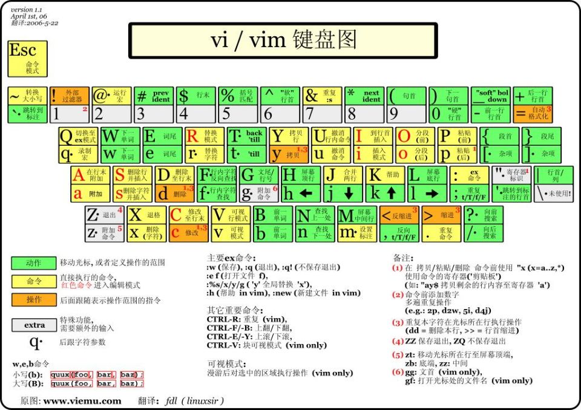
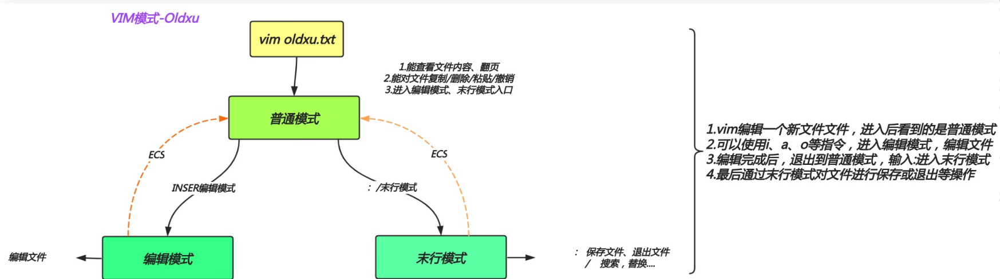

# vim编辑器

## 目录

-   [什么是vim](#什么是vim)
-   [vi和vim的区别](#vi和vim的区别)
-   [vim的三个模式](#vim的三个模式)
    -   [普通模式](#普通模式)
    -   [编辑模式](#编辑模式)
    -   [末行模式](#末行模式)
-   [VIM的使用](#VIM的使用)
-   [普通模式](#普通模式)
-   [编辑模式](#编辑模式)
-   [末行模式](#末行模式)
-   [视图模式](#视图模式)
-   [VIM扩展](#VIM扩展)
    -   [配置环境变量](#配置环境变量)
-   [vim文件对比](#vim文件对比)
-   [vim异常退出处理](#vim异常退出处理)



## 什么是vim

vi和vim都是Linux的文本编辑工具，相当于Windows的记事本

## vi和vim的区别

vi和vim都是文本编辑器只不过vim是vi的增强版。

vim比vi多了语法高亮显示，其他编辑功能几乎无差，所以使用vi和vim取决于个人习惯。

centos最小化安装默认没有vim编辑器，需要进行安装，命令如下

```bash
yum install vim -y
```

## vim的三个模式

&#x20;       vim主要有三个模式，是：普通模式、编辑模式、末行模式。



### 普通模式

主要负责控制光标的移动，可对文本进行复制、粘贴、删除工作。

只要使用vim编辑文本文件，默认处于普通模式。

### 编辑模式

主要进行文本的编辑和修改

从默认的普通模式进入编辑模式需要按一个键，该键可以是a，i，o（大小写都可）

当你处于编辑模式时，Linux最下方会出现INSERT|插入标记

要想返回普通模式只需按下ESC键即可

### 末行模式

末行模式是屏幕最下方的一行，主要作用是保存和退出编辑器

从普通模式进入末行模式输入‘：’或‘/’即可进入

该模式下可以进行如下操作：显示行号，搜索，替换，保存，退出。

> 📌在vim中，无法直接从编辑模式进入末行模式

## VIM的使用

## 普通模式

主要用于光标移动，复制，粘贴，删除，替换。

当前光标以及光

```bash
#1，光标移动
  G   #光标跳至文本末尾
  gg  #光标跳至文本顶端
  Ngg #光标跳转至当前文件内的N行
  $   #光标跳转至光标所在行的尾部
  ^、|、0 # 光标跳转至当前光标所在行的首部
#2.文件内容较多时
  ctrl+f  #往下翻页（行比较多）
  ctrl+b  #往上翻页
#3.复制和粘贴
  yy  #复制当前光标所在的行
  5yy #复制当前光标以及光标向下四行（算当前行）
  p（小） #粘贴至当前光标下一行
  P（大） #粘贴至当前光标上一行
#4.删除、剪贴、撤销
  dd  #删除当前光标所在的行
  4dd #删除当前光标所在的行以及往下的三行
  dG  #删除当前光标以后的所有行
  D   #删除当前光标及光标以后的内容
  x（小） #删除当前光标标记往后的字符
  X(大)  #删除当前光标标记往前的字符
  dd & p  #剪贴、先删除dd（number dd），后粘贴p
  u  #撤销上一步操作 
#5.替换
  r（小）  #替换当前光标标记的单个字符
  R（大）  #进入REPLACE(替换)，连续替换，ESC 结束
```

## 编辑模式

编辑模式主要用于编辑文件

```bash
#进入编辑模式
  i  #光标不做任何操作
  a  #将当前光标往后一位
  o  #并在当前光标下添加一行空白内容
#大写
  I  #并将光标跳转至本行头部
  A  #将光标移动至本行的尾部
  O  #并在当前光标上添加一行空白内容 
```

## 末行模式

主要用于搜索，保存，退出文件

```bash
#1.文件的保存和退出
:w    #保存当前状态
:w!   #强制保存当前状态
:q    #退出当前文档（文档必须保存才能退出）
:q！  #强制退出文档不会修改当前内容
:wq   #先保存，再退出
:wq！ #强制保存并退出
:x    #先保存再退出
zz   #保存退出，shift+zz
:number  #跳转至相对应的行号
#2.文件内容查找
/内容  #需要搜索的内容（查找功能）
n     #按搜索的到的内容依次往下进行查找
N     #按搜索到的内容依次往下进行查找
#3.文件内容替换
:x，y s#sbin#test#g  #替换x-y行中包含sbin的内容为test
:%s#abin#test#g    #替换整个文本中包含sbin的替换为test
:%s#sbin#test#g    #替换内容时提示是否需要替换
#4.文件内容另存
:w /root/文件名   #将所有内容另存为/root/文件名 中 
#5.文件内容读入
:r /etc/hosts  #读入/etc/hosts文件至当前光标下面
:5r /etc/hosts #指定插入/etc/hosts文件至当前文件的第五行下面 
```

## 视图模式

试图模式需要从普通模式进入，主要进行批量操作

ctrl+v进入可视块模式，选中需要注释的行 &#x20;

1.插入:按shift+i进入编辑模式，输入#，结束按ESC键

2.删除:选中内容后，按x或者d键删除 &#x20;

3.替换:选中需要替换的内容，按下r键， 然后输入替换后的内容

shift+v进入可视行模式，选中整行内容

1.复制:选中行内容后按y键及可复制。

2.删除:选中行内容后按d键删除。

## VIM扩展

### 配置环境变量

1.临时为打开的文件时显示行号、忽略大小写等环境

```bash
:set nu     #显示行号
:set ic     #忽略大小写，在搜索的时候有用
:set ai     #自动缩进
:set list   #显示制表符（空行、tab键）
:set no[nu|ic|ai..]  #取消临时设定的变量 
```

2.如果希望配置的临时变量永久生效，需要将内容写入配置文件中

\~/.vimrc 个人环境变量，针对当前用户（优先级高）

/etc/vimrc 全局环境变量，针对系统中所有用户

> 📌如果个人vim环境没有配置，则使用全局vim环境变量配置

> 📌如果个人vim环境和全局环境变量产生冲突，优先使用个人vim环境变量

> 📌vim有注释的环境变量：[VIM编写shell或者python脚本时自动添加脚本开头注释信息。 - 会飞的鱼· - 博客园 (cnblogs.com)](https://www.cnblogs.com/zyos/p/9213878.html "VIM编写shell或者python脚本时自动添加脚本开头注释信息。 - 会飞的鱼· - 博客园 (cnblogs.com)")

## vim文件对比

用以对比文件修改前后的差异

```bash
diff  #文件对比
vimdiff  #以vim方式打开两个文件对比，高亮显示不同的内容
 
```

## vim异常退出处理

当使用vim打开一个新的文件时，如果修改了文件内容，此时强制退出终端，则会造成异常现象

```bash
#假设打开filename文件被意外关闭，需要删除同文件名的。swp文件即可解决
rm -f .filename.swp 
```

取消文字高亮  ：nohl
