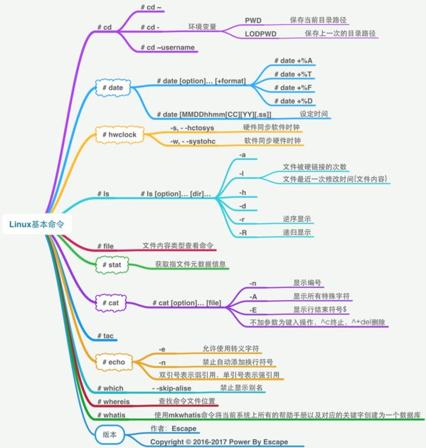

# bashshell特性

## 目录

-   [Vmare功能](#Vmare功能)
    -   [快照](#快照)
    -   [克隆](#克隆)
        -   [完整克隆](#完整克隆)
        -   [链接克隆](#链接克隆)
-   [Bash shell](#Bash-shell)
    -   [什么是bash](#什么是bash)
    -   [bash使用方式](#bash使用方式)
        -   [执行方式](#执行方式)
    -   [bash命令语法](#bash命令语法)
-   [bash特性](#bash特性)
    -   [补全](#补全)
    -   [快捷键分布](#快捷键分布)
    -   [（1）ctrl快捷](#1ctrl快捷)
    -   [（2）移动光标命令](#2移动光标命令)
    -   [（3）剪切字符](#3剪切字符)
    -   [（4）复制粘贴](#4复制粘贴)
    -   [（5）中断正在运行的命令行](#5中断正在运行的命令行)
    -   [（6）退出当前Xshell](#6退出当前Xshell)
    -   [（7）搜索命令行使用过的历史命令记录](#7搜索命令行使用过的历史命令记录)
    -   [（8）获取上一条命令的最后部分，用空格分隔开来的部分](#8获取上一条命令的最后部分用空格分隔开来的部分)
    -   [（9）清屏命令](#9清屏命令)
    -   [（10）暂停命令](#10暂停命令)
    -   [（11）锁屏](#11锁屏)
    -   [（12）解除锁屏](#12解除锁屏)
    -   [（13） ！+命令 执行上一条命令，!! 执行上两条命令](#13-命令-执行上一条命令-执行上两条命令)
-   [别名（alias）](#别名alias)
    -   [临时操作：](#临时操作)
    -   [永久操作](#永久操作)
    -   [bash帮助书册](#bash帮助书册)
-   [文件管理](#文件管理)
    -   [操作的文件在那个路径](#操作的文件在那个路径)
-   [根目录下各文件夹的含义](#根目录下各文件夹的含义)
-   [命令](#命令)
    -   [创建](#创建)
    -   [删除](#删除)
    -   [移动](#移动)
    -   [复制](#复制)
    -   [查看](#查看)
    -   [下载：  ](#下载--)
    -   [选项：  ](#选项--)
    -   [查找：  ](#查找--)
        -   [which  ](#which--)
        -   [whereis  ](#whereis--)



## Vmare功能

### 快照

将虚拟机某一刻的状态刻录下来相当于手机的备份

### 克隆

#### 完整克隆

将整个虚拟机复制过来张勇内存相当较大而且复制速度慢。

#### 链接克隆

引用原始机器的数据，相当于客户机，原始机器为服务器，一旦原始机器毁坏，克隆机同时损坏，好处：空间占用小，复制快，缺点：依赖原始主机。

## Bash shell

### 什么是bash

支持字符页面的窗口，只能执行bash相关命令

bash相当于命令解释器，将用户所写的字符翻译给内核，由内核翻译给硬件由硬件执行。

### bash使用方式

单条命令使用：速度慢而且出错率高

脚本形式使用：速度快而且效率高同时出错率低

#### 执行方式

手动执行命令和自动执行命令。

### bash命令语法

命令+选项+参数

命令：要实现的主体功能

选项：调节命令输出的结果

参数：路径

eg：ls -l  /etc/

ls为命令，-l为选项，/etc/为参数（所要执行命令文件的位置路径）

## bash特性

### 补全

**补全功能键为tab**

补全的形式主要有三种：命令补全、路径

补全、选项补全。特别注意：无法用tab补全时，说明写错了。

若要进入的目录的路径较深时可以利用tab补全防止出错，如果在补全命令时按一下tab无反应再按一下未补全命令弹出多个命令，说明该字符有有多个命令。

### 快捷键分布

### （1）ctrl快捷

ctrl+a,e光标跳转至正在输入的命令行的首/尾部

ctrl+k/u删除光标之后/之前的所有字符。

ctrl+c终止前台正在运行的程序

ctrl+d退出当前的shell

ctrl+z将任务暂停并挂在后台

ctrl+l清屏，和clear的功能相同

ctrl+r利用关键字搜索历史命令，

ctrl+左右：按命令选项参数进行移动

### （2）移动光标命令

Ctrl+A：移动光标到开头

Ctrl+E：移动光标到结尾

Ctrl+F：往光标后面移动一个字符

Ctrl+B：往光标前面移动一个字符

### （3）剪切字符

Ctrl+K：剪切光标处到行尾的字符

Ctrl+U：剪切光标处到行首的字符

Ctrl+Y：将剪切的字符进行粘贴

### （4）复制粘贴

Ctrl+Ins：复制

Shift+Ins：粘贴

### （5）中断正在运行的命令行

Ctrl+C

### （6）退出当前Xshell

Ctrl+D

### （7）搜索命令行使用过的历史命令记录

Ctrl+R


### （8）获取上一条命令的最后部分，用空格分隔开来的部分

ESC+.


### （9）清屏命令

Ctrl+L


### （10）暂停命令

Ctrl+Z


如上面sleep 40命令执行后一直动不了，光标一直在闪，按Ctrl+Z后就可以重新回到命令行

### （11）锁屏

Ctrl+S

### （12）解除锁屏

Ctrl+Q

### （13） ！+命令 执行上一条命令，!! 执行上两条命令

histroy 查看当前所有执行的命令；

-c：清空历史（内存）

-d：清除指定的条目；

-w：将记录写入到文件中（磁盘）；

## 别名（alias）

&#x20;    简化所执行的命令，分两种：临时别名和永久别名。

别名：为一个复杂的命令起一个简单的名称以便于操作

### 临时操作：

```bash
命名一个操作为另一个命令，格式为： alias net='cat /etc/sysconfig/network-scripts/ifcfg-ens32'
```

```bash
若要取消别名则进行的操作为：unalias net='cat /etc/sysconfig/network-scripts/ifcfg-ens32'
```

### 永久操作

1、将别名操作存入/etc/bashrc，此文件必须是登录shell时系统需要加载的一个文件

2、通过文件编辑工具vim进行操作：按下i键进入编辑插入所要进行操作别名的命令，编辑完毕按下esc，输入wq保存退出。

### bash帮助书册

man命令：直接查看该命令的帮助

命令  —help：查看该命令帮助

## 文件管理

### 操作的文件在那个路径

在/etc/hostname:位置＋名称＝路径

文件访问的两种方式：绝对路径、相对路径

绝对路径：只要从/开始的路径都是

相对路径：相对于当前目录来说

.为当前目录

..表示当前目录的上级目录

## 根目录下各文件夹的含义

/ &#x20;

sbin ：超级管理员执行的命令 &#x20;

bin  : 存放的都是二进制文件；命令文件； &#x20;

boot ：启动，存放内核文件，grub菜单 &#x20;

dev  ：设备，键盘，硬盘，光盘，u盘，显示器 &#x20;

/dev/null： 黑洞 &#x20;

/dev/zero： 摇钱树；取数据； &#x20;

/dev/random: 随机数 &#x20;

etc  ： 存放的是配置文件  （软件  程序）

调节软件工作状态》ftp》  默认只能下载、修改配置实现可以上传、下载，同时还能实现用户+密码的方式访问。

/etc/hostname： 主机名称 &#x20;

/etc/sysconfig/network-scripts/ifcfg-ens32  网卡的配置 &#x20;

home ： 普通用户的家目录  /home/{USERNAME} &#x20;

lib 、lib64: 库文件， &#x20;

mnt 、media ： 早起挂光盘使用的； &#x20;

opt   ： 早起第三方厂商工具，存储的路径；oracle &#x20;

proc  ： 存放系统运行时的一些状态数据；虚拟的文件系统 &#x20;

root  ： 超级管理员的家目录； （普通用无权限进入） &#x20;

run   ： 存放设备的驱动，进程的pid文件。锁文件； &#x20;

sys   ：  &#x20;

tmp   ： 临时；所有的用户都可以存储数据到目录中来； 谁创建谁可以删除； &#x20;

usr   ： 类似于windows系统文件目录； &#x20;

/usr/bin &#x20;

/usr/sbin &#x20;

var :  可变化的目录；日志；

## 命令

分为创建、删除、移动、复制、查看

### 创建

创建文件：touch

1、需要在/etc/目录下创建一个mg.txt文件

```bash
touch /etc/mg.txt
```

2、需要创建/root/1\~10.txt文件

```bash
touch {1 .. 10}.txt
```

创建目录：mkdir

语法：mkdir \[OPTION]... DIRECTORY...

-p 递归创建

-v 显示创建过程

```bash
mkdir -p /usr/local/{nginx,tomcat,httpd}/{logs,conf}
```

```bash
mkdir -pv /usr/local/{nginx,tomcat,httpd}/{logs,conf}
```

### 删除

删除文件：rm，删除目录：rmdir。

rm -rf  /\*删库跑路

-f 强制删除（不询问）

-r递归删除

rmdir -r /目录/目录/文件

删除目录中后缀为.pdf的文件

\[root\@node \~]# rm -f H.pdf

\[root\@node \~]# rm -f \*.pdf

### 移动

移动文件/目录：mv（move）

mv 源文件 目标文件

mv 源文件1 源文件2 目标目录

无论复制几个文件最后一个文件或目录就是目标目录

```bash
mv 文件1 目标目录 mv /lianxi/1/{1..3} /lianxi/2（支持多个移动）

```

### 复制

复制：cp（copy）

cp -r 递归复制 源文件路径(复制到当前目录)

cp -p保持文件属性

cp  源文件  目标位置    （绝对路径|相对路径）

cp   源文件1源文件2  目标位置

```bash
cp -rp 文件1路径 文件2路径 复制目标路径

```

### 查看

cat/less/more

cat

-A：查看特殊字符，当复制win中的内容到Linux时，如果碰到无法运行的情况，会使用-A检查一下是否存在特殊的字符

-n：查看行号；

less：查看比较大的文件：

空格：翻页

ctrl+f：向下翻页；

ctrl+b：向上翻页；

q：退出

more：查看大文件；（显示百分比）

空格：翻页

ctrl+f：向下翻页；

ctrl+b：向上翻页；

q：退出

head: 查看文件的头部，默认10行 &#x20;

-number：3  看前3行； &#x20;

tail: 查看文件尾部，默认10行； &#x20;

-f：动态追踪文件尾部变化（日志；） &#x20;

-n：指定多少行 &#x20;

head 和tail组合使用： &#x20;

\[root\@node \~]# ip a | head -3 | tail -1 &#x20;

inet 127.0.0.1/8 scope host lo &#x20;

管道： 将左边的命令执行后的结果，传递给右边命令的输入； &#x20;

### 下载： &#x20;

1.将互联网的文件下载到Linux服务器； &#x20;

wget：  由于最小化安装的操作系统，没有wget命令 &#x20;

yum install wget -y 安装上； &#x20;

### 选项： &#x20;

-O： 可以指定路径+文件保持的名称； &#x20;

2.将Linux上已有的文件下载到\[MacOS|Windows]上、 将windows的文件上传到Linux服务器上； &#x20;

\[root\@node \~]# yum install lrzsz -y &#x20;

rz： 直接输入命令，选择windows的文件，即可完成上传 &#x20;

sz /PATH路径 下载到Windows &#x20;

（不支持断点续传） &#x20;

（仅支持上传文件，可以选择将文件夹打成.zip包，在上传就可以了） &#x20;

（不支持上传单个文件超过4Gb以上的  .iso镜像） &#x20;

### 查找： &#x20;

不是查找文件；而是查找命令的： &#x20;

获取一个命令的绝对路径；因为有些命令都带有了别名，而当我们通过相对路径执行命令时，就会先执行别名； &#x20;

#### which &#x20;

\[root\@node \~]# which mkdir &#x20;

/usr/bin/mkdir &#x20;

#### whereis &#x20;

\[root\@node \~]# whereis mkdir &#x20;

mkdir: /usr/bin/mkdir /usr/share/man/man1/mkdir.1.gz &#x20;

\[root\@node \~]# whereis -b mkdir &#x20;

mkdir: /usr/bin/mkdir &#x20;

查找失败： &#x20;

1.根本不存在这个命令； &#x20;

2.没有安装这个命令 &#x20;

\[root\@node \~]# which xxxxxx &#x20;

/usr/bin/which: no xxxxxx in (/usr/local/sbin:/usr/local/bin:/usr/sbin:/usr/bin:/root/bin)

查看系统内核信息：`cat /proc/version`、`uname -a`
