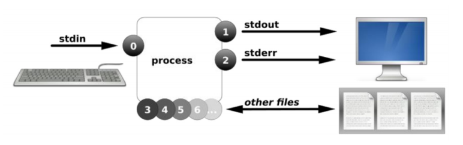
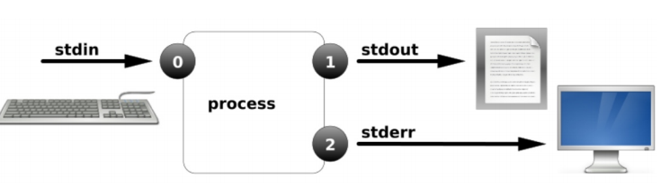
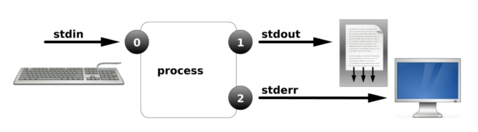
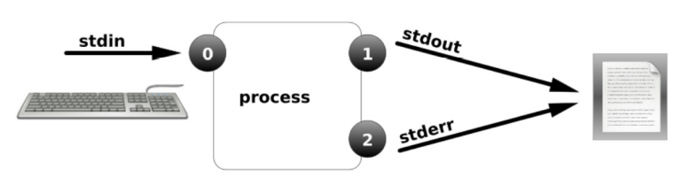
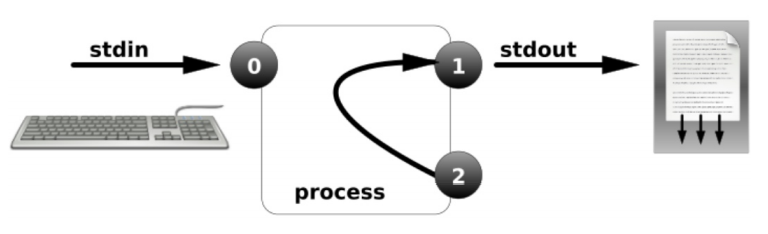
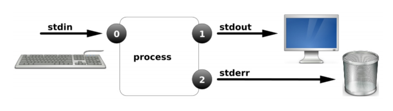
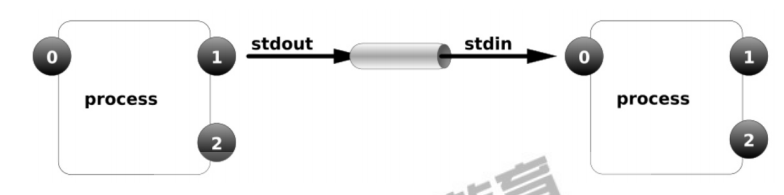
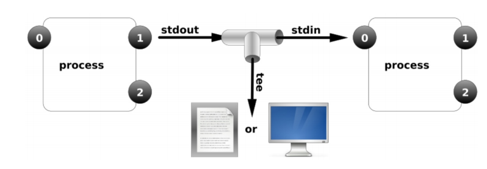

# IO重定向

## 目录

-   [什么是重定向](#什么是重定向)
-   [场景](#场景)
-   [标准输入与输出](#标准输入与输出)
    -   [总结](#总结)
-   [输出重定向案例](#输出重定向案例)
    -   [案例1-标准输出重定向](#案例1-标准输出重定向)
    -   [案例2-标准追加输出重定向](#案例2-标准追加输出重定向)
    -   [案例3-错误输出重定向](#案例3-错误输出重定向)
    -   [案例4-混合和输出重定向](#案例4-混合和输出重定向)
    -   [案例5-将内容输出至黑洞](#案例5-将内容输出至黑洞)
-   [输入重定向案列](#输入重定向案列)
    -   [通过输入重定向读取文件内容](#通过输入重定向读取文件内容)
    -   [通过输入重定向读入多行内容](#通过输入重定向读入多行内容)
    -   [通过输入重定向将数据导入至数据库](#通过输入重定向将数据导入至数据库)
-   [输入重定向场景](#输入重定向场景)
-   [进程管道技术](#进程管道技术)
    -   [管道](#管道)
    -   [tee和xargs](#tee和xargs)

## 什么是重定向

将原本要输出到屏幕的数据信息，重新定向到某个指定文件中，或者定向到黑洞（/dev/null）

## 场景

1.程序执行输出的信息较多时，需要保存下来进行分页查看

2.后台执行的程序一般都会有输出不希望他的输出干扰屏幕

3.定时执行的备份任务，希望将备份的结果保留下来时

4.当重复创建用户，会提示一些错误信息，可以直接将信息丢弃

5.希望将错误日志与正确日志分别输出保存到不同地文件时

## 标准输入与输出

当进程操作一个文件时

首先进程是无法直接访问硬件，需借助内核来访问文件

而内核kernel需要利用文件描述符（file descriptor）来访问文件。

#### 总结

进程—通过—文件描述符（非负整数）—访问—文件名称；进程使用文件描述符来管理打开得文件对应关系；



| 名称             | 文件描述符 | 作用                   |
| -------------- | ----- | -------------------- |
| 标准输入（STDIN）    | 0     | 默认是键盘，也可以是文件或其他命令的输出 |
| 标准输出（STDOUT）   | 1     | 默认输出到屏幕              |
| 错误输出（STDERR）   | 2     | 默认输出到屏幕              |
| 文件名称（filename） | 3+    |                      |

## 输出重定向案例

输出重定向，改变输出内容的位置。输出重定向有如下表格方式

| 类型        | 操作符 | 用途                                   |
| --------- | --- | ------------------------------------ |
| 标准覆盖重定向   | 1>  | 将程序输出的正确结果输出到指定的文件中，会覆盖文件原有内容        |
| 标准追加输出重定向 | 1>> | 将程序输出的正确结果以追加的方式输出到指定的文件中，不会覆盖文件原有内容 |
| 错误覆盖输出重定向 | 2>  | 将程序的错误结果输出到执行的文件中，会覆盖文件原有内容          |
| 错误追加输出重定向 | 2>> | 将程序的错误结果以追加的方式输出到执行的文件中，不会覆盖文件原有内容   |

### 案例1-标准输出重定向



如果文件不存在则创建（不会自动创建目录）

如果纯在则清空内容

```bash
> file
ifconfig eth0 > file
```

### 案例2-标准追加输出重定向



如果文件不存在则创建文件

如果文件存在则在文件尾部添加内容

```bash
echo “hello world” >> file

```

### 案例3-错误输出重定向


正确输出及错误输出至相同文件

输出至不同文件

```bash
find /etc -name "*.conf" 1>ok 2>ok
find /etc -name "*.conf" 1>ok 2>err
```

### 案例4-混合和输出重定向



混合输出重定向

将正确输出和错误输出混合至同一个文件

将两个文件内容组合为一个文件

```bash
find /etc -name "*.conf" &>ab
cat a b > c
```

正确和错误都输入到相同位置



```bash
ls /root /error >ab 2>&1
```

### 案例5-将内容输出至黑洞



```bash
ls /root /error >ab 2>/dev/null
ls /root /error >ab &>/dev/null
```

## 输入重定向案列

### 通过输入重定向读取文件内容

```bash
cat < /etc/hosts
```

### 通过输入重定向读入多行内容

```bash
cat <<EOF
jjjj
kkk
kkk
EOF  #只要不输入EOF则可以一直输入

```

### 通过输入重定向将数据导入至数据库

```bash
mysql -uroot -poldxu.com < /opt/wordpress.sql
```

## 输入重定向场景

恢复数据

脚本打印菜单时

cat写入文件：vim

输出重定向

正确输出：1>覆盖(先清空后写入)，1>>直接写入文件尾部（末尾）

错误输出：2>覆盖，2>>直接写入文件的尾部

混合输出

&>/dev/null

&>>/dev/null

1>/dev/null 2>&1

## 进程管道技术

### 管道

：“|”主要用来链接左右两个命令，将左侧的命令的【标准输出】，教给右侧命令的【标准输入】

注意事项：无法传递标准错误输出至后者命令

格式：cmd1 | cmd2 \[....|cmdn]



### tee和xargs

tee相当于分流，将前边命令的输出结果拦截下来输入到文本文件中或者输入到显示器



xargs可以让一些不支持管道的命令支持管道命令

```bash
which  cat | xargs ls -l
ls | xargs rm -fv
```
