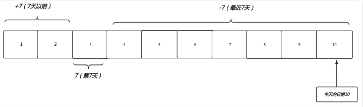
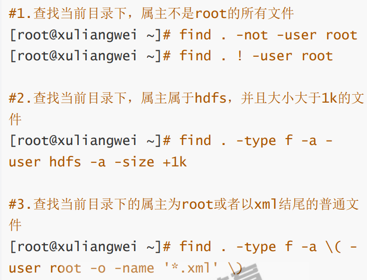
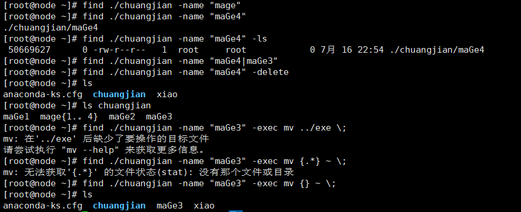
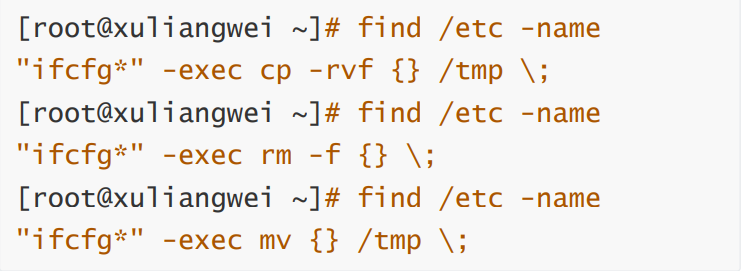
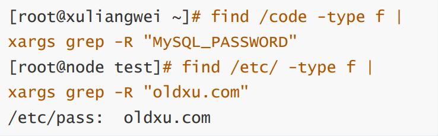

# 文件查找

## 目录

-   [find查找命令](#find查找命令)
    -   [为什么需要查找命令](#为什么需要查找命令)
    -   [为什么使用find查找](#为什么使用find查找)
    -   [find命令语法](#find命令语法)
    -   [find查找示例](#find查找示例)
        -   [find基于名称查找](#find基于名称查找)
        -   [find基于大小查找](#find基于大小查找)
        -   [find基于类型查找](#find基于类型查找)
        -   [find基于时间查找](#find基于时间查找)
        -   [find基于用户查找](#find基于用户查找)
        -   [find基于权限查找](#find基于权限查找)
        -   [find逻辑运算符](#find逻辑运算符)
        -   [find动作处理](#find动作处理)
        -   [find结合xargs](#find结合xargs)
        -   [find结合grep](#find结合grep)

# find查找命令

## 为什么需要查找命令

有时候我们可能忘记文件所在位置，有时候需要通过内容查找到对应的文件，此时就需要通过find进行查找

## 为什么使用find查找

因为find可以根据不同的条件来进行查找文件

比如：文件名称、文件大小、文件时间、属主属组、权限等等

可以通过以上方式从而精确定位进行查找文件。

## find命令语法

-a是并且 -o是或 -not 是相反

| 命令   | 路径         | 选项         | 表达式           | 动作        |
| ---- | ---------- | ---------- | ------------- | --------- |
| find | \[path...] | \[options] | \[expression] | \[action] |
| 查找   | 地区         | 妹纸         | 18-25岁        | ？？？       |

## find查找示例

### find基于名称查找

```bash
touch  /etc/sysconfig/network-scripts/{ifcfg-eth1,IFCFG-ETH1}  #创建文件
find /etc -name "ifcfg-eth1"  #查找/etc目录下包含ifcfg-eth0名称的文件
find /etc -iname "ifcfg-eth1"  #-i 忽略大小写
find /etc/ -name "ifcfg-eth"
find /etc -iname "ifcfg-eth"  #查找/etc目录下包含ifcfg-eth名称下所有文件
```

### find基于大小查找

+5 ： 大于5M

-5 ： 低于5M

5 ： 等于5M

```bash
find /etc -size +5M  #查找大于5M的文件
find /etc -size 5M   #查找等于5M的文件
find /etc -size -5M  #查找小于5M的文件
dd if=/dev/zero of=/etc/big count=6M bs=1 #创建一个6M大小的文件
find 路径 -size +5M -a -size -7M | xargs ls -l  #在该路径下查找大于5M并且小于7M的文件并查看长格式的详细信息
```

### find基于类型查找

```bash
find /dev -type 文件类型 
#f:文件 d：目录 l:链接 b：设备 c：字符设备 s：套接字 p:管道

```

### find基于时间查找



```bash
for i in {01..10}; do date -s 201904$ && touch file-$i; done  #创建测试文件
find ./ -itime "file-*" -mtime +7 #查找七天前的文件（不会打印当天文件）-7为查找最近七天的文件 7为查找第七天的文件
```

```bash
find ./ -type f -mmin -x ./文件  #查找最近你x分钟内发生变化的文件
find  /bin/ /sbin/ -type f -mmin -x  #查找最近几分钟内发生变化的命令
find /var/log -type f -name "*log" -mtime +x -delete  #查找/var/log下所有以.log结尾的文件，并保留最近x天的文件，其余时间点文件删除
```

### find基于用户查找

find /home -参数 用户

参数有：-user：属主  -group：属组  -nouser：没有属主 -nogroup： 没有属组

find /home -nogrpoup查找没有属组的

find  /home -nouser -o -nogroup 查找没有属组或者没有属主的

### find基于权限查找

基本格式：-perm \[/、-] MODE

MODE:精确权限匹配  权限

-MODE：每一类对象都必须拥有指定的权限并且的关系）

/mode：任何一类（UGO）只要一位匹配即可；（或者）

```bash
find /root -type f -perm 权限 -ls #精确查找
find /root -type f -perm -644 -ls #包含（u涵盖6 g涵盖4 o涵盖4）
find /root -type f -perm /644 -ls #或者（u为6 或者g为4或者o为0）
```

特殊权限（最低权限为4000 4755 也满足需求）

### find逻辑运算符

| 符号      | 作用    |
| ------- | ----- |
| -a      | 与（并且） |
| -o      | 或（或者） |
| -not\|！ | 非（）   |



### find动作处理

| 动作      | 含义                            |
| ------- | ----------------------------- |
| -print  | 打印查找到的内容                      |
| -ls     | 以长格式的方式打印查到的内容                |
| -delete | 删除查到的文件（仅能删除空目录）              |
| -ok     | 后面跟自定义shell命令（提示是否操作）         |
| exec    | 后边跟自定义shell命令（标准写法 -exec \\;） |





### find结合xargs

xargs将前者命令查找到的文件作为一个整体传递给后者输入，所以其操作的性能极高

```bash
find 路径 -type f -perm -4000 | xargs -I {} cp -rv {} ？tmp
将匹配到的文件进行拷贝
```

### find结合grep

当忘记重要配置文件存储路径时，可通过搜索关键字获取文件其路径；


