# 用户权限

## 目录

-   [基本权限](#基本权限)
    -   [什么是权限](#什么是权限)
    -   [为啥要权限](#为啥要权限)
    -   [权限与用户的关系](#权限与用户的关系)
    -   [权限中rwx的含义](#权限中rwx的含义)
    -   [如何修改权限](#如何修改权限)
        -   [UGO方式](#UGO方式)
        -   [NUM方式](#NUM方式)
        -   [权限对文件的影响](#权限对文件的影响)
        -   [文件权限总结](#文件权限总结)
        -   [权限对目录的影响 ](#权限对目录的影响-)
            -   [验证r权限](#验证r权限)
        -   [目录权限小结](#目录权限小结)
        -   [文件及目录权限小结](#文件及目录权限小结)
        -   [修改所属关系](#修改所属关系)
    -   [基于httpd场景的说明](#基于httpd场景的说明)
-   [特殊权限](#特殊权限)
    -   [特殊权限suid](#特殊权限suid)
        -   [总结](#总结)
    -   [特殊权限SGID](#特殊权限SGID)
    -   [特殊权限sbit](#特殊权限sbit)
        -   [总结](#总结)
    -   [文件特殊权限](#文件特殊权限)
        -   [作用](#作用)
        -   [配置](#配置)
    -   [文件默认权限](#文件默认权限)
        -   [背景](#背景)
        -   [结论](#结论)

# 基本权限

## 什么是权限

权限是用来约束用户能对系统所做的操作

权限是指某个特定的用户具有特定的系统资源使用权力

## 为啥要权限

Linux是一个多用户系统，对于每一个用户来说，个人隐私的保护十分重要，所以需要进行权限划分；

1.安全性：降低误删除风险、减少人为造成故障以及数据泄露等风险。

2.数据隔离：不同的权限能看到、以及操作不同的数据

3.职责明确：电商场景客服只能查看投诉、无法查看店铺收益，运营则能看到投诉以及店铺收益

## 权限与用户的关系

在Linux中针对文件定义三个身份，分别是属主owner、属组group、其他人others

每种身份又对应三种权限，分别是读read、写write、执行execute

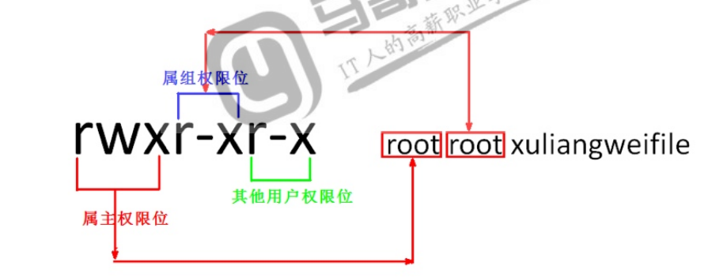

## 权限中rwx的含义

| 字母    | 含义   | 二进制 | 八进制权限表示法 |
| ----- | ---- | --- | -------- |
| r     | 读取权限 | 100 | 4        |
| w     | 写入权限 | 010 | 2        |
| x     | 执行权限 | 001 | 1        |
| - - - | 没有权限 | 000 | 0        |

## 如何修改权限

修改权限使用chmod（change mode）命令来实现

对于root用户来说，可以修改任何人的文件权限

对于普通用户来说仅仅能修改自己的文件权限

### UGO方式

给文件所有人添加读写执行权限

```bash
chmod a=rwx file  # a=all （所有，即是user+group+other）
```

取消文件的所有权限

```bash
chmod a=-rwx file 
```

属主读写执行，属组读写，其他人无权限

```bash
chmod u=rwx，g=rw，o=- file
```

属主属组读写执行，其他人读权限

```bash
chmod ug=rw，o=r file
```

### NUM方式

设定文件权限644 （rw-r- -r- -）

```bash
chmod 644 file
```

设定文件权限600，rw - - - - - - -

```bash
chmod 600 file
```

设定目录权限为755 ，递归授权rwxr-xr-x

```bash
chmod -R 755 dir
```

### 权限对文件的影响

在Linux中权限设定对文件和对目录的影响是有去别的

| 权限      | 对文件影响          | 对目录影响         |
| ------- | -------------- | ------------- |
| 读取权限（r） | 具有读取\阅读文件内容的权限 | 具有浏览目录内容      |
| 写入权限（w） | 具有新增、修改文件内容的权限 | 具有增加和删除目录内的文件 |
| 执行权限（x） | 具有执行文件的权限      | 进入目录          |

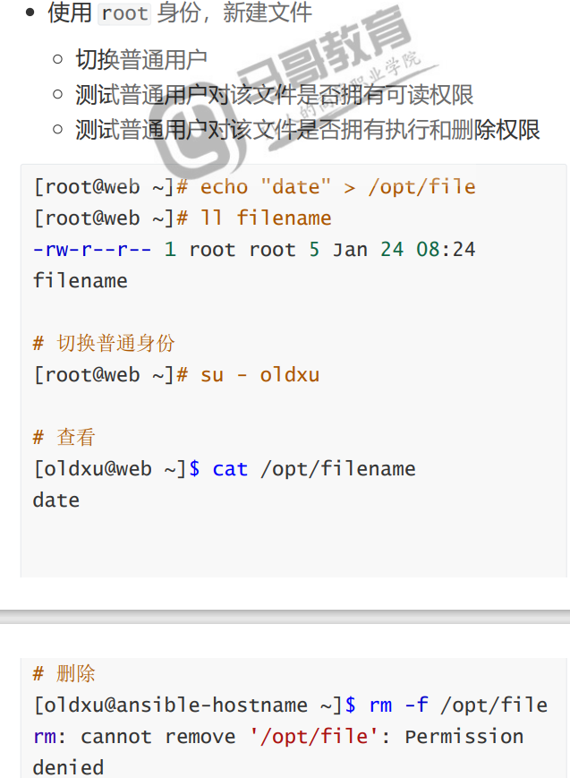

验证w权限

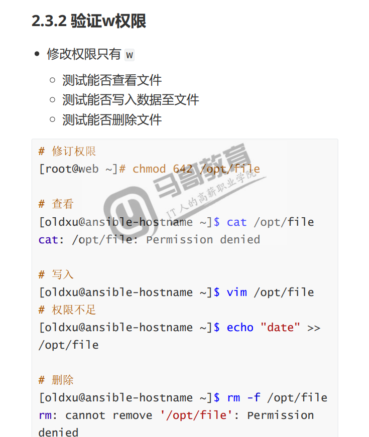

验证x权限

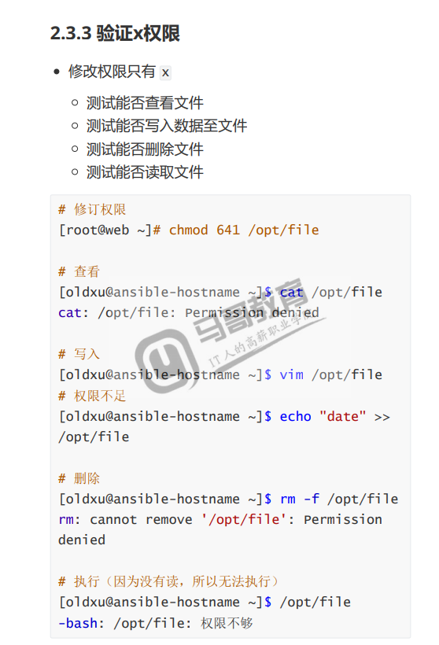

### 文件权限总结

1.读取权限r：具有读取阅读文件内用的权限

只能使用1查看类命令：cat，head，tail,less,more

2.写入权限w：具有新增、修改文件内容的权限

使用vim会提示权限拒绝，但可以强制保存，会覆盖文件的所有内容；

使用echo命令重定向的方式可以往文件内写入数据，>>可以追加内容

使用rm无法删除文件，因为删除文件需要看上级目录是否有w的权限

3.执行权限x：具有执行文件的权限

执行权限什么用都没有

如果普通用户需要执行文件，需要配合r权限

### 权限对目录的影响&#x20;

#### 验证r权限

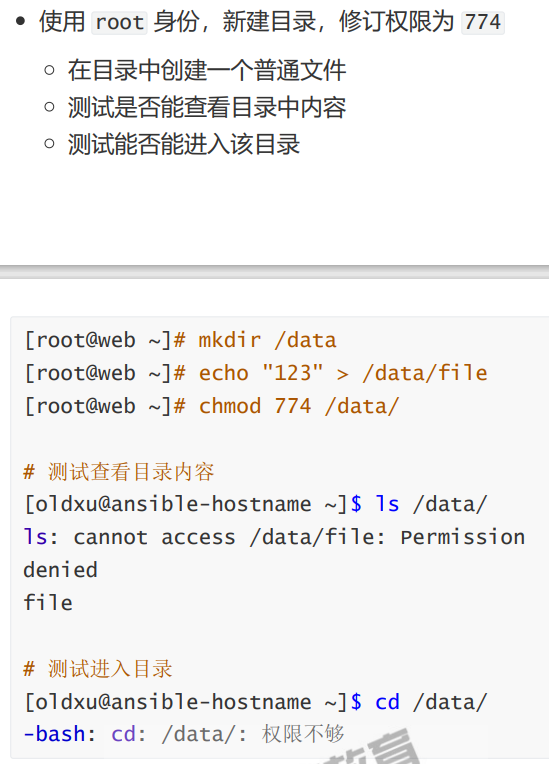

验证w权限

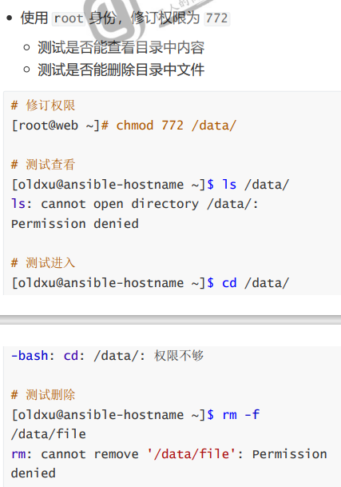

验证x权限

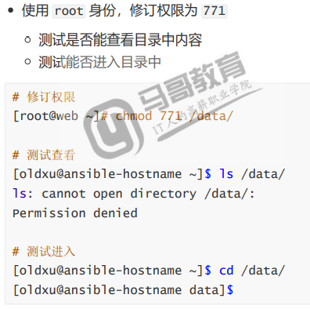

### 目录权限小结

读取权限r：具有浏览目录及子目录权限

使用ls命令浏览目录及子目录，会提示权限拒绝

使用ls -l命令浏览目录及子目录时，文件属性会带问号，并且只能看到文件名

写入权限w：具有增加、删除或修改目录文件名的权限，需要x权限的配合

可以在目录内创建文件，删除文件（跟文件本身权限无关）

不能进入目录，不能复制目录、不能删除目录、不能移动目录

执行权限x：具有执行文件的权限

只能进入目录

不能浏览、复制、删除、移动

### 文件及目录权限小结

●文件权限设定小结: &#x20;

文件r权限，只给用户查看，无其他操作; &#x20;

文件rw权限，可以查看和编辑文件内容\[代码文件] ; &#x20;

文件rx权限，允许查看和执行文件、但不能修改文件\[脚本|命令] ; &#x20;

文件rwx权限，能读、能写、能执行、 \[不能删除] ; &#x20;

●目录权限设定小结: &#x20;

目录rx权限，允许浏览目录内文件以及子目录，不允许在该目录下创建文件、删除文件 &#x20;

目录rw权限，能查看目录，能往目录写入文件，但无法进入目录--> (使用的情况太少) &#x20;

●默认系统设定的安全权限: &#x20;

文件权限644 &#x20;

目录权限755属主:创建文件、删除文件、改变;能看，能执行，能读;

### 修改所属关系

为什么要修改所属关系：进程能够以何种方式去访问一个文件，取决于这个进程所运行的用户对该文件是否拥有对应的权限。

chown（change owner）、chgrp（change group）：修改文件所属关系

chown：能变更文件的属主和属组

chgrp：仅能变更文件的属组

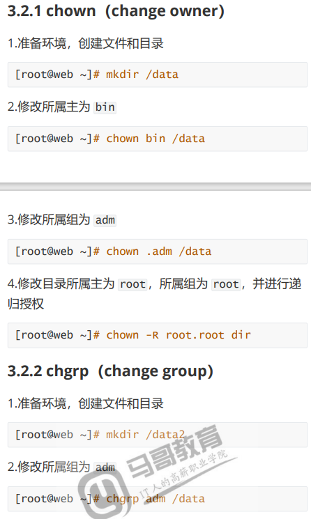

## 基于httpd场景的说明

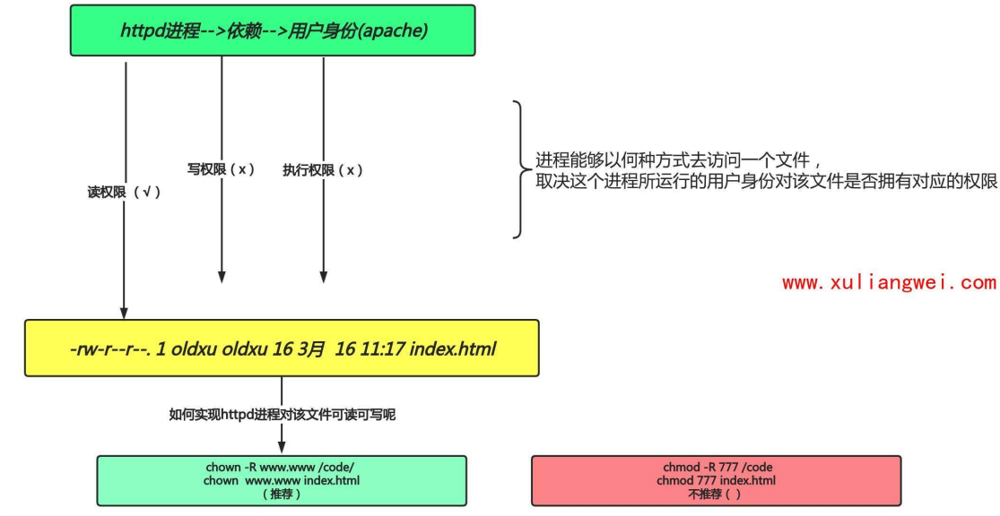

```bash
#1.安装httpd
setenforce 0
systrmctl dstop firewalld  #关闭防火墙
yum install httpd -y
systmctl start httpd 
#2.在默认站点目录创建文件，修订其权限，然后验证能否访问成功
 echo "web" > /var/www/html/index.html
 chmod 600(主可读可写，组和其他人无权限) /var/www/html/index.html
 ll /var/www/html/index.html
#3.无法访问，解决提示权限不足，有两种方式
#方法1
chmod 777（主和组和其他用户拥有最高权限）/var/www/html/index.html
#方法二
ps -ef | grep httpd   
chown apache.apache /var/www/html/index.html
chmod 600  /var/www/html/index.html 特殊权限
```

# 特殊权限

除了r，w，x三种权限以外，还有其他权限的字母。

比如：/usr/bin/passwdp;

7L:W文件，属主应该是x的权限位出现了s

/usr/bin/locate文件。属组应该是x的权限位出现了s

/tmp目录，其他人应该是x的权限位出现了t

我们将此称为特殊权限。特殊权限主要有：suid，sgid，sbit。

## 特殊权限suid

用户在修改自己密码时会更新/etc/shdow文件，因为shadow文件是存储用户密码的文件。但shadow文件的权限是禁止任何人进行修改的，为何呢

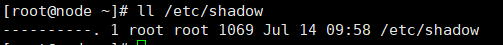

普通用户可以修改自己的密码主要在于passwd命令，因为该命令本身就拥有特殊权限setuid也就是在属主的权限位上的执行命令是s

suid：当一个执行文件设置setuid后，用户在执行这个文件时将以文件所有者的身份来执行。

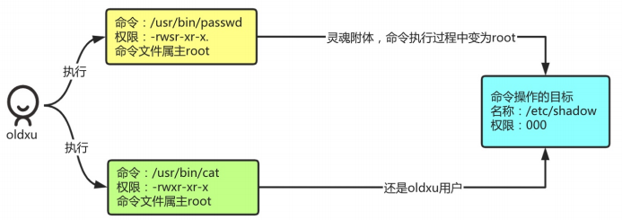

当使用普通用户执行passwd命令会发生什么变化？

1.由于passwd命令拥有suid特殊权限；（在属主权限位有一个s）

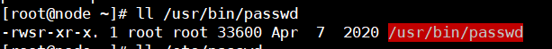

2.所以passwd命令在执行的过程中，会以命令的属主身份运行该命令；（也就是root身份）

3.总结：用户—>passwd—>转换为命令属主身份root执行—>操作/etc/shadow信息变更

语法

```bash
chmod u+s /usr/bin/cat
chmod 4755 /usr/bin/cat
```

### 总结

1.让普通用户对可执行的二进制文件，临时拥有二进制文件的所属主权限（root）

2.如果设置的二进制文件没有执行权限，那么suid的权限显示就是大S

3.特殊权限suid仅对二进制可执行程序有效，其他文件或目录则无效；

> 📌注意：suid相对危险，不建议对vim或rm'进行suid操作

## 特殊权限SGID

1.若系统有两人用户，分别为ex1和ex2，这两个人用户都拥有example附加组

2.这两个用户需要共同拥有/data/code目录的开发权

3.互相之间能修改彼此的文件，但该目录不允许其他人进入查阅

```bash
groupadd example
useradd ex1 -G example
useradd ex2 -G example
mkdir /data/code
chown .example /data/code/
chmod 2770 /data/code/
chmod g-s /data/code   #删除权限
```

## 特殊权限sbit

一旦目录被赋予了粘滞位Sticky（SI TI KI）除了root可以删除目录中的所有文件，普通用户对该目录就算拥有w权限。也只能删除自己建立的文件，而不能删除其他用户建立的文件。

配置

```bash
chmod 1755 /tmp
chmod o+t /tmp

```

### 总结

1.让所有普通用户对该目录具有写入权限，并且能实现每个用户只能删自己的文件；

2.粘滞位目录表现在others的x位，用t表示，如果没有执行权限则显示为T。

3.粘滞位目录的属主以及root用户有权限删除目录中的内容，其他用户无权删除。

## 文件特殊权限

特殊权限是凌驾于rwx基础权限之上的，是一种高级属性（ls -l不可见）

### 作用

1.创建一个文件，不允许被修改、移动、删除、包括root也不行—>适合/etc/passwd;

2.创建一个文件，仅允许往文件里面追加数据，不允许修改、移动、删除。—>适合sudo审计日志；

### 配置

Linux系统需要通过chattr命令来实现特殊属性的配置

格式 ： chattr  \[+-=]  选项   文件或目录名

选项：

a ：可对文件进行追加内容；

i  ：锁定文件，不允许其他操作；

配置/etc/passwd文件，不能改，不能追加，不能删除。

```bash
chattr +i /etc/passwd   #赋予文件i权限


```

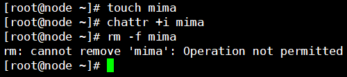

配置/var/log/secure文件，只能追加写入日志，不允许手动修改，也不允许删除。

```bash
#赋予文件a权限
chattr +a /var/log/secure
lasttr /var/log/secure  #查看特殊权限
#测试追加数据
echo "test" >> /var/log/secure
echo "tesr" >> /var/log/secure
#不能删除，不能修改
rm -f /var/log/secure
```

如果相取消特殊属性，需要使用root身份

```bash
chattr  -i  /etc/passwd
chattr  -a /var/log/secure

```

## 文件默认权限

是指用户在创建文件或目录时，默认分配给文件或目录的访问权限

### 背景

1.用户创建一个文件的默认访问权限为：rw-rw-

rw- （八进制值666）

2.用户创建一个目录的默认访问权限为：rwxrwxrwx （八进制值777）

3.但最终创建出来的文件权限是 644 目录是

755，为什么目录不是777，文件不是666呢?

### 结论

UMASK表示要减掉的权限
