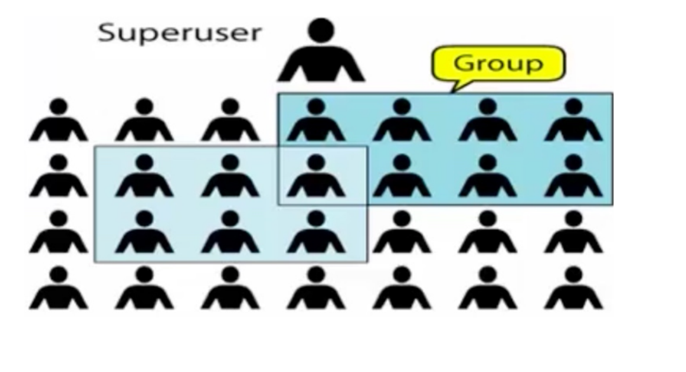
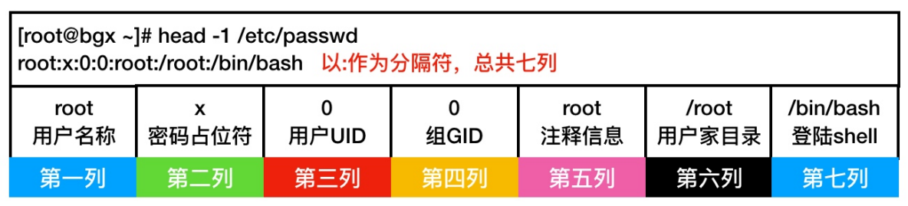
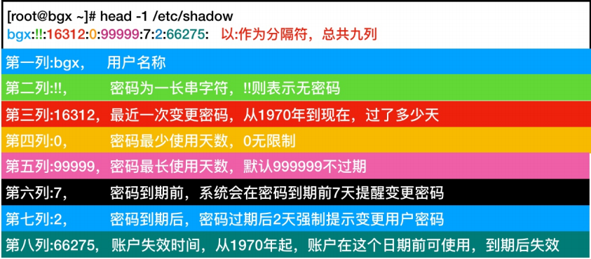
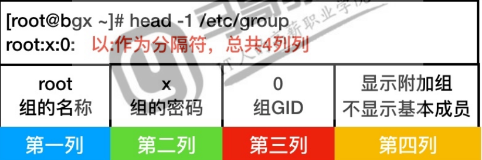
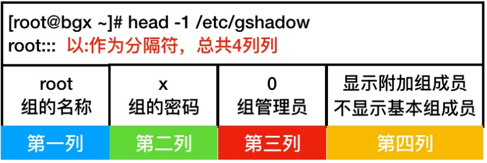

# 用户管理

## 目录

-   [用户基本概述](#用户基本概述)
    -   [什么是用户](#什么是用户)
    -   [为什么需要用户](#为什么需要用户)
    -   [用户的分类](#用户的分类)
    -   [查询用户的id信息](#查询用户的id信息)
    -   [配置文件](#配置文件)
        -   [passwd文件](#passwd文件)
        -   [shadow文件](#shadow文件)
    -   [用户相关命令](#用户相关命令)
        -   [添加用户useradd](#添加用户useradd)
        -   [修改用户usermod](#修改用户usermod)
        -   [删除用户userdel](#删除用户userdel)
        -   [设定密码passwd](#设定密码passwd)
            -   [交互式设定密码](#交互式设定密码)
    -   [用户组基本概述](#用户组基本概述)
        -   [ 什么是用户组](#-什么是用户组)
        -   [类别](#类别)
        -   [相关配置文件](#相关配置文件)
        -   [用户组命令](#用户组命令)
            -   [添加组groupadd](#添加组groupadd)
            -   [修改组groupmod](#修改组groupmod)
            -   [删除组groupdel](#删除组groupdel)

# 用户基本概述

## 什么是用户

用户是指能够正常登录系统的。例如：登陆QQ的用户，登陆荣耀的用户。



&#x20;&#x20;

## 为什么需要用户

1.系统上的每一个进程（每一个程序），都需要一个特定的用户进行执行

2.通常在公司是使用普通用户管理服务器，因为root权限过大，容易造成故障。

## 用户的分类

| 用户UID（User ID） | 系统中约定的含义                        |
| -------------- | ------------------------------- |
| 0              | 超级管理员，最高权限，有着极强的破化能力 rm -rf /\* |
| 1\~200         | 系统用户，用来运行系统自带的进程，默认已创建          |
| 201\~999       | 系统用户，用来运行用户安装的程序，所以此类用户无需登录系统   |
| 1000+          | 普通用户，正常可以登陆系统的用户，权限比较小，能执行的任务有限 |

## 查询用户的id信息

命令：id

```bash
id  #查询当前登路的用户信息
id  用户  #查询其他用户的信息 
```

## 配置文件

当我们创建一个新的用户时系统会将用户信息存放在/etc/passwd中，而密码单独存放在/etc/shadow中，也就是说这俩个文件非常重要，不要轻易删除和修改。

### passwd文件

/etc/passwd配置文件的解释如下，也可使用man 5 passwd获取帮助



### shadow文件

/etc/shadow配置文件解释如下，或使用man 5 shadow获取帮助。

[如何使用change命令改变密码的属性 - oldxulinux - 博客园 (cnblogs.com)](https://www.cnblogs.com/oldxu/p/10679004.html "如何使用change命令改变密码的属性 - oldxulinux - 博客园 (cnblogs.com)")



## 用户相关命令

### 添加用户useradd

若要添加系统普通用户，可以使用useradd命令，使用系统root用户登录系统之后就可以添加系统普通用户了。

| 选项 | 功能描述                    |
| -- | ----------------------- |
| -u | 指定要创建用户的UID，不允许冲突       |
| -g | 指定要创建的用户基本组             |
| -G | 指定要创建用户附加组，逗号隔开可添加多个附加组 |
| -d | 指定要创建用户家目录              |
| -s | 指定要创建用户的bash shall      |
| -c | 指定要创建用户的注释信息            |
| -M | 给创建的用户不创建家目录            |
| -r | 创建系统账户，默认无家目录           |

创建oldxu用户

ID为6969，基本组为ops，附加组为dev，注释信息为2000 new student，登陆shell：/bin/bash

```bash
useradd -u 6969 -g ops -G dev -c "2000 new student" -s /bin/bash oldxu
```

### 修改用户usermod

若想修改Linux系统普通用户，可以使用usermod命令，使用root账户登录linux系统之后就可以修改系统普通用户。

| 选项 | 描述                              |
| -- | ------------------------------- |
| -u | 指定修改用户的UID                      |
| -g | 指定要修改用户的基本组                     |
| -G | 指定要修改用户附加组，使用逗号隔开多个附加组，覆盖原有的附加组 |
| -d | 指定要修改用户家目录                      |
| -s | 指定要修改用户的bash shell              |
| -c | 指定要修改用户注释信息                     |
| -l | 指定要修改用户的登陆名                     |
| -L | 指定要锁定的用户                        |
| -U | 指定要解锁的用户                        |

修改oldxu用户

UID为5008

基本组为network，附加组为ops，dev，sa

注释信息为student，登录名称为new\_oldxu

```bash
usermod -u 5008 -g network -G ops,dev,sa -c "student" -l new_oldxu oldxu
```

### 删除用户userdel

若要删除linux系统的普通用户，可以使用userdel命令，使用root账户登录了Linux系统之后就可以删除系统普通用户。

```bash
userdel -r 用户名 #连同家目录一起删除
```

批量删除此前创建过所有无用的用户

使用awk提取无用的用户名称

使用sed拼接删除用户的命令

调用userdel命令，连同家目录一起全部删除

```bash
awk -F ':' '$3>=1000{print $1}' /etc/passwd | sed -r "s#(.*)#userdel -r \1#g" |bash

```

### 设定密码passwd

创建用户后，如需要使用该用户使用远程登陆系统则需要为用户设定密码，设定密码使用passwd

1.普通用户只允许变更自己的密码，无法更改其他人密码，并且密码长度必须是8位字符

2.管理员允许修改任何人的密码，无论密码长度多长或多短。

#### 交互式设定密码

通过交互方式为用户设定密码

```bash
passwd  #给当前用户设定密码
passwd root #给root用户修改密码
passwd 用户  #给用户修改密码，普通用户只能修改自己的
```

非交互式设定随机密码

所写命令必须包括 -d，-c，-C，-s(0位密码不行)

| 选项 | 含义   |
| -- | ---- |
| d  | 数字   |
| c  | 小写字母 |
| C  | 大写字母 |
| s  | 特殊字符 |

mkpasswd&#x20;

```bash
yum install expect -y  #安装mkpasswd插件
echo "(mkpasswd -l num -d num -c num -C num -s num)" #随机生成密码
|tee file #将随机生成的密码写入该文件
|passwd --stdin 用户 #改变该用户密码为随机生成密码
# 批量修改用户密码并输出
 #!/bin/bash

for i in mg bob alice

do

  pass=$ (mkpasswd -1 10 -d 2 -C 2 -C 2 -S4)

      useradd $

  echo "$pass" | passwd --stdin $   
       
     &>/dev/nu11

    echo "user: $i pass: $pass'

    echo "user: $i Pass: $pass" >>user. _pass.txt

done

```

## 用户组基本概述

### &#x20;什么是用户组

组是一种逻辑层面的定义

逻辑上将多个用户归纳至一个组，当我们对组操作，其实就相当于对组中的所有用户进行操作

### 类别

默认组：创建用户时不指定组，则默认创建与用户同名的组

基本组：用户有且只有一个基本组，创建时可通过-g指定（亲爹）

附加组:用户可以有多个附加组创建时通过-G指定（干爹）

### 相关配置文件

group文件



gshadow文件



### 用户组命令

#### 添加组groupadd

若想要添加Linux用户组，可以使用groupadd命令，使用root账号登录Linux系统之后就可以添加用户组了

| 选项 | 功能描述                        |
| -- | --------------------------- |
| -f | 如果组已存在，会提示的                 |
| -g | 为新组设置GID，若GID已经存在会提示GID已经存在 |
| -r | 创建一个系统组                     |

添加一个gid为1000的系统组

```bash
groupadd -r -g 1000 组名
```

#### 修改组groupmod

| 选项 | 功能描述                        |
| -- | --------------------------- |
| -f | 如果组已经存在，会提示成功的状态            |
| -g | 为新组设置GID，若GID已经存在会提示GID已经存在 |
| -r | 修改为一个系统组                    |
| -n | 改名为新的组                      |

#### 删除组groupdel

若想要删除一个组，则groupdel+组名即可删除

> 📌如果所要删除的组中存在用户是无法删除该组的，必须先删除用户后再删除组。
