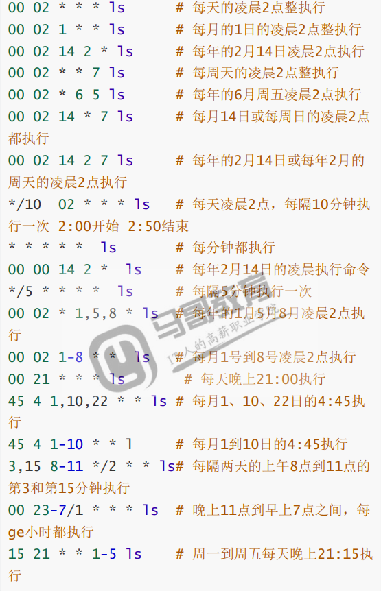

# 计划任务

## 目录

-   [计划任务基本概述](#计划任务基本概述)
    -   [为什么需要crond](#为什么需要crond)
    -   [计划任务基本应用](#计划任务基本应用)
    -   [计划任务时间周期](#计划任务时间周期)
    -   [使用crond实现计划任务](#使用crond实现计划任务)
        -   [场景](#场景)
        -   [注意事项](#注意事项)
        -   [如何备份](#如何备份)
        -   [拒绝特定用户使用](#拒绝特定用户使用)

# 计划任务基本概述

crond就是计划任务。类似于我们平时生活中的闹钟，定时执行

## 为什么需要crond

主要需要做一些周期性任务，例如：

定期备份重要的文件及数据

促销活动。准时开启抢购接口，准时关闭抢购接口

每分钟检测超时订单。超过三十分钟未支付的取消订单

每隔五分钟上各个电商平台刷取订单信息写入自己公司的系统中。

计划任务两大类：系统级别的定时任务，用户级别的定时任务

## 计划任务基本应用

## 计划任务时间周期

```bash
vim /etc/crontab  #crontab配置文件记录了时间周期的含义
################################
SHELL=/bin/bash #执行命令的解释器
PATH=/sbin:/bin:/usr/sbin:/usr/bin  #环境变量
MAILTO=root  #邮件发给谁

# For details see man 4 crontabs

# Example of job definition:
# .---------------- minute (0 - 59) #分钟
# |  .------------- hour (0 - 23)  #小时（二十四小时制）
# |  |  .---------- day of month (1 - 31) #日期
# |  |  |  .------- month (1 - 12) OR jan,feb,mar,apr ... #月
# |  |  |  |  .---- day of week (0 - 6) (Sunday=0 or 7) OR sun,mon,tue,wed,thu,fri,sat #周
# |  |  |  |  |
# *  *  *  *  * user-name  command to be executed
#  *表示任意的（分时日月周）时间都能执行
#  -表示一个时间范围段，如5-7点
#  ，表示分隔时段，如6，0，4表示周六、日、四
#  /1表示每隔n单位时间，如*/10每隔10分钟

```

计划任务编写规范



## 使用crond实现计划任务

相关选项                                                                                                                                                                                                                                                                                                                                                                                                                                                                                                                                                                                                                                                                                                                                                                                                                                                                                                                                                                                                                                                                                                                                                                                                                                                                                                                                                                                                                                                                                                                                                                                                                                                                                                                                                                                                                                                                                                                                                                                                                                                                                                                                                                                                                                                                                                             &#x20;

| 参数 | 含义           |
| -- | ------------ |
| -e | 编辑定时任务       |
| -l | 查看定时任务       |
| -r | 删除定时任务（清空所有） |
| -u | 指定其他用户       |

### 场景

定时时间同步

```bash
ntpdate time.windows.com &>/dev/null  #同步时间并将将要输出的内容输出到黑洞
crontab -e -u root #编辑定时任务并指定root用户
crontab  -l -u root #查看root用户下的定时任务
```

每半个小时执行一次sunc

```bash
crontab -l
*/30 15,17 * * * sync &>dev/null
```

每天备份文件

eg：每天凌晨三点做一次备份。备份/etc/目录到/backup下面

1.将备份命令写入一个脚本中

2.每天备份文件名格式要求：时间\_用户名\_etc.tar.gz

3.在执行计划任务时，不要输出任务信息

4.存放备份内容的目录要求只保留三天的数据

```bash
#实现如上备份需求
mkdir /backup  #创建一个需要备份到的文件夹
tar zcf $(date+%F)_$(hostname)_etc.tar.gz /etc  #根据需求执行命令
find /backup -name "*.tar.gz" -mtime +3 -exec rm -f {}\; #查找目录下的备份文件
#shell文本模式
vim  /opt/backup.sh
  mkdir /backup
  ar zcf $(date+%F)_$(hostname)_etc.tar.gz /etc
  find /backup -name "*.tar.gz" -mtime +3 -exec rm -f {}\;
#配置定时任务
crontab -l
00 03 * * * bash /root/back.sh &>/dev/null
```

### 注意事项

1.给定时任务注释

2.将需要定期执行的任务写入shell脚本中，避免直接使用命令无法执行的情况tar date

3.定时任务的结尾一定要有&>/dev/null或者将结果追加重定向>>/tmp/date.log文件。主要作用不要将执行结果输出到屏幕。

4.有些命令是无法执行成功的echo"123" >>/tmp/test.log  &>/dev/null

5.如果一定要是用命令，命令必须使用绝对命令

### 如何备份

备份计划任务：

由于所有的计划任务编写完毕后都存储至 /var/spool/cron/{username}中；

所以只需要通过cp、scp的方式进行备份即可

如果计划任务没有备份，还不小心执行了crintab -r

通过查找/var/log/cron中执行的记录，然后过滤与cmd相关的内容行；

通过执行任务的时间推算执行频率；

### 拒绝特定用户使用

crond如何拒绝某个用户使用

```bash
echo "用户" >> /etc/cron.deny #使用root用户将需要拒绝的用户加入到/etc/cron.deny
crontab -e  #登录普通用户，测试能否能编写定时任务

```
