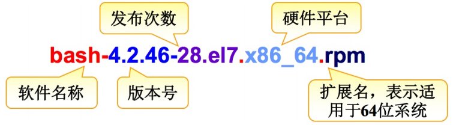
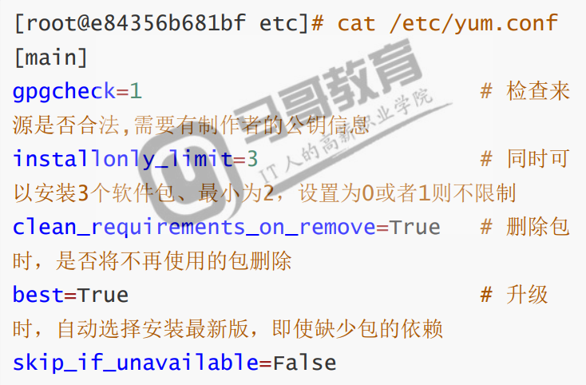
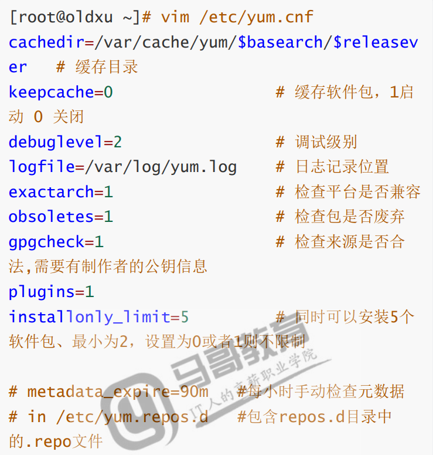
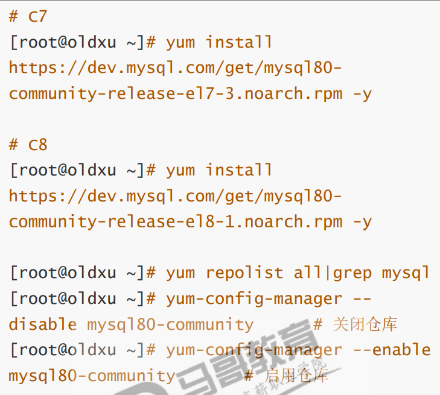
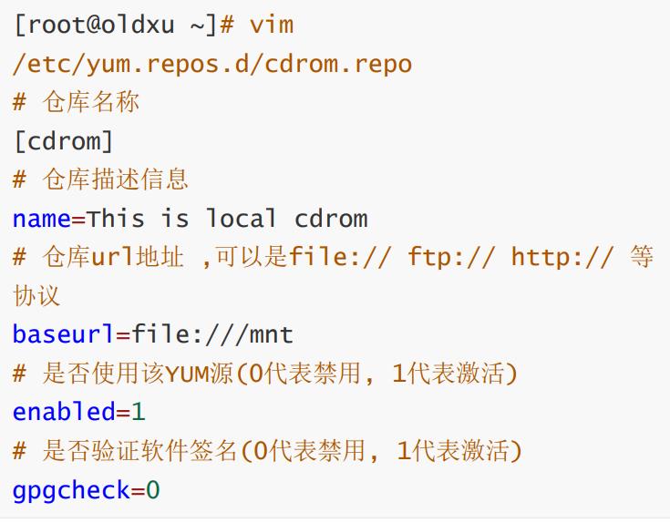
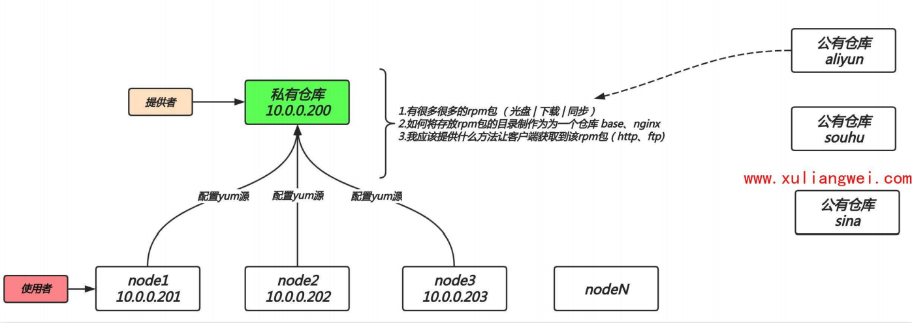
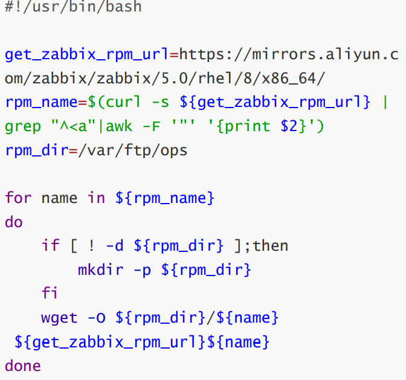
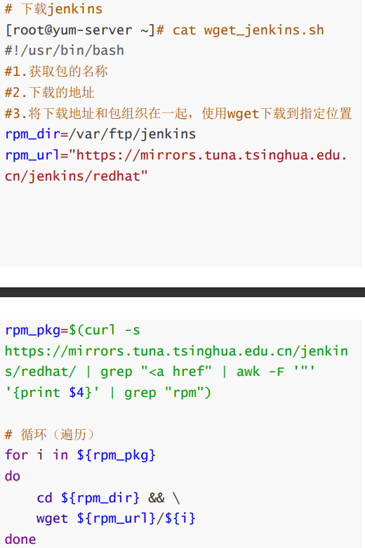
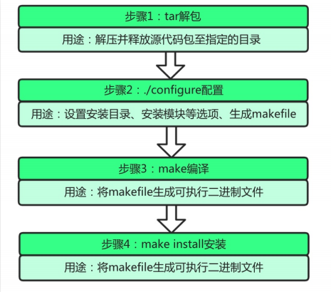

# 软件包管理

## 目录

-   [RPM](#RPM)
    -   [包名组成部分](#包名组成部分)
    -   [其他类型的安装包](#其他类型的安装包)
    -   [包管理命令](#包管理命令)
        -   [安装命令](#安装命令)
        -   [依赖包安装](#依赖包安装)
        -   [升级软件包](#升级软件包)
        -   [卸载安装包](#卸载安装包)
        -   [查询软件包](#查询软件包)
-   [YUM](#YUM)
    -   [源和库](#源和库)
    -   [配置文件](#配置文件)
    -   [配置源](#配置源)
    -   [日常操作](#日常操作)
        -   [查询软件包](#查询软件包)
        -   [安装软件包](#安装软件包)
        -   [重装软件包](#重装软件包)
        -   [更新软件包](#更新软件包)
        -   [删除软件包](#删除软件包)
        -   [管理组包](#管理组包)
        -   [管理仓库](#管理仓库)
        -   [管理历史记录](#管理历史记录)
-   [搭建仓库](#搭建仓库)
    -   [yum缓存包](#yum缓存包)
    -   [搭建本地yum仓库](#搭建本地yum仓库)
-   [搭建企业yum仓库](#搭建企业yum仓库)
    -   [环境准备](#环境准备)
    -   [服务端操作](#服务端操作)
    -   [客户端操作](#客户端操作)
-   [源码包管理实践](#源码包管理实践)
    -   [源码包的优缺点](#源码包的优缺点)
-   [Ubuntu软件包管理](#Ubuntu软件包管理)
    -   [区别](#区别)
    -   [Ubuntu软件包管理](#Ubuntu软件包管理)
    -   [apt包管理](#apt包管理)

# RPM

rpm全称Redhat package manager缩写，是由红帽子开发用于软件包的安装、升级、卸载与查询的工具

格式：xxx.rpm。格式：rpm

## 包名组成部分

RPM包命名以-将软件分成若干部分



## 其他类型的安装包

| 分类        | 安装          | 版本                 |
| --------- | ----------- | ------------------ |
| 熟食类\|rpm包 | 预先编译打包，安装简单 | 软件（k8s开源应用）版本偏低    |
| 菜\|源码包    | 手动编译打包 安装繁琐 | 软件版本随意（rpm包版本低，源码） |
| 二进制包      | 解压即可使用，安装简单 | 不能修改源码（小工具，解压即用）   |

## 包管理命令

### 安装命令

-i ： 安装安装包

-v : 显示安装过程

-h ： 显示安装进度条

使用rpm安装本地路径下的软件包

```bash
mount /dev/cdrom /mnt #挂载光盘
rpm -ivh /mnt/Packagres/包名  #安装包
```

查找安装互联网上的包

```bash
wget 下载到本地 --》安装
rpm -ivh  互联网上软件包的位置  #从互联网上下载软件包
```

### 依赖包安装

包依赖是指A依赖B、B依赖C、C依赖A。当我们需要安装rpm类型包出现依赖关系应该如何处理，

1.尝试安装被依赖的包1

2.尝试安装被依赖的包2

3.尝试安装被依赖的包3

最后尝试安装被主程序包

> 📌由于rpm的包依赖的关系太强，所以通常我们都是使用yum来解决

### 升级软件包

1.先安装低版本

2.尝试使用rpm -ivh安装高版本（会报错）

3.使用rpm -Uvh升级低版本到高版本（完美解决）

### 卸载安装包

如果需要卸载，先查询软件包是否安装，然后再进行卸载操作

```bash
rpm -q 软件包   #使用rpm -q查询软件包是否存在系统
rpm -e 软件包   #删除软件包
```

### 查询软件包

| 选项  | 描述                  |
| --- | ------------------- |
| -q  | 查看指定软件包是否安装         |
| -qa | 查看系统中已安装的所有RPM软件包列表 |
| -qi | 查看指定软件的详细信息         |
| -ql | 查询指定软件包所安装的目录、文件列表  |
| -qc | 查询指定软件包的配置文件        |
| -qf | 查询文件或目录属于那个RPM软件包   |

```bash
rpm -qa  |grep rpm包部分字符  #模糊查找系统已安装的rpm包
rpm -qi  软件包 #查询软件包相关信息
rpm -ql 软件包  #查询软件包所安装中在系统中生成的文件路径
rpm -qc 软件包  #查询软件包的主配置文件
rpm -qf 文件包位置  #查询配置文件或系统是由哪个rpm包提供
rpm -qlp rpm包位置  #查询未安装的rpm包会产生哪些文件
```

小结：查询mkdir命令是由哪个包安装的

1.先查出mkdir命令的位置  whcih  mkdir

2.根据命令位置进行包查询   rpm -qf 命令位置 &#x20;

或者rpm  -qf  \$(which mkdir)  #先执行小括号内的，之后将结果当作输入给前者

ps：rpm查询命令来自那个安装包需要知道命令的绝对路径，如果不存在该命令是无法查找到该命令的所属软件包

3.安装.rpm软件包时，-i和-u有何区别

-i 安装

-u升级

# YUM

yum能通过互联网下载.rpm格式包进行包装，并能自动处理其依赖关系，无需繁琐地一次次下载安装

yum文件后缀为 .repo

## 源和库

要使用yum命令工具安装更新软件，需要有一个包含各种rpm软件包的仓库，这个仓库我们一般称为yum的源。这个源可以是本地仓库、也可以是网络仓库。

例如：client —ftp/http/file—yum地址—yum仓库（rpm包集合）

## 配置文件

centos8的配置文件



centos7的配置文件



## 配置源

系统默认是国外提供源，需要替换为国内的

```bash
wget -O /etc/yum.rpos.d/Centos-base.repo \http://mirrors.aliyun.com/repo/Centos-7.repo
```

配置第三方yum源（EPEL）

```bash
wget -O /etc/yum.reopss.d/epel.repo \http://mirrors.aliyun.com/repo/Centos-7.repo
```

Nginx官方源

vim /etc/yum.repos.d/nginx.repo

yum源的查找方式大体一致Apache，Docker、Nginx、open stark、elkstack

## 日常操作

### 查询软件包

使用dnf|yum list查询所有仓库中的所有软件包

```bash
yum list
yum list | grep ftp
```

使用dnf/yum list installed查询所有已安装至系统中的软件包

```bash
dnf list installed
yun list installed
```

查询命令来自哪个软件包

```bash
yum provides 命令
```

### 安装软件包

使用dnf/yum install通过仓库获取软件包进行安装

```bash
yum install 软件包  #交互，麻烦
yum install 软件包  #非交互
```

使用dnf/yum localinstall安装本地的rpm包，如果rpm包存在依赖，会通过当前已有的仓库获取解决依赖关系

```bash
yum install 网上文件地址
#yum Localinstall安装本地的rpm包，会自动查找当前系统上已有的仓库解决依赖关系
yum localinstall 软件包
```

### 重装软件包

当我们安装好服务后，如果不小心删除了服务的配置文件，此时可以通过重装的方式修复。

首先删除vsftpd配置主文件

```bash
rpm -qc vsftpd  #查找vsftpd文件位置
rm -f 配置文件位置 #删除文件
```

使用dnf/yum reinstall对软件进行重新安装

```bash
yum reinstall vsftpd
```

检查vsftpd服务配置文件是否恢复，以及软件是否能正常使用。

再次运行rpm  -qc查询文件软件包位置

### 更新软件包

```bash
yum check-update  #对比linux已安装的软件和yum仓库中的软件，有哪些需要升级
yum update acl -y #更新acl软件
yum update -y #更新整个系统所有的软件，包括内核（通常刚装完系统会执行）
```

### 删除软件包

```bash
yum remove 软件包
```

### 管理组包

使用命令dnf/yum groups install安装一整个组的软件

```bash
yum group list
yum groups install Development \
Compatibility libraries \
base debugging Tools
```

使用命令删除包组

```bash
yum group remove 要移除的软件包 -y
```

### 管理仓库

列出dnf/yum repolist源可用的软件仓库

```bash
yum repolist all #查看所有的仓库
```

通过dnf/yum-config-manager启用和禁用仓库（本质都是在修改repo文件中的enable参数0  1）



### 管理历史记录

当我们删除了某个软件时，希望撤销删除的操作，可以使用yum history undo

删除httpd软件，然后参看操作记录

```bash
yum remove httpd -y
yum history
```

使用dnf/yum history undo Number撤销

```bash
yum history info N
yum history undo N
```

# 搭建仓库

## yum缓存包

方式1.通过修改dnf/yum全局配置文件

```bash
vim /etc/yum.conf
keeocache=1  #启动缓存
yum install lrzsz -y
find /var/cache/yum/ -type f -name "*.rpm"
```

&#x20;方式2.通过dnf/yum下载该软件包至本地，不进行安装

```bash
yum install httpd -y \
--downloadonly \
--downloaddir=/opt
```

方式3.清理缓存，可以使用dnf/yum clean

```bash
yum clean all #清理所有yum缓存信息，包括缓存的软件包
yum clean packages  #仅清理所有缓存的软件包
```

## 搭建本地yum仓库

Linux系统刚安装时是不能联网的。但需要安装相应环境的软件包。这个时候就可以利用光盘制作一个本地yum仓库

方式1.光盘挂载上：rpm -ivh /path/xx.rpm
方式2.将光盘制作为一个本地仓库，提供本地使用；自己解决依赖问题

```bash
mount /dev/cdrom /mnt  #挂载镜像
gzip /etc/yum.repos.d/* #备份原有仓库

```

编辑一个.repo文件，将仓库信息存储至该文件



生成缓存信息然后安装软件测试

```bash
yum makecache
yum install lrzsz -y
```

# 搭建企业yum仓库

很多时候不仅仅是一台机器无法上网，而是很多机器都无法上网，这个时候难道要每一台机器都要挂载光盘吗？可以是可以但是文件更新怎办，所以我们就需要构建一个人企业级的yum仓库



本地光盘提供基础软件包：base

yum缓存提供常用软件包：nginx、zabbix、docker

### 环境准备

| 系统     | IP         | 角色  |
| ------ | ---------- | --- |
| centos | 10.0.0.100 | 服务器 |
| centos | 10.0.0.99  | 客户端 |

### 服务端操作

```bash
systemctl stop firewalld #关闭防火墙
setenforce  0
```

```bash
yum -y install vsftpd
system start vsftpd
system enable vsftpd #安装ftp服务并加入开机启动
mkdir -p /var/ftp/centos
mount /dev/cdrom/mnt
cp -rp /mnt/packages/*.rpm/var/ftp/cetos7 #首先提供基础base软件包，centos7和centos包的位置不同
```

```bash
curl -s 'https://mirrors.aliyun.com/zabbix/zabbix/1.8/rhel/6/x86_64/' | grep "a href" | awk -F '"' '{print $2}' | grep "rpm" | sed -r 's#(.*)#wget -O /var/ftp/zabbix/\1 https://mirrors.aliyun.com/zabbix/zabbix/1.8/rhel/6/x86_64/\1#g' | bash  
#提供第三方源的rpm软件包，curl：访问浏览器的数据并输出，筛选出下载文件，用sed加awk进行下载
```

脚本下载





提供第三方源的rpm软件包，采用Rsync同步科大源方式实现，后期结合定时任务，定点同步互联网最新软件包;

```bash
rsync -avz rsync://rsync.mirrors.ustc.edu.cn/repo/nginx /var/ftp/
```

```bash
yum -y install createrepo #安装仓库创建文件
createrepo  要创建仓库的文件  #创建仓库
#ps: 如果此仓库每次新增软件则需要重新生成一次


```

### 客户端操作

所有客户端仅需yum源指向本地客户端，即可使用本地当服务器提供的软件包

```bash
gzip /etc/yum.repos.d/*#
vim /etc/yum.repos.d/centos7
[centos7]
name=centos_base
baseurl=ftp://10.0.0.100/centos7 #centos7和centos8配置不同
gpdcheck=0
配置使用其他源
vim /etc/yum.repos.d/ops.repo
[http_server_nginx]
name = anyway
baseurl = http://10.0.0.100/nginx/
enable = 1
gpgcheck = 0

[http_server_jenkins]
name = anyway
baseurl = http://10.0.0.100/jenkins/
enable = 1
gpgcheck = 0


[http_server_zabbix]
name = anyway
baseurl = http://10.0.0.100/zabbix/
enable = 1
gpgcheck = 0

```

# 源码包管理实践

\`源码包指的是开发编写好的程序源代码，但并没有将其编译为一个能正常使用的二进制工具。

## 源码包的优缺点

优点：1.可以自行修改源代码，但是需要会c

2.可以定制需要的相关功能

3.新版软件优先更新源码

缺点：1、相对rpm安装软件的方式会复杂很多。

2.标准化实施困难，自动化就无法落地

源码获取：常见的软件包都可可以在观望获取源码包，比如apache、nginx、mysql

如何安装：



此方法不是百分百通用于所有源码包，建议拿到源码包解压后，进入目录寻找相关的README帮助文档

# Ubuntu软件包管理

### 区别

| 操作内容      | centos                              | Ubuntu                                |
| --------- | ----------------------------------- | ------------------------------------- |
| 软件包后缀     | \*.rpm                              | \*.deb                                |
| 源配置文件     | /etc/yum.conf                       | /etc/apt/sources                      |
| 网卡配置文件    | /etc/sysconfig/network-scripts-eth0 | /etc/netplan/00-installer-config.yaml |
| 创建用户      | 默认创建用户家目录、解释器bash                   | 默认不创建用户家目录、解释器为sh                     |
| 防火墙规则     | 默认规则                                | 默认没有任何规则                              |
| 权限        | root或普通用户                           | 默认普通用户权限                              |
| ssh       | 默认允许root登录                          | 默认不允许root登录                           |
| selinux   | /etc/selinux/config                 | 没有selinux                             |
| 更新软件包列表   | yum makecahe                        | apt update                            |
| 安装软件      | yum install package                 | apt insrall package                   |
| 安装已下载的软件包 | rpm -ivh pkg.rpm                    | dpkg -i pkg.deb                       |
| 安装一下载的软件包 | yum localinstall pkg.rpm            | apt install ./pkg.deb                 |
| 删除软件包     | yum remove pscksage                 | apt remove \|pur                      |

### Ubuntu软件包管理

debian软件包的包名叫deb，类似rpm包。对于deb包的管理方式有dpkg、apt两种方式

dpkg：可以实现安装、删除、但无法解决依赖项

apt：类似yum，功能强大

### apt包管理

| apt命令            | apt-get命令            | 命令功能            |
| ---------------- | -------------------- | --------------- |
| apt install      | apt-get intsall      | 安装软件包           |
| apt remove       | apt-get remove       | 移除软件包           |
| apt purge        | apt-get purge        | 移除软件包及配置文件      |
| apt updata       | apt-get update       | 刷新存储库索引         |
| apt upgrade      | apt-get upgrade      | 升级所有可升级的软件包     |
| apt autoremove   | apt-get autoremove   | 自动删除不需要的包       |
| apt full-upgrade | apt-get dist-upgrade | 在升级软件包时自动处理依赖关系 |
| apt search       | apt-cache search     | 搜索应用程序          |
| apt show         | apt-cache show       | 显示安装细节          |
