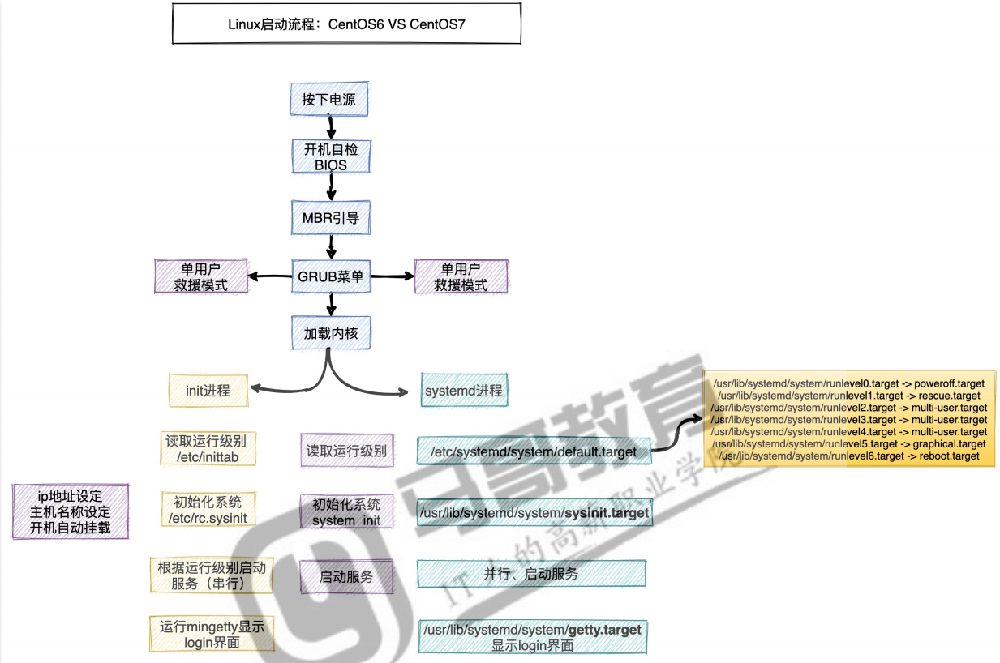
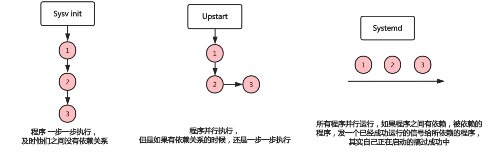

# 系统服务

## 目录

-   [系统启动流程](#系统启动流程)
-   [运行级别](#运行级别)
    -   [调整运行级别](#调整运行级别)
-   [systemd管理](#systemd管理)
    -   [由来](#由来)
    -   [优势](#优势)
    -   [相关命令](#相关命令)
-   [救援模式](#救援模式)
    -   [场景1-忘记超级管理员密码](#场景1-忘记超级管理员密码)
    -   [场景2-系统损坏需备份数据](#场景2-系统损坏需备份数据)
    -   [场景3-误删除grub文件修复](#场景3-误删除grub文件修复)
-   [ulimit资源限制](#ulimit资源限制)

# 系统启动流程

centos6：[Linux 系统启动过程 | 菜鸟教程 (runoob.com)](https://www.runoob.com/linux/linux-system-boot.html "Linux 系统启动过程 | 菜鸟教程 (runoob.com)")

centos7



# 运行级别

指操作系统当前正在运行的功能级别

| system V  init级别 | systemd目标名称                             | 作用          |
| ---------------- | --------------------------------------- | ----------- |
| 0                | runlevel0.target,&#xA;poweroff.target   | 关机          |
| 1                | runlevel0.target,&#xA;poweroff.target   | 单用户模式（修改密码） |
| 2                | runlevel2.target,&#xA;multi-user.target |             |
| 3                | runlevel3.target,multi-user.target      | 字符界面（最多）    |
| 4                | runlevel4.target,&#xA;multi-user.target |             |
| 5                | runlevelr5.targetgraphical.target       | 图形界面        |
| 6                | runlevel6.target,&#xA;reboot.target     | 重启          |

## 调整运行级别

systemd使用targets而不是runlevels有两个目标：

multi-user.target：类似于运行级别3

graphical.target：类似于运行级别5

```bash
systemctl get-default #查看系统默认运行级别
systemctl set-default #设置默认目标，请运行
```

# systemd管理

## 由来

Linux一直以来都是采用init进程作为祖宗进程，但是init有两个缺点:
1.系统启动时间长，init进程是串行启动，只有前一个进程启动完，才会启动下一个进程;
2.启动脚本复杂，初始化系统后会加载很多脚本，脚本都会处理各自的情况，并且脚本多而杂;

3.需要写脚本;
systemd 即为system daemon守护进程，systemd主要解决上文的问题而诞生
systemd的目标是，为系统的启动和管理提供一套完整的解决方案;



## 优势

1、最新系统都采用systemd管理RedHat7、centos7、ubuntu15 ;
2、centos7支持开机并行启动服务，显著提高开机启动效率;
3、centos7关机只关闭正在运行的服务，而centos6全部都关闭一次;
4、centos7服务的启动与停止不在使用脚本进行管理，也就是/etc/init.d下不在有脚本;
5、centos7使用systemd解决原有模式缺陷，比如原有service不会关闭程序产生的子进程;

## 相关命令

/usr/lib/systemd/system/:服务启停文件，通过systemctl命令对其文件启动、停止、重载等操作
systemctl start crond:启动服务
systemctl stop crond:停止服务systemctl restart crond:重启服务

systemctl reload crond :重载服务
systemctl enable crond:服务设定为开机运行

systemctl disab1ed crond:服务设定为开机不运行
systemctl daemon-reload crond:创建服务启动文件需要重载配置
systemctl list-unitgfiles:查看各个级别下服务的启动与禁用
systemctl is-enabled crond.service:查看特定服务是否为开机自启动
systemctl is-active crond:查看服务是否在运行

# 救援模式

## 场景1-忘记超级管理员密码

以centos7为例

第1步:重启Linux系统主机并出现引导界面时，按下键盘上的e键进入内核编辑界面
第2步:在linux16这行的后面添加enforcing=Oinit=/bin/bash，然后按ctrl ＋x进入
第3步:进入到系统的单用户模式，依次输入以下命令，重启操作系统，使用新密码登录
1、mount -o rw , remount/默认/分区只读，重新挂载为读写模式
2、echo "123" l passwd --stdin root:非交互式修改密码
3、exec /sbin/init:重新引导系统

## 场景2-系统损坏需备份数据

当系统坏了，无法登录系统，需要把里面数据恢复，这怎么办？

第一步:挂载iso镜像文件，修改BIOS，调整DVD光盘为第一引导;
第二步:选择Troubleshooting，继续选择Rescue a centos system救援模式;

第三步:输入1，然后执行命令chroot/mnt/sysimage，挂载真实系统;
第四步:备份系统中的数据文件至其他磁盘;

## 场景3-误删除grub文件修复

第一步:模拟误删除故障rm -rf /boot/grub2 && reboot

第二步:系统无法正常启动起来（提示grub找不到)

第三步:然后按照之前的操作进入救援模式，执行chroot /mnt/sysimage挂载真实的操作系统;

第四步:使用grub2相关命令修复

grub2-install  /dev/sda重新添加mbr引导

grub2-mkconfigo/boot/grub2/ grub.cfg重新生成配置
ls    /boot/grub2/grub.cfg

# ulimit资源限制

ulimit可以对系统资源进行控制

-u：限制普通用户所能打开的最大进程数目；

-n：限制用户能分配到的文件描述符的数量

```bash
ulimit  -u  3  #限制每个用户最大能打开3个进程
ulimit  -n  10  #限制进程最多打开的文件描述符为10
```

调整ulimit限制参数

通过命令方式调整打开的文件数量，以及进程数都是临时操作，所以需要进行永久配置

配置文件：/etc/security/limits.conf

调整

soft：软限制，超过则提示

hard：硬限制，超过则停止

```bash
[root@oldxu ~]# tai1
/etc/security/limits.conf
# max user processes
*soft nproc 60000* hard nproc 60000
# open files
* soft nofile 100000        (2^6-1 )
hard nofile 100000          ( 2^16-1 = 65535 )
#系统级，添加如下字段（调整内核才可以生效)
[root@node ~]# tail /etc/sysct1.conf
fs.fi7e-max = 100000
```
