# 网络管理

## 目录

-   [为何需要网络](#为何需要网络)
-   [什么是网络](#什么是网络)
-   [互联网通信协议](#互联网通信协议)
    -   [物理层](#物理层)
    -   [数据链路层](#数据链路层)
        -   [什么是广播：](#什么是广播)
    -   [网络层](#网络层)
    -   [传输层](#传输层)
    -   [应用层](#应用层)
-   [TCP协议](#TCP协议)
    -   [三次握手](#三次握手)
    -   [四次挥手](#四次挥手)
    -   [转换状态](#转换状态)
        -   [四次挥手状态转换](#四次挥手状态转换)
    -   [UDP协议](#UDP协议)
-   [网络配置](#网络配置)
    -   [修改网卡名称](#修改网卡名称)
-   [配置网络地址](#配置网络地址)
    -   [nmcli查看网络状况](#nmcli查看网络状况)
    -   [nmcli配置ip地址](#nmcli配置ip地址)
    -   [nmcli修改地址](#nmcli修改地址)
    -   [nmcli管理配置文件](#nmcli管理配置文件)
-   [网卡绑定](#网卡绑定)
    -   [网卡绑定Bonding](#网卡绑定Bonding)
    -   [配置round-robin](#配置round-robin)
    -   [bond](#bond)
        -   [网卡配置](#网卡配置)
        -   [状态检查](#状态检查)
    -   [active-backup](#active-backup)
        -   [网卡配置](#网卡配置)
        -   [bond网卡配置](#bond网卡配置)
        -   [故障模拟](#故障模拟)

# 为何需要网络

1.打破地域上数据传输的限制

2.提高信息之间的传输效率，以便更好实现资源的共享

# 什么是网络

是由若干节点和链接这些节点的链路构成。表示诸多对像及其相互关系。

是信息传输、接收、共享的虚拟平台，通过它把各个信息联系在一起。从而实现这些资源的共享

网络节点链接在一起，需要实现“信息传输”（信息通信）要满足以下条件：

1.使用物理链接的介质将所有计算机连接在一起（网卡、网线、交换机、路由器）

2.双方在通信过程中，必须使用统一的通信标准，也就是通讯协议（互联网通讯协议）

# 互联网通信协议

其实就是规定了一堆标准，用来定义计算机如何接入internet以及接入internet的计算机通信的标准;所以计算机都需要学习此标准、遵循此标准来进行信息传输（信息通信);

国际标准化组织：推出osi七层参考模型。将互联网通讯协议分成了不同的层，每一层都有专门的标准，以及组织数据的格式；

（物、数、网、传、会、表、应）对于写程序来说。通常会把七层归纳为五层（物、数、网、传、应）

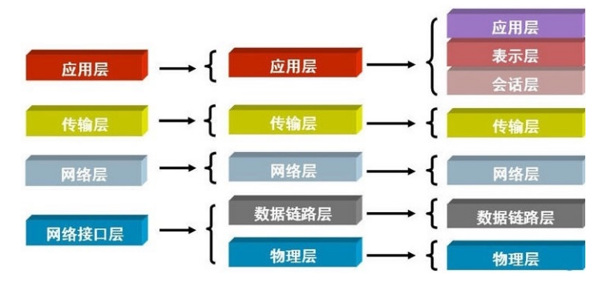

[123.gif (536×489) (xuliangwei.com)](http://cdn.xuliangwei.com/123.gif "123.gif (536×489) (xuliangwei.com)")

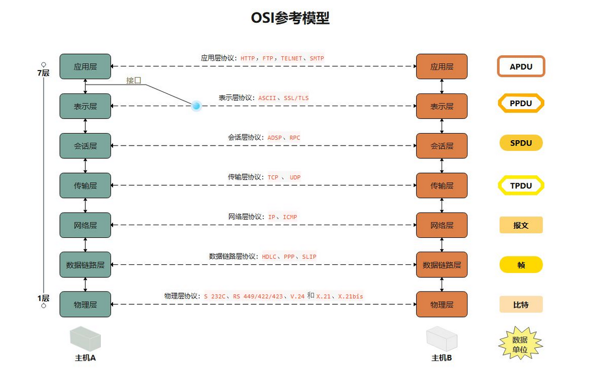

### 物理层

定义物理设备的标准，如网卡网线，传输速率。最终实现数据转成电信号传输

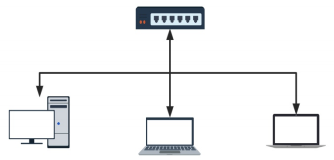

单独发送电信号是没有意义的，因为没开头也没规定结尾，要想变得有意义就要对其进行分组，这时候就要引入数据链路层

### 数据链路层

定义了电信号的分组标准方式，一组数据称之为一个数据帧，严格遵守enhernet以太网协议，以太网规定了如下几件事：

1.数据帧分为head和data两部分组成，其中head固定十八字节

head：发送者/源地址、目标地址/接受者（源地址6字节、目标字节、数据类型6字节）

源地址和目标地址均为MAC地址

data：主要存放是网络层整体的数据，最长1500字节，超过最大限制就分片发送

2.但凡接入互联网的主机必须有一块网卡。网卡烧制了全世界唯一的MAC地址

3.有了以太网协议规定后，它能对数据分组、也可以区分数据的意义，还能找到目标主机的地址、就可以实现计算机通信，但计算机是瞎的，就需要采用广播方式

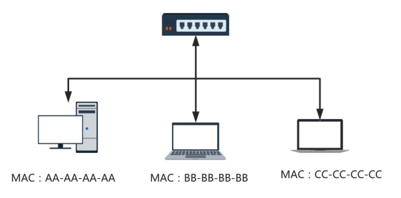

#### 什么是广播：

如果全世界计算机都连接在一起，其中一个计算机传输一串数据给02计算机，全世界的计算机都收到信息，只有02计算机去执行，其他计算机会丢弃收到的命令。

-如果全世界的计算机放在一个交换机上，理论上是不是可以实现全世界通信；

首先无法将全世界计算机放在一台交换机上，因为没有这样的机器

其次就算放在同一设备上，每台计算机都广播一下，设备无法正常工作

所以我们应该将主机划区域，隔离在一个又一个的区域中，然后通过“网关/路由”链接在一起

## 网络层

用来划分广播域，如果广播域内主机要往广播域外的主机发送数据，一定要有一个"网关/路由"帮其将数据转发到外部计算机;网关和外界通信走的是路由协议(这个我们不做详细阐述)。其次网络层协议规定了如下几件事;

1.数据包分为head和data两部分组成

head：发送者/源地址、目标地址/接受者，该地址为IP地址

data：主要存放是传输层整体的数据

2.IP地址来划分广播域，主要来判断两台是否在同一广播域中；

合法的ipv4地址组成=ip地址/子网掩码[在线网络计算器 | TCP/IP子网掩码计算换算 —在线工具 (sojson.com)](https://www.sojson.com/convert/subnetmask.html "在线网络计算器 | TCP/IP子网掩码计算换算 —在线工具 (sojson.com)")

如果计算出两台地址的官广播域一样，说明两台计算机处在同一区域中

如果它们处于同一网络（局域网)10.0.0.1-->10.0.0.100 :

1.本地电脑根据数据包检查目标IP如果为本地局域网;

⒉.直接通过交换机广播MAC寻址;将数据包转发过去;

如果它们处于不同网络（跨局域网)10.0.0.1-->39.104.16.126∶

arp地址协议

1.本地根据数据包检查目标IP如果不为本地局域网，则尝试获取网关的MAc地址;

2.本地封装数据转发给交换机，交换机拆解发现目标MAc是网关，则送往网关设备;

3.网关收到数据包后，拆解至二层后发现请求目标MAc是网关本机MAC;

4.网关则会继续拆解数据报文到三层，发现目标地址不为网关本机;

5.网关会重新封装数据包，将源地址替换为网关的wAN地址，目标地址不变;

6.出口路由器根据自身“路由表"”信息将数据包发送出去，直到送到目标的网关;

## 传输层

网络层帮我们区分子网，数据链路层帮我们找到主机，但一个主机有多个进程，进程之间进行不同的网络通信，那么当收到数据时，如何区分数据是那个进程的呢;其实是通过端口来区分;端口即应用程序与网卡关联的编号。

定义：提供进程之间的逻辑通信

传输层也分成:head和data两部分组成;head:源端口、目标端口、协议(TCP、UDP) ;
data:主要存放是应用层整体的数据;

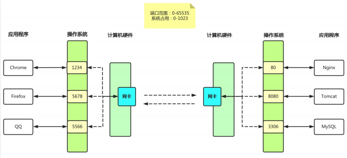

## 应用层

为终端应用提供服务，如我们浏览器交互时候需要用到的HTTP协议，邮件发送的smtp，文件传输的ftp等

# TCP协议

tcp可靠数据传输协议;为了实现可靠传输，在通信之前需要先建立连接，也叫"双向通路"，就是说客户端与服务端要建立连接，服务端与客户端也需要建立连接，当然建立的这个双向通路它只是一个虚拟的链路，不是用网线将两个设备真实的捆绑在一起;

虚拟链路的作用:由于每次通信都需要拿到IP和Port，那就意味着每次都需要查找，建立好虚拟通路，下次两台主机之间就可以直接传递数据;

## 三次握手

第一次:客户端要与服务端建立连接，需要发送请求连接消息;
第二次:服务端接收到数据后，返回一个确认操作(至此客户端到服务端链路建立成功);
第三次:服务端还需要发送要与客户端建立连接的请求;
第四次:客户端接收到数据后，返回一个确认的操作(至此服务端到客户端的链路建立成功);

由于建立连接时没有数据传输，所以第二次确认和第三次请求可以合并为一次发送;

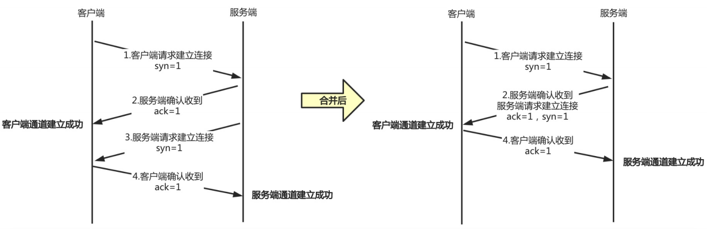

TCP协议为了实现可靠传输，通信双方需要判断自已经发送的数据包是否都被接收方收到，如果没收到,就需要重发。为了实现这个需求，就引出序号
(seq）和确认号(ack)的使用。
举例:发送方在发送数据包时，序列号(假设为123)，那么接收方收到这个数据包以后，就可以回复一个确认号(124=123+1）告诉发送方“我已经收到了你的数据包，你可以发送下一个数据包，序号从124开始"，这样发送方就可以知道哪些数据被接收到，哪些数据没被接收到，需要重发。

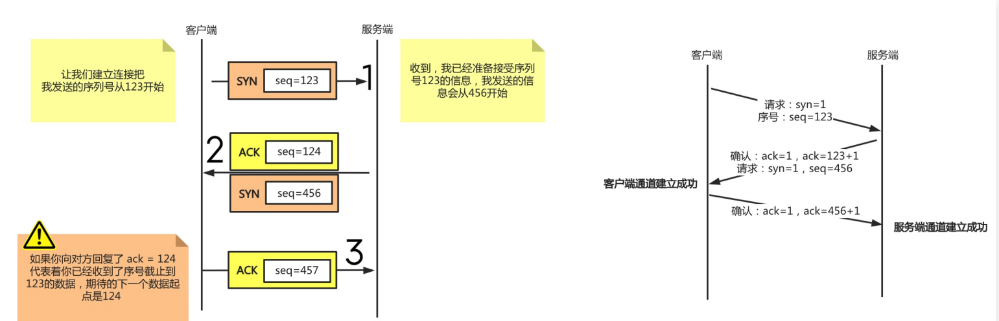

## 四次挥手

第一次挥手:客户端（服务端也可以主动断开)向服务端说明想要关闭连接;
第二次挥手:服务端会回复确认。但不是立马关闭，因为此时服务端可能还有数据在传输中;
第三次挥手:待到服务端数据传输都结束后，服务端向客户端发出消息，我要断开连接了;
第四次挥手:客户端收到服务端的断开信息后，给予确认。服务端收到确认后正式关闭。

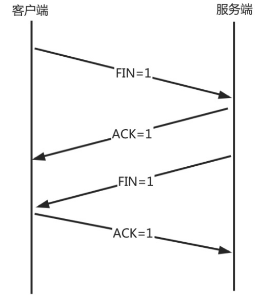

## 转换状态

三次握手状态转换：

1.客户端发送syn包向服务端请求建立tcp链接，客户端进入syn\_send状态

2.服务端收到请求之后，之后向客户端发送syn+ack的合成包，同时自身进入syn\_recv状态

3.客户端收到回复之后，发送ack信息，自身进入establied状态

4.服务端收到ack数据之后，进入ESTABLISHED状态

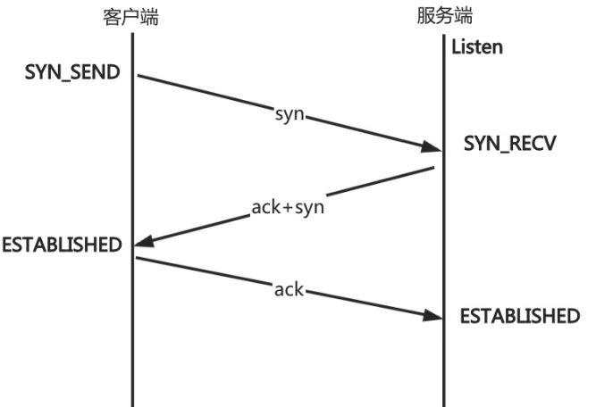

### 四次挥手状态转换

1.客户端发送完数据之后，向服务器请求断开链接，自身进入FIN\_WAIT\_1状态

2.服务端收到FIN包之后，回复ACK包表示收到，但此时服务端可能还有数据没发送完成，自身进入CLOSE\_WAIT妆台，表示对方发送完成且请关闭链接，自身发送完成之后可以关闭链接&#x20;

3.服务端数据发送完成后，发送FIN包给客户端，自身进入LAST\_ACK状态，等待客户端ACK确认

4.客户端收到FIN包之后，回复一个ACK包，并进入TIME\_WAIT状态注意:TIME\_WAIT状态比较特殊，当客户端收到服务端的FIN包时，理想状态下，是可以直接关闭连接了;但是有几个问题:

问题1:网络是不稳定的，可能服务端发送的一些数据包，比服务端发送的FIN包还晚到;

问题2:.如果客户端回复的ACK包丢失了，服务端就会一直处于LAST\_ACK状态

如果客户端没有关闭，那么服务端还会重传FIN包，然后客户端继续确认;
所以客户端如果AcK后立即关闭连接，会导致数据不完整、也可能造成服务端无法释放连接。所以此时客户端需要等待2个报文生存最大时长，确保网络中没有任何遗留报文了，再关闭连接;

如果机器TIME\_WAIT过多，会造成端口会耗尽，可以修改内核参数tcp\_tw\_reuse=1端口重用;

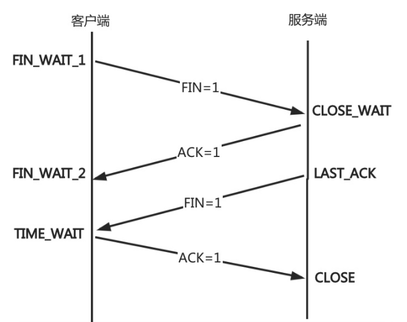

## UDP协议

&#x20;是不可靠传输协议；不可靠指的是传输数据时不可靠

udp协议不需要先建立链接。只需要获取服务端的ip+port发送完毕也无需服务器返回ack

udp协议如果在发送过程中丢失了那就是丢失了

# 网络配置

```bash
yum install net-tools -y  #安装ifconfig工具
ifconfig  #查看网卡信息
ifconfig  #仅查看eth0网卡信息
ifconfig -a  #查看所有网卡信息，包阔禁用和启用
#UP：网卡处于活动状态，BROADCAST：支持广播
#RUNNING：网线已接入
#MULTICAST:支持组播#MTU:最大传输单元(字节),接口一次所能传输的最大包
#enther:硬件(MAC)地址 txqueuelen:传输缓存区长度大小
#RX packets:接收的数据包
#TXpackets:发送的数据包
#errors:总的收包的错误数量#dropped:拷贝中发生错误被丢弃
#co77isions : 网络信号冲突情况,值不为0则可能存在网络故障
ip addr show eth0   #查看当前地址
 2: eth0: <BROADCAST,MULTICAST, 1.UP ,LOWER_UP>mtu 1500 qdisc pfifo_fast state uP qlen
1000
2.link/ether 00: 0c:29:5f:6b: 8aff:ff: ff: ff:ff : ff
3.inet 10.0.0.100/24 brda 4. 192.168.69.255scope global ens32
valid_lft forever preferred_1ft
forever
5.inet6 fe80: : bd23:46cf:a12e : c0a1/64scope 7ink
valid_lft forever preferred_lft
forever
#1.活动接口为UP
#2:Link行指定设备的MAC地址
#3:inet行显示IPv4地址和前缀
#4:广播地址、作用域和设备名称在此行
#5:inet6行显示IPv6信息
ip -s link show eth0  #查看网络性能的统计信息，例如：发送和传送的包，错误、丢弃
2: eth0: <BROADCAST,MULTICAST,UP,LOWER_UP> mtu 1500 qdisc pfifo_fast state UP mode DEFAULT group default qlen 1000
    link/ether 00:16:3e:14:54:49 brd ff:ff:ff:ff:ff:ff
    RX: bytes  packets  errors  dropped overrun mcast   
    19142678344 57010359 0       0       0       0       
    TX: bytes  packets  errors  dropped carrier collsns 
    28473763431 44556591 0       0       0       0 


```

## 修改网卡名称

场景1- - -已安装操作系统，修改网卡命名为eth0和eth1

```bash
cc /etc/sysconfig/network-wcripts/  #切换到存放网卡的文件夹
mv ifcfg-ens32 ifcfg-eth0    #将原来网卡信息文件改为目标文件
vim  ifcfg-eth0   #修改配置文件
NAME=eth0
DEVICE=eth0 
vim /etc/sysconfig/grub   #修改内核启动参数，禁用预测命名规则方案，将net.ifname=0 biosdevname=0参数关闭
GRUB_CMDLINE_LINUX="...net.ifname=0 biosdevnname=0 quiet"
grub2-mkconfig -o /boot/grub/grub.cfg
reboot  #重启系统
ifconfig  #检查网卡名称是否修改成功
```

&#x20;场景2- - - 在新安装系统时，修改网卡名称规则

1.选中install Centos7按下tab设定kernel参数；

2.增加内核参数：net.ifname=0 biosdevname=0;

3,进入network界面查看是否修改成功，成功后可继续安装系统

# 配置网络地址

Centos7系统默认采用NetworkManager来提供网络服务，这是一种动态管理网络配置的守护进程，能够让网络设备保持连接状态。NetworkManager提供的命令行和图形配置工具对网络进行设定，设定保存的配置文件在/etc/sysconfig/network-scripts目录下，工具有nmcli、nmtui

NetworkManager有如下两个概念需要了解:

device物理设备，例如:enp2s0, virbr0 , team0

connection连接设置，具体网络配置方案

一个物理设备device可以有多套逻辑连接配置，但同一时刻只能使用一个connection连接配置;

## nmcli查看网络状况

```bash
nmcli device  #查看所有设备
nmcli dev show eth0 #查看某个设备的详细状态
nmcli connection  #查看链接状态
nmcli con show --active   #查看所有活动的链接状态
nmcli con show “eth0”  #查看指定链接状态、

```

## nmcli配置ip地址

使用nmcli创建一个static的链接，配置ip、掩码、网关等

1.添加一个连接设置，并指定链接配置名称

2.将链接配置绑定物理网卡设备

3.配置网卡类型，网卡是否开机启动

4.网卡使什么模式配置ip地址（静态、dhcp）

5，配置网卡的IP地址、掩码、网关、dns等等

```bash
nmcli connection add con-name eth0-static ifname eth0 \
type ethernet autoconnect yes \
ipv4.method manual \
ipv4.addresses 10.0.0.222/24 \
ipv4.gateway 10.0.0.254 \
ipve.dns 233.5.5.5 \
+ipv4.dns 8.8.8.8
#################
nmcli connection up eth0-static  #激活eth0-static的链接
nmcli connection show #显示链接信息
```

## nmcli修改地址

```bash
nmcli connection modify eth0-static \
autoconnect no  #取消开机自动激活网络
nmcli connection modify eth0-static \
ipv4.dns 8.8.8.8  #修改eth0-static链接的dns配置
nmcli connection modify eth0-static \
+ipv4.dns 8.8.8.8  #同上
nmcli connection modify eth0-static \
ipv4.addresses 10.0.0.111/24 ipv4.gateway 10.0.0.254  #替换链接的静态IP和默认网关
nmcli connection delete eth1-static #删除自建的链接
```

## nmcli管理配置文件

使用nmcli管理/etc/sysconfig/network-scripts/配置文件，其实就是自定义一个网卡的配置文件，然后叫给networkmanager服务进行管理

1、新增物理网卡
2、拷贝配置文件(可以和设备名称一致)
3、修改配置,UUID、连接名称、设备名称、IP地址4、重新加载网络配置
5、启用连接,并检查

```bash
cp 原网卡配置文件 添加的物理网卡文件  #添加一个物理网卡并将原网卡文件拷贝到目标文件
[root@o1dxu network-scripts]# cat ifcfg-eth1-static
TYPE=EthernetBOOTPROTO=none  #网卡类型none;
static; dhcp;     #硬件服务器都选择static，云主机、docker容器实例一般都是dhcp
IPADDR=10.0.0.222    #iP地址
PREFIX=24        #子网掩码
DEFROUTE=yes    #默认路由
NAME=eth1-static   #链接的配置名称
DEVICE=eth2    #设备名称
ONBOOT=yes      #开机是否启动
nmcli connection reload  #重载链接，让networkmanager服务能够识别添加自定义网卡配置
#########################
#如果网卡链接配置已经关联了eth1物理设备，希望修改IP地址，可以用如下方式
# 方式一、nmcli modify方式修改然后重载配置[root@o1dxu ~]# nmcli modify eth1-staticipv4 .address 10.0.0.233/24
nmcli down eth1-static &&nmcli up eth1-static
#方式二、vim修改，先reload，然后重载
[root@node~network-scripts]# cat ifcfg-eth1-static
IPADDR=10.0.0.234
nmc1i connection down eth1-static &&nmcli connection up eth1-static#重新加载

```

# 网卡绑定

## 网卡绑定Bonding

1、可以实现网络冗余，避免单点故障;
2、可以实现负载均衡，以提升网络的传输能力;

网卡绑定实现模式

模式0 balance-rr负载轮询:两网卡单独100MB，聚合为1个网络传输，则可提升为20OMBО

模式1 active-backup高可用:两块网卡，其中一条若断线，另外的线路将会自动顶替

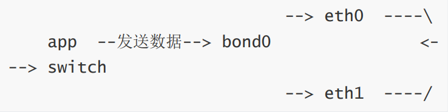

## 配置round-robin

```bash
cat /etc/sysconfig/network-scripts/ifcfg-eth0   #eth0网卡配置
TYPE=Ethernet
DEVICE=eth0NAME=eth0ONBOOT=yesMASTER=bond0SLAVE=yes
cat /etc/sysconfig/network-scripts/ifcfg-eth1  #eth1网卡配置
TYPE=Ethernet
DEVICE=eth1NAME=eth1ONBOOT=yesMASTER=bond0SLAVE=yes

```

## bond

### 网卡配置

```bash
cat /etc/sysconfig/network-scripts/ifcfg-bond0   #查看bond网卡配置文件
TYPE=Bond
BOOTPROTO=noneONBOOT=yes
DEVICE=bond0NAME=bond0
IPADDR=10.0.0.100PREFIX=24
GATEWAY=10.0.0.2DNS1=223.5.5.5DEFROUTE=yes
BONDING_MASTER=yes
BONDING_OPTS="miimon=200 mode=O"     #检查间隔时间ms
```

### 状态检查

```bash
cat /proc/net/bonding/bond0
ethool bond0 #检查网卡传输速度
nmcli connection delete bond0  #删除网卡
```

## active-backup

### 网卡配置

```bash
cat /etc/sysconfig/network-scripts/ifcfg-eth0    #网卡eth0文件
TYPE=Ethernet
DEVICE=eth0NAME=eth0ONBOOT=yesMASTER=bond1SLAVE=yes
##########################################################
cat /etc/sysconfig/network-scripts/ifcfg-eth1    #网卡rth1文件配置
TYPE=Ethernet
BOOTPROTO=noneDEVICE=eth1NAME=eth1ONBOOT=yesMASTER=bond1SLAVE=yes

```

### bond网卡配置

```bash
[root@o1dxu ~]# cat /etc/sysconfig/network-scripts/ifcfg-bond1
TYPE=Bond
BOOTPROTO=noneONBOOT=yes
DEVICE=bond1NAME=bond1
IPADDR=10.0.0.200
PREFIX=24
GATEWAY=10.0.0.2
DNS1=223.5.5.5
BONDING_MASTER=yes
BONDING_OPTS="miimon=200 mode=1 fail_over_mac=1"
#bond1获取mac地址有两种方式
#1、从第一个活跃网卡中获取mac地址，然后其余的SLAVE网卡的mac地址都使用该mac地址;
#2、使用fai1_over_mac参数，是bond0使用当前活跃网卡的mac地址，mac地址随着活跃网卡的转换而变。
# fail_over_mac参数在VMware上是必须配置，物理机可不用配置;
cat /proc/net/bonding/bond1   #状态检查
```

### 故障模拟

```bash
ifdown eth0 #关闭活跃网卡
cat /proc/net/bonding/bond1  #检查状态，发现备用网卡切换为活跃网卡
```
