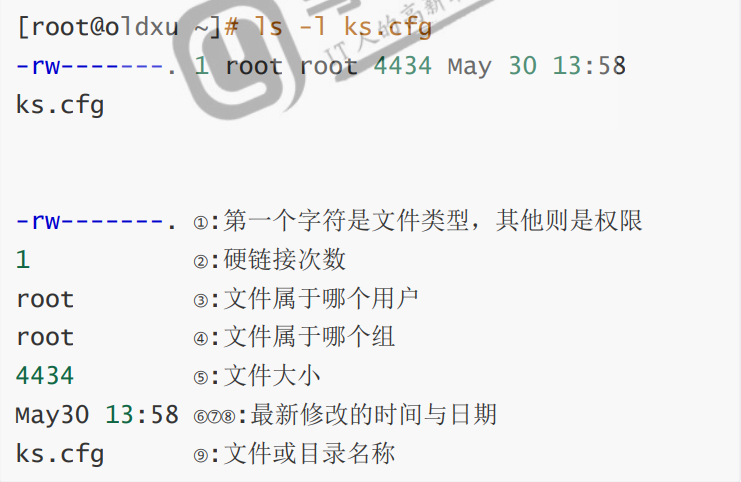
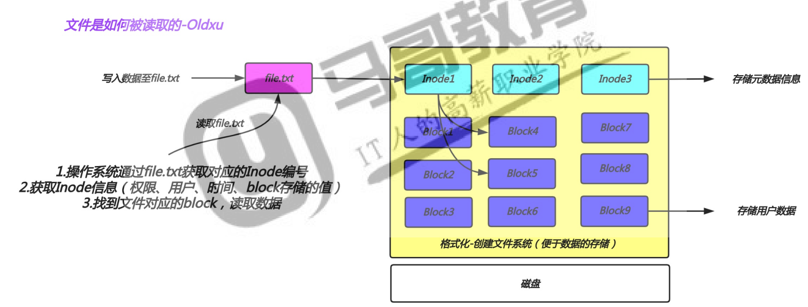
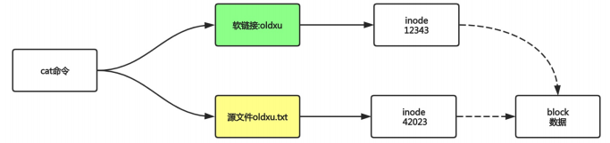
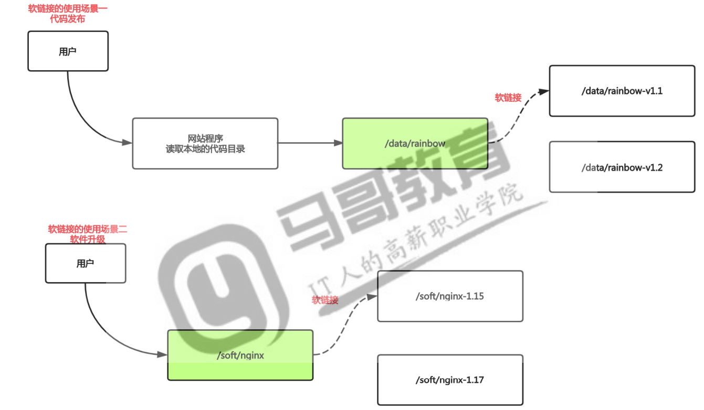
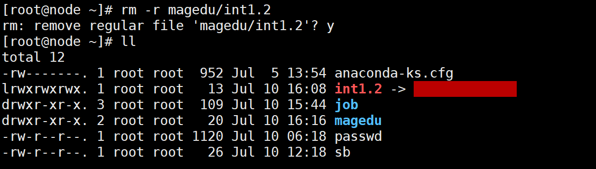
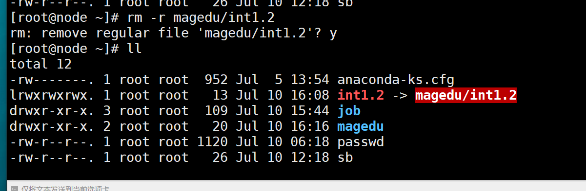

# 文件知识扩展

## 目录

-   [文件属性](#文件属性)
-   [文件类型](#文件类型)
-   [链接文件](#链接文件)
    -   [Indoe与Block](#Indoe与Block)
-   [软硬链接](#软硬链接)
    -   [软链接](#软链接)
        -   [实现原理](#实现原理)
        -   [创建软链接](#创建软链接)
    -   [硬链接](#硬链接)
-   [文件时间](#文件时间)

## 文件属性

&#x20;当我们使用ls -列出目录下所有文件时，通常会以长格式的方式显示，其实长格式显示就是我们Windows下看到的文件的详细信息，我们将其称为文件属性，整个文件的属性分为十列。各列的含义如下：



## 文件类型

通常我们使用颜色或者后缀名称来区分文件类型，但有时候是不准确的

所以我们可以通过ls -l以长格式显示一个文件的属性，通常第一列的第一个字符来进一步的判断文件具体的类型。

第一列字母类型说明

| 文件字母类型 | 类型含义                               |
| ------ | ---------------------------------- |
| -      | 普通文件（文本，二进制，压缩，图片，日志等）             |
| d      | 目录文件                               |
| b      | 设备文件（块文件）存储设备硬盘 /dev/sda, /dev/sr0 |
| c      | 设备文件（字符设备），终端、dev、tty1             |
| s      | 套接字文件，进程与进程间的一种通信方式（socket插座）      |
| \|     | 链接文件                               |

有些情况下，无法通过ls -l查看文件类型，这个时候我们就需要用“file”命令来精确判断这个文件类型

```bash
file 文件位置  #精确显示文件类型
```

## 链接文件

### Indoe与Block

文件有文件名与数据，Linux中划分为两个部分：数据data与文件元数据metadata

查看文件inode和block命令：stat

1.数据data block，数据块是用来记录文件真实内容的地方，我们称为Block

2.元数据metadata，用来记录文件大小、创建时间、所有者等信息，称为Inode

3.notice：Inode不包含文件名称，Inode仅包含文件的元数据信息，主要包含以下内容：

a.文件字节数

b.文件的user ID Group  ID

c.文件的读、写、执行权限

d.文件的时间戳（访问时间、修改时间、创建时间）

e.连接数，既有多少文件名指向这个inode

f.文件数据block的位置

4.没有inode都有一个编号，操作系统是通过inode来识别不同的文件。



## 软硬链接

### 软链接

相当于Windows的快捷方式

#### 实现原理



1.软连接文件会将inode指向源文件block

2.当我们访问这个软链接文件时，其实访问的时源文件本身

使用场景：软件升级，代码发布



#### 创建软链接

```bash
ln -s 要链接的位置 链接名 #创建软链接
rm -r 软链接链接名 && 创建软链接 #删除软链接同时创建软链接，保证用户访问时不会断点。 
```

> 📌如果删除链接文件，将会提示链接无效，链接文件闪红。





### 硬链接

## 文件时间

[linux中文件的三种time（atime,mtime,ctime） - LinuxPanda - 博客园 (cnblogs.com)](https://www.cnblogs.com/zhaojiedi1992/p/zhaojiedi_linux_031_linuxtime.html "linux中文件的三种time（atime,mtime,ctime） - LinuxPanda - 博客园 (cnblogs.com)")

Linux的文件有三个时间，分别为：atime，mtime，ctime

| 简名    | 全名          | 中文名  | 含义                   |
| ----- | ----------- | ---- | -------------------- |
| atime | access time | 访问时间 | 文件中的数据最后被访问的时间       |
| mtime | modify time | 修改时间 | 文件内容被修改的最后时间         |
| ctime | change time | 变化时间 | 文件的元数据发生变化。比如权限，所有者等 |
