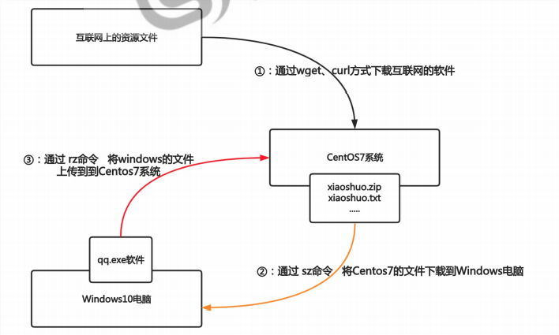
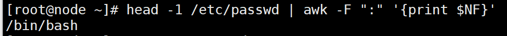
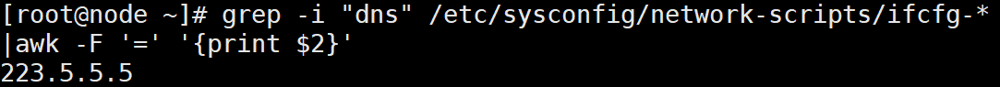
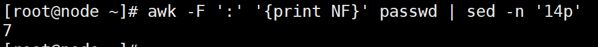
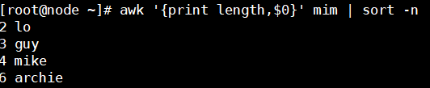
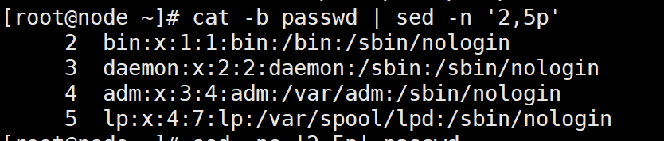
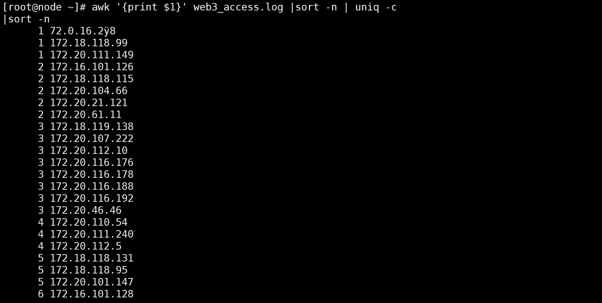
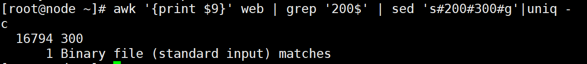
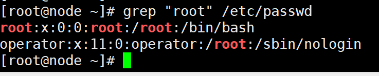
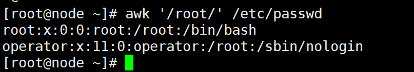

# 命令

## 目录

-   [查看命令](#查看命令)
    -   [head](#head)
    -   [tail](#tail)
-   [下载命令](#下载命令)
    -   [wget](#wget)
    -   [curl](#curl)
    -   [rz-sz](#rz-sz)
-   [查询命令](#查询命令)
    -   [which](#which)
    -   [whereis](#whereis)
-   [过滤（行）](#过滤行)
    -   [grep 过滤文件内容，保留符合所写条件的](#grep-过滤文件内容保留符合所写条件的)
-   [取列（列）](#取列列)
    -   [awk](#awk)
-   [替换（字符）](#替换字符)
    -   [sed](#sed)
-   [排序-去重](#排序-去重)
    -   [sort排序](#sort排序)
-   [统计](#统计)
    -   [uniq](#uniq)
    -   [cut](#cut)
    -   [wc](#wc)

## 查看命令

### head

```bash
head pass #查看头部前十行文件
head -n5 pass #查看前五行文件 
```

### tail

```bash
tail pass #查看尾部文件 默认后十行
tail -number 文件位置#查看文件后number行
tail -f（或tailf） 文件位置 #查看文件尾部变化，监控
```

## 下载命令



### wget

centos最小化安装默认的没有wget，需要进行安装

```bash
yum install wget -y  
```

下载互联网上文件到本地

```bash
wget 文件地址#下载到当前目录
```

将文件下载到指定目录

```bash
wget -O 指定目录 要下载的文件地址#下载到指定目录
```

### curl

仅查看地址文件的内容

```bash
curl 文件地址
```

将某个地址内的文件下载都指定目录并修改为xx

```bash
curl -o 指定目录/xx 文件地址
```

### rz-sz

需要安装命令包，否则则无法使用命令

```bash
yum install lrzsz -y#（y表示确认安装）
rz # 只能上传文件，不支持上传文件夹，不支持大于4G文件，也不支持断电续传
sz # 只能下载文件，不支持下载文件夹
```

> 📌文件下载上传推荐使用xftp工具

## 查询命令

### which

```bash
which 命令 #查看命令的绝对路径
type -a 命令 #查看命令的绝对命令（包括别名） 
```

### whereis

```bash
whereis 命令 #查找命令的路径、帮助手册等
whereis -b 命令 #仅显示命令显示的路径 
```

> 📌查询是查询命令不是查询文件，相对路径的文件可以正常执行。

> 📌查找失败原因：

&#x20;                1.根本不存在这个命令

&#x20;                2.没有安装这个命令

## 过滤（行）

### grep 过滤文件内容，保留符合所写条件的

```bash
grep "^条件"  文件位置 #匹配开头符合条件的行
grep "条件$"  文件位置 #匹配结尾符合条件的行
grep -v "条件" 文件位置 #匹配除了包含条件以外的内容，其他的全部打印 
grep -i "条件" 文件位置 #忽略大小写
grep -Ei "条件$|字符" 文件位置 #匹配文件中包含条件结尾或符合字符的条件的行
-i #搜索时忽略大小写.
-n #列出所有匹配的行，显示行号
-E #匹配多个条件，正则表达式的扩展
-o #输出文件中匹配到的部分
^开头字符
$结尾字符 
-v #取反，取不符合条件的行 
^[^字符] 
```

## 取列（列）

### awk

-F 指定分隔符（拆分成多列）

'{print \$n}' 提取其中某列

awk '/字符/' 筛选符合字符的行

若想在提取的多个列中空隙加字符

```bash
awk  '{print $num"字符"$num}' 文件
awk  'END{print NR}' 文件 #打印文件总行数
awk  'NR==1{print}' 文件 #打印文件第一行
awk  'NR=num && nR=num'#打印第几行到第几行
awk  'NR!=1{print}' #打印文件除第一行外
awk  '{print NF}' 文件 #查看文件列数
-F '条件' #以条件为分隔符进行查看文件列数
awk  '{print length,$0}' #统计字符的个数并输出在第一列
awk -F '[: ] +'多个空格当分隔符
```

eg：以“:”为分隔符，取出/etc/passwd第一行的最后一列的内容



取出当前linux操作系统的DNS /etc/sysconfig/network-scripts/ifcfg- \*。



以：为分隔符查看文件第十四行有多少列

```bash
awk -F ':' '{print NF}' 文件 | sed -n '14p'
```



怎么按照字符的个数对一堆字符串进行排序？
例如：Mike，guy，lo，archie，让他按照字符从少到多排序，预期排序为：lo，guy，MIke，archie。

```bash
awk '{print length,$0}' 1.txt | sort -n
```



## 替换（字符）

### sed

替换

```bash
sed 's#旧#新#g' 文件名称 
```

匹配

```bash
sed -r 's#()()()#\1\2\3#g' 打印到屏幕
sed -r 's#()()()#rm -f \1\2\#g' |bash #运用bash解释命令
```

```bash
sed -n 'num,num+p'，筛选从第几行到第几行

```



打印文本第二行第一列

```bash
sed -n "2,1p" filename |awk 'print $1'
```

## 排序-去重

### sort排序

某些情况下，需要对一个无序的文本文件进行数据进行排序此时需要用sort排序

```bash
sort [OPTION]....[FILE]...
参数 #-r:倒序  -n：按数字排序 -t：（sort -t "符号" ）指定分隔符（默认空格）
#-k:指定几列几字符（指定1,1  3.1,3.3）
sort -t "字符" -k列数  #文本文件指定分隔符对第几列进行排序
```

## 统计

### uniq

如果文件中有多行完全相同的内容，希望删除重复的行，同时统计出完全相同的行的总次数，就可以使用该命令uniq解决（但是必须配合sort使用）

uniq \[OPTION]...\[INPUT \[OUTPUT]]

```bash
#选项：-c 计算机重复的行
#使用 1，先创建一个文本文件
#2，uniq需要和sort一起使用，先使用sort进行排序，让重复内容连续在一起
#3，使用uniq去除相邻重复的行
#4，-c参数能统计出文件中每行内容重复的次数
```

将"web3\_access.log"上传至你的linux服务器
（1）统计出该文件IP地址出现的次数，并按正序对其进行排序



（2）统计该文件内HTTP状态返回码出现的次数（例如200,404,403,在第九列）,并按照倒序进行排序


（3）过滤出所有状态返回码是200的行，并将这些返回码为200行的全部替换成300



匹配/etc/passwd里包含root关键字的行（要求至少两种方法，分别使用awk和grep）





```bash
sed -n '/root/p' /etc/passwd #扩展
```

### cut

```bash
cut OPTION...[FILE]...#语法结构
cut -d "字符" -f number，nubmber 文件位置 #指定在文件第几列和第几列的指定分隔符进行分割 
```

### wc

```bash
wc [OPTION]...[FILE]...
#选项：-l显示文件行数  -c显示文件字节  -w显示文件单词
wc -l 文件位置 #统计文件中有多少行 
```

> 📌扩展统计文件行号方法：

grep -n ". \*" 文件 |tail -1

cat -n ". \*" 文件 |tail -1

awk '{print NR \$0}' 文件 |tail -1
