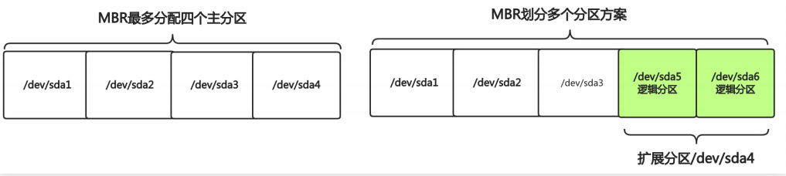
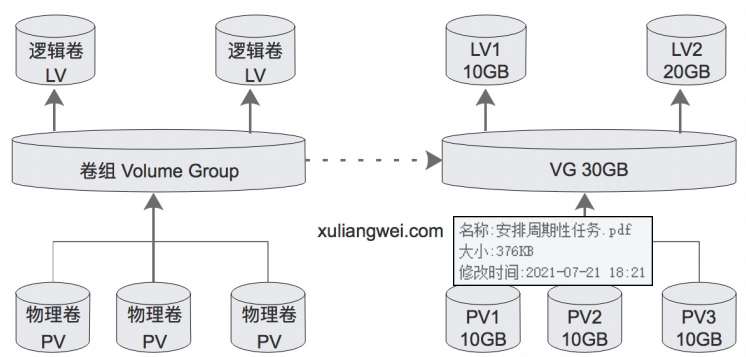

# 磁盘管理

## 目录

-   [磁盘物理结构](#磁盘物理结构)
    -   [什么是盘片](#什么是盘片)
    -   [磁道](#磁道)
    -   [扇区](#扇区)
    -   [柱面](#柱面)
    -   [磁头](#磁头)
    -   [接口类型](#接口类型)
    -   [磁盘命名](#磁盘命名)
-   [分区管理](#分区管理)
    -   [MBR：](#MBR)
    -   [fdisk分区工具](#fdisk分区工具)
    -   [gdisk分区工具](#gdisk分区工具)
    -   [mkfs格式化系统](#mkfs格式化系统)
-   [挂载管理](#挂载管理)
    -   [临时挂载](#临时挂载)
    -   [临时卸载](#临时卸载)
    -   [永久挂载](#永久挂载)
    -   [配置文件/etc/fstab](#配置文件etcfstab)
-   [虚拟磁盘SWAP](#虚拟磁盘SWAP)
    -   [为什么需要swap](#为什么需要swap)
    -   [swap基本应用](#swap基本应用)
-   [逻辑卷lvm](#逻辑卷lvm)
    -   [为何要用lvm](#为何要用lvm)
    -   [什么是lvm](#什么是lvm)
    -   [相关术语](#相关术语)
    -   [配置](#配置)
-   [卷组管理](#卷组管理)
    -   [扩大卷组](#扩大卷组)
    -   [缩小卷组](#缩小卷组)

# 磁盘物理结构

## 什么是盘片

硬盘一般有多个盘片，每个盘面可以有两面，即第一个盘面的正面为0面，反面为1面，依次类推

## 磁道

每个盘片的盘面在出厂时被划分了很多的同心圆环，数据就存储在这样的同心圆环上面，我们将这样的圆环称为磁道Track，肉眼可见

## 扇区

将磁道划分为若干弧段，每一个弧段就是一个扇区sector，是硬盘上的存储物理单位，

## 柱面

处于同一个垂直区域的磁道称为柱面，即为盘面上相同磁道的集合，存储到相同半径磁道上的统一扇区，可以实现并行读取，主要减少了磁头寻道时间

## 磁头

读取磁盘磁道上面的金属块，主要负责读或写入数据。

## 接口类型

IDE  SCSI（已经淘汰）、sata、sas、msata、m2

msata是专门为超级笔记本设计的，m2是inter为替代MSATA推出的新的接口规范

m2优势

速度及体积

## 磁盘命名

真实物理服务器

| 设备名称     | 分区信息      | 设备类型         |
| -------- | --------- | ------------ |
| /dev/sda | /dev/sda1 | 第一块物理磁盘第一分区  |
| /dev/sdb | /dev/sdb2 | 第二块磁盘第二分区    |
| /dev/sdd | /dev/sdd4 | 第四块物理磁盘的第四分区 |

虚拟服务器（阿里或者kvm虚拟机主机）

| 设备名称     | 分区信息      | 设备类型         |
| -------- | --------- | ------------ |
| /dev/vdb | /dev/vdb1 | 第一块虚拟磁盘的第一分区 |
| /dev/vdb | /dev/vdb2 | 第二块虚拟磁盘的第二分区 |
| /dev/vdc | /dev/vdc3 | 第三块虚拟磁盘的第三分区 |

# 分区管理

### MBR：

主引导记录，用来找到磁盘上的操作系统并且引导启动（0磁道，1扇区，512字节）

446字节：boot loader

64字节：存储分区表，每16字节表示一个分区，最多四个“主分区”（主分区+扩展分区）

GPT

新型的分区表GPT支持分配128个主分区

[http://www.udaxia.com/wtjd/6117.html](http://www.udaxia.com/wtjd/6117.html "http://www.udaxia.com/wtjd/6117.html")（两者区别）

> 📌两者不能互传，会导致数据丢失



## fdisk分区工具

仅支持分配小于2TB的磁盘（MBR）

查看当前设备（fdisk -l）

对设备进行分区fdisk /dev

分区命令

m：显示帮助mkd

n：创见新分区

d：删除分区

p：查看分区

w：保存分区

q：退出

分区案列

案例一：分配4个分区（4P）

案列二：分配5个分区（1P+1E+4L）

案列三：分配6个分区（3P+1E+3L）

## gdisk分区工具

gdisk支持分配大于2TB的磁盘

查看当前设备gdisk -l  device

对设备进行分区gdisk /dev/sdb

分区命令

？：显示帮助

n：创建新分区

p：打印分区

w：保存分区

q：退出

分区案例

案例1：分配四个主分区（4P）

案例2：分配五个主分区（5P）

案例3：分配六个主分区（6P）

## mkfs格式化系统

mkfs命令用户格式化硬盘，类似于将房子装修成3室一厅还是两室一厅

-b：设定数据区块占用空间大小，目前支持1024、2048、4096bytes每个块

-t：用来指定什么类型的文件系统，可以是ext4，xfs；

提示：

分区工具，可以针对整块磁盘，或者单个分区进行格式化操作

一般情况下建议，不要直接格式化使用整个磁盘，要分区后再格式化，头部要预留空间；

使用mkfs命令格式化整个硬盘（无论硬盘原本什么格式，格式化指定什么格式就是什么格式）

```bash
blkid#查看被格式化过的分区
mkfs.ext4  /dev/sdb  #格式化整个硬盘成ext4格式
mkfs.xfs  /dev/sdb1  #格式化硬盘某个分区为xfs格式
mks.xfs -b  size=1024 /dev/sdb2 #指定一个数据块的大小为4k=4096字节
```

# 挂载管理

当需要使用磁盘空间时，需要准备一个目录作为挂载点。然后使用mount与该设备进行关联

## 临时挂载

通过mount进行挂载，但重启无效，称为临时挂载

-t：指定文件系统挂载分区

-a：检查并且挂载/etc/fstab配置文件中未挂载的设备

-o：指定挂载参数，ro（read-only），rw（读写）

```bash
mkdir  挂载的目录 #创建要挂载的目录
mount -t xfs -o ro/rw 要挂载的磁盘  挂载的目录 #挂载只读或者读写的磁盘

```

## 临时卸载

如果不想使用可以使用umount  设备|目录进行临时卸载

-l：强制卸载

```bash
umount  /db1  #卸载入口目录
umount  /dev/sdb1  #卸载设备
umount  -l /db1  #强制卸载
```

> 📌若处于要卸载的目录，强制卸载以后写入数据，直接写入硬盘设备，不会写入目录

## 永久挂载

如果想要永久挂载，需要把挂载的相关信息写入/etc/fstab配置文件中实现

**·** 配置文件的列表规范解释：设备名称|挂载的入口目录|文件系统类型|挂载参数|是否备份|是否检查

**·** 步骤：1.获取设备名称，或者获取设备的UUID。2.手动临时挂载测试

&#x20;        3.写入/etc/fstab配置文件。4.使用mount -a检查是否存在错误

```bash
blkid | grep “sdb1”  #获取设备名称或者设备的uuid
mount UUID=“设备的uuid”  挂载的位置  #将设备挂载到指定目录

############
tail -l /etc/fstab #手动编写
blkid | grep /dev/sda1 | awk -F '[:]+' '{print $2}' | \
sed -r 's#(.*)#\1 /db1 xfs defaults 0 0#g' >> /etc/fstab  #自动化实现挂载
############
mount  -a  #加载配置文件同时检测是否存在语法错误
```

## 配置文件/etc/fstab

配置文件格式

第一列：指定需要挂载的设备（包括设备名称、设备id）

第二列：挂载的入口目录

第三列：文件系统类型（包括xfs和ext4类型）

第四列：挂载参数

async/sync：使用同步或异步方式存储数据；默认为async

user/nouser:是否允许普通用户使用mount命令挂载，默认no

exec/noexe：是否允许许可可执行文件执行。默认允许

suid/nosuid：是否允许存在suid属性的文件。默认suid

auto/noauto：执行mount -a命令时，此文件系统是否被主动挂载。默认auto

rw/ro：是否以只读或者读写模式进行挂载。默认rw

defaults：具有rw、suid、dev、exec、auto、nouser、async等参数

第五列：是否要备份磁盘

0：不做备份

1：每天进行备份操作

2：不定日期的进行备份操作

第六列：开机是否检验扇区

0：不要检验磁盘是否有坏道

1：检验

2：校验（当1级别检验完成之后进行2级别检验）

# 虚拟磁盘SWAP

sawp分区是在系统的物理内存不够时，将硬盘中的一部分空间供当前运行的程序使用

## 为什么需要swap

当物理磁盘不够时会随机kill占用内存的进程，从而产生oom，临时使用swap可以解决

## swap基本应用

```bash
fdisk  /dev/sdb #创建分区
mkswap /dev/sdb1  #格式化分区为swap分区
free -m #查看swap 分区大小
```

扩展swap分区

使用swapo命令

swapon  device：将某个磁盘大小添加到swap分区中

swapon  -a：添加所有swap分区

缩小swap分区

使用swapoff命令

swapoff device ：关闭某个磁盘的swap分区

swap -a：关闭所有swap分区

# 逻辑卷lvm

## 为何要用lvm

当刚开始安装linux系统时，往往不能确定每个分区使用的空间大小，只能凭借经验分配，不科学

如果分区设置的过大，就会浪费磁盘空间

如果分区设置的过小，就会导致空间不够

如何希望分配的空间过大或者过小都能进行动态调整，则需要使用lvm逻辑卷

## 什么是lvm

是一种对磁盘分区管理的一种机制

优点：

可以创建和管理逻辑卷，而不是直接使用物理磁盘。

可以弹性的管理逻辑卷的扩大缩小，操作简单，而不损坏已存储的数据。

可以随意将新的磁盘添加到lvm，以直接扩展已经存在的逻辑卷。

缺点

如果有一个磁盘损坏整个lvm都坏了，lvm只有动态扩展作用

解决方法：用raid+lvm=既有冗余又有动态扩展

## 相关术语

物理卷（pv）：将常规的磁盘通过pvcreate命令对其进行初始化，形成物理卷

卷组（VG）：把多个物理卷组成一个逻辑的整体，这样的大小就是多个盘之和

逻辑卷（LV）：从卷组中划分需要的空间大小出来，用户仅需对其进行格式化即可挂载使用

基本单元（PE）：分配的逻辑大小的最小单元，默认是4mb，假设分配100mb空间则需要创建25个pe



## 配置

```bash
pvcreate  /dev/sdb #将磁盘转换为物理卷并加入pv
pvs #检查pv创建情况
vgcreate datavg  /dev/sdb  #创建名为datavg的卷组，将物理卷加入进卷组
vgs #检查卷组
lvcreate -L 100M -n lv1 datavg #分配100m空间给你lv1逻辑卷，-L 指定逻辑卷大小，-n指定逻辑卷名称
；lvscan #检查逻辑卷
mkfs.xfs  /dev/dataavg/lv1  #格式化逻辑卷
mkdir  /lv1  #创建目录
mount /dev/dataavg/lv1 /lv1/ #挂载光盘至lv1目录
df -h #检查
```

# 卷组管理

## 扩大卷组

```bash
pvcreate /dev/sdc  #将新磁盘加入pv
vgs  #检查卷组当前大小
vgextend datavg /dev/sdc  #使用vgtend扩展卷组
vgs #再次检查卷组大小
```

## 缩小卷组

假设想移除/dev/sdb磁盘，建议先将sdb磁盘数据先迁移到sdc磁盘，然后再移除

注意：同一卷组的磁盘才可以进行在线迁移

```bash
pvs #检查当前逻辑卷vg中pv使用情况
pvmove  /dev/sdb  #将sdb数据迁移至sdc
pvc  #检查是否将sdb数据迁移至sdc
vgreduce datavg /dev/sdb  #从卷组中移除sdb磁盘


```
