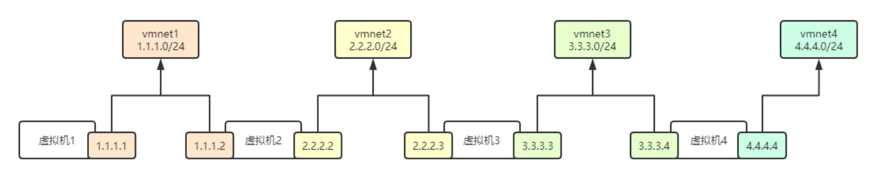

# 路由

## 目录

-   [什么是路由](#什么是路由)
-   [如何配置路由](#如何配置路由)
-   [路由分类](#路由分类)
    -   [主机路由](#主机路由)
    -   [网络路由](#网络路由)
    -   [默认路由](#默认路由)
    -   [永久路由](#永久路由)
-   [案列：](#案列)
    -   [路由条目优化](#路由条目优化)

# 什么是路由

是指路由器从一个lan接口上收到的数据包，根据数据包的“目的地址”进行定向转发到另一个wan接口的过程

# 如何配置路由

使用route进行管理路由表

命令语法：route \[add|del]  \[-host|-net|default]  \[address]  \[netmask0]  \[gw]  \[dev]

| add\|del | 增加或删除路由条目                            |
| -------- | ------------------------------------ |
| -host    | 添加或删除主机路由                            |
| -net     | 添加或删除网络路由                            |
| default  | 添加或删除默认路由                            |
| address  | 添加要去往的网段地址  由ip+netmask组成            |
| gw       | 指定下一跳地址。要求下一跳地址必须是能到达的，且一般是和本网段直连的接口 |
| dev      | 将添加路由与对应的接口关联，一般内核会自动判断路由应该关联那个接口    |

```bash
示例：route add -host 1.1.1.1/32 dev eth0
route add -net 1.1.1.1/32 dev eth1
route add -net 1.1.1.1/32 gw 1.1.1.2
route add default gw 1.1.1.2
```

# 路由分类

## 主机路由

指明到某台主机应该怎么走；destination精确到某一台主机

如何配置

```bash
route add -host 1.1.1.1/32 dev eth0  #去往1.1.1.1主机，从eth0接口出
route add -host 1.1.1.1/32 gw  10.0.0.2 #去往1.1.1.1主机都交给10.0.0.2转发
```

## 网络路由

指明到某类网络怎么走；精确到某一网段的主机

```bash
route add -net 2.2.2.0/24 dev eth0  #去往2.2.2.0/24网段，从wth0接口出
route add -net 2.2.2.0/24 gw 10.0.0.2  #去往2.2.2.0网段，都交给10.0.0.2转发
```

## 默认路由

如果匹配不到主机路由、网络路由的，全不走默认路由（网关）

```bash
route add -net 0.0.0.0 gw 10.0.0.2
route add default gw 10.0.0.2
```

## 永久路由

使用route命令添加的路由，属于临时添加；在/etc/sysconfig/network-scripts目录下创建route-ethx的网卡名称，添加路由条目

# 案列：

实验环境：



虚拟机1网卡配置

```bash
[root@vm1 ~]# cat /etc/sysconfig/network-scripts/ifcfg-eth0
TYPE=Ethernet
BOOTPROTO=static
DEFROUTE=yes
NAME=eth0
DEVICE=eth0
ONBOOT=yes
IPADDR=10.0.0.100
PREFIX=24
[root@vm1 ~]# cat /etc/sysconfig/network-scripts/ifcfg-eth1
TYPE=Ethernet
BOOTPROTO=static
DEFROUTE=yes
NAME=eth1
DEVICE=eth1
ONBOOT=yes
IPADDR=1.1.1.1PREFIX=24

```

查看路由信息，进行查看有没有指向目标地址的路由，若没有，则加路由

若要1.1.1.1和2.2.2.2互通

```bash
route add -net 2.2.2.0/24 gw 1.1.1.2  #虚拟机1去往2.2.2.0网段走1.1.1.2地址，因为跨网段，走共同网段去不同网段

```

若要虚拟机1和3.3.3.3互通

```bash
route add -net 3.3.3.0/24 gw 1.1.1.2  #虚拟机1到3.3.3.0网段去走1.1.1.2地址出去
route add -net 3.3.3.0/24 gw 2.2.2.3  #在虚拟机2中加入到去往3.3.3.0网段的地址
echo "1" > /proc/sys/net/ipv4/ip_forward  
sysctl -p #开启虚拟机2的内核转发功能，将虚拟机1发送给虚拟机3的信息转发过去
route add -net 1.1.1.0//24 gw 2.2.2.2  #虚拟机3反馈信息给虚拟机1走2.2.2.2地址转发给1.1.1.0网段
```

1.1.1.1和4.4.4.4互通需要2和3开启转发功能，各个路由器都需有去往各个地址的路由

## 路由条目优化

以虚拟机1为例，除第一个路由条目外，其他的都是1.1.1.2来转发

删除转发地址重复的路由 route del -net 2.2.2.0/24配置默认路由：route add -net 0.0.0.0/0 gw 1.1.1.2或者route add default gw 1.1.1.2
