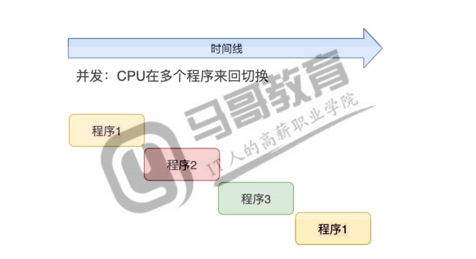
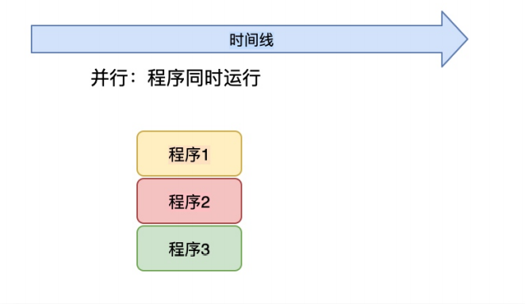
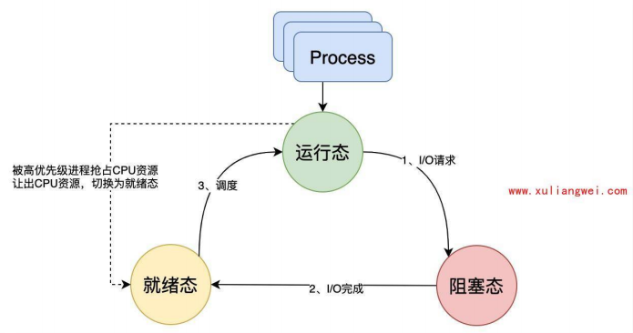
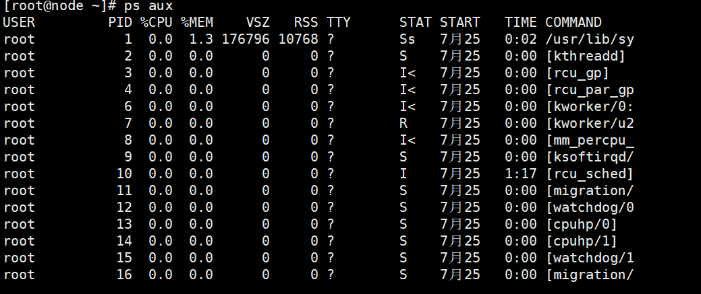
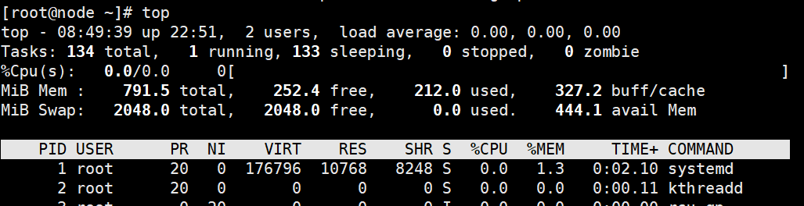
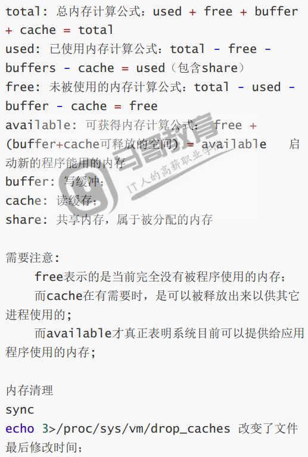
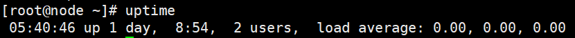

# 进程管理

## 目录

-   [进程的基本概述](#进程的基本概述)
    -   [程序与进程  ](#程序与进程--)
    -   [并行和并发](#并行和并发)
    -   [进程运行的状态](#进程运行的状态)
-   [进程运行状态监控](#进程运行状态监控)
    -   [静态监控进程ps](#静态监控进程ps)
        -   [每列指标详解](#每列指标详解)
        -   [ps查看命令](#ps查看命令)
        -   [查看用户进程](#查看用户进程)
        -   [stat运行状态](#stat运行状态)
    -   [动态监控top](#动态监控top)
        -   [中断](#中断)
-   [管理进程状态](#管理进程状态)
    -   [支持的信号](#支持的信号)
    -   [进程优先级](#进程优先级)
        -   [配置优先级](#配置优先级)
        -   [指定进程启动优先级](#指定进程启动优先级)
        -   [修改进程优先级](#修改进程优先级)
-   [后台进程管理](#后台进程管理)
-   [系统平均负载](#系统平均负载)
    -   [什么是平均负载](#什么是平均负载)
    -   [可运行状态](#可运行状态)
    -   [不可中断状态](#不可中断状态)
    -   [平均负载和cpu使用率](#平均负载和cpu使用率)
    -   [平均负载案例实战](#平均负载案例实战)
        -   [场景1— —cpu密集型进程](#场景1-cpu密集型进程)
        -   [场景2— —I/O密集型进程](#场景2-IO密集型进程)
        -   [场景3— —大量的进程](#场景3-大量的进程)
        -   [总结](#总结)

# 进程的基本概述

pstree进程没有括号，线程为大括号

## 程序与进程 &#x20;

区别

程序：程序是数据+指令的集合，是一个动态的概念。同时程序可以长期存在系统中。

进程：是程序运行的过程，是一个动态的概念，在进程运行的过程中，系统会随着程序的中止而销毁，不会永久的存在系统中。

## 并行和并发

并发：多个任务看起来是同时运行，这是一种假并行（CPU在任务中来回切换）



并行：多个任务是真正的同时运行（并行必须有多核CPU才能实现）



## 进程运行的状态

一般有三个状态：就绪状态、运行状态、阻塞状态。

就绪态：进程已经具备运行条件，但需要等待CPU的调度才可运行。

运行态：进程占用CPU，并在CPU上运行

阻塞态：进程因等待某件事而暂时不能运行



三种形态之间转换的情况

运行—>就绪：进程发生I/O操作，需等待事件，而继续无法执行，则进程由运行状态变为阻塞状态

阻塞—>就绪：进程所等待的事件已经完成，但无法直接运行，需要进入就绪队列，等待调度

就绪—>运行：运行的进程时间片已经用完，CPU会从就绪队列中选择合适的进程分配CPU

运行—>就绪：1.进程占用CPU的时间过长，而系统分配给改进程的CPU的时间是有限的；

2：当有更高优先级的进程要运行时，该进程需要让出CPU，由运行状态转变为就绪状态

就绪—>阻塞：已经就绪了，跟阻塞毫无关系

阻塞—>运行：阻塞状态结束，它必须进入就绪队列中，然后等待CPU从队列中挑选进程分配资源

# 进程运行状态监控

&#x20;查看进程状态分为：静态查看、动态查看

## 静态监控进程ps

ps -aux 常用组合，查看进程用户、pid、占用cpu百分比、占用内存百分比、状态、执行的命令等

### 每列指标详解



user：启动进程的用户

pid：进程运行的id号

%CPU：进程占用CPU百分比

%men：进程占用内存百分比

vsz：进程占用虚拟内存大小（kb）

rss：进程占用物理内存实际大小（kb）

tty：进程是由哪个终端运行启动的tty1、pts/0等

？表示内核程序与终端无关

stat：进程运行过程中的状态 man ps&#x20;

start：进程的启动时间

time：进程占用cpu的总时间（0表示还没超过秒）

commmd：程序的运行指令，【】属于内核态的进程。没有【】属于用户态进程。

### ps查看命令

```bash
ps -ef | grep sshd #查看进程
pstree  #查看进程树
-p 代号  #查看某个进程都树状结构
```

### 查看用户进程

```bash
su -用户 -c "命令" &  #以普通用户运行进程并且将进程扔进后台运行
pgrep -l -u 用户  #使用pgrep过滤用户运行的进程及子进程id
-a ：表示列出进程pid以及详细命令
```

### stat运行状态

| 基本状态 | 描述     | 状态+符号 | 描述                      |
| ---- | ------ | ----- | ----------------------- |
| R    | 进程运行   | S     | 进程时控制进程，Ss进程的领导者，父进程    |
| S    | 可中断睡眠  | <     | 进程运行在高优先级上，S<优先级较高的进程   |
| T    | 进程被暂停  | N     | 进程运行在低优先级上，SN优先级较低的进程   |
| DSN  | 不可中断进程 | +     | 当前进程运行在前台，R+该表示进程在前台运行  |
| Z    | 僵尸进程   | l     | 进程时多线程的，sl表示进程时以多线程方式运行 |

## 动态监控top

| 选项 | 意义    |
| -- | ----- |
| d  | 刷新时间  |
| p  | 指定pid |
| u  | 指定用户  |

```bash
top -d 1 -p pid 
top -d 1 -p $(pgrep nainx) #仅查看指定进程详情
top -d 1 -u 用户 #动态查看用户运行的进程
htop  #彩色打开top状态

```

执行top后可进行的选项（也就是进去入top以后在表格上边一行输入选项）

| 选项 | 含义                |
| -- | ----------------- |
| c  | 改变top刷新频率         |
| P  | 按CPU进行排序          |
| M  | 以内存进行排序           |
| R  | 对排序后的结果进行倒序       |
| f  | 自定义显示的字段，比如打印ppid |
| k  | 指定杀死某个id          |
| 1  | 显示cpu核心数          |
| z  | 以高亮显示数据           |
| b  | 高亮显示处于R状态的进程      |
| q  | 退出                |
| h  | 显示帮助              |

top字符段的含义



Tsaks：129 total ：当前进程的总数

1 running ： 正在运行的进程数量

128 sleeping ： 睡眠的进程数量

0 stopped ： 停止的进程数量

0 zomile ： 僵尸进程数量

%cpu（s）含义

us ：系统用户进程使用CPU百分比

sy ： 内核中的进程占用cpu百分比，通常内核是于硬件进行交互

id ： 空闲cpu的百分比

wa：cpu等待io完成的时间

hi ： 硬中断，占的cpu百分比

si ： 软中断，占的cpu百分比

st ： 比如虚拟机占用物理cpu的时间

### 中断

[怎么理解Linux软中断？ - oldxulinux - 博客园 (cnblogs.com)](https://www.cnblogs.com/oldxu/p/10789270.html "怎么理解Linux软中断？ - oldxulinux - 博客园 (cnblogs.com)")

内存计算公式：



# 管理进程状态

如果想要关闭运行的进程，则需要使用：kill，killall，pkill等命令对进程id发送关闭信号

## 支持的信号

使用kill -l可以列出当前系统所支持的所有信号，以以下三个信号为例

1（SIGHUP）：通常用来重新加载配置文件

9（SIGHILL）：强制杀死进程

15（SIGHERM）：终止进程，默认kill信号

语法

```bash
kill -信号（数字）  进程pid 
```

关闭进程kill

可通过pkill、killall指定进程服务名称，然后将其杀死

语法

```bash
pkill/killall  进程服务名称  #关闭进程
pkill -9 -t  tty # 强制链接用户下线
```

## 进程优先级

### 配置优先级

nice值越高优先级越低，nice值越低优先级越高

top命令查看优先级

NI：显示nice值，默认是0

PR：显示nice值，-20映射到0，+19映射到39

```bash
ps axo command,nice #列出command的nice值
```

### 指定进程启动优先级

用nice命令

```bash
nice -n -5 vim & #在后台指定vim的优先级为-5
ps aux |grep ”vim“ 
ps axo pid，commmand，nice | grep 98417 #查看vim优先级
```

### 修改进程优先级

用renice命令

```bash
ps axo pid,command,nice | grep [s]shd #查看正在运行的sshd进程优先级
renice -n -20 pid #调整pid主进程的优先级

```

调整完后退出终端，重新打开一个再次查看sshd的优先级

# 后台进程管理

主要有两种方式：nohup方式和screen方式

```bash
nohup 进程& #将前台进程转为后台
ps aux | grep 进程 #查看进程运行情况
jobs #查看后台作业
fg %1 #转为前台运行
bg %1 #转为后台运行
```

sreen

```bash
yum install screen -y #安装screen工具（centos8需要安装epel包）
screen -S wget_soft #开启一个screen子窗口 -S可以为其指定名称
ctrl+a+b  #平滑退出screen，但不会中职前台任务
screen -list #查看当前有多少screen正在运行
screen -r 进程名/id  #根据进程的名称或者id进入进程
exit  #退出进程，结束screen
supervisor  (python java)

```

# 系统平均负载

当系统变慢时第一件事就是执行top或uptime了解系统负载情况。



前面几列，分别是当前时间、系统运行时间以及正在登录的用户数

后面三个数字依次是过去1分钟，5分钟，15分钟的平均负载

## 什么是平均负载

平均负载是单位时间内，系统处于可运行状态和不可中断状态的平均进程数，也就是平均活跃进程数或者理解为平均负载是单位时间内的活跃进程数。平均负载和cpu没有直接关系

## 可运行状态

指正在使用cpu或者正在等待cpu的进程，也就是我们命令看到处于R状态的进程

## 不可中断状态

系统中最常见的是等待硬件设备的I/O响应，通过ps命令可以看到D进程。所以不可中断状态实际上是系统对进程和硬件的设备的一种保护机制。

## 平均负载和cpu使用率

平均负载不仅包括了正在使用的cpu进程还包括了等待cpu和等待I/O的进程

而cpu使用率是单位时间内cpu繁忙情况的统计，跟平均负载并不一定完全对应。比如：

cpu密集型进程，使用大量cpu计算会导致平均负载升高，此时两者是一致的，

I/O密集型进程，等待I/O也会导致平均负载升高，单cpu使用率不一定很高

大量cpu进程调度也会导致平均负载升高，此时的cpu使用率也会比较高

## 平均负载案例实战

实战使用stress、mpstat、pidstat三个工具演示三个场景并找出平均负载升高的场景

stress是linux系统压力测试工具，作为异常进程模拟平均负载升高的场景

mpstat是多核cpu性能分析工具，用来实时查看每个cpu的性能指标，及所有cpu的平均指标

pidstat是一个常用的进程性能分析工具，用来市市查看进程的cpu、men、I/O等星能指标

使用前需要先安装三个工具     &#x20;

```bash
yum install stress sysstat -y
#如果出现无法安装的情况，建议更新下载软件包
```

### 场景1— —cpu密集型进程

```bash
stress --cpu 1 --timeout 600  #模拟一个cpu使用达到100%的场景
watch -d uptime  #再开一个终端查看平均负载的变化情况
#使用watch -d参数表示高亮显示变化的区域（负载会持续升高）
mpstat -P ALL 5    #再开一个终端运行mpstat查看使用率达到变化情况
#表示监控所有的cpu，后面数字表示间隔几秒后输出一组数据 。单核的cpu只有一个all和0
#####################
#从终端2和终端3中可得平均负载得升高正是由于cpu使用率为100%，要想知道哪个进程导致了使用率为100%可以使用pidstat查询
pidstat -u 5 1 #间隔5秒输出一组数据  从此可以看出那个进程的cpu使用率
```

### 场景2— —I/O密集型进程

```bash
stress --io 1 --timeout 600 #模拟I/O压力， 即不停的执行sync
watch -d uptime  #再开一个终端查看平均负载的变化情况
mpstat -P ALL 5 #显示所有CPU的指标，并间隔5秒输出一组数据， 会发现cpu中与内核打交道的sys占用非常高
pidstat -u 5 1  #要想知道是谁导致iowait高，需要使用pidstat查询，间隔5秒输出一组数据，-u表示cpu指标


```

### 场景3— —大量的进程

```bash
stress -c 4 --timeout 600  #模拟四个进程
watch -d uptime  #由于系统只有一个cpu比四个进程要少的多，因此系统cpu处于严重过载状态
pidstat -u 5 1 #通过pidstat查询进程可得四个进城抢占一个cpu所以每个进程都在等待（代码块中的%wait列）的时间高达75%，超出cpu计算能力，导致cpu过载


```

### 总结

[stress工具使用指南和结果分析 - 2TheMoon - 博客园 (cnblogs.com)](https://www.cnblogs.com/muahao/p/6346775.html "stress工具使用指南和结果分析 - 2TheMoon - 博客园 (cnblogs.com)")

平均负载高可能是cpu密集型进程导致的

平均负载高并不一定代表cpu使用率高，还有可能是I/O更繁忙了

当发现负载过高时，可以使用mpstat、pidstat等工具辅助分析负载的来源。
