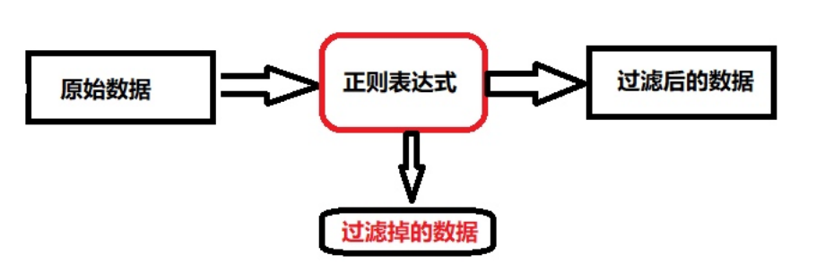

# 正则表达及sed

## 目录

-   [正则表达式介绍](#正则表达式介绍)
    -   [什么是正则](#什么是正则)
    -   [注意事项](#注意事项)
    -   [规则语法](#规则语法)
    -   [练习](#练习)
    -   [正则表达式案例](#正则表达式案例)
        -   [提取服务器网卡地址](#提取服务器网卡地址)
        -   [过滤空行与#开头的](#过滤空行与开头的)
        -   [匹配日志中的http版本](#匹配日志中的http版本)
        -   [匹配用户手机号是否合法](#匹配用户手机号是否合法)
        -   [匹配邮箱是否合法](#匹配邮箱是否合法)
-   [sed文本处理](#sed文本处理)
    -   [基本介绍](#基本介绍)
    -   [工作模式](#工作模式)
    -   [基础语法](#基础语法)
        -   [常用选项](#常用选项)
    -   [基本示例](#基本示例)
        -   [sed pattern过滤](#sed-pattern过滤)
            -   [练习](#练习)
-   [sed追加命令](#sed追加命令)
    -   [追加命令示例](#追加命令示例)
-   [删除命令](#删除命令)
-   [修改命令](#修改命令)
-   [sed实践](#sed实践)

# 正则表达式介绍

## 什么是正则

以特定符号表达一组数字或字母的规则



## 注意事项

1.正则表达式应用非常广泛，存在于各种编程语言中。

2.正则表达式和Linux的通配符以及特殊字符是有区别的 \* .。 rm -rf \* grep "\*"

3.要想学好grep、sed、awk首先就需要对正则表达式有一定的了解。只有了解了规则，才能灵活的运用。

## 规则语法

-   **正则表达式**

    \：转义符，将特殊字符进行转义，忽略其特殊意义

    ^:匹配行首，匹配字符串的开始

    \$:匹配行尾。匹配字符串的结尾

    ^\$:表示空行

    . :匹配除换行符\n之外的任意单个字符

    \[ ]:匹配包含在\[字符]之中的任意一个字符\[a|b]cd

    \[^]:匹配\[^a]之外的任意字符

    \[ - ]:匹配\[ ]中指定范围内的任意一个字符例如\[a-z] | \[0-9]

    ?:匹配之前的项一次或零次

    +:匹配之前的项一次或多次

    *:匹配之前的项0次或多次.* ​

    ():匹配表达式，创建一个用于匹配的子串

    {n}:匹配之前的项n次，n可以为0的正整数grep "\[0-9]{1,3}"

    {n,}：之前的项至少需要匹配n次

    {n,m}：指定之前的项至少匹配n次，最多匹配m次，n\<m

    \|:交替匹配，|两边的任意一项ab（c|d）匹配abc或abd

    \\<\\>或\b：锚定词首与词尾， \\\<grep\\> ，匹配所有包含grep字符的行,如果出现grepa是不会被匹配
-   **特殊字符**

    \[\[ :space: ]]:匹配空格

    \[\[ :digit: ]]:匹配\[0-9]

    \[\[ :lower: ]]:匹配\[a-z]

    \[\[ :upper: ]]:匹配\[A-Z]

    \[\[ :alpha: ]]:匹配\[a-Z]

## 练习

以以下文档进行练习以下习题(lianxi.txt)

> I am xuliangwei teacher!
> I teach linux.
> test
>
> I like badminton ball ,billiard ball and
> chinese chess!
> my blog is
> [http://liangweilinux.blog.51cto.com](http://liangweilinux.blog.51cto.com "http://liangweilinux.blog.51cto.com")
> our site is [http://www.xuliangwei.com](http://www.xuliangwei.com "http://www.xuliangwei.com")
> my qq num is 572891887.
> not 572891888887

完成以下问题

```bash
#过滤以m开头的行
 grep '^m' lianxi.txt
#排除空行，并打印行号
 grep -v '^[^$]$' lianxi.txt | nl
 grep -v '^[[:space:]]$' lianxi.txt | nl
#匹配任意一个字符，不包括空行
 grep '^my' lianxi.txt
#匹配所有内容
 grep -r -e '[a-z]' -e '^$'  lianxi.txt
#匹配以点结尾的
 grep '[.$]' lianxi.txt
#匹配有a或b或c的行
 egrep '[a|b|c]' lianxi.txt
#匹配数字所在的行
 grep '[0-9]' lianxi.txt 
#匹配所有小写字母
 grep '[a-z]' lianxi.txt
#匹配包含5个8的行
 egrep '8{5}' lianxi.txt

```

## 正则表达式案例

### 提取服务器网卡地址

```bash
#使用grep正则表达式方式提取网卡地址
 ifconfig eth0| grep ^.*inet | egrep -o '\<[0-9]{2}\.[0-9]\.[0-9]\.[0-9]{2}\>'
 ifconfig eth0| grep ^.*inet | egrep -o '[0-9]{2}\.[0-9]\.[0-9]\.[0-9]{2}'
 ifconfig eth0| grep ^.*inet | egrep -o '\<[[:digit:]]{2}\.[[:digit:]]\.[[:digit:]]\.[[:digit:]]{2}\>'

```

### 过滤空行与#开头的

```bash
#使用grep正则表达式方式，排除nginx日志文件的空行和#开头的行
  egrep -v "#|^$" nginx.conf
  egrep -v "(^#|^$|^[[:space:]]+#)" nginx.conf

```

### 匹配日志中的http版本

```bash
#使用grep正则表达式方式。匹配nginx日志中的http3.0 http3.1 http2.1 http2.0 
  egrep -o "HTTP/(1|2|3)\.(0|1)" access_log_grep

```

### 匹配用户手机号是否合法

```bash
#!/usr/bin/env bash
read -p "请输入你要查询的手机号" phone
#使用正则进行判断用户是否是十一位
if [[ $phone =~ ^[0-9]{11}$ ]]; then
  #判断用户输入的开头位是都符合规则
  if [[ $phone =~ (133|166|155|131|189) ]]; then
    echo "你输入的号码通过测试"
    else
      echo "你输入的号码没有通过测试"
 fi
fi
```

### 匹配邮箱是否合法

```bash
#使用grep正则表达式，匹配qq。163，sina，email地址
read -p "情书如你要找回密码的邮箱" email
email_l=${email%@*}
#对比邮箱字符长度，超过十六则无效
if [ ! ${email_l} -le 16 ]; then
  echo "你输入的邮箱无效"
  exit
fi
#进行邮箱的格式匹配，无效邮箱则退出
if [[ $email =~ ^([0-9]|[a-Z])+\@(qq|sina|163)\..+$ ]]; then
echo "邮箱输入正确"
else
  echo " 你输入的邮箱不正确"
fi

```

# sed文本处理

## 基本介绍

sed(Stream Editor) 流编辑器，能够对标准输出或文件进行逐行处理。

简单来说，sed可以实现对文件的增、删、查、改。

## 工作模式

读取一行放在缓存区，然后进行处理，最后输出

## 基础语法

第一种语法格式：stdout | sed \[option] "pattern" ifconfig eth0 | sed 's###g'

option: 选项

pattern：匹配 sed '/^root/' || grep

command: 动作 p，d, c , s###g , r,w,i,a

第二种形式： sed \[option] "pattern command" file sed -i 's#200#31#g' /etc/sysconfig

### 常用选项

| 选项 | 含义                 |
| -- | ------------------ |
| -n | 只打印匹配的行（取消文件的默认输出） |
| -e | 允许多项编辑             |
| -f | 编辑动作把偶你在文件，指定文件才执行 |
| -r | 支持扩展正则表达式          |
| -i | 直接变更文件内容           |

## 基本示例

示例文件

```bash
I love shell
I love SHELL
This is test file
```

示例

```bash
#取消文件默认输出
sed -n '/shell/p' file.txt
#-e -n 用于多项编辑
sed -n -e '/shell/p' -e '/SHELL/p' file.txt
#-f编辑动作保存在文件，指定文件才执行
将pattern写入文件中
/shell/p
#执行
sed -n -f 写入pattern的文件 file.txt
#-r 正则表达式
sed -rn '/shell|SHELL/p' file.txt
```

### sed pattern过滤

命令格式：sed \[option] '/pattern/command' file

| 匹配模式                         | 含义                                        |
| ---------------------------- | ----------------------------------------- |
| 10command                    | 匹配第10行                                    |
| 10，20command                 | 匹配从第110行开始到第20行结束                         |
| 10，+5command                 | 从第十行开始到第16行结束                             |
| /pattern1/,/pattern2/command | 匹配到pattern1的行开始，到匹配到pattern2的行结束          |
| 10,/pattern/command          | 匹配从第10行开&#xA;始，到匹配到&#xA;pattern1的行结&#xA;束 |

命令示例

```bash
#指定行号
sed -n '10p' passwd
#指定起始行号和结束行号
sed -n '10p，20p' passwd
#指定起始行号，之后后面n行
sed -n '1，+np' passwd
#正则表达式匹配
sed -n '/^root/p' passwd
#打passwd文件第一个匹配到以bin开头的行，到第二个匹配到以ftp的行
sed -n '/^bin/,/^ftp/p' passwd
#从指定行号进行匹配，直到指定条件结束（打印passwd文件中从第2行开始匹配，直到以^halt开头的行结束）
sed -n '2,/^halt/p' passwd
```

#### 练习

```bash
1) 打印/etc/passwd中第20行
sed -n '20p' /etc/passwd
2）打印/etc/passwd中从第8行开始，到第15行结束的内容
sed -n '8,15p' /etc/passwd
3）打印/etc/passwd中从第8行开始，然后+5行结束的内容
sed -n '8,+5p' /etc/passwd
4）打印/etc/passwd中开头匹配bin字符串的内容
sed -n '/^bin/' /etc/passwd
5）打印/etc/passwd中开头为root的行开始，到开头为ftp的行结束的内容
sed -n '/^root/,/ftp/p' /etc/passwd
6）打印/etc/passwd中第8行开始，到含有/sbin/nologin的内容的行结束内容
sed -n '8,/\/sbin\/nologin/p' /etc/passwd
```

# sed追加命令

| 编辑命令 | 含义           |
| ---- | ------------ |
| a    | 行后追加内容append |
| i    | 行前追加内容insert |
| r    | 读入外部文件，行后追加  |
| w    | 将匹配行写入外部文件   |

## 追加命令示例

```bash
#匹配/bin/bash的行，在其后添加一行内容
sed -i '/^bin/a ok' passwd
#以 /bin 开头的行到已 sshd 开头的行，前面添加一行。
sed '/^bin/,/^sshd/i AAAAAA-OK' passwd
#将list.txt文件中内容追加到匹配模式的最后面
sed -i '/root/r list.txt' passwd
#指定为文件的20行添加一行内容
sed -i '30i listen 80;' passwd
#匹配/bin/bash所有的行。将其保存到/tmp/login.txt下
 sed '/\/bin\/bash/w/tmp/login.txt' passwd  #\转义符

```

# 删除命令

示例

```bash
#删除passwd文件中第一行内容
sed '1d' passwd
#删除passwd文件中第一行到第五行内容
sed '1,d' passwd
#删除passwd文件中第二行及以下五行内容
sed '2，+5d' passwd
#匹配/sbin/nologin结尾的行，之后进行删除
sed '/\/sbin\/nologin$/d' passwd
#匹配sshd开头的行，到rpc开头的行
sed '/^sshd/,/^rpc/d' passwd
#删除 vsftpd 配置文件以 # 号开头的行，以及空行
#删除配置文件中#号开头的注释行, 如果碰到tab或空格是无法删除
sed '/^#/d' file
#删除配置文件中含有tab键的注释行
sed -r '/^[ \t]*#/d' file
#删除无内容空行
sed -r '/^[ \t]*$/d' file

```

# 修改命令

| 编辑命令                            | 含义                                        |
| ------------------------------- | ----------------------------------------- |
| 1s/old/new/                     | 替换第1行内容                                   |
| 1,10s/old/new/                  | 替换1行到10行内容                                |
| 1,+5s/old/new/                  | 替换1行到6行的内容                                |
| /pattern1/s/old/new/            | 替换匹配pattern1的内容                           |
| /pattern1/,/pattern2/s/old/new/ | 替换匹配到pattern1的行直到匹配到pattern2的所有行内容old为new |
| 10,/pattern1/s/old/new/         | 替换第10行直到匹配到pattern1的所有行内容old为enw          |

修改命令示例

```bash
#修改passwd文件第1行中第一个root为ROOT
sed -i '1s/root/ROOT/' passwd
#修改passwd文件中第5行到第10行中所有的/sbin/nologin为/bin/bash
sed -i '5,10s/\/sbin\/nologin/\/bin\/bash/' passwd
sed -i '5,10s#/sbin/nologin#/bin/bash#' passwd
#修改passwd文件中匹配到/sbin/nologin的行，将匹配到行中的login为该大写的LOGIN
sed -i '/\/sbin\/nologin/s#login#LOGIN#g' passwd
sed -i '/\/sbin\/nologin/s/login/LOGIN#g' passwd
#修改passwd文件中从匹配到以root开头的行，到匹配到行中包含bin的行
sed -i '/^root/,/^bin/s/bin/BIN/g' passwd
#修改SELINUX=enforcing修改为SELINUX=disabled（可以使用c替换方式）
 sed -i '/^SELINUX=/c SELINUX=disabled' selinux
#将nginx.conf文件添加注释
sed -i 's/^/# /' nginx.conf
#使用sed提取eth0网卡地址
ifconfig eth0 | sed -rn '2s/^.*et //p' | sed -rn 's/ ne.*//p'
ifconfig eth0 |sed -nr '2s/(^.*et) (.*) (net.*)/\2/p'

```

# sed实践
