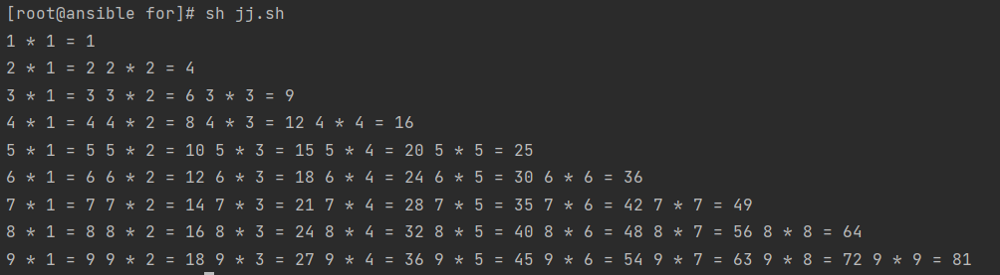

# shell循环判断-for-while
## 目录

-   [什么是循环](#什么是循环)
-   [for循环是什么](#for循环是什么)
-   [for基础循环语法](#for基础循环语法)
-   [使用示例](#使用示例)
    -   [示例](#示例)
    -   [通过for循环进行创建用户的脚本](#通过for循环进行创建用户的脚本)
    -   [for循环输出整个升序降序脚本](#for循环输出整个升序降序脚本)
    -   [循环计算10以内能整除3的数](#循环计算10以内能整除3的数)
-   [for循环案例](#for循环案例)
    -   [探测主机存活脚本](#探测主机存活脚本)
    -   [对每个主机进行探测三次，若三次不通则判定为死，若存活，列出第几次活](#对每个主机进行探测三次若三次不通则判定为死若存活列出第几次活)
    -   [批量下载镜像市场软件脚本](#批量下载镜像市场软件脚本)
    -   [实现九九乘法表](#实现九九乘法表)
    -   [模拟恢复被删除的文件](#模拟恢复被删除的文件)
-   [while循环](#while循环)
    -   [基本语法](#基本语法)
        -   [两数进行相乘](#两数进行相乘)
    -   [循环控制语句](#循环控制语句)
        -   [exit方法](#exit方法)
        -   [break方法](#break方法)
        -   [continue方法](#continue方法)

## 什么是循环

脚本在执行任务的时候，总会遇到需要循环执行的时候。

场景：批量创建100个用户，我们就需要使用循环来实现

## for循环是什么

很多人把for循环叫做条件循环；

因为for循环的次数和给予的条件是成正比的，也就是你给5个条件，那么他就循环5次；

## for基础循环语法

```bash
#for循环语法                  for循环示例（默认以空格做分割,给了三个条件）
for 变量名 in [ 取值列表 ]        for var
                                      in file1 file2 file3
do                                    do
    循环体
    echo the text is $var
done                                 done
```

## 使用示例

```bash
#!/usr/bin/bash
for((i=1;i<=10;i++))
do
 echo "$i"
done
```

for 循环默认使用空格为分隔符，可以使用 IFS 来自定义分隔符

以冒号做分隔符 IFS=:

以换行符做为字段分隔符 IFS=\$'\n'

#### 示例

```bash
#!/usr/bin/bash
IFS=$'\n'

for i in $(cat /etc/hosts)
do
 echo "$i"
done
```

### 通过for循环进行创建用户的脚本

通过读入文件中的用户与密码文件，进行批量添加用户。

文件中的格式: user:passwd

分析：循环

1.先读入文件；

2.进行字段分割；

3.完成创建；

创建一个管理用户文件（user.txt）

```bash
kk:123
kl:456
jj:789 
```

编写执行脚本

```bash
#!/usr/bin/env bash
. /etc/init.d/functions
for user in $(cat user.txt)#读取文件内容，
do
  us=$(echo $user|awk -F ':' '{print $1}') #筛选文件中第一列作为用户名并当作us变量
  ps=$(echo $user|awk -F ':' '{print $2}') #筛选文件中第二列作为密码并当作ps变量
  id $us &> /dev/null  #根据返回数字判断用户是否存在
  if [ $(echo $?) -eq 0 ]; then
    #如果用户已存在则进行询问是否要删除用户
    echo "$us 该用户已存在"
        read -p "是否要删除$us 用户 [yes|no]" user #是否确认删除，若不需要注释即可
        case $user in
        yes)
            userdel -r $us
        esac
    else
      #如果用户不存在则进行询问是否创建用户
      read -p "$us 用户不存在，是否创建[yes|no]" usr  #是否确认创建，若不需要注释即可
      case $usr in
      yes)
      useradd $us
      echo "$ps" | passwd --stdin $us &>/dev/null
      action "$us 用户及密码已创建成功"
    esac
  fi
done
```

### for循环输出整个升序降序脚本

```bash
#！/bin/bash
a=0
b=10
for i in {1..9}
do
let a++;
let b--;
echo num is $a - $b
done

```

### 循环计算10以内能整除3的数

```bash
for i in {1..10}
do
num=$[ $i % 3 ]
if [ $num -eq 0 ];then
sum=$[ $sum + $i ]
fi
done
echo $sum
```

## for循环案例

### 探测主机存活脚本

需求：批量探测某个网段的主机存活状态

思路：通过for循环遍历所有IP地址

将所有ip跌入一个文件中

```bash
seq 254 | sed -r 's#(.*)#10.0.0.\1#g' >> ip_new.txt  #列出该网段所有主机，一共254台
#脚本执行
for ip in $(cat ip_new.txt)
do
  {

  ping -c1 -W1 $ip &>/dev/null
    if [ $? -eq 0 ];then
      echo "$ip ok" >> ip_ok.txt
      echo "$ip ok"
    fi

}&
  done
    wait
      echo "done.."

```

### 对每个主机进行探测三次，若三次不通则判定为死，若存活，列出第几次活

```bash
for ip in $(cat ip_new.txt)
do
    ip=10.0.0.$i
    ping -c1 -W2 $ip &>/dev/null
  if [ $? -ne 0 ];then

# 内循环 10.0.0.9
for j in {1..3}
 do
  ping -c1 -W2 $ip &>/dev/null
    if [ $? -eq 0 ];then
      echo "$ip 探测第 $j 次 才通.."
  break
     else
      echo "$ip 探测第 $j 次不通.."
    fi
    done
      else
        echo "$ip is tong..."
    fi
  done
```

### 批量下载镜像市场软件脚本

需求：有一个软件包仓库，它的地址是[https://mirror.tuna.tsinghua.edu.cn/zabbix/](https://mirror.tuna.tsinghua.edu.cn/zabbix/ "https://mirror.tuna.tsinghua.edu.cn/zabbix/")zabbix/5.0/rhel/7/x86\_64/

批量下载其中大于5m的文件到/tmp下

```bash
for i in $(curlhttps://mirror.tuna.tsinghua.edu.cn/zabbix/
zabbix/5.0/rhel/7/x86_64/)
do
# 判断大小，大于则拷贝至/tmp目录
  pkg_size=$(du -s $i | awk '{print$1}')
    if [ $pkg_size -ge 5120];then
    wget
    fi
  done

```

### 实现九九乘法表

```bash
[root@ansible for]# cat jj.sh
#!/usr/bin/env bash
for i in {1..9}
do
# 内循环1-9
  for j in {1..9}
do
  echo -n "$i * $j = $[ $i * $j ] "

# i变量等于几则让j变量循环几次
  if [ $i -eq $j ];then
    echo ""
      break
  fi
done
done

```



### 模拟恢复被删除的文件

```bash
```

## while循环

while是shell脚本中负责循环的语句。和for用法一样

### 基本语法

```bash
#当条件测试成立（条件测试为真），执行循环体
if [];then
  while 条件测试
    do
      循环体
    done

```

降序输出十个数字

```bash
#!/bin/bash
var=10
while [ $var -gt 0 ]
do
    echo $var
    var=$[$var-1]
done
```

#### 两数进行相乘

```bash
#自增进行相乘
#!/usr/bin/bash
num=9
while [ $num -ge 1 ]
do
    sum=$(( $num * $num ))
    echo "$num * $num = $sum"
    num=$[$num-1]
done
#自减进行相乘
#!/usr/bin/bash
num=1
while [ $num -le 9 ]
do
      sum=$(( $num * $num ))
      echo "$num * $num = $sum"
      num=$[$num+1]
done

```

### 循环控制语句

在执行while循环语句时，有时候需要在没有达到循环结束条件时强制跳出循环，

控制此循环的功能有：exit，break，continue

#### exit方法

退出整个程序，脚本遇到exit时不管还剩下多少代码都不执行，

```bash
#!/usr/bin/bash
for i in {1..3}
do
    echo "123"
    exit
    echo "456"
done
    echo "Done....."


```

#### break方法

脚本遇到break时结束当前循环，但会执行循环以外的代码

```bash
#!/usr/bin/bash
for i in {1..3}
do
    echo "123"
    break
    echo "456"
done
    echo "Done....."
```

#### continue方法

忽略本次循环剩余的所有代码，直接进入下一次循环，直到循环结束，之后继续执行循环之后代码

```bash
#!/usr/bin/bash
for i in {1..3}
do
    echo "123"
    continue
    echo "456"
done
    echo "Done....."  #循环三次
```
