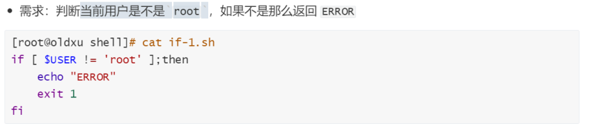
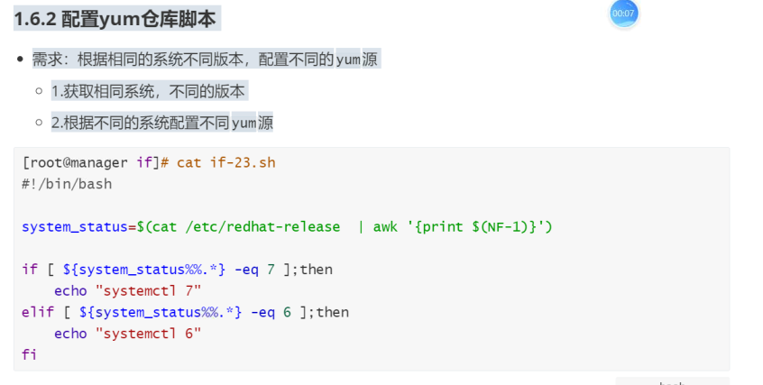
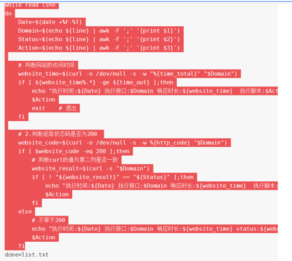
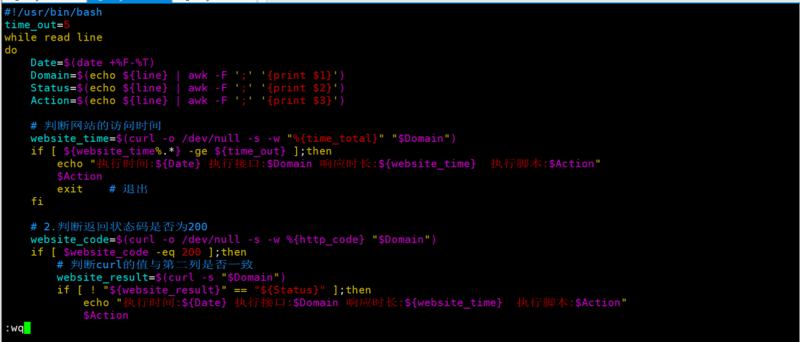
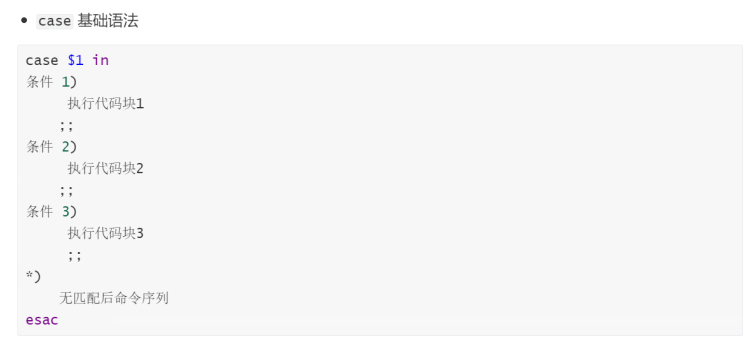

# shell流程控制-if-case

## 目录

-   [if判断语句](#if判断语句)
    -   [什么是if](#什么是if)
    -   [为什么需要if](#为什么需要if)
    -   [基础语法](#基础语法)
        -   [单分支结构](#单分支结构)
        -   [双分支结构](#双分支结构)
        -   [多分支结构](#多分支结构)
    -   [if分支场景](#if分支场景)
        -   [单分支场景案例](#单分支场景案例)
        -   [双分支脚本案例](#双分支脚本案例)
        -   [多分支脚本案例](#多分支脚本案例)
    -   [if基于文件比较](#if基于文件比较)
        -   [备份脚本案列-1](#备份脚本案列-1)
        -   [备份脚本案列-2](#备份脚本案列-2)
        -   [备份脚本案列-3](#备份脚本案列-3)
        -   [为执行脚本加锁](#为执行脚本加锁)
    -   [if基于整数比较](#if基于整数比较)
        -   [检查服务状态的脚本](#检查服务状态的脚本)
        -   [数字排序脚本](#数字排序脚本)
    -   [if基于字符的比较](#if基于字符的比较)
    -   [if基于正则比较](#if基于正则比较)
        -   [批量创建用户脚本](#批量创建用户脚本)
-   [if判断相关脚本实战场景](#if判断相关脚本实战场景)
    -   [场景1一备份文件](#场景1一备份文件)
-   [case判断语句](#case判断语句)
    -   [什么是case](#什么是case)
    -   [使用场景](#使用场景)
    -   [基础语法](#基础语法)
    -   [编写nginx的启停脚本](#编写nginx的启停脚本)
    -   [编写nginx状态脚本](#编写nginx状态脚本)
    -   [编写rsync启停脚本](#编写rsync启停脚本)
    -   [编写lvs启停脚本](#编写lvs启停脚本)

## if判断语句

### 什么是if

if就是模仿人类的判断来进行的，但它没有人类那么有情感，只有True和False这两种结果。

### 为什么需要if

当我们在写程序的时候，经常需要对上一步的执行结果进行判断，那么判断就需要使用if语句来实现。

if语句在我们程序中主要就是用来做判断的;

不管大家以后学习什么语言，以后只要涉及到判断的部分，大家就可以直接拿if来使用，

不同的语言之间的if只是语法不同，原理是相同的。

### 基础语法

#### 单分支结构


#### 双分支结构


#### 多分支结构


### if分支场景

#### 单分支场景案例



#### 双分支脚本案例

需求：判断当前登录用户是管理员还是普通用户

如果是超级管理员输出当前是管理员

如果不是强制退出

```bash
#!/usr/bin/env bash
if [ $USER == root ];then
  echo "当前为超级用户"
  else
    read -p "当前不是超级用户是否退出程序[y|n]: " action
    if [ $action == y ];then
    exit
    else
      echo "无效操作，即将强制退出"
      sleep 1
      exit

    fi
fi
```

#### 多分支脚本案例

通过脚本判断两个数的大小。

```bash
#单分支嵌套模式
#!/usr/bin/env bash
if [ $1 -eq $2 ];then
  echo "$2=$1"
  else
    if [ $1 -gt $2 ];then
      echo "$1>$2"
      else
        echo "$1<$2"
    fi
fi

#多分支模式
#!/usr/bin/env bash
if [ $1 -eq $2 ];then
  echo "$2=$1"
    elif [ $1 -gt $2 ];then
      echo "$1>$2"
      else
        echo "$1<$2"
fi

```

### if基于文件比较

if语句中的文件比较

-e:如果文件或目录存在则为真

-s:如果文件存在且至少有一个字符则为真（不为空）

-d:如果文件存在且为目录则为真

-f:如果文件存在且为普通文件则为真

-r:如果文件存在且可读则为真

-w:如果文件存在且可写则为真

-x:如果文件存在且可执行则为真

#### 备份脚本案列-1

备份文件至/backup/system/filesnam-当前日期，不存在则创建目录

```bash
#!/usr/bin/env bash
file=$"/backup/system/filesname-$(date +%F)"
if [ ! -e $file ];then
  mkdir -p $file
  else
    read -p "请输出你要备份的文件:" File
    cp $File $file
    sleep 0.2
    echo "文件$File 已经备份到$file"
fi
```

#### 备份脚本案列-2

继续淦。如果备份文件存在则进行备份。如果不存在则退出

```bash
#!/usr/bin/env bash
file=$"/backup/system/filesname-$(date +%F)"  #定义文件位置变量
if [ ! -e $file ];then
  mkdir -p $file  #如果备份地址不存在则创建
  else
    read -p "请输出你要备份的文件:" File
    if [ -e $File ]; then  #判断需要备份的文件是否存在
        cp  $File $file
      sleep 0.2
        echo "文件$File 已经备份到$file"
      else
       echo "备份的$File 文件不存在,即将强制退出"
      sleep 0.5
      exit
    fi
fi
```

#### 备份脚本案列-3

基于需求1，2，判断文件是否为空，若为空则退出

```bash
#!/usr/bin/env bash
file=$"/backup/system/filesname-$(date +%F)"  #定义文件位置变量
if [ ! -e $file ];then
  mkdir -p $file  #如果备份地址不存在则创建
  else
    read -p "请输出你要备份的文件:" File
    if [ -e $File ] && [ -s $File ]; then  #判断需要备份的文件是否存在或者是否为空
        cp  $File $file
        sleep 0.2
        echo "文件$File 已经备份到$file"
      else
       echo "备份的$File 文件不存在或为空,即将强制退出"
       sleep 0.5
      exit
    fi
fi
```

#### 为执行脚本加锁

```bash
if [ -f /tmp/test.lock ];then  #判断是否存在锁
  echo "该脚本正在运行，请稍后"
  else
    touch /tmp/test.lock  #加锁
fi
#解锁
sleep  1
if [ -f /tmp/test.lock ];then
 rm -rf /tmp/test.lock
fi
```

### if基于整数比较

if语句中的整数比较〔整数1操作符整数2]

-eq:等于则条件为真，示例:\[ 1 -eq 10 ]

if \[ 1 -eq 2 ];then

echo "成立"

else

echo "不成立"

fi

-ne:不等于则条件为真，示例:\[ 1 -ne 10 ]

-gt:大于则条件为真，示例:\[ 1 -gt 10 ]。

-lt:小于则条件为真，示例:\[ 1 -lt 10 ]

-ge: 大于等于则条件为真，示例:\[ 1 -ge 10 ]

-le:小于等于则条件为真，示例:\[ 1 -le 10 ]

-z  有值为1，没有值为0

#### 检查服务状态的脚本

用户执行脚本时可以查看各个服务的状态，

3.非运行，停止状态。4.没有安装服务，服务不存在。0.运行状态，服务正在运行

```bash
#for循环加case判断
#!/usr/bin/env bash
for i in nginx httpd zabbix-agent vsftpd Service_Name
do
  systemctl status $i &> /dev/null
  case $( echo $? ) in
  0)
    echo "$i 服务已经启动"
    ;;
  3)
    echo "$i 服务没有启动"
    ;;
  *)
    echo "$i 服务未安装"

esac

done

#if多分支结构
#!/usr/bin/bash
if [ $# -ne 1 ];then
  echo "USAGE: $0 { nginx | httpd | zabbix-agent | vsftpd | Service_Name }"
  exit
fi
systemctl status $1 &>/dev/null
rc=$?
if [ $rc -eq 4 ];then
  echo "$1 服务没有安装..."
  exit
else
if [ $rc -eq 3 ];then
  echo "$1 服务没有启动..."
elif [ $rc -eq 0 ];then
  echo "$1 服务已经启动...."
fi
fi

```



#### 数字排序脚本

输入三个数并进行升序排序，思路：1，控制只能输入三个参数。2，将行转为列的显示。3，排序

```bash
#基于if判断
#!/usr/bin/env bash
if [ $# -ne 3 ];then
  echo "请输入三个数"
  exit
fi
echo "$1 $2 $3" | xargs -n1 | sort -n
#基于read进行操作
#!/usr/bin/bash
read -p "请输入第一个数:" a
read -p "请输入第二个数:" b
read -p "请输入第三个数:" c

echo "$a $b $c" | xargs -n1 | sort -n

```

### if基于字符的比较

if语句中的字符串比较〔整数1操作符整数2]

\==:等于则条件为真，示例\[ "\$a" == "\$b"]

if \[ a == a ];then

echo"成立"

else

echo "不成立"

!=:不相等则条件为真，示例\[ "a" != "b"]

-z:字符串的长度为零则为真(内容空则为真)，示例\[ -z "\$a" ]

-n:字符串的长度不为空则为真(有内容则为真)，示例\[ -n "\$a" ]





### if基于正则比较

if语句中的正则比较〔\[变量 =\~正则匹配的内容]]

\[\[ "\$USER" =\~ ^r ]]:判断用户是否已root开头;

\[\[ "\$num" =\~ ^\[0-9]+\$ ]]:判断用户输入的是否为全数字;

注意:单中括号使用正则语法会报错，bash: \[: =\~: binary operator expected

```bash
#判断用户输入的是否全是数字
read -p "请输入一个数值" p
if [[ "$p" =~ ^[0-9]+$ ]];then
  echo "你输入的全是数字，good"

else
  echo "GUN"
  exit
fi

```

#### 批量创建用户脚本

需求：

1.提示用户输入要创建用户的前缀，必须是英文。&#x20;
test

2.提示用户输入后缀，必须是数字。 010203

3.如果前缀和后缀都没有问题，则进行用户创建。test01 test02

4.并且密码是随机的；

```bash
#!/usr/bin/env bash
read -p "请输入用户名的前缀:" front
#判断用户输入的前缀
if [[ $front =~ ^[a-Z]+$ ]];then
  echo "你输入的是全英，通过"
else
  echo "输入错误，不是全英"
  sleep 1
  exit
fi
#判断用户后缀
read -p "请输入用户名的后缀:" bottom
if [[ $bottom =~ ^[0-9]+$ ]];then
  echo "你输入的是全数字，通过"
  else
    echo "你输入的不是全数，退出"
    sleep 1
    exit
fi
#if语句进行编写判断
#拼接用户前后缀，存在不创建，不存在则创建
user_name=$front$bottom
id $user_name &> /dev/null
if [ $(echo $?) -eq 0 ];then
  echo "用户已经存在"
  else
    useradd $user_name
    echo "用户未被创建，已创建"

fi
#case语句进行编写判断
#拼接用户前后缀，存在不创建，不存在则创建
user_name=$front$bottom
id $user_name &> /dev/null
case $(echo $?) in
  0)
    echo "用户已经存在"
    ;;
  1)
    useradd $user_name
    echo "用户不存在，已创建"
    
esac
```

## if判断相关脚本实战场景

### 场景1一备份文件

需求：在每月第一天备份并压缩/etc目录的所有内容，存放到/opt/bak目录，存放的形式
2019\_04\_10\_etc.tar.gz，脚本名称为fileback，存放在/root的家目录下。

思路：1.借助定时任务；

2.判断/opt/bak是否存在；tar czf /opt/bak/时间\_etc.tar.gz  /etc

先编写一个关于备份文件的脚本，将脚本加入定时任务中

```bash
#!/usr/bin/env bash
#定义变量
Date=$(date +%F)
dir=/opt/bak
lockfile=/tmp/back.lock
logfile=/var/log/$0.log
#输出系统时间给文件命令
  log_format(){
    echo "$($Date_%T) $(hostname) $0:$1" >> ${logfile}
  }
#判断用户身份，如若不是root拒绝执行
if [ ! $USER == "root" ];then
 echo  "请使用超级用户执行操作,即将强制退出。。"
  sleep 1
  exit
else
 echo "超级用户开始执行脚本。。。。"
fi
#给脚本加锁
if [ -f $lockfile ]; then
  echo "该脚本正在运行"
  exit
  else
    touch $lockfile
fi
#打包

if [ ! -d $dir  ]; then
  mkdir "$dir"
    tar czf $dir/$Date.tar.gz /etc &> /dev/null
  else
    tar czf $dir/$Date.tar.gz /etc &> /dev/null
fi
#反馈信息
if [ -e $dir/$Date.tar.gz ];then
  echo "备份成功"
  else
    echo "备份失败"
fi
#休眠两秒进行删除枷锁
sleep 2
rm -rf $lockfile
```

## case判断语句

### 什么是case

case语句和if多分支判断语句类似，主要用来做多条件判断;

只不过case在she17脚本中比if多分支条件判断更方便。

### 使用场景

在生产环境中，我们会根据"一个问题”做多种预案，然后根据用户选择来加载不同的预案。

case \$1 in stop

start

restart

比如服务的启停脚本，我们首先要写好启动、停止、重启的预案，然后根据用户选择来加载不同的预案。

### 基础语法



### 编写nginx的启停脚本

[case.zip](file/case_HXXskKcJ_1.zip " case.zip")

### 编写nginx状态脚本

```bash
#!/usr/bin/bash
. /etc/init.d/functions

ngx_pid=/var/run/nginx.pid
ngx_tmp=/tmp/ngx.status

case $1 in
  start)
    # 判断服务是否存活
    if [ ! -f $ngx_pid ];then
      nginx -t &>${ngx_tmp}
      if [ $? -ne 0 ];then
        ngx_file=$(cat /tmp/ngx.status  | awk '/emerg/' | awk '{print $NF}' | awk -F ":" '{print $1}')
        ngx_line=$(cat /tmp/ngx.status  | awk '/emerg/' | awk '{print $NF}' | awk -F ":" '{print $2}')
        read -p "Nginx的 ${ngx_file} 的第 ${ngx_line} 行出现了错误，是否需要进入编辑 [ y | n ]:" Action
        if [ ${Action:=y} == "y" ];then
          vim ${ngx_file} +${ngx_line}
        else
          exit
        fi
      else
        # 启动
        /usr/sbin/nginx 
        # 查看进程
        ngx_process_pid=$(cat ${ngx_pid})
        ngx_process_mess=$(ps aux |grep ${ngx_process_pid} | grep -v grep|wc -l)
        if [ $ngx_process_mess -ge 1 ];then
          action "Nginx启动成功" /bin/true
        else
          action "Nginx启动失败" /bin/false
        fi
      
      fi
    else
      action "Nginx已启动" /bin/false
    fi  
  ;;
  
  stop)
  ;;
  status)
  ;;

  *)
    echo "Usage $0 [ start | stop | restart ]"
    exit
esac

```

### 编写rsync启停脚本

```bash
#!/usr/bin/bash
. /etc/init.d/functions

Rsync_Pid_File=/var/run/rsyncd.pid

start_rsync() {
      # 判断pid是否存在，如果存在说明服务已经启动过了
      if [ -f $Rsync_Pid_File ];then
        action "Rsync正在运行中,不用重复启动.." /bin/false
      else
        /usr/bin/rsync --daemon
        Rsync_Status=$(netstat -lntp |grep 873 | grep -w "^tcp" | wc -l)
        
        if [ $Rsync_Status -eq 1 ];then
          action "Rsync 启动成功"  /bin/true
        else
          action "Rsync 启动失败"  /bin/false
        fi
      fi

}
stop_rsync() {
      # 判断是否存活
      if [ -f  $Rsync_Pid_File ];then
        #停止
        kill  $(cat ${Rsync_Pid_File})
        sleep 0.5
        Rsync_Status=$(netstat -lntp |grep 873 | grep -w "^tcp" | wc -l)
        if [ $Rsync_Status -eq 0 ];then
          action "Rsync 停止成功" /bin/true
        else
          action "Rsync 停止失败" /bin/false
        fi

      else
        # 已经是停止状态
        action "Rsync 已经是停止状态" /bin/false
      fi

}

case $1 in
  start)
    start_rsync 
  ;;

  stop)
    stop_rsync
  ;;

  restart)
    if [ -f $Rsync_Pid_File ];then
      stop_rsync
      start_rsync
    else
      start_rsync
    fi
  ;;

  status)
    if [ -f $Rsync_Pid_File ];then
      rsync_process_id=$(cat ${Rsync_Pid_File})
      
      echo ""
      echo "****************Rsync Status ****************************"
      rsync_process_message=$(ps aux|grep ${rsync_process_id} | grep -v grep)
      echo "${rsync_process_message}"
      echo "*******************************************************"

    else
      action "Rsync 暂未启动.." /bin/false
    fi
  ;;

  *)
    echo "Usage $0 [ start | status | restart | stop ]"
    exit
esac

```

### 编写lvs启停脚本

```bash
#!/usr/bin/bash
net_eth1=eth1:1
net_vip=172.16.1.33
net_port=80
rs_ip="172.16.1.5 172.16.1.6 172.16.1.7 172.16.1.8"

case $1 in
  start)
    #1.配置vip
    cat > /etc/sysconfig/network-scripts/ifcfg-${net_eth1} <<-EOF
    TYPE=Ethernet
    BOOTPROTO=none
    DEFROUTE=yes
    NAME=${net_eth1}
    DEVICE=${net_eth1}
    ONBOOT=yes
    IPADDR=${net_vip}
    PREFIX=24
    EOF

    # 启动LVS-VIP
    ifup ${net_eth1}

    #2.配置ipvsadm规则
    ipvsadm -A -t ${net_vip}:${net_port} 
    for host in ${rs_ip}
    do
      ipvsadm -a -t ${net_vip}:80 -r ${host}:${net_port}
    done

    # 3.打印LVS规则
    clear
    ipvsadm -L -n 
    ;;


  stop)
    ifdown ${net_eth1}
    sleep 0.5
    rm -f /etc/sysconfig/network-scripts/ifcfg-${net_eth1}
    ipvsadm -C
    ;;

  *)
    echo "Usage $0 [ start | stop ]"
    exit

esac


```
