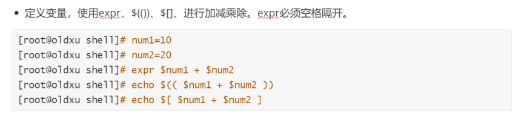
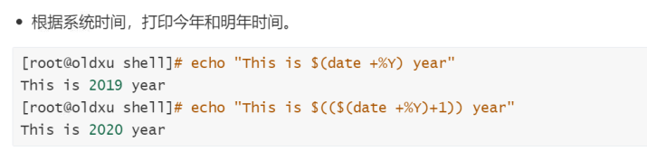
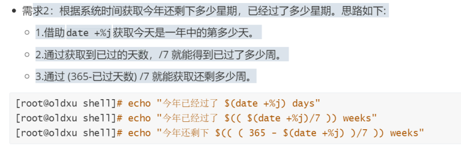
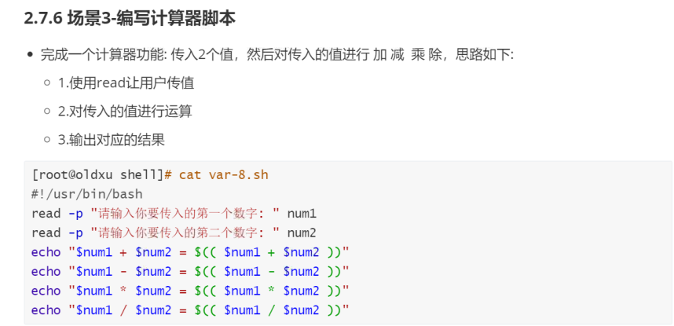

# shell脚本基础及变量

## 目录

-   [shell脚本基本概述](#shell脚本基本概述)
    -   [什么是shell](#什么是shell)
    -   [什么是shell脚本](#什么是shell脚本)
    -   [shell脚本能做什么](#shell脚本能做什么)
    -   [脚本预备知识](#脚本预备知识)
        -   [如何学](#如何学)
    -   [shell脚本书写方式](#shell脚本书写方式)
        -   [命名规范](#命名规范)
        -   [格式声明](#格式声明)
        -   [#号使用](#号使用)
        -   [自动添加shell首部](#自动添加shell首部)
-   [shell变量](#shell变量)
    -   [什么是变量](#什么是变量)
    -   [命名规则](#命名规则)
    -   [定义方式](#定义方式)
        -   [用户自定义变量](#用户自定义变量)
        -   [系统环境变量](#系统环境变量)
        -   [位置参数变量](#位置参数变量)
        -   [特殊参数变量](#特殊参数变量)
        -   [参数场景示例](#参数场景示例)
    -   [read交互传递变量](#read交互传递变量)
        -   [场景1-模拟登陆页面](#场景1-模拟登陆页面)
        -   [场景2-系统备份脚本](#场景2-系统备份脚本)
        -   [3-探测主机存活](#3-探测主机存活)
        -   [4-修改主机名称](#4-修改主机名称)
-   [shell变量的删除](#shell变量的删除)
    -   [什么是变量的删除](#什么是变量的删除)
    -   [为什么要删除](#为什么要删除)
    -   [删除的方式](#删除的方式)
    -   [删除语法示例](#删除语法示例)
    -   [场景](#场景)
        -   [1-提取内存百分比脚本](#1-提取内存百分比脚本)
        -   [2-为不同版本系统安装源](#2-为不同版本系统安装源)
-   [shell变量替换](#shell变量替换)
    -   [什么是变量替换](#什么是变量替换)
    -   [替换方式](#替换方式)
    -   [场景](#场景)
        -   [1-替换PATH变量](#1-替换PATH变量)
        -   [2-字符串替换脚本](#2-字符串替换脚本)
-   [shell变量运算](#shell变量运算)
    -   [什么是变量运算 ](#什么是变量运算-)
    -   [为什么需要](#为什么需要)
    -   [实现方式](#实现方式)
    -   [场景](#场景)
        -   [1-根据当前时间计算明年时间](#1-根据当前时间计算明年时间)
        -   [2-计算今年还剩多少周](#2-计算今年还剩多少周)
        -   [3-编写计算脚本](#3-编写计算脚本)

## shell脚本基本概述

### 什么是shell

shell是一个命令解释器，它在操作系统的最外层，负责直接与用户进行对话，将用户输入的命令翻译给操作系统，并将处理的结果输出至屏幕。


当然shell命令是存在交互式、非交互式两种方式

交互:日常使用，登陆、执行命令、退出;

非交互:直接读取某个文件，文件从头执行到尾即结束;

### 什么是shell脚本

1\)将系统命令堆积在一起，顺序执行(简称:系统命令堆积)

2\)特定的格式＋特定的语法＋系统的命令=文件。

### shell脚本能做什么

1.基础配置:系统初始化操作、系统更新、内核调整、网络、时区、SSH优化

⒉.安装程序:部署LNMP、LNMT、MysQL、Nginx、Redis.LVS、Keepalived等等

3.配置变更: Nginx conf、PHP conf、MysQL conf、 Redis conf

4.业务部署: she11配合git、 jenkins实现代码自动化部署，以及代码回滚

5.日常备份:使用Shell脚本对MySQL进行每晚的全备与增量备份

6.信息采集: zabbix + she11，硬件、系统、服务、网络、等等

7.日志分析:取值-→>排序->去重->统计->分析

8.服务扩容:扩容:监控服务器集群cpu，如cpu负载持续80%＋触发动作(脚本)，脚本:调用api开通云主机->初始化环境->加入集群->对外提供

9.服务缩容:监控服务器集群cpu使用率，->低于20%->检测当前有多少web节点->判断是否超过预设-\~>缩减到对应的预设状态->变更负载的配置

10.字符提取:比如nginx状态、php状态、格式化数据等;

> ⛔注意: shell脚本主要的作用是简化操作步骤,提高效率，减少人为干预，减少系统故障

### 脚本预备知识

1、熟练使用vim编辑器

2、熟练使用Linux基础命令

3、熟练使用Linux三剑客

注意:如果我们对命令使用不够熟练、对基本服务也不会手动搭建、那么一定学不会Shell

#### 如何学

1、基础命令+基础服务+练习+思路。(必备)

2、能看懂shell脚本->能修改shell脚本-->能编写shell脚本-->能优化shell脚本

### shell脚本书写方式

#### 命名规范

名字要有意义，不要使用a、b、c、1、2、3这种方式命名;

虽然linux系统中，文件没有扩展名的概念;

依然建议你用.sh 结尾;

名称控制在30个字节以内。例如: check\_memory.sh

#### 格式声明

shell脚本开头必须指定脚本运行环境以#这个特殊符号组合来组成。

如: # ! /bin/bash 指定该脚本是运行解析由/bin/bash来完成;

#### #号使用

```bash
#!/bin/bash
#Author: oldxu
#created Time: 2021/11/01 12:00
#Script Description: first she17 study script
```

#### 自动添加shell首部

```bash
[root@web01 ~]# cat ~/.vimrc
autocmd BufNewFile *.sh exec ":call SetTitle()"
func SetTitle()
if expand("%:e") == 'sh'
call setline(1,"#!/bin/bash")
call setline(2,"#********************************************************************")
call setline(3,"#Author     : Oldxu")
call setline(4,"#Date       : ".strftime("%Y-%m-%d"))
call setline(5,"#FileName   : ".expand("%"))
call setline(6,"#Description: The test script")
call setline(7,"#********************************************************************")
call setline(8,"")
endif
endfunc
autocmd BufNewFile * normal G

```

## shell变量

### 什么是变量

变量是shell中传递数据的一种方法。

简单理解:就是用一个固定的字符串去表示不固定的值，便于后续引用。

### 命名规则

变量定义命名:大写小写字母、下划线组成，尽量字母开头。{注意:变量名称最好具备一定含义}

变量定义语法:变量名=变量值，等号是赋值，需要注意:等号两边不能有空格，其次定义的变量不要与系统命令出现冲突。参考如下定义变量方式:

ip=10.0.0.100

ip=10.0.0.100

Hostname\_ip=10.0.0.100

hostname\_IP=10.0.0.100

system\_cpu\_load\_avg1=w|awk '{print \$1}'

system\_cpu\_load\_avg5=w|awk '{print \$2}'

system\_cpu\_load\_avg15=w|awk '{print\$3}'

### 定义方式

1.用户自定义变量:人为定义变量名与变量的值。

⒉.系统环境变量:保存的是和系统操作环境相关的数据，所有用户都可以使用。

3.位置参数变量:向脚本中进行参数传递，变量名不能自定义，变量作用是固定的。

4.特殊参数变量:是Bash中已经定义好的变量，变量名不能自定义，变量作用也是固定的。eg（echo \$? ）

#### 用户自定义变量

```bash
#定义变量，变量名=变量值，不能出现横杠命名
  var="hello world" #定义变量有空格时必须用双引号
#引用变量
  echo $var
  echo ${var}_log  #如果想在变量前后加内容变量必须括起来
 #shell脚本使用
 [root@ansible shell]# cat vars.sh
#!/bin/bash
var=$"hello world"
echo "${var}"


```

注意：双引号""是弱引用而''是强引用

#### 系统环境变量

```bash
#使用系统已定义的系统变量
[root@ansible shell]# sh xitongvar.sh
    用户家目录是: /root
    当前的主机: ansible
    当前所在目录: /root/shell
[root@ansible shell]# cat xitongvar.sh
    #!/bin/bash
    echo "用户家目录是: $HOME"
    echo "当前的主机: $HOSTNAME"
    echo "当前所在目录: $PWD"
#人为定义环境变量
  export vars="hello world"  #将人为定义的变量转化成环境变量
[root@ansible shell]# sh vars.sh  #如果不转换环境变量。默认另一个窗口执行，找不到变量
  hello world
[root@ansible shell]# cat vars.sh
    #!/bin/bash
    echo "$vars2"
 

```

#### 位置参数变量

位置参数顾名思义，就是传递给脚本参数的位置，例如给一个脚本传递一个参数，我们可以在Shell脚本内部获取传入的位置参数，获取参数的格式为:\$n。n代表一个数字。

例如传递给脚本的第一个参数就为\$1，第2个参数就为\`\$2,以此类推.....其中\$0为该脚本的名称。

```bash
[root@ansible shell]# cat weizhi.sh
  #!/bin/bash
  echo "当前shell脚本的文件名: $0"
  echo "第2个shell脚本位置参数: $1"
  echo "第2个shell脚本位置参数: $2"
  echo "第3个shell脚本位置参数: $3"
[root@ansible shell]# sh weizhi.sh 12 34 33
  当前shell脚本的文件名: weizhi.sh
  第2个shell脚本位置参数: 12
  第2个shell脚本位置参数: 34
  第3个shell脚本位置参数: 33

```

#### 特殊参数变量

特殊参数:

\$ \*:传递给脚本或函数的所有参数，当被双引号""包含时，所有的位置参数被看做一个字符串

\$@:传递给脚本或函数的所有参数，当被双引号""包含时，每个位置参数被看做独立的字符串&#x20;

\$?:上个命令的退出状态，或函数的返回值，0为执行成功，非0则为执行失败

\$\$:当前程序运行的PID

\$0:脚本的路径+名名称=位置;

\$1...\$n:脚本的位置参数:参数之间使用空格隔开;

\$#:获取脚本的位置参数的总个数;―判断脚本最多接受多个参数传递;

```bash
[root@ansible shell]# cat ts.sh
  #!/bin/bash
  echo "第一个参数为:$1"
  echo "第二个参数为:$2"
  echo "脚本名称为:$0"
  echo "脚本接受参数总数为:$#"
  curl -I baidu.com &>/dev/null
  echo "运行命令的状态为:$?"
  echo "脚本的ID为:$$"
  echo "\$* 的结果为:$*"
  echo "\$@ 的结果为:$@"
  echo "=========================="
  echo "\$* 循环接收的结果"
  2.执行脚本
  for i in "$*";
  do
  echo $i
  done
  echo "\$@ 循环接收的结果"
  for j in "$@";
  do
  echo $j
  done

[root@ansible shell]# sh ts.sh uu jjj kk
  第一个参数为:uu
  第二个参数为:jjj
  脚本名称为:ts.sh
  脚本接受参数总数为:3
  运行命令的状态为:0
  脚本的ID为:67264
  $* 的结果为:uu jjj kk
  $@ 的结果为:uu jjj kk
  ==========================
  $* 循环接收的结果
  ts.sh: line 13: 2.执行脚本: command not found
  uu jjj kk
  $@ 循环接收的结果
  uu
  jjj
  kk

```

#### 参数场景示例

```bash
#通过位置变量创建linux系统账户和密码，执行测试
[root@ansible shell]# sh password.sh username password
    Changing password for user username.
    passwd: all authentication tokens updated successfully.
[root@ansible shell]# ls /home
    username
[root@ansible shell]# cat password.sh
    #!/bin/bash
    useradd  "$1"
    echo "$2" | passwd --stdin "$1"
#通过位置变量创建 Linux 系统账户及密码，执行 控制最多传递两个参数。
[root@ansible shell]# sh password.sh username password
    useradd: user 'username' already exists
    Changing password for user username.
    passwd: all authentication tokens updated successfully.
[root@ansible shell]# sh password.sh username password rr
     USAGE password.sh [ user|Password ]
[root@ansible shell]# cat password.sh
    #!/bin/bash
    if [ $# -ne 2 ]; then #通过$#控制用户传递参数的个数
            echo " USAGE $0 [ user|Password ] "
            exit
    fi
    useradd  "$1"
    echo "$2" | passwd --stdin "$1"
#通过位置变量创建 Linux 系统账户及密码，执行 var1.sh username password，控制最多传递两个参数，且必须是root身份；
[username@ansible shell]$ sh password.sh  ww ee
    username plaese user root user
[root@ansible shell]# sh password.sh  ww ee
    Changing password for user ww.
    passwd: all authentication tokens updated successfully.
[root@ansible shell]# cat password.sh
    #!/bin/bash
    if [ $UID -ne 0 ]; then
            echo "$USER plaese user root user"
    exit
    fi
    
    if [ $# -ne 2 ]; then #通过$#控制用户传递参数的个数
            echo " USAGE $0 [ user|Password ] "
            exit
    fi
    useradd  "$1"
    echo "$2" | passwd --stdin "$1"


    

```

### read交互传递变量

除了自定义变量，以及系统内置变量，还可以使用read命令进行交互式传递变量

| read选项 | 含义     |
| ------ | ------ |
| -p     | 打印信息   |
| -t     | 限定时间   |
| -s     | 不显示字符  |
| -n     | 指定字符个数 |

```bash
[root@ansible shell]# cat read.sh
    #!/bin/bash
    read -p "login:" acc
    read -s -p "password:" ps  #p选项要最开进字符串，不然不显示字符串
    echo "username $acc  password $ps"
[root@ansible shell]# sh read.sh
login:1234
password:username 1234  password 12123

```

#### 场景1-模拟登陆页面

使用 read 模拟 Linux 登陆页面，

1.如果输入用户为root，密码为123，则输出欢迎登陆；

2.否则输出用户或密码错误；

```bash
[root@ansible shell]# sh login.sh
      CentOS Linux 7 (Core)
      Kernel 3.10.0-862.el7.x86_64 on an x86_64
      ansible login:root
      password:
      滚犊子
[root@ansible shell]# sh login.sh
      CentOS Linux 7 (Core)
      Kernel 3.10.0-862.el7.x86_64 on an x86_64
      ansible login:root
      password:
    welcome root login in
[root@ansible shell]# vim login.sh
[root@ansible shell]# cat login.sh
      #!/bin/bash
      system=$(hostnamectl | awk '/Operating/' | awk -F ': ' '{print $(NF)}')
      kernel=$(hostnamectl | awk '/Kernel/' | awk -F '[: ]+' '{print $2}')
      version=$(hostnamectl | awk -r '/ernel/' | awk -F ' ' '{print $3}')
      banben=$(hostnamectl | awk -r '/ernel/' | awk -F ' ' '{print $3}'| awk -F '.' '{print $NF}')
      #打印登录界面信息
      echo "$system"
      echo "${kernel} ${version} on an ${banben}"
      #进行交互式输入
      read -p "$(hostname) login:" user
      read -s -p "password:" ps
      echo "" #换行操作
      #判断用户输入是否正确
      if [ $user == "root" -a $ps == "123" ];then
              echo "welcome $user login in"
         else
              echo "滚犊子"
              exit
      fi

```

#### 场景2-系统备份脚本

```bash
[root@ansible shell]# sh backup.sh
    你要备份的目录是:/etc/hosts
    你要备份到那个目录/root
    你确定要备份/etc/hosts---》d_dir [y|n]y
     ------bakckup statr-------
    -----backup success------
[root@ansible shell]# ls /root
  anaconda-ks.cfg  cs.sh  hosts  jumpserver  roles  shell
[root@ansible shell]# cat backup.sh
      #!/usr/bin/bash
      read -p "你要备份的目录是:" dir
      read -p "你要备份到那个目录" d_dir
      read -p "你确定要备份$dir---》d_dir [y|n]" action
      #判断输入的是y还是n
      if [ $action == y ];then
              echo " ------bakckup statr------- "
              cp $dir $d_dir
              sleep 1
       echo "-----backup success------"
      fi

```

#### 3-探测主机存活

```bash
[root@ansible shell]# cat ping.sh
    #!/usr/bin/bash
    read -p " 输入需要测试的主机ip:" ip
    #测试主机是否存在
    ping -c2 $ip >> /dev/null
    if [ $? -eq  1 ];then
            echo "主机$ip不存在"
    else
            echo "主机$ip存在"
    fi
[root@ansible shell]# sh ping.sh
   输入需要测试的主机ip:172.16.1.62
   主机172.16.1.62存在
```

#### 4-修改主机名称

```bash
[root@asnible62 shell]# sh hostnam.sh
    当前主机的名称是: asnible62
    请输入你要修改的主机名称: ansible
    你确定要修改asnible62 为ansible [y|n]y
    正在修改用户名.......
    用户名已修改为 ansible ok
[root@ansible shell]# cat hostnam.sh
    #!/usr/bin/bash
    Hostname=$(cat /etc/hostname)
    echo "当前主机的名称是: $Hostname"
    read -p "请输入你要修改的主机名称: " name
    read -p "你确定要修改$Hostname 为$name [y|n]" action
    #判断输入是否为y，若是则修改
    if [ $action == "y" ];then
            echo "正在修改用户名......."
            sleep 1
            hostnamectl set-hostname $name
            echo "用户名已修改为 $name ok"
            bash #重新加载使修改的用户名生效
    fi

```

## shell变量的删除

### 什么是变量的删除

简单来说，就是在不改变原有变量的情况下，对变量进行删除。

### 为什么要删除

比如:我们需要对某个变量的值进行整数比对，但变量的值是一个小数。怎么办?我们可以使用变量删除的方式，将小数位进行删除，然后在进行整数比对。

### 删除的方式

| 变量           | 说明           |
| ------------ | ------------ |
| \$(变量#匹配规则)  | 从头开始匹配，最短删除  |
| \$(变量##匹配规则) | 从头开始匹配，最长删除  |
| \$(变量%匹配规则)  | 从尾部开始匹配，最短删除 |
| \$(变量%%匹配规则) | 从尾部开始匹配，最长删除 |

### 删除语法示例

```bash
#从后往前删除变量内容
[root@ansible shell]# echo $url
    www.baidu.com
[root@ansible shell]# echo ${url##*.}
    com
[root@ansible shell]# echo ${url#*.}
    baidu.com
#从后往前删除变量内容
[root@ansible shell]# echo ${url%.*}
    www.baidu
[root@ansible shell]# echo ${url%%.*}
    www
#变量内容替换
[root@ansible shell]# echo ${url/baidu/lyj} #指定内容进行替换
    www.lyj.com
[root@ansible shell]# echo ${url/b/B}  #替换匹配到的第一个b换成大写
    www.Baidu.com
[root@ansible shell]# echo ${url//b/B}  #更换所有小写的b为大写的B
    www.Baidu.com

```

### 场景

#### 1-提取内存百分比脚本

查看内存/当前使用状态，如果使用率超过80%则报警
发邮件

1.如何获取内存指标； free -m

2.拿到使用率的百分比；free -m | awk '/^Mem/{print \$3/\$2\*100}'

3.与定义的阈值做比对 80%；

4.超过80，则发送邮件，否则没有任何提示；

```bash
[root@ansible shell]# sh kernel.sh
    kernel is ok 13%
[root@ansible shell]# cat kernel.sh
    #!/usr/bin/bash
    Mem=$(free -m | awk '/^Mem/{print $3/$2*100}')
    if [ ${Mem%.*} -ge 30 ]
    then
            echo "kernel is error ${Mem%.*}%"
    else
            echo "kernel is ok ${Mem%.*}%"
    fi

```

#### 2-为不同版本系统安装源

写一个脚本，在CentOS6上运行则安装6的epel，在
CentOS7系统运行则安装7系统的epel；

1.判断系统的版本；cat /etc/redhat-release | awk'{print \$(NF-1)}'

2.根据不同的版本安装不同的源；

```bash
[root@ansible shell]# sh yum.sh
    yum_repository-7 is ok
[root@ansible shell]# cat yum.sh
    #!/usr/bin/bash
    version=$(cat /etc/redhat-release | awk '{print $(NF-1)}')
    #判断版本号进行不同的版本源安装
    if [ ${version%%.*} -eq 7 ];then
            wget -O /etc/yum.repos.d/epel.repo http://mirrors.aliyun.com/repo/epel-7.r
    epo &>/dev/null
            echo "yum_repository-7 is ok"
    fi
    if [ ${version%%.*} -eq 6 ];then
            wget -O /etc/yum.repos.d/epel.repo http://mirrors.aliyun.com/repo/epel-6.r
    epo
            echo "yum_repository is ok"
    fi

```

## shell变量替换

### 什么是变量替换

简单来说，就是在不改变原有变量的情况下，对变量进行替换。
比如:原本输出linux是小写，可以将其转为LINUX大写，或者直接删除;

### 替换方式

| 变量                | 说明                      |
| ----------------- | ----------------------- |
| \$(变量/旧字符串/新字符串)  | 替换变量内的旧字符串为新字符串，只能替换第一个 |
| \$(变量//旧字符串/新字符串) | 偷换变量内的旧字符串至新字符串，全部替换    |


### 场景

#### 1-替换PATH变量

```bash
url=www.baidu.com
[root@ansible shell]# echo ${url/baidu/lyj} #指定内容进行替换
    www.lyj.com
[root@ansible shell]# echo ${url/b/B}  #替换匹配到的第一个b换成大写
    www.Baidu.com
[root@ansible shell]# echo ${url//b/B}  #更换所有小写的b为大写的B
    www.Baidu.com
```

#### 2-字符串替换脚本

需求：变量 string="Bigdata process isHadoop, Hadoop is open source project" 执行脚本后，打印输出 string 变量，并给出用户以下选项：

1\)、打印 string 长度

2\)、删除字符串中所有的 Hadoop

3\)、替换第一个Hadoop为Linux

4\)、替换全部Hadoop为Linux用户输入数字1|2|3|4，可以执行对应项的功能，输入q|Q则退出交互模式

```bash
[root@ansible shell]# sh tihuan.sh
    Bigdata process is Hadoop, Hadoop is open source project
    1.打印string的长度
    2.删除字符串中所有的Hadoop
    3.替换第一个Hadoop为linux
    4.替换所有Hadoop为linux
    请输入要做的操作 1|2|3|4|q|Q:1
    他的长度是 56
[root@ansible shell]# cat tihuan.sh
    #!/usr/bin/bash
    string="Bigdata process is Hadoop, Hadoop is open source project"
    #打印需求选项
    echo $string
    echo "1.打印string的长度"
    echo "2.删除字符串中所有的Hadoop"
    echo "3.替换第一个Hadoop为linux"
    echo "4.替换所有Hadoop为linux"
    read -p "请输入要做的操作 1|2|3|4|q|Q:" action
    #写满足需求的命令
    if [ $action -eq 1 ];then
            echo "他的长度是 ${#string}"
    fi
    if [ $action -eq 2 ];then
            echo "${string//Hadoop/}"
    fi
    if [ $action -eq 3 ];then
            echo "${string/Hadoop/linux}"
    fi
    if [ $action -eq 4 ];then
            echo "${string//Hadoop/linux}"
    fi
#if嵌套方式实现
[root@ansible shell]# cat tihuan.sh
    #!/usr/bin/bash
    string="Bigdata process is Hadoop, Hadoop is open source project"
    #打印需求选项
    echo $string
    echo "1.打印string的长度"
    echo "2.删除字符串中所有的Hadoop"
    echo "3.替换第一个Hadoop为linux"
    echo "4.替换所有Hadoop为linux"
    read -p "请输入要做的操作 1|2|3|4|q|Q:" action
    #写满足需求的命令
    if [ $action -eq 1 ];then
            echo "他的长度是 ${#string}"
    else
            if [ $action -eq 2 ];then
                echo "${string//Hadoop/}"
                else
                if [ $action -eq 3 ];then
                  echo "${string/Hadoop/linux}"
                  else
                if [ $action -eq 4 ];then
                  echo "${string/Hadoop/linux}"
                  else
                    exit
                fi
            fi
    fi
    fi
#case方式实现
[root@ansible shell]# cat tihuan.sh
#!/usr/bin/bash
string="Bigdata process is Hadoop, Hadoop is open source project"
#打印需求选项
echo $string
echo "1.打印string的长度"
echo "2.删除字符串中所有的Hadoop"
echo "3.替换第一个Hadoop为linux"
echo "4.替换所有Hadoop为linux"
read -p "请输入要做的操作 1|2|3|4|q|Q:" action
#写满足需求的命令
case $action in
  1)
    echo "他的长度是 ${#string}"
  ;;
  2)
    echo "${string//Hadoop/}"
    ;;
  3)
    echo "${string/Hadoop/linnx}"
    ;;
  4)
    echo "${string//Hadoop/linux}"
    ;;
  *)
    exit
esac
   
  
```

## shell变量运算

### 什么是变量运算&#x20;

其实就是我们以前学习过的加减乘除。

### 为什么需要

当我们需要开发一个计算器程序时，是不是就需要运算了?当我们要对结果进行单位换算时，是不是就需要变量运算了?

### 实现方式

通常整数运算有expr.\$(())、\$\[ ]等方式，小数运算有bc、awk方式。

| 操作符        | 含义 |
| ---------- | -- |
| num1+num2  | 加  |
| num1-num2  | 减  |
| num1\*num2 | 乘  |
| num1/num2  | 除  |
| num1%num2  | 取余 |



### 场景

#### 1-根据当前时间计算明年时间



#### 2-计算今年还剩多少周



#### 3-编写计算脚本


