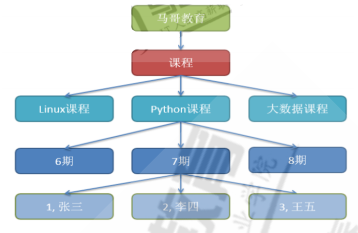
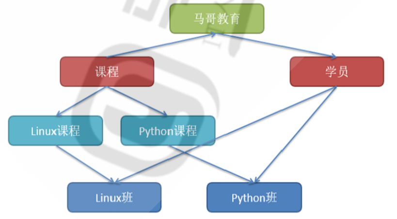

# MySQL数据库原理介绍

## 目录

-   [数据分类](#数据分类)
-   [发展阶段](#发展阶段)
-   [相关名词及优点](#相关名词及优点)
-   [数据库管理系统介绍](#数据库管理系统介绍)
-   [关系型数据库RDBMS](#关系型数据库RDBMS)
-   [关系型数据库理论](#关系型数据库理论)
    -   [联系类型](#联系类型)
    -   [正规化分析：](#正规化分析)

## 数据分类

机构化数据：有固定格式和长度的数据

非结构化数据：无固定长度格式的数据

半结构化数据

## 发展阶段

萌芽阶段：文件系统→初级阶段：第一代数据库（网状、层次模型）→层次模型（关系行数据库和结构化查询语句）→高级阶段（关系-对象数据库）

## 相关名词及优点

database：数据库是数据的汇集，它以一定的组织形式存于存储介质上

DBMS：Database Management System, 是管理数据库的系统软件，它实现据库系统的各种功能。是数据库系统的核心

DBA:Database Administrator, 负责数据库的规划、设计、协调、维护和管理等工作

Application：应用程序,指以数据库为基础的应用程序

优点：

程序与数据相互独立
保证数据的安全、可靠
最大限度地保证数据的正确性
数据可以并发使用并能同时保证一致性
相互关联的数据的集合
较少的数据冗余

## 数据库管理系统介绍

分层结构由IBM在20世纪60年代开发，并在早期大型机DBMS中使用。记录的关系形成了一个树状模型。这种结构简单，但缺乏灵活性，因为这种关系仅限于一对多关系。
代表数据库：IBM IMS(信息管理系统)

网状数据库1964年通用电气GE公司的 Charles Bachman 成功地开发出世界上第一个网状数据库IDS(集成数据存储)，IDS 具有数据模式和日志的特征，只能在GE主机运行

## 关系型数据库RDBMS

相关名词

关系Relational：关系就是二维表。其中：表中的行、列次序并不重要

行row：表中的每一行，又称为一条记录record

列column：表中的每一列，成为属性，字段，域field

主键Primary key：PK ,一个或多个字段的组合, 用于惟一确定一个记录的字段，一张表只有一个主键, 主键字段不能为空NULL

唯一键Unique key: 一个或多个字段的组合,用于惟一确定一个记录的字段,一张表可以有多个UK,而且UK字段可以为NULL

域domain：属性的取值范围，如，性别只能是'男'和'女'两个值，人类的年龄只能0-150

常用关系数据库：MySQL、PostgresSQL、Oracle、MSSQL Server、DB2

## 关系型数据库理论

E-R模型

实体Entity：客观存在并可以相互区分的客观事物或抽象事件称为实体即表,在E-R图中用矩形表示实体，把实体名写在框内

属性Attribute：实体所具有的特征或性质,描述实体里面的单个信息, 使用椭圆形表示

联系Relationship：描述了实体的属性之间的关联规则

• 实体内部的联系：指组成同一个实体内的各属性之间的联系。如职工实体中，职工号和部门经理
号之间有一种关联关系
• 实体之间的联系：指不同实体之间的属性的联系。例：学生选课实体和学生基本信息实体之间
• 实体之间的联系用菱形框表示

### 联系类型

一对一联系：在表A或表B中创建一个字段﹐存储另一个表的主键值 如: 一个人只有一个身份证

一对多联系(1:n)：外键, 如: 部门和员工

多对多联系(m:n)：增加第三张表, 如: 学生和课程

### 正规化分析：

第一范式（1NF）、第二范式（2NF）、第三范式（3NF）、巴德斯科范式（BCNF）、第四范式(4NF）和第五范式（5NF，又称完美范式）

1.4.4.1 第一范式：1NF

无重复的列，每一列都是不可分割的基本数据项，同一列中不能有多个值，即实体中的某个属性不能有多个值或者不能有重复的属性，确保每一列的原子性。除去同类型的字段，就是无重复的列
说明：第一范式（1NF）是对关系模式的基本要求，不满足第一范式（1NF）的数据库就不是关系数据库

1.4.4.2 第二范式：2NF

第二范式必须先满足第一范式，属性完全依赖于主键，要求表中的每个行必须可以被唯一地区分，通常为表加上每行的唯一标识主键PK，非PK的字段需要与整个PK有直接相关性,即非PK的字段不能依赖于部分主键

1.4.4.3 第三范式：3NF

满足第三范式必须先满足第二范式属性，非主键属性不依赖于其它非主键属性。第三范式要求一个数据表中不包含已在其它表中已包含的非主关键字信息，非PK的字段间不能有从属关系
