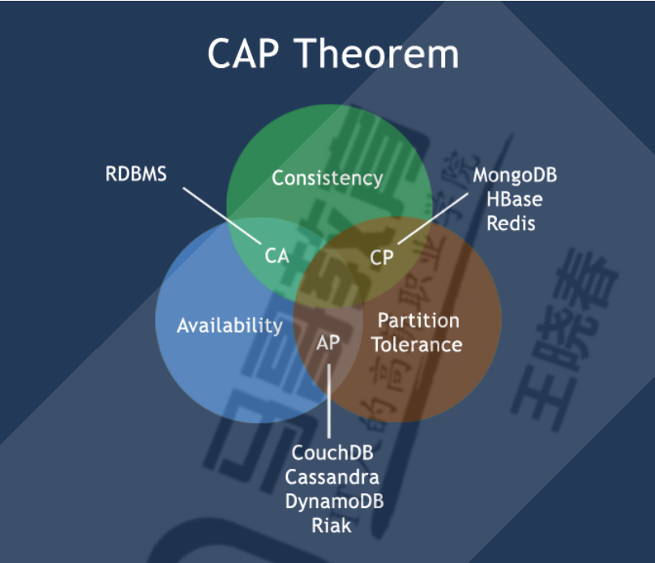

# Redis介绍及安装

## 目录

-   [redis基础](#redis基础)
    -   [nosql数据库](#nosql数据库)
    -   [RDBMS和NOSQL对比](#RDBMS和NOSQL对比)
    -   [CAP定理](#CAP定理)
    -   [Nosql数据库分类](#Nosql数据库分类)
    -   [Redis应用场景](#Redis应用场景)
-   [Redis安装及链接](#Redis安装及链接)
    -   [yum安装redis](#yum安装redis)
    -   [二进制安装](#二进制安装)

## redis基础

### nosql数据库

数据库主要分为两大类：关系型数据库与nosql数据库

关系型数据库，是建立在关系模型基础上的数据库，其借助于集合代数等数学概念和方法来处理数据库中的数据。主流的 MySQL、Oracle、MS SQL Server 和 DB2 都属于这类传统数据库。

NoSQL 数据库，全称为 Not Only SQL，意思就是适用关系型数据库的时候就使用关系型数据库，不用的时候也没有必要非使用关系型数据库不可，可以考虑使用更加合适的数据存储。NoSQL 是对不同于传统的关系型数据库的数据库管理系统的统称。

nosql适合于超大规模数据存储。

### RDBMS和NOSQL对比

-   RDBMS

    高度组织化结构化数据
    结构化查询语言（SQL）
    数据和关系都存储在单独的表中。
    数据操纵语言，数据定义语言
    严格的一致性
    基础事务
-   Nosql

    代表着不仅仅是SQL, 没有声明性查询语言
    没有预定义的模式
    最终一致性，而非ACID属性
    非结构化和不可预知的数据
    CAP定理
    高性能，高可用性和可伸缩性

### CAP定理

cap定理又称为布鲁尔定理，对于分布式计算机系统来说，不可能同时满足以下三点

1.一致性（consistency）所有节点在同一实践具有相同的数据

2.可用性(Availability) (保证每个请求不管成功或者失败都有响应

3.分隔容忍(Partition tolerance) (系统中任意信息的丢失或失败不会影响系统的继续运作)

CAP理论的核心是：一个分布式系统不可能同时很好的满足一致性，可用性和分区容错性这三个需求，最多只能同时较好的满足两个。
因此，根据 CAP 原理将 NoSQL 数据库分成了满足 CA 原则、满足 CP 原则和满足 AP 原则三 大类：
CA - 单点集群，满足一致性，可用性的系统，通常在可扩展性上不太强大。

CP - 满足一致性，分区容忍性的系统，通常性能不是特别高。

AP - 满足可用性，分区容忍性的系统，通常可能对一致性要求低一些。



### Nosql数据库分类

| 类型          | 部分代表                                                     | 特点                                                                           |
| ----------- | -------------------------------------------------------- | ---------------------------------------------------------------------------- |
| 列存储         | HbaseCassandraHypertable                                 | 顾名思义，是按列存储数据的。最大的特点是方便存&#xA;储结构化和半结构化数据，方便做数据压缩，对针对&#xA;某一列或者某几列的查询有非常大的IO优势 |
| 文档存储        | MongoDBCouchDB                                           | 文档存储一般用类似json的格式存储，存储的内容是文档型的。这样也就有机会对某些字段建立索引，实现关系数据库的某些功能。                 |
| key-value存储 | Tokyo Cabinet /&#xA;TyrantBerkeley&#xA;DBMemcacheDBRedis | 可以通过key快速查询到其value。一般来说，存储不管value的格式，照单全收。（Redis包含了其他功能）                     |
| 图存储         | Neo4JFlockDB                                             | 图形关系的最佳存储。使用传统关系数据库来解决的&#xA;话性能低下，而且设计使用不方便。                                 |
| 对象存储        | db4oVersant                                              | 通过类似面向对象语言的语法操作数据库，通过对象的方式存取数据                                               |
| xml数据库      | Berkeley DB                                              | 高效的存储XML数据，并支持XML的内部查询语法，比如XQuery,Xpath                                      |

-   redis特性

    速度快: 10W QPS,基于内存,C语言实现
    单线程
    持久化
    支持多种数据结构
    支持多种编程语言
    功能丰富: 支持Lua脚本,发布订阅,事务,pipeline等功能
    简单: 代码短小精悍(单机核心代码只有23000行左右),单线程开发容易,不依赖外部库,使用简单
    主从复制
    支持高可用和分布式

> ⛔一次只运行一条命令、拒绝长(慢)命令:keys \*, flushall, flushdb, slow lua script, mutil/exec, operate bigvalue(collection)、其实不是单线程: 早期版本是单进程单线程,3.0 版本后实际还有其它的线程, 实现特定功能,如: fysnc file descriptor,close file descriptor

### Redis应用场景

session共享、缓存、计数器、微博/微信社交场合、消息队列、地理位置

## Redis安装及链接

rocky网卡配置

```bash
TYPE=Ethernet
BOOTPROTO=none# none或者static表示静态，dhcp表示动态
NAME=ens33#可以和真实网卡不一样
UUID=f36bee5a-976c-4180-87bc-3fbb36325d6e
DEVICE=ens33#网卡ipa查询的网卡名保持一致
ONBOOT=yes#激活网卡
IPADDR=10.0.0.99
PREFIX=24#子网掩码或者NETMASK=255.255.255.0
GATEWAY=10.0.0.2#网关
DNS1=223.5.5.5#DNS服务器

```

### yum安装redis

```bash
yum install redis  #直接进行安装
systemctl enbale --now redis #加入并直接启动
[root@redis16 yum.repos.d]# pstree -p | grep redis  #查看redis进程
           |-redis-server(1931)-+-{redis-server}(1932)
           |                    |-{redis-server}(1933)
           |                    `-{redis-server}(1934)


```

### 二进制安装

```bash
redis包下载安装网站：http://download.redis.io/releases/
#安装依赖
yum -y install gcc jemalloc-devel systemd-devel
#下载源码
wget http://download.redis.io/releases/redis-5.0.7.tar.gz
#解压源码包
tar xvf redis-5.0.7.tar.gz
#编译安装
cd redis-5.0.7/
make PREFIX=/apps/redis install #指定redis安装目录
#如果支持systemd,需要执行下面
make USE_SYSTEMD=yes PREFIX=/apps/redis install

#配置变量
echo 'PATH=/apps/redis/bin:$PATH' > /etc/profile.d/redis.sh
. /etc/profile.d/redis.sh

#目录结构
tree /apps/redis/
#准备相关目录和配置文件
mkdir /apps/redis/{etc,log,data,run} #创建配置文件、日志、数据等目录
cp redis.conf /apps/redis/etc/

```

前台启动redis：`redis-server  /etc/redis.conf`

开启redis多实例：redis-server - -port 端口号&#x20;

解决启动时三个警告

```bash
vim /etc/sysctl.conf
net.core.somaxconn = 1024  #backlog参数控制的是三次握手的时候server端收到client ack确认号之后的队列值，即全连接队列
vm.overcommit_memory = 1   
#0、表示内核将检查是否有足够的可用内存供应用进程使用；如果有足够的可用内存，内存申请允许；否则，内存申请失败，并把错误返回给应用进程。此为默认值
#1、表示内核允许分配所有的物理内存，而不管当前的内存状态如何
#2、表示内核允许分配超过所有物理内存和交换空间总和的内存
echo 'echo never > /sys/kernel/mm/transparent_hugepage/enabled' >> /etc/rc.d/rc.local 
chmod +x /etc/rc.d/rc.local
#编辑redis服务启动文件
[root@centos7 ~]#cat /lib/systemd/system/redis.service
[Unit]
Description=Redis persistent key-value database
After=network.target

[Service]
ExecStart=/apps/redis/bin/redis-server /apps/redis/etc/redis.conf --supervised
systemd
ExecStop=/bin/kill -s QUIT $MAINPID
Type=notify #如果支持systemd可以启用此行
User=redis
Group=redis
RuntimeDirectory=redis
RuntimeDirectoryMode=0755
LimitNOFILE=1000000   #指定此值才支持更大的maxclients值

[Install]
WantedBy=multi-user.target
重启启动redis

```

远程客户端链接：`/apps/redis/bin/redis-cli -h IP/HOSTNAME -p PORT -a PASSWORD`

创建命令软连接

```bash
[root@centos7 ~]#ln -sv /apps/redis/bin/redis-* /usr/bin/
‘/usr/bin/redis-benchmark’ -> ‘/apps/redis/bin/redis-benchmark’
‘/usr/bin/redis-check-aof’ -> ‘/apps/redis/bin/redis-check-aof’
‘/usr/bin/redis-check-rdb’ -> ‘/apps/redis/bin/redis-check-rdb’
‘/usr/bin/redis-cli’ -> ‘/apps/redis/bin/redis-cli’
‘/usr/bin/redis-sentinel’ -> ‘/apps/redis/bin/redis-sentinel’
‘/usr/bin/redis-server’ -> ‘/apps/redis/bin/redis-server’

```

编译安装后的命令

```bash
[root@centos7 ~]#ll /apps/redis/bin/
total 32772
-rwxr-xr-x 1 root root 4366792 Feb 16 21:12 redis-benchmark #redis性能测试工具
-rwxr-xr-x 1 root root 8125184 Feb 16 21:12 redis-check-aof #AOF文件检查工具
-rwxr-xr-x 1 root root 8125184 Feb 16 21:12 redis-check-rdb #RDB文件检查工具
-rwxr-xr-x 1 root root 4807856 Feb 16 21:12 redis-cli       #客户端工具
lrwxrwxrwx 1 root root      12 Feb 16 21:12 redis-sentinel -> redis-server #哨兵，软连接到server
-rwxr-xr-x 1 root root 8125184 Feb 16 21:12 redis-server #redis 服务启动命令
```
