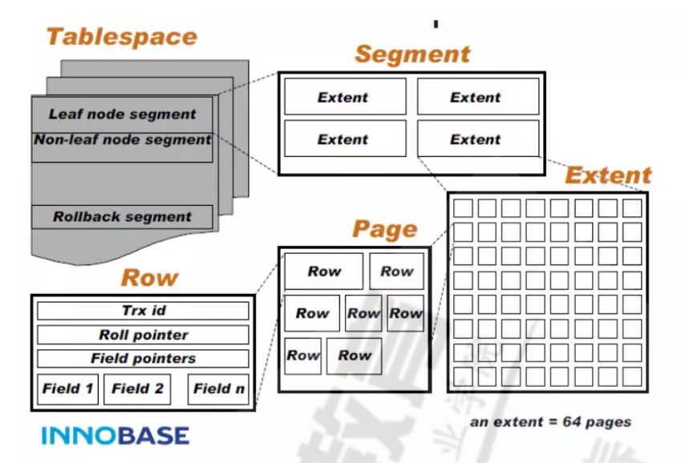

# MySQL架构和性能优化

## 目录

-   [MySQL存储引擎](#MySQL存储引擎)
-   [管理存储引擎](#管理存储引擎)
-   [MySQL中的系统数据库](#MySQL中的系统数据库)
-   [服务器变量](#服务器变量)
-   [index索引](#index索引)
    -   [管理索引](#管理索引)
-   [并发控制](#并发控制)
    -   [锁机制](#锁机制)
    -   [事务](#事务)
    -   [日志管理](#日志管理)
        -   [错误日志](#错误日志)
        -   [通用日志](#通用日志)
    -   [慢查询日志](#慢查询日志)
    -   [二进制日志（备份日志）](#二进制日志备份日志)

## MySQL存储引擎

-   引擎
    -   mylsam引擎

        特点：不支持事务、表级锁定、读写相互阻塞，写入不能读，读时不能写、只缓存索引、不支持外键约束、不支持聚簇索引、读取数据较快，占用资源较少、不支持MVCC（多版本并发控制机制）高并发、崩溃恢复性较差、MySQL5.5.5 前默认的数据库引擎

        适用场景：只读、表较小

        引擎文件：tbl\_name.frm 表格式定义、tbl\_name.MYD 数据文件、tbl\_name.MYI 索引文件
    -   innodb引擎

        特点：行级锁、支持事务，适合处理大量短期事务、读写阻塞与事务隔离级别相关、可缓存数据和索引、支持聚簇索引、崩溃恢复性更好、支持MVCC高并发、从MySQL5.5后支持全文索引、从MySQL5.5.5开始为默认的数据库引擎

        数据库文件：

        

        所有InnoDB表的数据和索引放置于同一个表空间中
        ```bash
        数据文件：ibdata1, ibdata2,存放在datadir定义的目录下
        表格式定义：tb_name.frm,存放在datadir定义的每个数据库对应的目录下
        ```
        每个表单独使用一个表空间存储表的数据和索引
        ```bash
        两类文件放在对应每个数据库独立目录中
        数据文件(存储数据和索引)：tb_name.ibd 
        表格式定义：tb_name.frm
        ```

## 管理存储引擎

```bash
#查看mysql支持的存储引擎
show engines;
#查看当前默认的存储引擎
show variables like '%storage_engine%';
#设置默认的存储引擎
vim /etc/my.cnf
[mysqld]
default_storage_engine= InnoDB
#查看库中所有表使用的存储引擎
show table status from db_name;
#查看库中指定表的存储引擎
show table status like  'tb_name';
show create table tb_name;
#设置表的存储引擎
CREATE TABLE tb_name(... ) ENGINE=InnoDB;
ALTER TABLE tb_name ENGINE=InnoDB;

```

## MySQL中的系统数据库

mysql数据库：mysql的核心数据库，类似于Sql Server中的master库，主要负责存储数据库的用户、权限设置、关
键字等mysql自己需要使用的控制和管理信息

indformation\_schema数据库：MySQL 5.0之后产生的，一个虚拟数据库，物理上并不存在information\_schema数据库类似与"数据字典"，提供了访问数据库元数据的方式，即数据的数据。比如数据库名或表名，列类型，访问权限（更加细化的访问方式）

performance\_schema数据库：MySQL 5.5开始新增的数据库，主要用于收集数据库服务器性能参数,库里表的存储引擎均为PERFORMANCE\_SCHEMA，用户不能创建存储引擎为PERFORMANCE\_SCHEMA的表

sys数据库：MySQL5.7之后新增加的数据库，库中所有数据源来自performance\_schema。目标是把performance\_schema的把复杂度降低，让DBA能更好的阅读这个库里的内容。让DBA更快的了解DataBase的运行情况

## 服务器变量

## index索引

排序的快速查找的特殊数据结构，定义作为查找条件的字段上，又称为key，索引通过存储引擎实现

-   优点

    索引可以降低服务需要扫描的数据量，减少了IO次数
    索引可以帮助服务器避免排序和使用临时表
    索引可以帮助将随机I/O转为顺序I/O
-   缺点

    占用额外空间，影响插入速度
-   类型

    B+ TREE、HASH、R TREE、FULL TEXT
    聚簇（集）索引、非聚簇索引：数据和索引是否存储在一起
    主键索引、二级（辅助）索引
    稠密索引、稀疏索引：是否索引了每一个数据项
    简单索引、组合索引: 是否是多个字段的索引
    左前缀索引：取前面的字符做索引
    覆盖索引：从索引中即可取出要查询的数据，性能高


### 管理索引

索引结构：[二叉树](https://www.cs.usfca.edu/~galles/visualization/BST.html "二叉树")、[红黑树](https://www.cs.usfca.edu/~galles/visualization/RedBlack.html "红黑树")、[B-tree索引](https://www.cs.usfca.edu/~galles/visualization/BTree.html "B-tree索引")、[B+tree索引](https://www.cs.usfca.edu/~galles/visualization/BPlusTree.html "B+tree索引")、hash索引

```bash
#创建索引
create index index_name on tbl_name(index_col_name)
alter table tbl_name add index_name(index_col_name)
#获取帮助
help create index
#删除索引
drop index index_name on tbl_name;
ALTER table tbl_name drop index index_name(index_col_name)
#查看索引
show index from [db_name.]tbl_name;
#优化表空间
optimize table tbl_name;
#查看索引的使用
SET GLOBAL userstat=1;  #MySQL无此变量
SHOW INDEX_STATISTICS;


```

## 并发控制

### 锁机制

读锁：共享锁，也称为s锁，多个读互不堵塞

读锁：独占锁，回阻塞其他事务

```bash
#加锁
LOCK TABLES tbl_name [[AS] alias] lock_type  [, tbl_name [[AS] alias] lock_type] ...
lock_type
read  #读锁
write  #写锁
#解锁
unlock tables
#关闭正在打开的表，加全局锁
FLUSH TABLES [tb_name[,...]] [WITH READ LOCK] 
#查询时加写或读锁
SELECT clause [FOR UPDATE | LOCK IN SHARE MODE]
修改stuid=24的classid=1
MariaDB [hellodb]> update students set classid=1 where stuid=24
```

### 事务

事务 Transactions：一组原子性的 SQL语句，或一个独立工作单元
事务日志：记录事务信息，实现undo,redo等故障恢复功能

事务特性：

A：atomicity 原子性；整个事务中的所有操作要么全部成功执行，要么全部失败后回滚
C：consistency一致性；数据库总是从一个一致性状态转换为另一个一致性状态,类似于能量守恒定律(N50周启皓语录)
I：Isolation隔离性；一个事务所做出的操作在提交之前，是不能为其它事务所见；隔离有多种隔离级别，实现并发
D：durability持久性；一旦事务提交，其所做的修改会永久保存于数据库中

查看事务

```bash
#查看当前正在进行的事务
SELECT * FROM INFORMATION_SCHEMA.INNODB_TRX;

#以下两张表在MySQL8.0中已取消
#查看当前锁定的事务
SELECT * FROM INFORMATION_SCHEMA.INNODB_LOCKS;
#查看当前等锁的事务
SELECT * FROM INFORMATION_SCHEMA.INNODB_LOCK_WAITS;

```

### 日志管理

mysql的日志主要有以下几类：事务日志、错误日志、通用日志、慢查询日志、二进制日志、中继日志

#### 错误日志

mysqld启动和关闭过程中输出的事件信息
mysqld运行中产生的错误信息
event scheduler运行一个event时产生的日志信息
在主从复制架构中的从服务器上启动从服务器线程时产生的信息

错误日志路径：`SHOW GLOBAL VARIABLES LIKE 'log_error' ;`

#### 通用日志

记录对数据库的通用操作，包括错误的sql语句

相关设置

```bash
#查看通用日志是否开启
select @@general_log;
#启动通用日志
set global general_log=1;
#查看默认通用日志存放在文件中
show global variables like 'log_output';
#通用日志存放的文件路径
select @@general_log_file;
#查看表的详细信息
show table status like 'general_log'\G;
```

### 慢查询日志

记录执行查询市场从超出指定时长的操作

```bash
slow_query_log=ON|OFF #开启或关闭慢查询，支持全局和会话，只有全局设置才会生成慢查询文件
long_query_time=N #慢查询的阀值，单位秒,默认为10s
slow_query_log_file=HOSTNAME-slow.log  #慢查询日志文件
log_slow_filter = admin,filesort,filesort_on_disk,full_join,full_scan,
query_cache,query_cache_miss,tmp_table,tmp_table_on_disk 
#上述查询类型且查询时长超过long_query_time，则记录日志
log_queries_not_using_indexes=ON  #不使用索引或使用全索引扫描，不论是否达到慢查询阀值的语句是否记录日志，默认OFF，即不记录
log_slow_rate_limit = 1 #多少次查询才记录，mariadb特有
log_slow_verbosity= Query_plan,explain #记录内容
log_slow_queries = OFF    #同slow_query_log，MariaDB 10.0/MySQL 5.6.1 版后已删除

```

### 二进制日志（备份日志）

记录导致数据改变活潜在导致数据改变的sql语句以及已经提交的日志，不依赖存储引擎类型

```bash
#查看格式
show variables like 'binlog_format';
二进制文件有两种文件：日志文件以及索引文件
```

二进制日志相关的服务器变量

```bash
sql_log_bin=ON|OFF：#是否记录二进制日志，默认ON，支持动态修改，系统变量，而非服务器选项
log_bin=/PATH/BIN_LOG_FILE：#指定文件位置；默认OFF，表示不启用二进制日志功能，上述两项都开启才可以
binlog_format=STATEMENT|ROW|MIXED：#二进制日志记录的格式，mariadb5.5默认STATEMENT
max_binlog_size=1073741824：#单个二进制日志文件的最大体积，到达最大值会自动滚动，默认为1G
#说明：文件达到上限时的大小未必为指定的精确值
binlog_cache_size=4m #此变量确定在每次事务中保存二进制日志更改记录的缓存的大小（每次连接）
max_binlog_cache_size=512m #限制用于缓存多事务查询的字节大小。
sync_binlog=1|0：#设定是否启动二进制日志即时同步磁盘功能，默认0，由操作系统负责同步日志到磁盘
expire_logs_days=N：#二进制日志可以自动删除的天数。 默认为0，即不自动删除

```

相关配置

```bash
#查看mariadb自行管理使用中的二进制文件及大小
show {binary|master} logs
#查看二进制文件
show master status
#查看二进制文件中的指定内容
SHOW BINLOG EVENTS [IN 'log_name'] [FROM pos] [LIMIT [offset,] row_count]
eg：
show binlog events in 'mysql-bin.000001' from 6516 limit 2,3
#清楚二进制日志
PURGE { BINARY | MASTER } LOGS { TO 'log_name' | BEFORE datetime_expr }

PURGE BINARY LOGS TO 'mariadb-bin.000003'; #删除mariadb-bin.000003之前的日志
PURGE BINARY LOGS BEFORE '2017-01-23';
PURGE BINARY LOGS BEFORE '2017-03-22 09:25:30'
#切换日志
flush logs;
```
