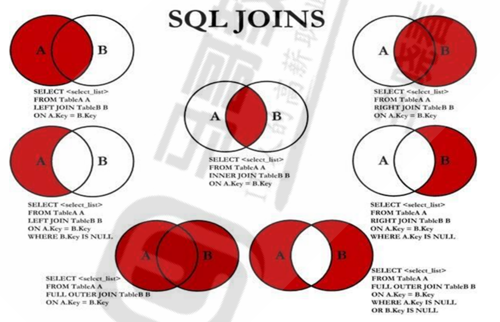
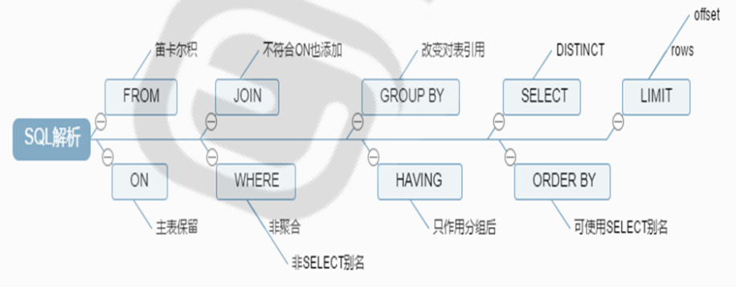

# MySQL语句

## 目录

-   [DDL语句](#DDL语句)
    -   [查看表](#查看表)
    -   [修改和删除表](#修改和删除表)
-   [DML语句](#DML语句)
    -   [insert](#insert)
    -   [update](#update)
    -   [delete语句](#delete语句)
-   [DQL语句](#DQL语句)
    -   [单表操作](#单表操作)
    -   [多表查询](#多表查询)
        -   [子查询](#子查询)
        -   [联合查询](#联合查询)
    -   [交叉链接](#交叉链接)
    -   [内连接](#内连接)
    -   [左右外链接](#左右外链接)
    -   [完全外连接](#完全外连接)
    -   [自链接](#自链接)
-   [SELECT语句处理顺序](#SELECT语句处理顺序)
    -   [view视图](#view视图)
    -   [function函数](#function函数)
        -   [创建UDF语法](#创建UDF语法)
-   [PROCEDURE 存储过程](#PROCEDURE-存储过程)
-   [触发器](#触发器)
-   [MySQL用户管理](#MySQL用户管理)
    -   [权限管理和DCL语句](#权限管理和DCL语句)

## DDL语句

表：二维关系
设计表：遵循规范
定义：字段，索引

字段：字段名，字段数据类型，修饰符
约束，索引：应该创建在经常用作查询条件的字段上

```bash
#直接创建表的方法
#直接创建
CREATE TABLE [IF NOT EXISTS] 'tbl_name' (col1 type1 修饰符, col2 type2 修饰符, ...)#字段信息
col type1 
PRIMARY KEY(col1,...)
INDEX(col1, ...)
UNIQUE KEY(col1, ...) #表选项：
ENGINE [=] engine_name
ROW_FORMAT [=] {DEFAULT|DYNAMIC|FIXED|COMPRESSED|REDUNDANT|COMPACT}
#注意
Storage Engine是指表类型，也即在表创建时指明其使用的存储引擎
同一库中不同表可以使用不同的存储引擎
同一个库中表建议要使用同一种存储引擎类型
#创建表
CREATE TABLE student (
id int UNSIGNED AUTO_INCREMENT PRIMARY KEY,
name VARCHAR(20) NOT NULL,
age tinyint UNSIGNED,
#height DECIMAL(5,2),
gender ENUM('M','F') default 'M')ENGINE=InnoDB AUTO_INCREMENT=10 DEFAULT CHARSET=utf8;
#id字段以10初始值，每个条件之间用，隔开

insert  student  ( name,age )values('xiaoming',20) #给表中赋值
select * from (表名); #查看表中的数据
drop from 表名 where 条件; #删除符合条件的表中数据
#创建表也可以用CREATE TABLE employee (id int UNSIGNED NOT NULL ,name VARCHAR(20) NOT NULL,age tinyint UNSIGNED,PRIMARY KEY(id,name));
创建时间类型的表
mysql> create table testdate (id int auto_increment primary key,date timestamp default current_timestamp not null);

```

查询现存表进行创建，信标会被直接插入查询而来得数据：

&#x20;`create table user select user,host,password from mysql.user;`

&#x20;通过复制现存的表的表结构创建，但不复制数据：

`CREATE [TEMPORARY] TABLE [IF NOT EXISTS] tbl_name { LIKE old_tbl_name | (LIKE old_tbl_name) }`

### 查看表

查看表：`show tables`； 查看表创建的命令：`show create table tbl_name`

查看表结构：`desc 表名；SHOW COLUMNS FROM  表名;`查看表状态：`SHOW TABLE STATUS LIKE 'tbl_name';`查看支持的engine类型：`SHOW ENGINES;`

### 修改和删除表

查看修改表的帮助：`help alter table`删除表：`drop table [if exists] 'tbl_name'`

修改表

```bash
#修改表名
ALTER TABLE students RENAME s1;
#添加字段（指定在那个字段后边插入）
ALTER TABLE s1 ADD phone varchar(11) AFTER name;
#修改字段类型
ALTER TABLE s1 MODIFY phone int;
#修改字段名称和类型
ALTER TABLE s1 CHANGE COLUMN phone mobile char(11);
#删除字段（一列直接删除，从表中删除）
ALTER TABLE s1 DROP COLUMN mobile;
#修改字符集
ALTER TABLE s1 character set utf8;
#修改数据类型和字符集
ALTER TABLE s1 change name name varchar(20) character set utf8;
#添加字段
ALTER TABLE students ADD gender ENUM('m','f');
alter table student modify is_del bool default false;
#修改字段名和类型
ALETR TABLE students CHANGE id sid int UNSIGNED NOT NULL PRIMARY KEY; 
#删除字段
ALTER TABLE students DROP age;
#查看表结构
DESC students;
#新建表无主键，添加和删除主键
CREATE TABLE t1 SELECT * FROM students;
ALTER TABLE t1 add primary key (stuid);
ALTER TABLE t1 drop primary key ;
#添加外键
ALTER TABLE students add foreign key(TeacherID) references teachers(tid);
#删除外键
SHOW CREATE TABLE students #查看外键名
ALTER TABLE students drop foreign key <外键名>;

```

## DML语句

包括：insert、delete、update

### insert

格式：`insert tbl_name [(col1,....)] values (val1,...),(val1,...)`

全值插入：insert 表名  values（要插入的数值【英文要用双引号】）

部分列插入：insert  表名（列名）values（要插入的值）

### update

语法

```bash
UPDATE [LOW_PRIORITY] [IGNORE] table_reference
    SET col_name1={expr1|DEFAULT} [, col_name2={expr2|DEFAULT}] ...
    [WHERE where_condition]
    [ORDER BY ...]
    [LIMIT row_count]
#注意：一定要有限制条件，佛则将修改所有行的指定字段
利用mysql选项避免此错误
mysql -U | --safe-updates| --i-am-a-dummy

[root@centos8 ~]#vim /etc/my.cnf
[mysql]
safe-updates
#修改指定字段的数值
update student set name='xiao' where id=1;

```

### delete语句

删除表中数据，但不会自动缩减数据文件的大小

语法：

```bash
DELETE [LOW_PRIORITY] [QUICK] [IGNORE] FROM tbl_name
    [WHERE where_condition]
    [ORDER BY ...]
    [LIMIT row_count]
#可先排序再指定删除的行数
#如果想清空表，保留表结构，也可以使用下面语句，此语句会自动缩减数据文件的大小
truncate table tbl_name;
#缩减表的大小
optimize table tb_name;
删除数据可以使用逻辑删除，添加一个标识字段实现，删除数据即修改表示字段
```

## DQL语句

### 单表操作

语法：

```bash
SELECT
 [ALL | DISTINCT | DISTINCTROW ]
 [SQL_CACHE | SQL_NO_CACHE]
 select_expr [, select_expr ...]
    [FROM table_references
    [WHERE where_condition]
    [GROUP BY {col_name | expr | position}
      [ASC | DESC], ... [WITH ROLLUP]]
    [HAVING where_condition]
    [ORDER BY {col_name | expr | position}
      [ASC | DESC], ...]
    [LIMIT {[offset,] row_count | row_count OFFSET offset}]
    [FOR UPDATE | LOCK IN SHARE MODE]

```

查询时使用别名：col1 as alias

where ：指明过滤条件，

过滤条件：布尔型表达式
算术操作符：+, -, \*, /, %
比较操作符：=,<=>（相等或都为空）, <>, !=(非标准SQL), >, >=, <, <=
范例查询: BETWEEN min\_num AND max\_num
不连续的查询: IN (element1, element2, ...)
空查询: IS NULL, IS NOT NULL
DISTINCT 去除重复行，范例：SELECT DISTINCT gender FROM students;
模糊查询: LIKE 使用 % 表示任意长度的任意字符 \_ 表示任意单个字符
RLIKE：正则表达式，索引失效，不建议使用
REGEXP：匹配字符串可用正则表达式书写模式，同上
逻辑操作符：NOT，AND，OR，XOR

GROUP BY：根据指定的条件把查询结果进行"分组"以用于做"聚合"运算
常见聚合函数： count(), sum(), max(), min(), avg(),注意:聚合函数不对null统计
HAVING: 对分组聚合运算后的结果指定过滤条件
一旦分组 group by ，select语句后只跟分组的字段，聚合函数

ORDER BY: 根据指定的字段对查询结果进行排序，升序：ASC，降序：DESC

对查询结果中的数据请求施加"锁"
FOR UPDATE: 写锁，独占或排它锁，只有一个读和写操作
LOCK IN SHARE MODE: 读锁，共享锁，同时多个读

简单查询示例

```bash
DESC students;
INSERT INTO students VALUES(1,'tom'，'m'),(2,'alice','f');
INSERT INTO students(id,name) VALUES(3,'jack'),(4,'allen');
SELECT * FROM students WHERE id < 3;   #查询id小于的字段
SELECT * FROM students WHERE gender='m';#查询gender字段中为m的行
SELECT * FROM students WHERE gender IS NULL;  
SELECT * FROM students WHERE gender IS NOT NULL;
SELECT * FROM students ORDER BY name DESC LIMIT 2;
SELECT * FROM students ORDER BY name DESC LIMIT 1,2;
SELECT * FROM students WHERE id >=2 and id <=4
SELECT * FROM students WHERE BETWEEN 2 AND 4
SELECT * FROM students WHERE name LIKE 't%'
SELECT * FROM students WHERE name RLIKE '.*[lo].*';
SELECT id stuid,name as stuname FROM students 

select * from students where classid in (1,3,5);
select * from students where classid not in (1,3,5);

#判断数值是否为空
select * from students where classid is null;
select * from students where classid is not null;
#ifnull函数判断指定的字段是否为空值,如果空值则使用指定默认值
mysql> select stuid,name,ifnull(classID,'无班级') from students where classid isnull;
#将age和gender多个字段重复的记录去重
mysql> select distinct age,gender from students;
#只取前3个
mysql> select * from students limit 0,3;
# 查询第n页的数据,每页显示m条记录
mysql> select * from students limit (n-1) * m,m;
#聚合函数使用（数学函数）
mysql> select sum(age)/count(*) from students where gender ='F';
#分组统计
mysql> select classid, count(*) 数量 from students group by classid;
#多个字段分组统计
select classid,gender,count(*) 数量 from students group by classid,gender; 
# with rollup 分组后聚合函数统计后再做汇总
mysql> select gender,count(*) from students group by gender with rollup;
注意:一旦使用分组group by,在select 后面的只能采用分组的列和聚合函数,其它的列不能放在select后面,否则根据系统变量SQL_MODE的值不同而不同的结果
#排序查询
#只取前3个
mysql> select * from students order by age desc limit 3
#跳过前3个只显示后续的2个
mysql> select * from students order by age desc limit 3,2;
#必须先过滤，再排序
select * from students where classid is not null order by gender desc, age asc ;9
#多列排序
select * from students order by gender desc, age asc;
#对classid 正序排序，NULL记录排在最后
select * from students order by -classid desc;
#分组和排序
mysql> select classid,count(*) 数量  from students group by classid order by 数量;
#分组后再排序
MariaDB [hellodb]> select gender,classid,avg(age) from students where classid is not null group by gender,classid order by gender,classid;
#查询排序后的第三到第十行
select * from students order by age limit 3,10;
#查询排序去重后的第三到第5行
select distinct age  from students order by age limit 3,5;
时间字段进行过滤查询,并且timestamp可以随其它字段的更新自动更新
#创建时间字段并加入数值
MariaDB [testdb]>  create table testdate (id int auto_increment primary key,date timestamp DEFAULT CURRENT_TIMESTAMP ON UPDATE CURRENT_TIMESTAMP);
MariaDB [testdb]>  insert testdate () values();
MariaDB [testdb]>  insert testdate values(),(),();
MariaDB [testdb]> select * from testdate;
#查询从几点到几点的时间断数据
select * from testdate where date >= '2020-06-03 15:21:12'and date <= '2020-06-03 18:27:40';
#修改其它字段,会自动更新timestamp字段
mysql> update testdate set id=10 where id=1;
mysql> select * from testdate3;

```

### 多表查询

即是多张表进行查询



#### 子查询

子查询 subquery 即SQL语句调用另一个SELECT子句,可以是对同一张表,也可以是对不同表,主要有以下四种常见的用法.

```bash
#用于比较表达式中的子查询，仅能返回单个值
SELECT Name,Age FROM students WHERE Age>(SELECT avg(Age) FROM teachers); #查询当前表中的字段比另一个表大的字段    
update students set Age=(SELECT avg(Age) FROM teachers) where stuid=25;  # 更改表中符合另一个表数值条件的字段
#用于IN中的子查询：子查询应该单独查询并返回一个或多个值重新构成列表
SELECT Name,Age FROM students WHERE Age IN (SELECT Age FROM teachers);  #查询前边条件和后边另一个表的条件符合的字段数值
#用于exists和not exists
select * from students s where  EXISTS (select * from teachers t where s.teacherid=t.tid);#括号内是要进行查询的条件。exist自带查询语句 
select * from students s where NOT EXISTS (select * fromteachers t where s.teacherid=t.tid);
#说明：
1、EXISTS (或 NOT EXISTS) 用在 where之后，且后面紧跟子查询语句（带括号）
2、EXISTS (或 NOT EXISTS) 只关心子查询有没有结果,并不关心子查询的结果具体是什么
3、上述语句把students的记录逐条代入到Exists后面的子查询中，如果子查询结果集不为空，即说明存在，那么这条students的记录出现在最终结果集，否则被排除
# 使用from子句中的子查询
格式: SELECT tb_alias.col1,... FROM (SELECT clause) AS tb_alias WHERE Clause;  
select s.aage from (select age,avg(age) as aage from student where id is not null group by id) as swhere s.aage>10;
+------+
| aage |
+------+
|   12 |
|   12 |
|   12 |
|   12 |
+------+
#子查询：select 的执行结果，被其它SQL调用
MariaDB [hellodb]> select stuid,name,age from students where age > (select avg(age) from students);
#子查询用来更新表
 
update teachers set age=(select avg(age) from students) where tid=4;


```

#### 联合查询

联合查询union实现的条件，多个表的字段数量相同，字段名和数据类型可以不同，但一般数据类型是相同的

`SELECT Name,Age FROM students UNION SELECT Name,Age FROM teachers;`

```bash
#多表纵向合并union
 
select * from teachers union select * from students;
select tid as id,name,age,gender from teachers union selectstuid,name,age,gender from students;
select * from teachers union all select * from teachers; #合并多个列表的全部内容
#去重记录查询
select distinct * from emp;
#union all 不去重
mysql> select * from emp union all select * from emp;

```

### 交叉链接

cross join 即多表的记录之间做笛卡尔乘积组合，并且多个表的列横向合并相加, "雨露均沾"
比如: 第一个表3行4列,第二个表5行6列,cross join后的结果为3\*5=15行,4+6=10列

```bash
#横向合并，交叉连接（横向笛卡尔）
select * from students cross join teachers;
select * from teachers , students;
#合并指定表中的数据
select stuid,students.name student_name,students.age,tid,teachers.name teacher_name,teachers.age from teachers  cross join students  ;


```

### 内连接

inner join 内链接多个表的交集

```bash
#内连接
select * from students inner join teachers on students.teacherid=teachers.tid;
#如果表定义了别名，原表名将无法使用
MariaDB [hellodb]> select stuid,s.name as student_name ,tid,t.name as teacher_name from students as s  inner join teachers as t on s.teacherid=t.tid;
#内连接后过滤数据
MariaDB [hellodb]> select * from students s inner join teachers t on s.teacherid=t.tid and s.age > 30 
自然链接
当源表和目标表共享相同名称的列时，就可以在它们之间执行自然连接，而无需指定连接列。
在使用纯自然连接时，如没有相同的列时，会产生交叉连接（笛卡尔乘积）
语法：(SQL:1999)SELECT table1.column, table2.column FROM table1 NATURAL JOIN table2;
create table t1 ( id int,name char(20));
MariaDB [db1]> create table t2 ( id int,title char(20));
MariaDB [db1]> insert t1 values(1,'mage'),(2,'wang'),(3,'zhang');
MariaDB [db1]> insert t2 values(1,'ceo'),(2,'cto');
MariaDB [db1]> select * from t1;
```

### 左右外链接

左连接: 以左表为主根据条件查询右表数据﹐如果根据条件查询右表数据不存在使用null值填充
右连接: 以右表为主根据条件查询左表数据﹐如果根据条件查询左表数据不存在使用null值填充

```bash
#左外连接
select s.stuid,s.name,s.age,s.teacherid,t.tid,t.name,t.age from students as s left outer join teachers as t on s.teacherid=t.tid;
#左外连接扩展
select * from students s left outer join teachers t  on s.teacherid=t.tid  where t.tid is null;
#多个条件的左外连接
select * from students s left outer join teachers t on s.teacherid=t.tid and s.teacherid is null;
#先左外连接，再过滤
select * from students s left outer join teachers t on s.teacherid=t.tid where s.teacherid is null;
#右外连接
select * from students s right outer join teachers t  on s.teacherid=t.tid  ;
#右外连接的扩展用法
select * from students s right outer join teachers t  on s.teacherid=t.tid  where s.teacherid is null;

```

### 完全外连接

mysql不支持完全外连接 full outer join语法

```bash
#MySQL不支持完全外连接 full outer join,利用以下方式法代替
MariaDB [hellodb]> select * from students left join teachers  on
students.teacherid=teachers.tid
    -> union
    -> select * from students right join teachers  on
students.teacherid=teachers.tid;

MariaDB [hellodb]> select s.stuid,s.name,s.age,t.tid,t.name,t.age  from students 
as s left   join teachers as t on s.teacherid=t.tid
    -> union
    -> select s.stuid,s.name,s.age,t.tid,t.name,t.age  from students as s right
  join teachers as t on s.teacherid=t.tid;

#完全外连接的扩展示例
MariaDB [hellodb]> select * from students s left outer join teachers t on s.teacherid=t.tid where t.tid is null union select * from students s right outer join teachers t on s.teacherid=t.tid where s.teacherid is null;

```

### 自链接

即自己链接自己

```bash
select   e.name,l.name   from emp as e inner join emp as l on e.leaderid=l.id;
#三张表连接示例
select name,course,score from students st  inner join scores sc  on st.stuid=sc.stuid inner join courses co on sc.courseid=co.CourseID;

```

## SELECT语句处理顺序



### view视图

视图：虚拟表，保存真实表的查询结果，相当于别名

利用视图,可以隐藏表的真实结构,在程序中利用视图进行查询,可以避免表结构的变化,而修改程序,降低程序和数据库之间的耦合度

```bash
#创建方法
create view view_name [(column_list)]
        as select_statement
        [with [cascaded | local] check option]
#查看视图定义
show create view view_name  #只能看视图定义
show create table view_name #可以查看表和视图
#删除视图
drop view view_name [,view_name] ... [restrict | cascade]
创建视图示例
 create view v_st_co_sc as select st.name,co.Course,sc.score 
 from students st inner join scores sc on st.stuid=sc.stuid 
 inner join courses co on sc.courseid=co.CourseID;

```

### function函数

分为系统内置函数和自定义函数

系统内置函数参考网站：[https://dev.mysql.com/doc/refman/8.0/en/sql-function-reference.html](https://dev.mysql.com/doc/refman/8.0/en/sql-function-reference.html "https://dev.mysql.com/doc/refman/8.0/en/sql-function-reference.html")[https://dev.mysql.com/doc/refman/5.7/en/sql-function-reference.html](https://dev.mysql.com/doc/refman/5.7/en/sql-function-reference.html "https://dev.mysql.com/doc/refman/5.7/en/sql-function-reference.html")

自定义函数：user-defined function UDF，保存在mysql.proc (MySQL8.0 中已经取消此表)表中

#### 创建UDF语法

```bash
CREATE [AGGREGATE] FUNCTION function_name(parameter_name type,[parameter_name 
type,...]) RETURNS {STRING|INTEGER|REAL} runtime_body
#说明：
#参数可以有多个,也可以没有参数
#无论有无参数，小括号（）是必须的
#必须有且只有一个返回值
#查看函数列表
show function status;
#查看函数定义
show create function function_name;
#删除UDF
drop function function_name;
#调用自定义函数语法
select function_name(parameter_value,...)
#默认MySQL8.0开启二进制日志,而不允许创建函数
mysql> CREATE FUNCTION simpleFun() RETURNS VARCHAR(20) RETURN "Hello World";
#打开此变量允许二进制日志信息函数创建
mysql> set global log_bin_trust_function_creators=ON;
#修改变量允许创建函数
MariaDB [hellodb]> set  global log_bin_trust_function_creators=ON;

```

mysql中的变量

两种变量：系统内置变量和用户自定义变量
系统变量：MySQL数据库中内置的变量，可用@@var\_name引用
用户自定义变量分为以下两种

普通变量：在当前会话中有效，可用@var\_name引用
局部变量：在函数或存储过程内才有效，需要用DECLARE 声明，之后直接用 var\_name引用

```bash
#自定义函数中定义局部变量语法
DECLARE 变量1[,变量2,... ]变量类型 [DEFAULT 默认值]
  局部变量的作用范围是在BEGIN...END程序中,而且定义局部变量语句必须在BEGIN...END的第一行定义
#给变量赋值语法
SET parameter_name = value[,parameter_name = value...]
SELECT INTO parameter_name
#示例
 DELIMITER //
CREATE FUNCTION addTwoNumber(x SMALLINT UNSIGNED, y SMALLINT UNSIGNED)
RETURNS SMALLINT
BEGIN
     DECLARE a, b SMALLINT UNSIGNED;
     SET a = x, b = y;
     RETURN a+b;
END//
DELIMITER ;
DECLARE x int;
SELECT COUNT(*) FROM tdb_name INTO x;
RETURN x;
END// 
#自定义的普通变量
select count(*) from 表名 into 要定义的变量名（eg：@num） #查询出表中的全部数据，进行统计赋值给变量
select count(*) into @num from students;
#如果需要条件进行统计则
select count(*) from student where age>20; #原理，统计出给以条件以后值为1的数列
mysql> select age>20 from student;
+--------+
| age>20 |
+--------+
|      0 |
|      1 |
|      0 |
|      0 |
+--------+
#进行查看变量
mysql> select count(*) from student where age>20;
+----------+
| count(*) |
+----------+
|        1 |
+----------+
1 row in set (0.00 sec)


```

## PROCEDURE 存储过程

多表SQL的语句的集合，可以独立执行，存储过程保存在mysql.proc表中

**优势**：存储过程把经常使用的SQL语句或业务逻辑封装起来,预编译保存在数据库中,当需要时从数据库中直接调用,省去了编译的过程，提高了运行速度，同时降低网络数据传输量

**存储过程与自定义函数的区别**：

存储过程实现的过程要复杂一些,而函数的针对性较强

存储过程可以有多个返回值,而自定义函数只有一个返回值

存储过程一般可独立执行,而函数往往是作为其他SQL语句的一部分来使用

无参数的存储过程执行过程中可以不加(),函数必须加 ( )

```bash
#创建存储过程
CREATE PROCEDURE sp_name ([ proc_parameter [,proc_parameter ...]])routime_body 
proc_parameter : [IN|OUT|INOUT] parameter_name type
#其中IN表示输入参数，OUT表示输出参数，INOUT表示既可以输入也可以输出；param_name表示参数名称；type表示参数的类型
#查看存储过程列表
show procedure status;
#查看存储过程定义
show creste procedure sp_name;
#调用存储过程
CALL sp_name ([ proc_parameter [,proc_parameter ...]])
#删除存储过程
DROP PROCEDURE [IF EXISTS] sp_name

```

## 触发器

```bash
#创建触发器
CREATE [DEFINER = { user | CURRENT_USER }]
   TRIGGER trigger_name
   trigger_time trigger_event
   ON tbl_name FOR EACH ROW
   trigger_bod
说明
trigger_name：触发器的名称
trigger_time：{ BEFORE | AFTER }，表示在事件之前或之后触发
trigger_event:：{ INSERT |UPDATE | DELETE }，触发的具体事件
tbl_name：该触发器作用在表名

#示例
#创建触发器，在向学生表INSERT数据时，学生数增加，DELETE学生时，学生数减少
CREATE TABLE student_info (
 stu_id INT(11) NOT NULL AUTO_INCREMENT ,
 stu_name VARCHAR(255) DEFAULT NULL,
  PRIMARY KEY (stu_id)
);
CREATE TABLE student_count (
 student_count  INT(11) DEFAULT 0
);
INSERT INTO student_count VALUES(0);
CREATE TRIGGER trigger_student_count_insert
AFTER INSERT
ON student_info FOR EACH ROW
UPDATE student_count SET student_count=student_count+1;
CREATE TRIGGER trigger_student_count_delete
AFTER DELETE
ON student_info FOR EACH ROW
UPDATE student_count SET student_count=student_count-1;
#查看触发器
#在当前数据库对应的目录下，可以查看到新生成的相关文件：trigger_name.TRN,table_name.TRG
SHOW TRIGGERS;
#查询系统表information_schema.triggers的方式指定查询条件，查看指定的触发器信息。
USE information_schema;
SELECT  * FROM triggers WHERE trigger_name='trigger_student_count_insert';
#删除触发器
DROP TRIGGER trigger_name;

```

## MySQL用户管理

```bash
#创建用户
CREATE USER 'USERNAME'@'HOST' [IDENTIFIED BY 'password']；
'USERNAME'@'HOST'
@'HOST': 主机名： user1@'web1.magedu.org'
IP地址或Network 
 通配符： %   _
 示例：wang@172.16.%.%  
     user2@'192.168.1.%'
     mage@'10.0.0.0/255.255.0.0'
#用户重命名
RENAME USER old_user_name TO new_user_name;
#删除用户
drop user 'username'@'user';   #eg:删除默认的空用户：DROP USER ''@'localhost';
#修改密码
 新版mysql中用户密码可以保存在mysql.user表的authentication_string字段中
如果mysql.user表的authentication_string和password字段都保存密码，authentication_string优先生效 
#方法1,用户可以也可通过此方式修改自已的密码
SET PASSWORD FOR 'user'@'host' = PASSWORD('password');  #MySQL8.0 版本不支持此方法,因为password函数被取消
set password for root@'localhost'='123456' ;  #MySQL8.0版本支持此方法,此方式直接将密码123456加密后存放在mysql.user表的authentication_string字段
#方法2
ALTER  USER test@'%' IDENTIFIED BY 'centos';  #通用改密码方法, 用户可以也可通过此方式修改自已的密码,MySQL8 版本修改密码
#方法3 此方式MySQL8.0不支持,因为password函数被取消
UPDATE mysql.user SET password=PASSWORD('password') WHERE clause;
#mariadb 10.3
update mysql.user set authentication_string=password('ubuntu') where
user='mage';
#此方法需要执行下面指令才能生效：
FLUSH PRIVILEGES;
如若忘记管理员密码的解决方法
#方法1
mysql> update mysql.user set authentication_string='' where user='root' and
host='localhost'; 
#方法2
mysql> flush privileges;
#再执行下面任意一个命令
mysql> alter user root@'localhost' identified by 'ubuntu';
mysql> set password for root@'localhost'='ubuntu';
[root@centos8 ~]#vim /etc/my.cnf
[mysqld]
#skip-grant-tables                                                                     
#skip-networking
[root@centos8 ~]#systemctl restart mysqld
[root@centos8 ~]#mysql -uroot -pubuntu

```

### 权限管理和DCL语句

-   权限类别
    -   管理类

        CREATE USER、FILE、SUPER、SHOW DATABASES、RELOAD、SHUTDOWN、REPLICATION SLAVE、REPLICATION CLIENT、LOCK TABLES、PROCESS、CREATE TEMPORARY TABLES
    -   程序类：针对FUNCTION、PROCEDURE、TRIGGER

        CREATE、ALTER、DROP、EXCUTE
    -   库和表级别：针对database、table

        ALTER、CREATE、CREATE VIEW、DROP INDEX、SHOW VIEW、WITH GRANT OPTION：能将自己获得的权限转赠给其他用户
    -   数据操作

        SELECT、INSERT、DELETE、UPDATE
    -   字段级别

        SELECT(col1,col2,...)、UPDATE(col1,col2,...)、INSERT(col1,col2,...)
    -   所有权限

        all privileges或者all

示例

```bash
GRANT SELECT (col1), INSERT (col1,col2) ON mydb.mytbl TO 'someuser'@'somehost';
GRANT ALL ON wordpress.* TO wordpress@'10.0.0.%' ;
GRANT ALL PRIVILEGES ON *.* TO 'root'@'10.0.0.%'  WITH GRANT OPTION;

#创建用户和授权同时执行的方式在MySQL8.0取消了
GRANT ALL ON wordpress.* TO wordpress@'192.168.8.%' IDENTIFIED BY 'magedu';
GRANT ALL PRIVILEGES ON *.* TO 'root'@'192.168.8.%' IDENTIFIED BY 'magedu' WITH GRANT OPTION;
#取消权限
REVOKE priv_type [(column_list)] [, priv_type [(column_list)]] ... ON [object_type] priv_level FROM user [, user] ...
范例
REVOKE DELETE ON *.* FROM 'testuser'@'172.16.0.%'
#查看指定用户活得的授权
Help SHOW GRANTS
SHOW GRANTS FOR 'user'@'host'; 
SHOW GRANTS FOR CURRENT_USER[()];

```

注意：MariaDB服务进程启动时会读取mysql库中所有授权表至内存

(1) GRANT或REVOKE等执行权限操作会保存于系统表中，MariaDB的服务进程通常会自动重读授权表，使之生效

(2) 对于不能够或不能及时重读授权表的命令，可手动让MariaDB的服务进程重读授权表：mysql> FLUSH PRIVILEGES;
