# Redis配置及优化

## 目录

-   [redis配置文件详解](#redis配置文件详解)
-   [config动态修改设置](#config动态修改设置)
    -   [慢查询](#慢查询)
    -   [redis持久化](#redis持久化)
        -   [RDB模式](#RDB模式)
        -   [AOF模式](#AOF模式)
        -   [AOF rewirte重写](#AOF-rewirte重写)
-   [redis常用命令](#redis常用命令)
-   [redis数据类型](#redis数据类型)
    -   [列表](#列表)
        -   [生成列表并插入数据](#生成列表并插入数据)
        -   [获取列表指定位置数据](#获取列表指定位置数据)
        -   [修改了列表指定索引值](#修改了列表指定索引值)
        -   [移除列表数据](#移除列表数据)
    -   [集合set](#集合set)
    -   [列表集合之间操作](#列表集合之间操作)
    -   [有序集合sorted set](#有序集合sorted-set)
    -   [哈希hash](#哈希hash)
-   [消息队列](#消息队列)
    -   [生产者/消费者](#生产者消费者)
    -   [队列介绍](#队列介绍)
    -   [生产者/消费者](#生产者消费者)
    -   [发布者/订阅者模式](#发布者订阅者模式)

## redis配置文件详解

```bash
bind 0.0.0.0 #监听地址，可以用空格隔开后多个监听IP

protected-mode yes #redis3.2之后加入的新特性，在没有设置bind IP和密码的时候,redis只允许访问127.0.0.1:6379，可以远程连接，但当访问将提示警告信息并拒绝远程访问
port 6379 #监听端口,默认6379/tcp
tcp-backlog 511 #三次握手的时候server端收到client ack确认号之后的队列值，即全连接队列长度
timeout 0 #客户端和Redis服务端的连接超时时间，默认是0，表示永不超时
tcp-keepalive 300 #tcp 会话保持时间300s
daemonize no #默认no,即直接运行redis-server程序时,不作为守护进程运行，而是以前台方式运行，如果想在后台运行需改成yes,当redis作为守护进程运行的时候，它会写一个 pid 到
/var/run/redis.pid 文件
supervised no #和OS相关参数，可设置通过upstart和systemd管理Redis守护进程，centos7后都使用systemd

pidfile /var/run/redis_6379.pid #pid文件路径,可以修改为/apps/redis/run/redis_6379.pid

loglevel notice #日志级别
logfile "/path/redis.log" #日志路径,示例:logfile "/apps/redis/log/redis_6379.log"

databases 16 #设置数据库数量，默认：0-15，共16个库

always-show-logo yes #在启动redis 时是否显示或在日志中记录记录redis的logo

save 900 1 #在900秒内有1个key内容发生更改,就执行快照机制
save 300 10 #在300秒内有10个key内容发生更改,就执行快照机制
save 60 10000  #60秒内如果有10000个key以上的变化，就自动快照备份
stop-writes-on-bgsave-error yes #默认为yes时,可能会因空间满等原因快照无法保存出错时，会禁止redis写入操作，生产建议为no
 #此项只针对配置文件中的自动save有效
rdbcompression yes #持久化到RDB文件时，是否压缩，"yes"为压缩，"no"则反之
rdbchecksum yes #是否对备份文件开启RC64校验，默认是开启
dbfilename dump.rdb #快照文件名

dir ./ #快照文件保存路径，示例：dir "/apps/redis/data"
#主从复制相关
# replicaof <masterip> <masterport> #指定复制的master主机地址和端口，5.0版之前的指令为
slaveof 
# masterauth <master-password> #指定复制的master主机的密码

replica-serve-stale-data yes #当从库同主库失去连接或者复制正在进行，从机库有两种运行方式：
#1、设置为yes(默认设置)，从库会继续响应客户端的读请求，此为建议值
#2、设置为no，除去特定命令外的任何请求都会返回一个错误"SYNC with master in progress"。
replica-read-only yes #是否设置从库只读，建议值为yes,否则主库同步从库时可能会覆盖数据，造成数据丢失
repl-diskless-sync no #是否使用socket方式复制数据(无盘同步)，新slave第一次连接master时需要做数据的全量同步，redis server就要从内存dump出新的RDB文件，然后从master传到slave，有两种方式把RDB文件传输给客户端：
#1、基于硬盘（disk-backed）：为no时，master创建一个新进程dump生成RDB磁盘文件，RDB完成之后由父进程（即主进程）将RDB文件发送给slaves，此为默认值
#2、基于socket（diskless）：master创建一个新进程直接dump RDB至slave的网络socket，不经过主进程和硬盘
#推荐使用基于硬盘（为no），是因为RDB文件创建后，可以同时传输给更多的slave，但是基于socket(为yes)， 新slave连接到master之后得逐个同步数据。只有当磁盘I/O较慢且网络较快时，可用
diskless(yes),否则一般建议使用磁盘(no)
repl-diskless-sync-delay 5 #diskless时复制的服务器等待的延迟时间，设置0为关闭，在延迟时间内到达的客户端，会一起通过diskless方式同步数据，但是一旦复制开始，master节点不会再接收新slave的复制请求，直到下一次同步开始才再接收新请求。即无法为延迟时间后到达的新副本提供服务，新副本将排队等待下一次RDB传输，因此服务器会等待一段时间才能让更多副本到达。推荐值：30-60

repl-ping-replica-period 10 #slave根据master指定的时间进行周期性的PING master,用于监测master状态,默认10s

repl-timeout 60 #复制连接的超时时间，需要大于repl-ping-slave-period，否则会经常报超时

repl-disable-tcp-nodelay no #是否在slave套接字发送SYNC之后禁用 TCP_NODELAY，如果选择"yes"，Redis将合并多个报文为一个大的报文，从而使用更少数量的包向slaves发送数据，但是将使数据传输到slave上有延迟，Linux内核的默认配置会达到40毫秒，如果 "no" ，数据传输到slave的延迟将会减少，但要使用更多的带宽
repl-backlog-size 512mb #复制缓冲区内存大小，当slave断开连接一段时间后，该缓冲区会累积复制副本数据，因此当slave 重新连接时，通常不需要完全重新同步，只需传递在副本中的断开连接后没有同步的部分数据即可。只有在至少有一个slave连接之后才分配此内存空间,建议建立主从时此值要调大一些或在低峰期配置,否则会导致同步到slave失败
repl-backlog-ttl 3600 #多长时间内master没有slave连接，就清空backlog缓冲区
replica-priority 100 #当master不可用，哨兵Sentinel会根据slave的优先级选举一个master，此值最低的slave会优先当选master，而配置成0，永远不会被选举，一般多个slave都设为一样的值，让其自动选择
#min-replicas-to-write 3 #至少有3个可连接的slave，mater才接受写操作
#min-replicas-max-lag 10 #和上面至少3个slave的ping延迟不能超过10秒，否则master也将停止写操作
requirepass foobared #设置redis连接密码，之后需要AUTH pass,如果有特殊符号，用" "引起来,生产建议设置
rename-command #重命名一些高危命令，示例：rename-command FLUSHALL "" 禁用命令
   #示例: rename-command del magedu
maxclients 10000 #Redis最大连接客户端
maxmemory <bytes> #redis使用的最大内存，单位为bytes字节，0为不限制，建议设为物理内存一半，8G内存的计算方式8(G)*1024(MB)1024(KB)*1024(Kbyte)，需要注意的是缓冲区是不计算在maxmemory内,生产中如果不设置此项,可能会导致OOM
#maxmemory-policy noeviction 此为默认值
# MAXMEMORY POLICY：当达到最大内存时，Redis 将如何选择要删除的内容。您可以从以下行为中选择一
种：
#
# volatile-lru -> Evict 使用近似 LRU，只有设置了过期时间的键。
# allkeys-lru -> 使用近似 LRU 驱逐任何键。
# volatile-lfu -> 使用近似 LFU 驱逐，只有设置了过期时间的键。
# allkeys-lfu -> 使用近似 LFU 驱逐任何键。

```

```bash
# volatile-random -> 删除设置了过期时间的随机密钥。
# allkeys-random -> 删除一个随机密钥，任何密钥。
# volatile-ttl -> 删除过期时间最近的key（次TTL）
# noeviction -> 不要驱逐任何东西，只是在写操作时返回一个错误。
#
# LRU 表示最近最少使用
# LFU 表示最不常用
#
# LRU、LFU 和 volatile-ttl 都是使用近似随机算法实现的。
#
# 注意：使用上述任何一种策略，当没有合适的键用于驱逐时，Redis 将在需要更多内存的写操作时返回错误。这些通常是创建新密钥、添加数据或修改现有密钥的命令。一些示例是：SET、INCR、HSET、LPUSH、SUNIONSTORE、SORT（由于 STORE 参数）和 EXEC（如果事务包括任何需要内存的命令）。

#MAXMEMORY POLICY：当达到最大内存时，Redis 将如何选择要删除的内容。可以从下面行为中进行选择：
# volatile-lru -> 在具有过期集的键中使用近似 LRU 驱逐。
# allkeys-lru -> 使用近似 LRU 驱逐任何键。
# volatile-lfu -> 在具有过期集的键中使用近似 LFU 驱逐。
# allkeys-lfu -> 使用近似 LFU 驱逐任何键。
# volatile-random -> 从具有过期设置的密钥中删除一个随机密钥。
# allkeys-random -> 删除一个随机密钥，任何密钥。
# volatile-ttl -> 删除过期时间最近的key（次TTL）
# noeviction -> 不要驱逐任何东西，只是在写操作时返回一个错误。
#
# LRU 表示最近最少使用
# LFU 表示最不常用
#
# LRU、LFU 和 volatile-ttl 均使用近似实现随机算法。
#
# 注意：使用上述任何一种策略，Redis 都会在写入时返回错误操作，当没有合适的键用于驱逐时。

appendonly no #是否开启AOF日志记录，默认redis使用的是rdb方式持久化，这种方式在许多应用中已经
#足够用了，但是redis如果中途宕机，会导致可能有几分钟的数据丢失(取决于dump数据的间隔时间)，根据
#save来策略进行持久化，Append Only File是另一种持久化方式，可以提供更好的持久化特性，Redis会
#把每次写入的数据在接收后都写入 appendonly.aof 文件，每次启动时Redis都会先把这个文件的数据读入
#内存里，先忽略RDB文件。默认不启用此功能

appendfilename "appendonly.aof" #文本文件AOF的文件名，存放在dir指令指定的目录中

appendfsync everysec #aof持久化策略的配置
#no表示由操作系统保证数据同步到磁盘,Linux的默认fsync策略是30秒，最多会丢失30s的数据
#always表示每次写入都执行fsync，以保证数据同步到磁盘,安全性高,性能较差
#everysec表示每秒执行一次fsync，可能会导致丢失这1s数据,此为默认值,也生产建议值
#同时在执行bgrewriteaof操作和主进程写aof文件的操作，两者都会操作磁盘，而bgrewriteaof往往会
#涉及大量磁盘操作，这样就会造成主进程在写aof文件的时候出现阻塞的情形,以下参数实现控制
#no-appendfsync-on-rewrite no #在aof rewrite期间,是否对aof新记录的append暂缓使用文件同步
#策略,主要考虑磁盘IO开支和请求阻塞时间。
#默认为no,表示"不暂缓",新的aof记录仍然会被立即同步到磁盘，是最安全的方式，不会丢失数据，但是要
#忍受阻塞的问题
#为yes,相当于将appendfsync设置为no，这说明并没有执行磁盘操作，只是写入了缓冲区，因此这样并不
#会造成阻塞（因为没有竞争磁盘），但是如果这个时候redis挂掉，就会丢失数据。丢失多少数据呢？Linux
#的默认fsync策略是30秒，最多会丢失30s的数据,但由于yes性能较好而且会避免出现阻塞因此比较推荐
auto-aof-rewrite-percentage 100 #当Aof log增长超过指定百分比例时，重写AOF文件，设置为0表示不自动重写Aof日志，重写是为了使aof体积保持最小，但是还可以确保保存最完整的数据

auto-aof-rewrite-min-size 64mb #触发aof rewrite的最小文件大小

aof-load-truncated yes #是否加载由于某些原因导致的末尾异常的AOF文件(主进程被kill/断电等)，建议yes

aof-use-rdb-preamble no #redis4.0新增RDB-AOF混合持久化格式，在开启了这个功能之后，AOF重
#写产生的文件将同时包含RDB格式的内容和AOF格式的内容，其中RDB格式的内容用于记录已有的数据，而AOF
#格式的内容则用于记录最近发生了变化的数据，这样Redis就可以同时兼有RDB持久化和AOF持久化的优点（既
#能够快速地生成重写文件，也能够在出现问题时，快速地载入数据）,默认为no,即不启用此功能
lua-time-limit 5000 #lua脚本的最大执行时间，单位为毫秒

cluster-enabled yes #是否开启集群模式，默认不开启,即单机模式

cluster-config-file nodes-6379.conf #由node节点自动生成的集群配置文件名称

cluster-node-timeout 15000 #集群中node节点连接超时时间，单位ms,超过此时间，会踢出集群

cluster-replica-validity-factor 10 #单位为次,在执行故障转移的时候可能有些节点和master断
#开一段时间导致数据比较旧，这些节点就不适用于选举为master，超过这个时间的就不会被进行故障转移,不
#能当选master，计算公式：(node-timeout * replica-validity-factor) + repl-pingreplica-period 

cluster-migration-barrier 1 #集群迁移屏障，一个主节点至少拥有1个正常工作的从节点，即如果主
#节点的slave节点故障后会将多余的从节点分配到当前主节点成为其新的从节点。

cluster-require-full-coverage yes #集群请求槽位全部覆盖，如果一个主库宕机且没有备库就会出
#现集群槽位不全，那么yes时redis集群槽位验证不全,就不再对外提供服务(对key赋值时,会出现
CLUSTERDOWN The cluster is down的提示,cluster_state:fail,但ping 仍PONG)，而no则可以
#继续使用,但是会出现查询数据查不到的情况(因为有数据丢失)。生产建议为no
cluster-replica-no-failover no #如果为yes,此选项阻止在主服务器发生故障时尝试对其主服务器进
#行故障转移。 但是，主服务器仍然可以执行手动强制故障转移，一般为no
#Slow log 是 Redis 用来记录超过指定执行时间的日志系统，执行时间不包括与客户端交谈，发送回复等
#I/O操作，而是实际执行命令所需的时间（在该阶段线程被阻塞并且不能同时为其它请求提供服务）,由于
#slow log 保存在内存里面，读写速度非常快，因此可放心地使用，不必担心因为开启 slow log 而影响
#Redis 的速度

slowlog-log-slower-than 10000 #以微秒为单位的慢日志记录，为负数会禁用慢日志，为0会记录每个
#命令操作。默认值为10ms,一般一条命令执行都在微秒级,生产建议设为1ms-10ms之间

slowlog-max-len 128 #最多记录多少条慢日志的保存队列长度，达到此长度后，记录新命令会将最旧的命
#令从命令队列中删除，以此滚动删除,即,先进先出,队列固定长度,默认128,值偏小,生产建议设为1000以上

```

## config动态修改设置

`config set paramter value`：可以动态调整redis服务器的配置无须重启

设置链接密码：

`127.0.0.1:6379> config set requirepass xiaoluozi`
OK

查看链接密码:`CONFIG GET requirepass`  首先进行auth输入密码

获取当前配置：`config get *` 奇数为键偶数为值

查看bind：`config get bind`

更改最大内存：`config set mamemory  数值`

### 慢查询

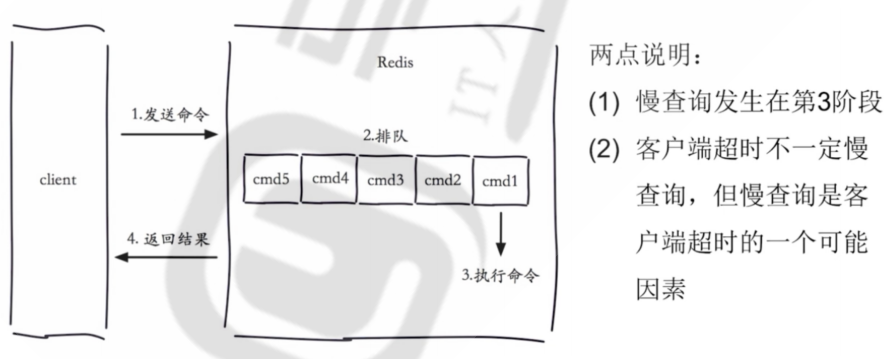

```bash
[root@centos8 ~]#vim /etc/redis.conf
slowlog-log-slower-than 1    #指定为超过1us即为慢的指令，默认值为10000us
slowlog-max-len 1024         #指定保存1024条慢记录，默认值为128
127.0.0.1:6379> SLOWLOG LEN  #查看慢日志的记录条数
(integer) 14
127.0.0.1:6379> SLOWLOG GET [n] #查看慢日志的n条记录
127.0.0.1:6379> SLOWLOG RESET #清空慢日志

```

### redis持久化

Redis 虽然是一个内存级别的缓存程序，也就是redis 是使用内存进行数据的缓存的，但是其可以将内存的数据按照一定的策略保存到硬盘上，从而实现数据持久保存的目的，实现redis持久化有两种方式，分别是RDB和AOF

#### RDB模式

原理：

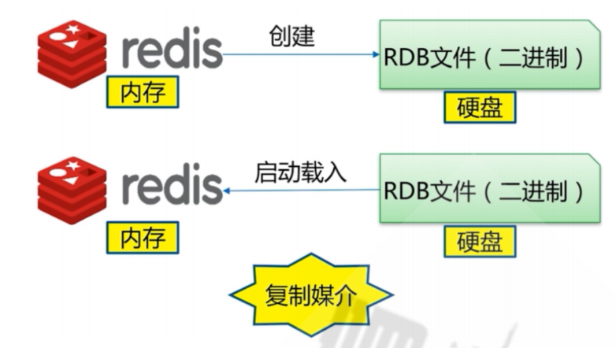

RDB是基于时间的快照，默认只保留当前最新的一次快照，特点是速度快，缺点是可能丢失快照数据

具体实现过程:

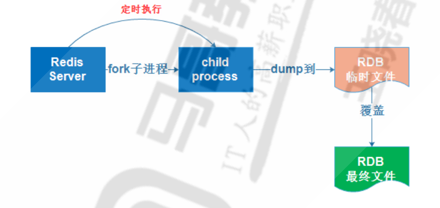

RDB相关配置

```bash
save 900 1         #900s内修改了1个key即触发保存RDB
save 300 10        #300s内修改了10个key即触发保存RDB
save 60 10000      #60s内修改了10000个key即触发保存RDB
dbfilename dump.rdb
dir ./             #编泽编译安装,默认RDB文件存放在启动redis的工作目录,建议明确指定存入目录
stop-writes-on-bgsave-error yes
rdbcompression yes
rdbchecksum yes
```

实现RDB的方式

save: 同步,会阻赛其它命令,不推荐使用

bgsave: 异步后台执行,不影响其它命令的执行

自动: 制定规则,自动执行

手动备份RDB文件的脚本

```bash
#配置文件
[root@centos7 ~]#vim /apps/redis/etc/redis.conf
save ""
dbfilename dump_6379.rdb
dir "/data/redis"
appendonly no 

#脚本内容
#!/bin/bash
BACKUP=/backup/redis-rdb
DIR=/apps/redis/data  #yum安装文件在/var/lib/redis/dump.rdb
FILE=dump.rdb
PASS=123456

color () {
    RES_COL=60
    MOVE_TO_COL="echo -en \\033[${RES_COL}G"
    SETCOLOR_SUCCESS="echo -en \\033[1;32m"
    SETCOLOR_FAILURE="echo -en \\033[1;31m"
    SETCOLOR_WARNING="echo -en \\033[1;33m"
    SETCOLOR_NORMAL="echo -en \E[0m"
    echo -n "$1" && $MOVE_TO_COL
    echo -n "["
    if [ $2 = "success" -o $2 = "0" ] ;then
        ${SETCOLOR_SUCCESS}
        echo -n $"  OK  "    
    elif [ $2 = "failure" -o $2 = "1"  ] ;then 
        ${SETCOLOR_FAILURE}
        echo -n $"FAILED"
    else
        ${SETCOLOR_WARNING}
        echo -n $"WARNING"
    fi
    ${SETCOLOR_NORMAL}
    echo -n "]"
    echo 
}

redis-cli -h 127.0.0.1 -a $PASS --no-auth-warning  bgsave 
result=`redis-cli -a $PASS --no-auth-warning info Persistence |grep rdb_bgsave_in_progress| sed -rn 's/.*:([0-9]+).*/\1/p'`
until  [ $result -eq 0 ] ;do
    sleep 1
    result=`redis-cli -a $PASS --no-auth-warning info Persistence |grep rdb_bgsave_in_progress| sed -rn 's/.*:([0-9]+).*/\1/p'`
done
DATE=`date +%F_%H-%M-%S`

[ -e $BACKUP ] || { mkdir -p $BACKUP ; chown -R redis.redis $BACKUP; }
cp $DIR/$FILE $BACKUP/dump_6379-${DATE}.rdb

color "Backup redis RDB" 0
#执行脚本
ll /backup/redis-rdb.rdb/ -h
```

观察save和bgsave的执行过程：

`(redis-cli -a 123456 save &) ; echo save is finished; rediscli -a 123456 get class `

自动保存：

```bash
vim /etc/redis.conf
save 60 3
#测试60s内修改3个key,验证是否生成RDB文件
```

#### AOF模式

工作原理：


AOF：appendonlyfile，按照操作顺序一次将操作追加到指定的日志文件末尾。

AOF模式默认是关闭的，第一次开启AOF后，并重启服务后，会因为AOF的有限级高于RDB，而AOF默认没有数据文件存在，从而导致数据丢失。

```bash
#redis-cli进入redis利用dasize进行查询数据量的大小
#模拟误开启AOF
vim /etc/redis.conf
appendonly yes #yes开启，no关闭也可在redis中执行config set appendonly no进行动态修改
重启redis再次进入查看发现数据量已经被清

```

正确开启AOF功能防止数据丢失

```bash
#首先查看redis文件中的镜像文件
ll /var/lib/redis
config set appendonly yes #自动触发AOF重写,会自动备份所有数据到AOF文件
#查看redis文件目录
[root@redis16 ~]# ll /var/lib/redis/
total 4
-rw-r--r--. 1 redis redis    0 Nov 18 19:20 appendonly.aof
-rw-r--r--. 1 redis redis 1582 Nov 18 19:23 dump.rdb


```

AOF相关配置

```bash
appendonly no #是否开启AOF日志记录，默认redis使用的是rdb方式持久化，这种方式在许多应用中已经
#足够用了，但是redis如果中途宕机，会导致可能有几分钟的数据丢失(取决于dump数据的间隔时间)，根据
#save来策略进行持久化，Append Only File是另一种持久化方式，可以提供更好的持久化特性，Redis会
#把每次写入的数据在接收后都写入 appendonly.aof 文件，每次启动时Redis都会先把这个文件的数据读入
#内存里，先忽略RDB文件。默认不启用此功能

appendfilename "appendonly.aof" #文本文件AOF的文件名，存放在dir指令指定的目录中

appendfsync everysec #aof持久化策略的配置
#no表示由操作系统保证数据同步到磁盘,Linux的默认fsync策略是30秒，最多会丢失30s的数据
#always表示每次写入都执行fsync，以保证数据同步到磁盘,安全性高,性能较差
#everysec表示每秒执行一次fsync，可能会导致丢失这1s数据,此为默认值,也生产建议值
dir /path

#rewrite相关
no-appendfsync-on-rewrite yes
auto-aof-rewrite-percentage 100
auto-aof-rewrite-min-size 64mb
aof-load-truncated yes
#动态修改配置自动生长appendonly.aof文件
127.0.0.1:6379> CONFIG set appendonly yes

```

#### AOF rewirte重写

将一些重复的,可以合并的,过期的数据重新写入一个新的AOF文件,从而节约AOF备份占用的硬盘空间,也能加速恢复过程，可以手动执行bgrewriteaof 触发AOF,第一次开启AOF功能,或定义自动rewrite 策略

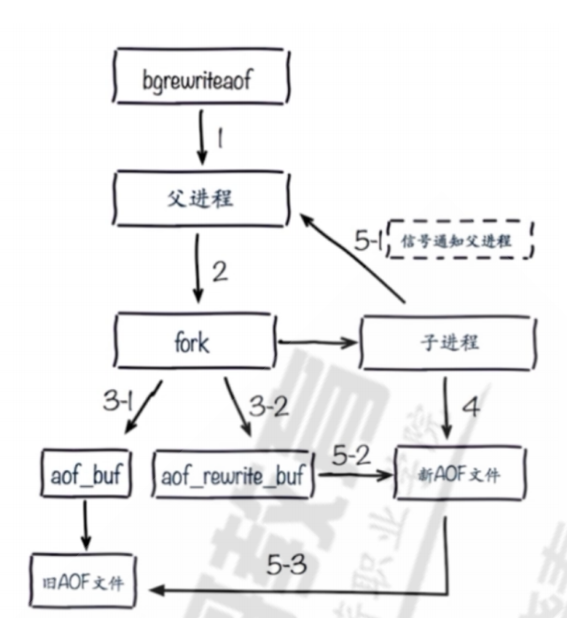

AOF重写配置

```bash
#同时在执行bgrewriteaof操作和主进程写aof文件的操作，两者都会操作磁盘，而bgrewriteaof往往会
涉及大量磁盘操作，这样就会造成主进程在写aof文件的时候出现阻塞的情形,以下参数实现控制
no-appendfsync-on-rewrite no #在aof rewrite期间,是否对aof新记录的append暂缓使用文件同步
策略,主要考虑磁盘IO开支和请求阻塞时间。
#默认为no,表示"不暂缓",新的aof记录仍然会被立即同步到磁盘，是最安全的方式，不会丢失数据，但是要
忍受阻塞的问题
#为yes,相当于将appendfsync设置为no，这说明并没有执行磁盘操作，只是写入了缓冲区，因此这样并不
会造成阻塞（因为没有竞争磁盘），但是如果这个时候redis挂掉，就会丢失数据。丢失多少数据呢？Linux
的默认fsync策略是30秒，最多会丢失30s的数据,但由于yes性能较好而且会避免出现阻塞因此比较推荐

#rewrite 即对aof文件进行整理,将空闲空间回收,从而可以减少恢复数据时间
auto-aof-rewrite-percentage 100 #当Aof log增长超过指定百分比例时，重写AOF文件，设置为0表示不自动重写Aof日志，重写是为了使aof体积保持最小，但是还可以确保保存最完整的数据
auto-aof-rewrite-min-size 64mb #触发aof rewrite的最小文件大小
aof-load-truncated yes #是否加载由于某些原因导致的末尾异常的AOF文件(主进程被kill/断电等)，建议yes
```

手动执行AOF重写bgrewriteaof命令：

`BGREWRITEAOF
时间复杂度： O(N)， N 为要追加到 AOF 文件中的数据数量。
执行一个 AOF文件 重写操作。重写会创建一个当前 AOF 文件的体积优化版本。`

缺点：即使有些操作是重复的也会全部记录，AOF 的文件大小要大于 RDB 格式的文件

AOF 在恢复大数据集时的速度比 RDB 的恢复速度要慢

根据fsync策略不同,AOF速度可能会慢于RDB

bug 出现的可能性更多

**怎么选择两种方式**：如果主要充当缓存功能,或者可以承受数分钟数据的丢失, 通常生产环境一般只需启用RDB即可,此也是默认值如果数据需要持久保存,一点不能丢失,可以选择同时开启RDB和AOF一般不建议只开启AOF

## redis常用命令

```bash
INFO  #显示当前节点redis运行状态信息
select #切换数据库，相当于mysql中的use dbname指令
#注意：在redis cluster模式下不支持多个数据库，会出现以下错误
[root@centos8 ~]#redis-cli 
127.0.0.1:6379> info cluster
# Cluster
cluster_enabled:1
127.0.0.1:6379> select 0
OK
127.0.0.1:6379> select 1
(error) ERR SELECT is not allowed in cluster mode
key #查看当前库下所有key，慎用
bgsave #手动在后台执行RDB持久化操作
#交互式操作
127.0.0.1:6379> bgsave
#非交互式操作
redis-cli -h 127.0.0.1 -a '123456' BGSAVE
dbsize  #返回当前库下的所有key数量
flushdb #强制清空当前库中的所有key，慎用
flushall #强制清空当前redis服务器所有数据库中的key，即删除所有数据，慎用
shutdown #关机。停止所有客户端
#如果有至少一个保存点在等待，执行 SAVE 命令
#如果 AOF 选项被打开，更新 AOF 文件
#关闭 redis 服务器(server)
#如果持久化被打开的话， SHUTDOWN 命令会保证服务器正常关闭而不丢失任何数据。
#另一方面，假如只是单纯地执行 SAVE 命令，然后再执行 QUIT 命令，则没有这一保证 —— 因为在执行
#SAVE 之后、执行 QUIT 之前的这段时间中间，其他客户端可能正在和服务器进行通讯，这时如果执行 QUIT 就会造成数据丢失。


```

## redis数据类型

字符串string

字符串是所有编程语言中最常见的和最常用的数据类型，而且也是redis最基本的数据类型之一，而且redis 中所有的 key 的类型都是字符串。常用于保存 Session 信息场景

| 命令            | 含义            |
| ------------- | ------------- |
| set key value | 设置key-value   |
| get key       | 获取key-value   |
| del key       | 删除key-value   |
| setnx setxx   | 根据key是否存在设置   |
| incr decr     | 计数            |
| mget mset     | 批量操作key-value |

添加一个key：`set key value [EX seconds] [PX millisecond] [NX|XX]`

```bash
如果 key 已经持有其他值， SET 就覆写旧值， 无视类型。
当 SET 命令对一个带有生存时间（TTL）的键进行设置之后， 该键原有的 TTL 将被清除。

从 Redis 2.6.12 版本开始， SET 命令的行为可以通过一系列参数来修改：
EX seconds:将键的过期时间设置为 seconds 秒。 执行 SET key value EX seconds 的效果等同于执行 SETEX key seconds value 。
PX milliseconds:将键的过期时间设置为 milliseconds 毫秒。 执行 SET key value PX 
milliseconds的效果等同于执行 PSETEX key milliseconds value 。
NX:只在键不存在时， 才对键进行设置操作。 执行 SET key value NX 的效果等同于执行 SETNX key value 。
XX:只在键已经存在时， 才对键进行设置操作。

```

示例

```bash
#不论key是否存在，都设置
127.0.0.1:6379> set key1 value1
OK
127.0.0.1:6379> get key1
"value1"
127.0.0.1:6379> TYPE key1  #判断类型
string
127.0.0.1:6379> SET title ceo ex 3 #设置自动过期时间3s
OK
127.0.0.1:6379> set NAME wang
OK
127.0.0.1:6379> get NAME
"wang" 
#大小写敏感
127.0.0.1:6379> get name
(nil)
127.0.0.1:6379> set name mage
OK
127.0.0.1:6379> get name
"mage"
127.0.0.1:6379> get NAME
"wang" #键值大小写代表着不同的键值
#key不存在,才设置,相当于add 
127.0.0.1:6379> get title
"ceo"
127.0.0.1:6379> setnx title coo  #set key value nx
(integer) 0
127.0.0.1:6379> get title
"ceo"
#key存在,才设置,相当于update
127.0.0.1:6379> get title
"ceo"
127.0.0.1:6379> set title coo xx
OK
127.0.0.1:6379> get title
"coo"
127.0.0.1:6379> get age
(nil)
127.0.0.1:6379> set age 20 xx
(nil)
127.0.0.1:6379> get age
(nil)

```

获取一个键值：`get  键值名`  删除一个或多个键值：`del 键值1  键值2`   批量设置多个键值：`mset 键值  要设置的值 键值2 要设置的值`  批量获取多个key：`mset 键值1  键值2`  查看指定n开头的键值：`keys  n*`   追加数据：`append key1 "要添加的值"`    设置新值并返回旧值：`getset 键名 设置的值`   返回字符串键值对应值的字节数：`strlen 键名`    判断key是否存在：`exists 键值名 # 返回值为1,表示存在2个key,0表示不存在`
查看key的过期时间：`ttl key #查看key的剩余生存时间,如果key过期后,会自动删除  -1 #返回值表示永不过期，默认创建的key是永不过期，重新对key赋值，也会从有剩余生命周期变成永不过期-2 #返回值表示没有此key num #key的剩余有效期`   重新设置key过期时间：`expire name num`   取消过期时间(永不过期)：`persist name`

数值操作：递增：首先给键值设置一个初始值执行`incr num` 对其进行自增
递减：`decr num`  增加：`incrby 键名 数值 将key对应的数字加decrement(可以是负数)。如果key不存在，操作之前，key就会被置为0。如果key的value类型错误或者是个不能表示成数字的字符串，就返回错误。这个操作最多支持64位有符号的正型数字。`   减少：`decrby 键名 num`  decrby可减少也可以增加

### 列表

列表是一个双向可读写的管道，头部试左侧，尾部是右侧一个列表最多可以包含2^32-1（4294967295）个元素，下标 0 表示列表的第一个元素，以 1 表示列表的第二个元素，以此类推。 也可以使用负数下标，以 -1 表示列表的最后一个元素， -2 表示列表的倒数第二个元素，元素值可以重
复，常用于存入日志等场景，此数据类型比较常用特点：有序、可重复、左右都可操作。

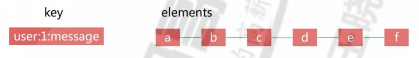

#### 生成列表并插入数据

lpush和rpush都可以插入列表

```bash
lpush key value [value ..]
如果有多个 value 值，那么各个 value 值按从左到右的顺序依次插入到表头： 比如说，对空列表
mylist 执行命令 LPUSH mylist a b c ，列表的值将是 c b a ，这等同于原子性地执行 LPUSH 
mylist a 、 LPUSH mylist b 和 LPUSH mylist c 三个命令。

如果 key 不存在，一个空列表会被创建并执行 LPUSH 操作。
当 key 存在但不是列表类型时，返回一个错误。

RPUSH key value [value …]
时间复杂度： O(1)
将一个或多个值 value 插入到列表 key 的表尾(最右边)。

如果有多个 value 值，那么各个 value 值按从左到右的顺序依次插入到表尾：比如对一个空列表 mylist 
执行 RPUSH mylist a b c ，得出的结果列表为 a b c ，等同于执行命令 RPUSH mylist a 、
RPUSH mylist b 、 RPUSH mylist c 。

如果 key 不存在，一个空列表会被创建并执行 RPUSH 操作。
当 key 存在但不是列表类型时，返回一个错误
#从左边添加数据，已添加的需向右移
127.0.0.1:6379> LPUSH name mage wang zhang  #根据顺序逐个写入name，最后的zhang会在列表的最左侧。
(integer) 3
127.0.0.1:6379> TYPE name
list
#从右边添加数据
127.0.0.1:6379> RPUSH course linux python go
(integer) 3
127.0.0.1:6379> type course
list
#向列表中追加数据
lpush 表名 内容
#从右边添加数据，已添加的向左移
127.0.0.1:6379> RPUSH list1 jack
(integer) 3

```

获取列表长度：`llen 表名`

#### 获取列表指定位置数据

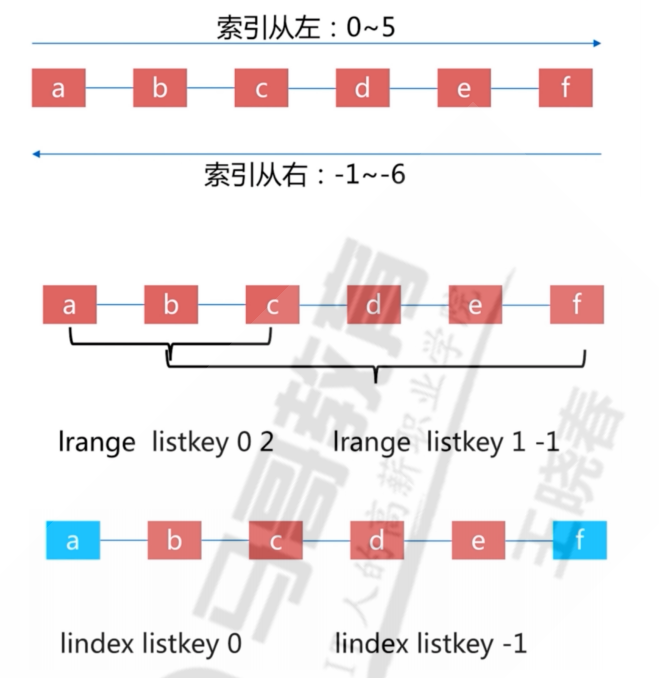

```bash
#获取某个编号的元素
lindex 表名 编号
#获取最后一个元素
lindex 表明 -1
#查看所有元素
lindex 表名  0  3
lrange 表名 0  -1
#指定范围
lrange  表名 num  num（范围）
```

#### 修改了列表指定索引值

```bash
lset 表名 指定编号 要更改的元素
```

#### 移除列表数据

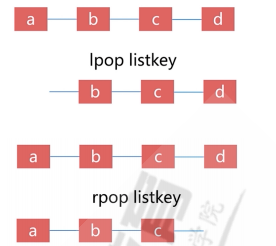

```bash
lpop 表名 #删除左边第一个
rpop 表名 #删除右边第一个
ltrim 表名 1 2 只保留1，2元素#LTRIM 对一个列表进行修剪(trim)，让列表只保留指定区间内的元素，不在指定区间之内的元素都将被删除
#删除列表
del 表名
exists 表名
```

### 集合set


set试string类型的无需集合，集合中成员是唯一的。

特点：无序、无重复、集合间操作

```bash
#生成集合key
sadd name 数值 #创建一个集合并对其进行赋值
#追加数值（追加只能追加不存在的数值，已存在的数值不能进行追加）
sadd name 数值
#查看所有集合中的所有数值
smembers name
#删除集合中的数值
srem name 要删除元素
```

### 列表集合之间操作

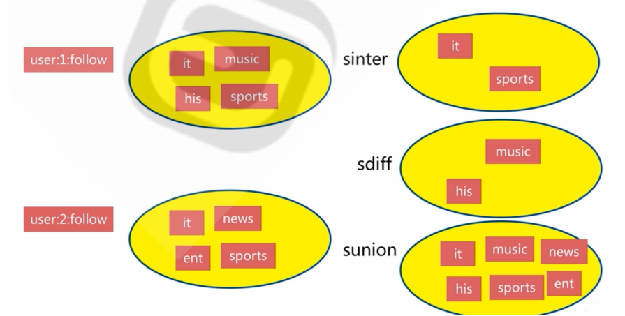

```bash
#获取两个集合的交集
 SINTER set1 set2
#获取集合的并集
 SUNION set1 set2
#获取集合的差集
 sdiff set1 set2

```

### 有序集合sorted set

Redis 有序集合和集合一样也是string类型元素的集合,且不允许重复的成员，不同的是每个元素都会关联一个double(双精度浮点型)类型的分数，redis正是通过该分来为集合中的成员进行从小到大的排序，有序集合的成员是唯一的,但分数(score)却可以重复，集合是通过哈希表实现的，所以添加，删除，查找的复杂度都是O(1)， 集合中最大的成员数为 2^32 - 1 (4294967295, 每个集合可存储40多亿个成员)，经常用于排行榜的场景

特点：有序、无重复元素、每个元素是由score（可以重复）和value（不可以重复）组成

```bash
#生成有序集合
127.0.0.1:6379> ZADD zset1 socre 元素  #分数为1
(integer) 1
127.0.0.1:6379> ZADD zset1 2 v2
(integer) 1
127.0.0.1:6379> ZADD zset1 2 v3  #分数可重复，元素值不可以重复
(integer) 1
#一次生成多个数据：
127.0.0.1:6379> ZADD zset2 1 v1 2 v2 3 v3 4 v4 5 v5
(integer) 5
127.0.0.1:6379> ZRANGE paihangbang 0 -1  #正序排序后显示集合内所有的key,score从小到大显示
127.0.0.1:6379> ZREVRANGE paihangbang 0 -1 #倒序排序后显示集合内所有的key,score从大到、小显示
127.0.0.1:6379> ZRANGE paihangbang 0 -1 WITHSCORES  #正序显示指定集合内所有key和得分情况
127.0.0.1:6379> ZREVRANGE paihangbang 0 -1 WITHSCORES  #倒序显示指定集合内所有key和得分情况
#获取集合个数
zcard 集合名
#基于索引返回数值
zarange 集合 0 2 #超出范围不报错
#返回某个数值的索引
zrank 集合名 元素
#获取分数
zscore 集合名 元素名
#删除元素
zrem 集合名 要删除的元素名
```

### 哈希hash

hash 即字典, 是一个string类型的字段(field)和值(value)的映射表，Redis 中每个 hash 可以存储 2^32 -1 键值对，类似于字典，存放了多个k/v 对，hash特别适合用于存储对象场景

特点：无序、k/v对、适用于存放相关的数据

相关命令：hget hset hdel 、hexists、hincrby、hgetall hvals  hkeys 、hmget hmset

```bash
#生成hash key
HSET hash field value
将哈希表 hash 中域 field 的值设置为 value 。
如果给定的哈希表并不存在， 那么一个新的哈希表将被创建并执行 HSET 操作。
如果域 field 已经存在于哈希表中， 那么它的旧值将被新值 value 覆盖
hset 表明 要输入的数值
127.0.0.1:6379> hset cat name luo age 23
(integer) 2
#查看所有字段的值
hgetall 表名
#增加字段
hset name 要增加的数值
#获取hash key的对应字段的值
hmget 表名 值名
#删除一个hash key的对应字段
hdel 表名 要删除的数值
#批量设置hash key的多个field和value
127.0.0.1:6379> HMSET 9527 name zhouxingxing age 50 city hongkong
OK
#获取hash中指定字段的值
127.0.0.1:6379> HMGET 9527 name age 
#获取hash中的所有字段名field（不包括字段注释）
hkeys 表名
#获取hash key对应所有field的value
hvals 表名
#获取指定hash key的所有field及value
hgetall 表名
#删除hash
del 表名
#查看hash表的数据量
exists 表名


```

## 消息队列

把要传输的数据放在队列中
功能: 可以实现多个系统之间的解耦,异步,削峰/限流等常用的消息队列应用: Kafka,RabbitMQ,Redis&#x20;

模式主要分为以下两种：生产者/消费者、发布者/订阅者

#### 生产者/消费者

生产者消费者模式下，多个消费者同时监听一个队列，但是一个消息只能被最先抢到消息的消费者消费，即消息任务是一次性读取和处理，此模式在分布式业务架构中很常用，比较常用的消息队列软件还有RabbitMQ、Kafka、RocketMQ、ActiveMQ等。

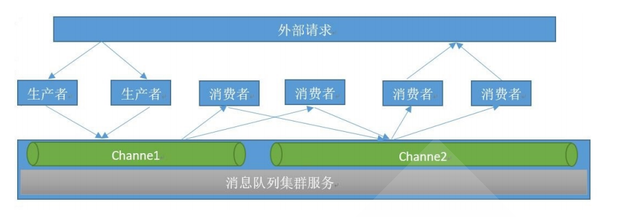

#### 队列介绍

#### 生产者/消费者

队列当中的消息由不同的生产者写入，也会有不同的消费者取出进行消费处理，但是一个消息一定是只能被取出一次也就是被消费一次

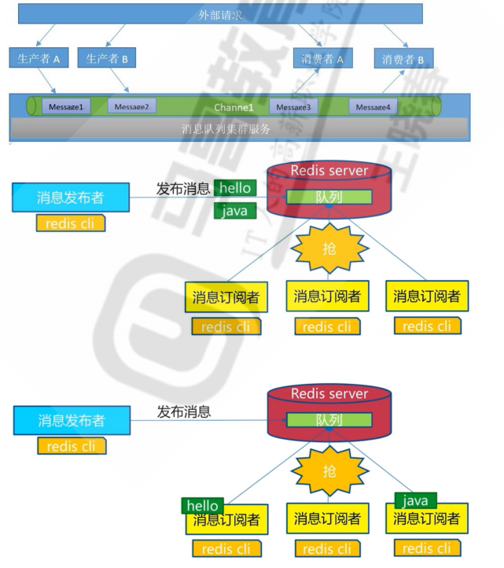

```bash
#生产者发布信息
lpush name 元素 #从管道左侧插入
#查看队列信息 
lrange name 0 -1
#消费者进行消费信息
rpop name #从管道右侧消费，用于消息得先进先出
#消费完再次进心查看队列信息
127.0.0.1:6379> lrange chan 0 -1
(empty list or set)

```

#### 发布者/订阅者模式

在发布者订阅者模式下，发布者将消息发布到指定的channel里面，凡是监听该channel的消费者都会收
到同样的一份消息，这种模式类似于是收音机的广播模式，即凡是收听某个频道的听众都会收到主持人
发布的相同的消息内容。此模式常用语群聊天、群通知、群公告等场景

Publisher：发布者
Subscriber：订阅者
Channel：频道

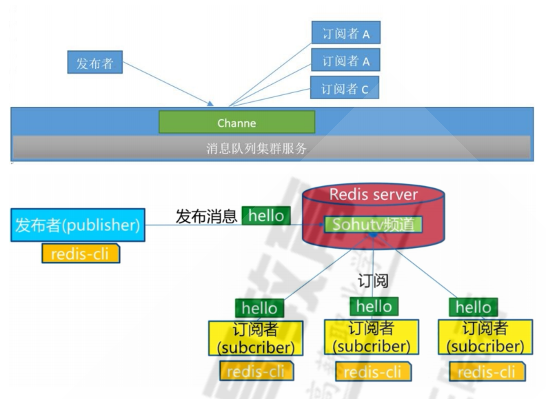

```bash
#订阅者订阅频道
127.0.0.1:6379> SUBSCRIBE channel1 #订阅者事先订阅指定的频道，之后发布的消息才能收到
Reading messages... (press Ctrl-C to quit)
1) "subscribe"
2) "channel1"
3) (integer) 1
#发布者发布信息
127.0.0.1:6379> PUBLISH channel1 test1 #发布者发布消息
(integer) 2   #订阅者个数
#订阅指定的多个频道
127.0.0.1:6379> SUBSCRIBE channel1 channel2
127.0.0.1:6379> PSUBSCRIBE *  #支持通配符*
127.0.0.1:6379> PSUBSCRIBE chann* #匹配订阅多个频道
#取消订阅
127.0.0.1:6379> unsubscribe channel1

```
