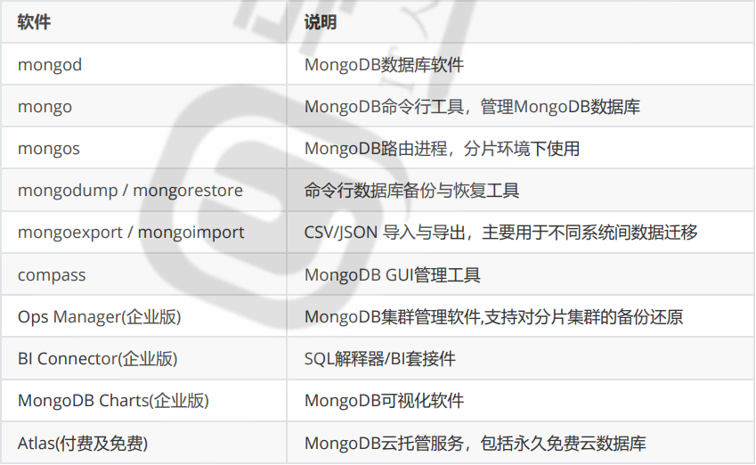

# mangodb

## 目录

-   [mangodb主要用途及特点](#mangodb主要用途及特点)
    -   [用途：](#用途)
    -   [特点：](#特点)
    -   [缺点：](#缺点)
-   [逻辑结构](#逻辑结构)
-   [常见框架](#常见框架)
-   [mongoDb相关工具及应用](#mongoDb相关工具及应用)
-   [mongodb安装方式](#mongodb安装方式)
    -   [二进制安装](#二进制安装)
    -   [客户端链接](#客户端链接)
    -   [mogosh](#mogosh)
-   [mongodb管理](#mongodb管理)
    -   [命令种类：](#命令种类)
        -   [库的操作](#库的操作)
        -   [集合（表）的操作](#集合表的操作)

## mangodb主要用途及特点

#### 用途：

应用数据库，比如：存储银行，保险公司流水信息，类似于Oracle,MySQL海量数据处理，大数据分析

网站数据、缓存等大尺寸、低价值的数据

在高伸缩性的场景，用于对象及JSON数据的存储。

#### 特点：

灵活动态的文档建模

JSON数据模型比较适合开发者

支持高可用

水平扩展可以支撑很大数据量和并发

存储空间占用相对关系型数据库会小很多

#### 缺点：

多表关联： 仅仅支持Left Outer Join

SQL 语句支持： 查询为主，部分支持

多表原子事务： 不支持

多文档原子事务：不支持

16MB 文档大小限制，不支持中文排序

服务端 Javascript 性能欠佳

## 逻辑结构


| mysql逻辑结构   | mangodb逻辑结构        |
| ----------- | ------------------ |
| 库：database  | 库：database         |
| 表：table     | 集合：collection      |
| 记录;record   | 文档：document        |
| 列：column    | 键：key              |
| primary key | 主键（mangodb提供为\_id） |
| 字段值：value   | 值：value            |

## 常见框架


## mongoDb相关工具及应用



## mongodb安装方式

基于rpm/deb进行安装

centos

```bash
cat > /etc/yum.repos.d/mongodb-org-5.0.repo <<EOF
[mongodb-org-5.0]
name=MongoDB Repository
baseurl=https://repo.mongodb.org/yum/redhat/\$releasever/mongodb-org/5.0/x86_64/
gpgcheck=1
enabled=1
gpgkey=https://www.mongodb.org/static/pgp/server-5.0.asc
EOF

#安装最新版
yum install -y mongodb-org

#安装指定版本
yum install -y mongodb-org-5.0.2 mongodb-org-database-5.0.2 mongodb-org-server5.0.2 mongodb-org-shell-5.0.2 mongodb-org-mongos-5.0.2 mongodb-org-tools-5.0.2
```

ubuntu安装

```bash
#导入公钥
wget -qO - https://www.mongodb.org/static/pgp/server-5.0.asc | sudo apt-key add -

#配置仓库文件
#基于Ubuntu20.04
echo "deb [ arch=amd64,arm64 ] https://repo.mongodb.org/apt/ubuntu 
focal/mongodb-org/5.0 multiverse" | sudo tee /etc/apt/sources.list.d/mongodborg-5.0.list

#基于Ubuntu18.04
echo "deb [ arch=amd64,arm64 ] https://repo.mongodb.org/apt/ubuntu 
bionic/mongodb-org/5.0 multiverse" | sudo tee /etc/apt/sources.list.d/mongodborg-5.0.list

#更新索引
sudo apt-get update

#安装最新版本
sudo apt-get install -y mongodb-org

#安装指定版本
sudo apt-get install -y mongodb-org=5.0.2 mongodb-org-database=5.0.2 mongodborg-server=5.0.2 mongodb-org-shell=5.0.2 mongodb-org-mongos=5.0.2 mongodb-orgtools=5.0.2
```

### 二进制安装

```bash
#创建所需用户和组
useradd mongod

#创建mongodb所需目录结构
mkdir -p /mongodb/{conf,data,log}

#创建YAML格式的配置文件,早期3.0版本以前是普通文本格式
cat > /mongodb/conf/mongo.conf <<EOF
#日志相关
systemLog:
 destination: file
 path: "/mongodb/log/mongodb.log"  #日志位置
 logAppend: true                   #追加日志
#数据存储有关
storage:
 dbPath: "/mongodb/data/"            #数据路径的位置
  
#进程控制
processManagement:
 fork : true                         #后台守护进程

#网络配置有关
net:
 port: 27017                         #端口号,默认不配置端口号，是27017
 bindIp: 0.0.0.0                     #监听地址自MongoDB 3.6版本后默认监听在localhost

#安全验证有关配置
security:
 authorization: enabled            #是否打开用户名密码验证,默认此项为关掉
EOF

cat /mongodb/conf/mongo.conf
systemLog:
 destination: file
 path: "mongodb/log/mongodb.log"
 logAppend: true
storage:
 dbPath: "mongodb/data/"
processManagement:
 fork: true
net:
 port: 27017
 bindIp: 0.0.0.0
chown -R mongod.mongod /mongodb/

tar xf mongodb-linux-x86_64-rhel70-v3.6-latest.tgz -C /usr/local
ln -s /usr/local/mongodb-linux-x86_64-rhel70-3.6.23-8-gc2609ed/ 
/usr/local/mongodb

#设置PATH变量
echo PATH=/usr/local/mongodb/bin/:'$PATH' > /etc/profile.d/mongodb.sh
. /etc/profile.d/mongodb.sh
    
#启动
su - mongod
mongod --dbpath /mongodb/data --bind_ip_all --port 27017 --logpath
/mongodb/log/mongod.log --logappend  --fork
mongod -f /mongodb/conf/mongo.conf

#登录mongodb
mongo

#mongodb的关闭方式
mongod -f /mongodb/conf/mongo.conf --shutdown
#mongodb使用systemd管理
cat > /lib/systemd/system/mongod.service <<EOF
[Unit]
Description=mongodb
After=network.target remote-fs.target nss-lookup.target

[Service]
Type=forking
User=mongod
Group=mongod
ExecStart=$INSTALL_DIR/mongodb/bin/mongod --config $MONGODB_DIR/conf/mongo.conf
ExecReload=/bin/kill -s HUP \$MAINPID
ExecStop=$INSTALL_DIR/bin/mongod --config $MONGODB/conf/mongo.conf --shutdown
PrivateTmp=true
# file size
LimitFSIZE=infinity
# cpu time
LimitCPU=infinity
# virtual memory size
LimitAS=infinity
# open files
LimitNOFILE=64000
# processes/threads
LimitNPROC=64000
# locked memory
LimitMEMLOCK=infinity
# total threads (user+kernel)
TasksMax=infinity
TasksAccounting=false
# Recommended limits for mongod as specified in
# https://docs.mongodb.com/manual/reference/ulimit/#recommended-ulimit-settings
[Install]
WantedBy=multi-user.target
EOF

systemctl daemon-reload
systemctl enable --now mongod

```

### 客户端链接

如果需要进入 mongodb 后台管理，可以先打开 mongodb 装目录的下的 bin 目录，然后执行 mongo 命令文件。
MongoDB Shell 是 MongoDB 自带的交互式 Javascript shell，用来对 MongoDB 进行操作和管理的交互式环境。
mongo 是MongoDB早期版本使用的shell工具当mongo进入 mongoDB 后台后，它默认会链接到 test 数据库

执行mongo进入mongo数据库

### mogosh

```bash
#安装mongosh
[root@rocky8 ~]#cat /etc/yum.repos.d/mongosh.repo 
[mongodb-org-5.0]
name=MongoDB Repository
baseurl=https://repo.mongodb.org/yum/redhat/$releasever/mongodb-org/5.0/x86_64/
gpgcheck=1
enabled=1
gpgkey=https://www.mongodb.org/static/pgp/server-5.0.asc

```

## mongodb管理

默认存在的库

admin库:系统预留库，MongoDB系统管理库
local库:本地预留库，存储关键日志
config库:MongoDB配置信息库
test:登录时默认存在的测试库,生产中可以将之删除

### 命令种类：

```bash
#db对象相关命令
show dbs|show databases    #显示数据库,相当于MySQL中的show databases
use <库名>                  #切换数据库
use admin 
> db   #查看当前库相当于MySQL中的select database() 
> db.shutdownServer()  #关闭服务

show collections       #显示表列表,相当于MySQL中的show tables 
show tables
#库级命令
db.[TAB][TAB]
db.help()
#表和文档
db.<collection>.[TAB][TAB]
db.<collection>.help ()
#rs复制集有关（replication set）
rs.[TAB][TAB]
rs.help ()
#sh分片集群
sh.[TAB][TAB]
sh.help ()


```

#### 库的操作

```bash
#use可以自动建库,如果库内没有数据,则不使用时会自动删除库
>use test
#删除当前所在库
>db.dropDatabase()
{ "dropped" : "test", "ok" : 1 }
#可以直接切换至不存在的库
>use testdb1
>db
testdb1

```

#### 集合（表）的操作

```bash
```
