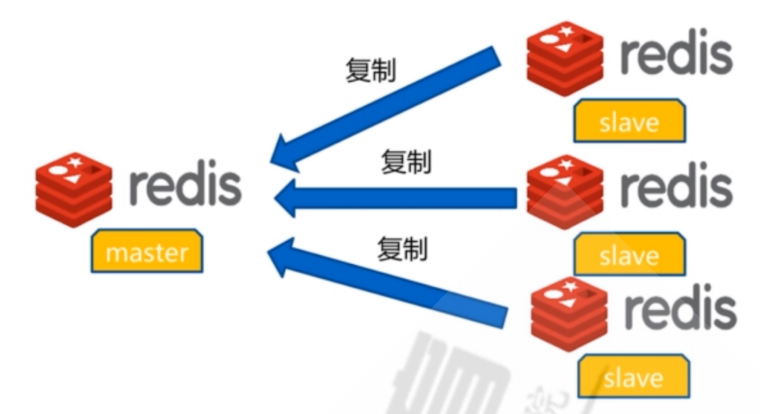
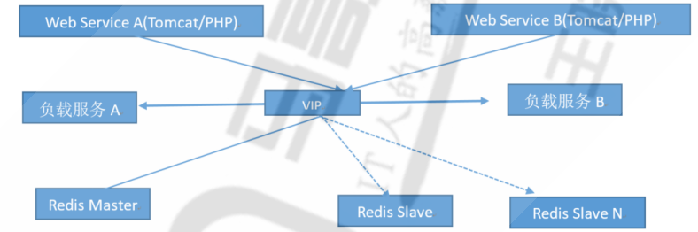
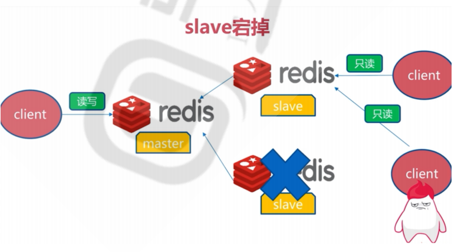
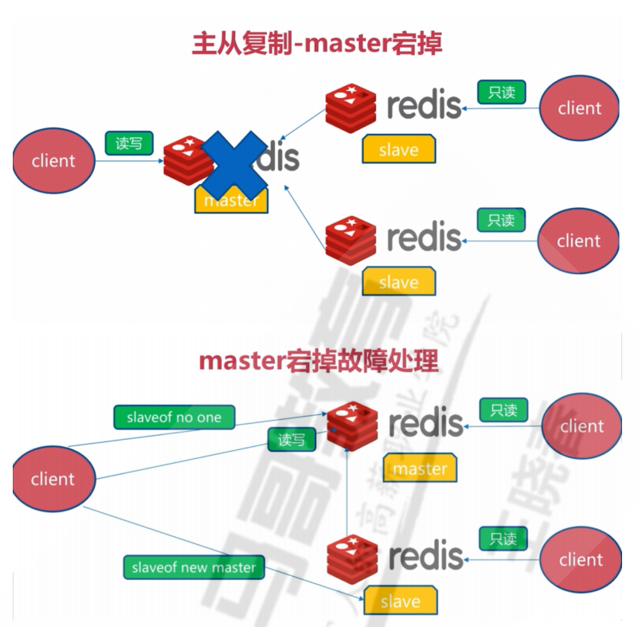
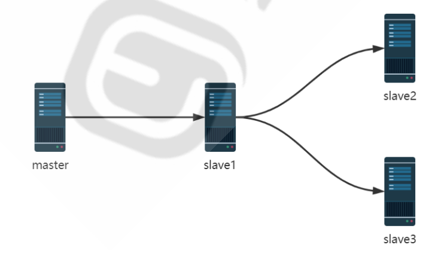

# redis集群和高可用

## 目录

-   [集群背景](#集群背景)
-   [Redis主从复制](#Redis主从复制)
    -   [主从复制架构](#主从复制架构)
        -   [主从复制实现](#主从复制实现)
    -   [主从命令配置](#主从命令配置)
-   [主从复制故障恢复](#主从复制故障恢复)
    -   [主从复制故障恢复实现](#主从复制故障恢复实现)
    -   [实现redis级联复制](#实现redis级联复制)
-   [主从复制优化](#主从复制优化)
    -   [全量复制](#全量复制)

## 集群背景

虽然Redis可以实现单机的数据持久化，但无论是RDB也好或者AOF也好，都解决不了单点宕机问题，即一旦单台 redis服务器本身出现系统故障、硬件故障等问题后，就会直接造成服务停止甚至数据丢失

## Redis主从复制



### 主从复制架构

主从模式（master/slave），可以实现Redis数据的跨主机备份。
程序端连接到高可用负载的VIP，然后连接到负载服务器设置的Redis后端real server，此模式不需要在程序里面配 置Redis服务器的真实IP地址，当后期Redis服务器IP地址发生变更只需要更改redis 相应的后端real server即可， 可避免更改程序中的IP地址设置。



特点：

一个master可以有多个slave
一个slave只能有一个master
数据流向是从master到slave单向的
master 可读可写
slave 只读

#### 主从复制实现

Redis Slave 也要开启持久化并设置和master同样的连接密码，因为后期slave会有提升为master的可能,Slave 端切换master同步后会丢失之前的所有数据,而通过持久化可以恢复数据，一旦某个Slave成为一个master的slave，Redis Slave服务会清空当前redis服务器上的所有数据并将master的数据导入到自己的内存，但是如果只是断开同步关系后,则不会删除当前已经同步过的数据。

为什么要开启持久化操作：

```bash
1.假设节点A为主服务器，并且关闭了持久化。并且节点B和节点C从节点A复制数据
2.节点A崩溃，然后由自动拉起服务重启了节点A.由于节点A的持久化被关闭了，所以重启之后没有任何数据
3.节点B和节点C将从节点A复制数据，但是A的数据是空的，于是就把自身保存的数据副本删除。

```

### 主从命令配置

```bash
#启用主从同步
默认redis 状态为master，需要转换为slave角色并指向master服务器的IP+PORT+Password
在从节点执行 REPLICAOF MASTER_IP PORT 指令可以启用主从同步复制功能,早期版本使用 SLAVEOF 指令
127.0.0.1:6379> REPLICAOF MASTER_IP PORT #新版推荐使用
127.0.0.1:6379> SLAVEOF MasterIP Port   #旧版使用，将被淘汰
127.0.0.1:6379> CONFIG SET masterauth <masterpass>
#master和salve上设置key1以方便观察是否同步成功
使用info replication进行查看服务状态
#在slave上设置master的IP和端口，4.0版之前的指令为slaveof 
127.0.0.1:6379> REPLICAOF 10.0.0.8 6379 #仍可使用SLAVEOF MasterIP Port
OK
#在slave上设置master的密码，才可以同步
127.0.0.1:6379> CONFIG SET masterauth 123456
OK
#查看已经同步成功
127.0.0.1:6379> GET key1
"v1-master"

#在master上可以看到所有slave信息
127.0.0.1:6379> INFO replication
# Replication
role:master
connected_slaves:2
#删除主从同步
#取消复制,在slave上执行REPLICAOF NO ONE,会断开和master的连接不再主从复制, 但不会清除slave上已有的数据
127.0.0.1:6379> REPLICAOF no one
salve只可读而无法写入数据
127.0.0.1:6379> set key1 v1-slave
(error) READONLY You can't write against a read only replica
#修改salve节点配置文件
[root@centos8 ~]#vim /etc/redis.conf 
 .......
# replicaof <masterip> <masterport>
replicaof 10.0.0.8 6379 #指定master的IP和端口号
# If the master is password protected (using the "requirepass" configuration
# directive below) it is possible to tell the replica to authenticate before
# starting the replication synchronization process, otherwise the master will
# refuse the replica request.

# masterauth <master-password>
masterauth 123456     #如果密码需要设置
.......
[root@centos8 ~]#systemctl restart redis


```

## 主从复制故障恢复

当 slave 节点故障时，将Redis Client指向另一个 slave 节点即可,并及时修复故障从节点



如果master节点故障，需要提升salve为新的master节点

Master的切换会导致master\_replid发生变化，slave之前的master\_replid就和当前master不一致从而会引发所有 slave的全量同步。



#### 主从复制故障恢复实现

```bash
工作原理: 当主节点master宕机以后，salve节点进行选举，断开主节点链接
自己当作master节点，让其他salve节点进行链接
```

### 实现redis级联复制



```bash
原有主从节点不变，salve指向中间从节点，salve执行replicaof host post
config set mastersuth 密码进行指向slave
查看中间salve状态
127.0.0.1:6379> INFO replication
# Replication
role:slave
master_host:10.0.0.8
master_port:6379
master_link_status:up
master_last_io_seconds_ago:8 #最近一次与master通信已经过去多少秒。
master_sync_in_progress:0  #是否正在与master通信。
slave_repl_offset:4312  #当前同步的偏移量
slave_priority:100   #slave优先级，master故障后值越小越优先同步。
slave_read_only:1
connected_slaves:1
slave0:ip=10.0.0.28,port=6379,state=online,offset=4312,lag=0 #slave的slave节点
master_replid:8e8279e461fdf0f1a3464ef768675149ad4b54a3
master_replid2:0000000000000000000000000000000000000000
master_repl_offset:4312
second_repl_offset:-1
repl_backlog_active:1
repl_backlog_size:1048576
repl_backlog_first_byte_offset:1


```

## 主从复制优化

主从复制分为全量同步和增量同步

### 全量复制

p98
