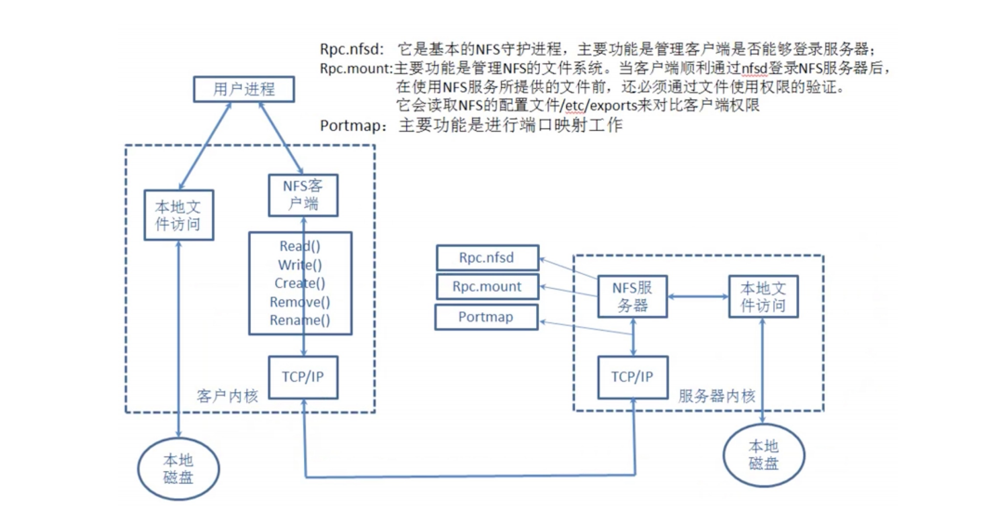

# NFS网络文件系统实战

## 目录

-   [什么是NFS](#什么是NFS)
-   [能干什么](#能干什么)
-   [NFS实现原理](#NFS实现原理)
-   [NFS服务实践](#NFS服务实践)
    -   [环境准备](#环境准备)
    -   [服务端操作](#服务端操作)
    -   [客户端操作](#客户端操作)
    -   [NFS配置详解](#NFS配置详解)
        -   [验证ro权限](#验证ro权限)
    -   [验证all\_squash权限](#验证all_squash权限)
-   [总结](#总结)

# 什么是NFS

network file system的缩写及网络文件系统（通常称为共享存储）

# 能干什么

主要功能是通过“局域网”让不同主机系统之间可以共享目录

# NFS实现原理



本地文件操作方式：

1.当用户执行mkdir命令，bashshell无法宛城该命令会将其翻译给内核

1.内核解析完成后会驱动对应磁盘设备，完成创建目录的操作

nfs创建文件方式

1.NFS客户端执行增、删等操作，客户端会使用不同的函数对该操作进行封装。
2.NFS客户端会通过TCP/IP的方式传递给NFs服务端。
3.NFS服务端接收到请求后，会先调用portmap进程进行端口映射。
4.nfsd进程用于判断NFs客户端是否拥有权限连接NFs服务端。
5.Rpc.mount进程判断客户端是否有对应的权限进行验证。
6.idmap进程实现用户映射和压缩。
7.最后NFs服务端会将客户端的函数转换为本地能执行的命令，由内核驱动硬件完成操作。

> 📌rpc是一个远程过程调用，那么使用nfs就必须有rpc服务

# NFS服务实践

## 环境准备

| 服务器系统  | 角色  | 外网IP      | 内网IP        |
| ------ | --- | --------- | ----------- |
| centos | 服务端 | 10.0.0.32 | 172.16.1.32 |
| centos | 客户端 | 10.0.0.31 | 172.16.1.31 |

## 服务端操作

安装：yum install nfs-utils -y

配置：配置nfs服务，nfs服务程序的配置文件为/etc/exports。需要按照：共享目录的路径 允许访问的NFS客户端（共享权限参数）书写，

| 配置语法 | /data   | 172.16.1.0/24 | (rw,sync,all\_squash) |
| ---- | ------- | ------------- | --------------------- |
| 语法含义 | NFS共享目录 | NFS客户端地址      | （参数.。。。。）             |

将nfs服务端的/data目录共享给172.16.1.0/24网段内的所有主机

1.所有客户端主机都拥有读写权限

2.在将数据写入到NFS服务器的硬盘中后才会结束操作，最大限度保证数据不丢失

3.将所有用户映射为本地的匿名用户（nfsnobody）

```bash
vim /etc/exports
/data  172.16.1.0/24(rw,sync,all_squash)
```

服务端初始化

初始化服务

```bash
mkdir /data  #建立需要共享的目录
chown -R nfsnobody.nfsnobosy /data  #为对应目录设置权限
systemctl enable nfs-server  #将nfs服务加入卡机自启动
systemctl restart nfs-server #重启nfs服务
```

## 客户端操作

挂载：使用showmount查询NFS服务器的远程共享信息，之后使用mount进行挂载

```bash
yum install nfs-untils  #安装nfs服务
showmount -e 172.16.1.32  #查看远程服务端可以挂载的nfs信息
mkdir /nfsdir  #创建挂载目录
mount -t nfs 172.16.1.32:/data /nfsdir  #挂载nfs远程服务
df -h  #查看挂载信息
vim  /etc/fstab  #将远程服务信息写入文件进行永久挂载
umount  /nfsdir  #将原来挂载的服务卸载，若提示忙碌无法卸载，切换到其他目录进行-lf强制卸载
mount -t nfs  -o nosuid，noexec 172.16.1.31:/data /mnt #通过mount -o指定挂载参数，禁止使用suid，exec增加安全性能

```

## NFS配置详解

执行man -exports命令

rw︰读写权限

ro∶只读权限

root\_squash:当NFS客户端以root管理员访问时，映射为NFS服务器的匿名用户(不常用)

no\_root\_squash :当NFS客户端以root管理员访问时，映射为NFS服务器的root管理员(不常用)

all\_squash:无论NFS客户端使用什么账户访问，均映射为NFS服务器的匿名用户(常用)·

sync :同时将数据写入到内存与硬盘中，保证不丢失数据

async:优先将数据保存到内存，然后再写入硬盘;这样效率更高，但可能会丢失数据

anonuid:配置all\_squash使用,指定NFS的用户UID，必须存在系统

anongid:配置all\_squash使用,指定NFS的用户GID，必须存在系统

### 验证ro权限

```bash
vim  /etc/exports
/data 172.16.1.0/24(ro, sync ,al7_squash)#将服务的权限改为只读
systemctl restart nfs-serverr #重启服务
#客户端
mount -t nfs 172.16.1.32:/data /mnt
cd mnt
touch file #发现无法写入文件
```

/data 172.16.1.0/24(ro, sync ,al7\_squash)

## 验证all\_squash权限

服务端将权限改为all\_squash权限

```bash
cat /etc/exports
/data  172.16.1.0/24(rw,sync,all_squash,anonuid=666,anondid=666)
groupadd -g 666 luo
useradd -u 666 -g 666 luo
chown -R luo.luo /data/ #创建属主和属组为666的用户和组，并授权给远程服务文件夹
#客户端
umount /mnt/
mount -t nfs 172.16.1.31:/data /mnt #卸载重新安装
发现服务端创建的文件在客户端显示的属主和属组是666
#为了统一也为了避免后期出现权限不足，在客户端也创建一个uid和gid为666的用户和组
```

# 总结

NFS存储优点

1.NFS简单易用、方便部署、数据可靠、服务稳定、满足中小企业需求。
2.NFS的数据都在文件系统之上，所有数据都是能看得见。

2.NFS存储局限

1.存在单点故障,如果构建高可用维护麻烦web->nfs()--实时同步-->backup

gfs文件系统;1TB存储;2TB;3TB;

gfs产品:文件系统;基于http的方式访问资源;

Ceph:文件系统;

2.NFS数据都是明文，并不对数据做任何校验，也没有密码验证(强烈建议内网使用)。

3.NFS应用建议

1.建议将静态数据jpg\png\mp4\css\js尽可能放置CDN场景进行加速，以此来减少后端压力

2.如果没有缓存或架构、代码等，本身历史遗留问题太大，在多存储也没意义
