# iptables

## 目录

-   [iptables概述](#iptables概述)
    -   [种类](#种类)
    -   [什么是iptables](#什么是iptables)
    -   [什么是包过滤防火墙](#什么是包过滤防火墙)
    -   [如何实现](#如何实现)
-   [iptables链的概念](#iptables链的概念)
    -   [什么是链](#什么是链)
    -   [iptables链的概念](#iptables链的概念)
-   [iptables表的概念](#iptables表的概念)
    -   [表的功能](#表的功能)
    -   [表与链的关系](#表与链的关系)
    -   [表与链相关问题](#表与链相关问题)
-   [iptables规则管理](#iptables规则管理)
    -   [什么是规则](#什么是规则)
    -   [如何查看、添加、修改、删除规则](#如何查看添加修改删除规则)
        -   [查看：](#查看)
        -   [添加规则](#添加规则)
        -   [修改规则](#修改规则)
        -   [清空计数器](#清空计数器)
        -   [备份及恢复](#备份及恢复)
        -   [永久生效](#永久生效)
-   [基本匹配](#基本匹配)
    -   [参数](#参数)
    -   [匹配示例](#匹配示例)
-   [iptables扩展匹配](#iptables扩展匹配)
    -   [multiport模块](#multiport模块)
    -   [iprange模块](#iprange模块)
    -   [string模块](#string模块)
    -   [time模块](#time模块)
    -   [icmp模块](#icmp模块)
    -   [connlimit模块](#connlimit模块)
    -   [limit模块](#limit模块)
    -   [tcp-flags模块](#tcp-flags模块)
-   [iptables链接追踪state](#iptables链接追踪state)
    -   [什么是链接追踪](#什么是链接追踪)
    -   [有哪些状态](#有哪些状态)
    -   [应用场景](#应用场景)
    -   [配置场景](#配置场景)
        -   [conntrack](#conntrack)
-   [iptables地址转换](#iptables地址转换)
    -   [什么是NAT](#什么是NAT)
    -   [NAT的几种模式](#NAT的几种模式)
    -   [NAT环境搭建](#NAT环境搭建)
    -   [SNAT场景配置](#SNAT场景配置)
    -   [DNAT场景配置（必须先实现SNAT才能实现DNAT）](#DNAT场景配置必须先实现SNAT才能实现DNAT)
-   [iptables自定义链](#iptables自定义链)
    -   [为什么要自定义](#为什么要自定义)
    -   [基本应用](#基本应用)
    -   [测试结果](#测试结果)
    -   [执行顺序](#执行顺序)
    -   [删除自定义链](#删除自定义链)
-   [场景示例](#场景示例)
    -   [场景1](#场景1)
    -   [场景2](#场景2)
    -   [场景3](#场景3)
        -   [ftp服务器的主动模式规则配置](#ftp服务器的主动模式规则配置)
        -   [FTP被动模式规则配置](#FTP被动模式规则配置)
-   [总结](#总结)

# iptables概述

过去，很长一段时期里，房屋都是草屋结构，如果一家失火，四邻也会跟着遭殃，所以为安全起见，古人就在自己居住地周围修筑高高的围墙，以阻挡外来的火势，保护自身的安全，这种墙就叫"防火墙"。

如今，“因特网”把世界各地的计算机都紧密地连接在一起。如果不严加防卫，一旦网络被侵害，可能会出现不可预计的损失。那么在互联网上，我们会采用类似防火墙的方法，来保护我们的网络不受侵害、为此我们需要设定防火墙规则，确定哪些类型的数据包允许通过，哪些不允许通过。

那么具备这种功能的“设备或软件"就可以称之为“防火墙"。

## 种类

从逻辑上讲，

防火墙可以大体分为主机防火墙和网络防火墙。

主机防火墙:针对于单个主机进行防护，比如windows。

网络防火墙:往往处于网络入口，针对于网络入口进行防护，服务于防火墙背后的服务器集群。

从物理上讲，防火墙可以分为硬件防火墙和软件防火墙。

硬件防火墙:在硬件级别实现部分防火墙功能，另一部分功能基于软件实现，性能高，成本高。。

软件防火墙:以软件的方式模拟防火墙功能，运行在操作系统上，性能不高，成本较低。

## 什么是iptables

iptables其实不是真正的防火墙，就是一个代理程序，用户通过iptables这个代理程序，将安全规则执行到对应的"安全框架"中，这个""安全框架"才是真正的防火墙，这个安全框架叫netfilter，是内核代码中不可缺少的一部分;

iptables位于操作系统的用户空间，我们后期是通过iptables命令工具操作netfilter内核框架。

所以iptables的完整叫法应该是netfilter/iptables，它是1inux平台下的“包过滤型防火墙"，这个包过滤防火墙是免费的，它可以代替昂贵的商业防火墙解决方案，完成数据包的过滤、连接追踪、限速、网络地址转换(NAT)等功能。

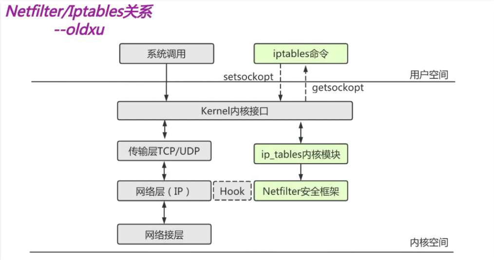

## 什么是包过滤防火墙

包过滤防火墙它工作在osI七层模型中的网络层，用来匹配网络数据包的（header) :

1.将Header与预先定义好的防火墙规则进行比对;
2.与规则相匹配的包会被放行;
3.与规则不匹配的包则可能会被丢弃、也可能执行更复杂的动作;
由于包过滤防火墙工作在网络层，故也称"网络层防火墙"，它通过检查每一个数据包的:

源地址、目的地址;

源端口、目的端口;

协议类型（TCP、UDP、ICMP)、等状态信息来判断是否符合规则;

## 如何实现

包过滤防火墙是由Netfilter 来实现的，它是内核的一部分:

如果我们想要防火墙能够达到"防火"的目的，则需要在内核中设置关卡，所有进出的报文都要经过这些关卡进行检查:

将符合条件的放行;。不符合条件的阻止;

而这些关卡在iptab1es中不被称为" 关卡",而被称为"链";

# iptables链的概念

## 什么是链

在iptables中的关卡为什么被称作"链"呢?

防火墙的作用就在于对经过的数据报文进行"规则"匹配，然后执行规则对应的"动作"，所以当报文经过这些关卡的时候，则必须匹配这个关卡上的规则，但是，这个关卡上可能不止有一条规则，而是有很多条规则，当我们把这些规则串到一起的时候，就形成了"链"

所以，每个经过这个"关卡"的报文，都要将这条"链"上的所有规则匹配一遍，如果有符合条件的规则，则执行规则对应的动作，如果没有则执行默认链的动作。

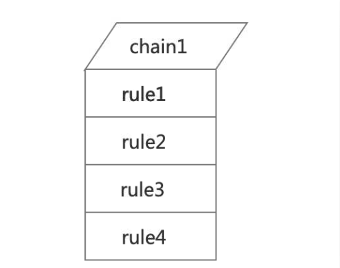

## iptables链的概念

当我们启用了防火墙功能时，报文需要经过很多关卡，也就是说，根据实际情况的不同，报文经过"链"可能不同，大体分为如下三类:

请求本机会经过哪些链（PREROUTING-->INPUT-->Local Process) ;

经过本机又会经过哪些链(PREROUTING-->FORWARD-->POSTROUTING);

从本机发出又会经过哪些链(Local Process-->OUTPU-->POSTROUTING);

了解Iptables链的数据包流向;后期在设定规则时，能很清晰的知道将规则设定在哪个链上;

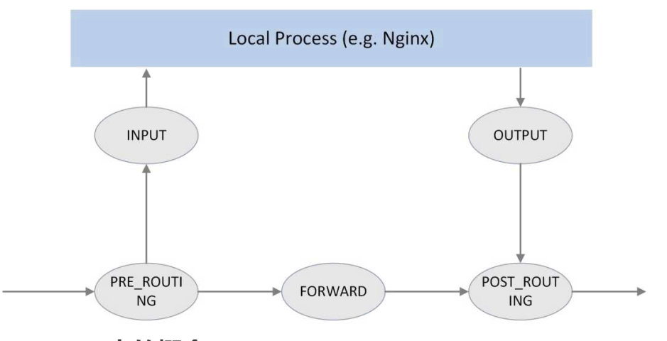

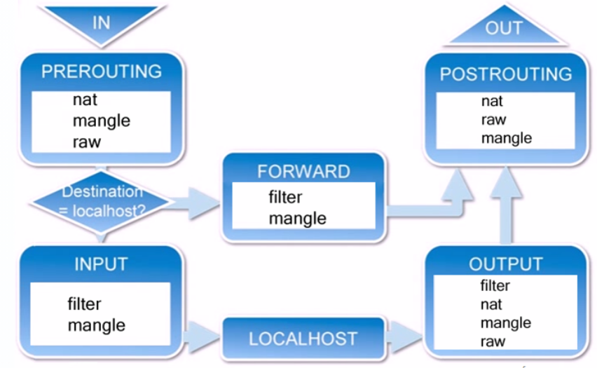

1.INPUT——进来的数据包应用此规则链中的策略；

2.OUTPUT——外出的数据包应用此规则链中的策略；

3.FORWARD——转发数据包时应用此规则链中的策略；

4.PREROUTING——对数据包作路由选择前应用此链中的规则；

5.POSTROUTING——对数据包作路由选择后应用此链中的规则。

# iptables表的概念

我们对每个"链"上都放置了一串规则，但是这些规则有些很相似，比如:

A类规则都是对业或者端口的过滤;

B类规则都是对报文进行修改的;

C类规则都是进行地址转换的;

那么这个时候，我们是不是能把实现相同功能的规则放在一起呢?

当我们把具有相同功能的规则集合在一起叫做"表"，所以说，不同功能的规则，我们可以放置在不同的表中进行管理，而iptab1es已经为我们定义了4种表，每种表对应了不同的功能。

## 表的功能

| 表名     | 作用               | 内核模块             | 包含的链                                        |
| ------ | ---------------- | ---------------- | ------------------------------------------- |
| fiter  | 负责过滤功能           | iptables\_filter | INPUT、OUTPUT、FORWARD                        |
| nat    | 负责网络地址转换功能       | iptable\_nat     | PREROUTING、INPUT、OUTPUT、POSTROUTING         |
| mangle | 负责修改数据包内容        | iptable\_mangle  | INPUT、OUTPUT、FORWARD、POSTROUTING、PREROUTING |
| raw    | 关闭nat表上启用的链接追踪机制 | iptable\_raw     | PREROUTING、OUTPUT                           |

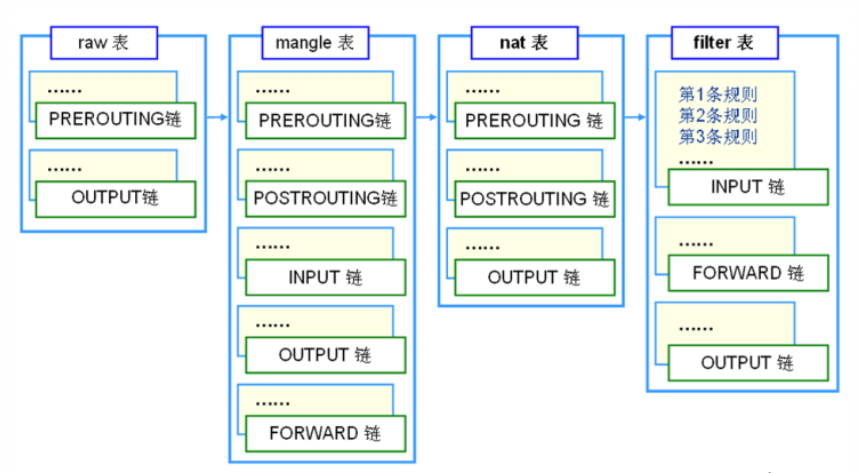

## 表与链的关系

顺序：raw—>mangle—>nat—>filter

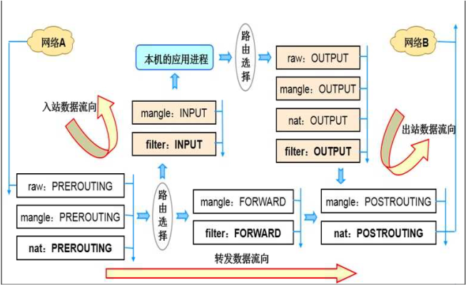

## 表与链相关问题

问题1:来自10.0.0.1的地址，访问本机的web服务请求不允许，应该在哪个表的哪个链上设定规则?

答案1:很多同学会觉得是PREROUTING链，但其实是TNPUT链，因为我们要做的是过滤，而PREROUTING不能做过滤，所以是INPUT

问题2:所有由本机发往10.0.0.0/24网段的TcP服务都不允许?

答案2:由本地发出会经过OUTPUT、POSTROUTING、但由于POSTROUTING不支持做过滤，所以应该在fiter表的OUTPUT规则链上配置。

问题3：所有来自己本地内部网络的主机，向互联网发送'web\`服务器请求都允许?

答案3：fiter表的foeward链上设置

# iptables规则管理

## 什么是规则

数据包的过滤基于规则，而规则是由匹配条件+动作组成。那我们对规则的操作无非就是增删查改。操作规则的语法:\`iptables \[-t表名]选项〔链名]\[规则]\[动作]

操作规则之前我们需要考量如下两个问题:

1\)要实现什么功能:判断添加到哪个表上;

2\)报文流经的路线:判断添加到哪个链上;

iptables语法：iptables \[-t table] command \[match] \[-j target/jump]

| iptables选项         | 含义                | 示例                                |
| ------------------ | ----------------- | --------------------------------- |
| -t,- -table        | 指定要操作的表（默认fiter）  | iptables -t fiter                 |
| -A,- -append       | 追加一条规则至链的末尾       | iptables -t fiter -A INPUT        |
| -I,- -insert       | 插入一条规则至链的顶部       | iptables -t fiter -I INPUT        |
| -D,- -delete       | 指定删除一条规则          | iptables -t fiter -D INPUT 1      |
| -R,- -replace      | 替换选定链中的规则         | iptables -t fiter -R INPUT        |
| -S,- -list-rules   | 打印选定链中的规则         | iptables -t fiter -S              |
| -F,- -flush        | 清空链中的所有规则         | iptables -t fiter -F              |
| -Z，- -zreo         | 讲所有链中的数据包和字节计数器归零 | iptables -t fiter -Z              |
| -N - -new-chain    | 创建自定义名称的规则链       | iptables -N NEW\_Rules            |
| -E,- -rename-chain | 给自定义链修改名称         | iptables -E old\_rules new\_rules |
| -X,- -delete-chain | 删除自定义链            | iptables -X Rules\_name           |
| -P,- -policy       | 给链设定默认策略          | iptables -t fiter -P DROP         |

## 如何查看、添加、修改、删除规则

### 查看：

-L：查看  -n：不解析 -v 详细  --line-numbers 编号

```bash
[root@route ~]# iptables -L  -n -v  --line-numbers


```

### 添加规则

-I：插入Insert

```bash
[root@route ~]# iptables -t filter -I INPUT -p icmp -j REJECT  #禁止icmp协议输入
[root@route ~]# iptables -L -n
```

### 修改规则

-R:修改 需要指定规则的编号

```bash
[root@route ~]# iptables -t filter -R  INPUT 1 -p icmp -j DROP
```

### 清空计数器

```bash
iptables -Z
iptables -F #清空规则
iptables -t nat -F #清空nat规则


```

### 备份及恢复

```bash
[root@route ~]# iptables-save > /etc/iptables.rule #备份iptables规则
[root@route ~]# iptables-restore < /etc/iptables.rule #恢复规则

```

### 永久生效

```bash
命令:iptables-restore < /etc/iptables.rule  
加入开机自启动 /etc/rc.local   #写入一个开机会自动加载的文件
```

# 基本匹配

## 参数

| 条件参数                                        | 含义                             |
| ------------------------------------------- | ------------------------------ |
| \[!]-p, --protocol protocol                 | 指明需要匹配的协议，如icmp. udp.tcp       |
| \[!]-s, --source address/mask               | 指定匹配源地址，如有多个可以逗号分隔             |
| \[!]-d, --destination address/mask          | 指定匹配目标地址，如有多个可以逗号分隔            |
| \[!]--source-port,--sport port              | 指定源端口                          |
| \[!]--destination-port,--dport port\[:port] | 指定目标端口                         |
| \[!]-i, --in-interface name                 | 接收数据包的接口名称                     |
| \[!]-o, --out-interface name                | 发送数据包的接口名称                     |
| \[!]-m, --match match                       | 执行需要使用的匹配项，属于扩展匹配              |
| \[!]-j, --jump target                       | 执行匹配规则后的动作、ACCEPT、DROP、REJECT等 |

## 匹配示例

```bash
 #仅允许10.0.0.10访问10.0.0。200服务器的80端口，其他地址全部拒绝
    # -I插入规则至第一行、-A追加规则、-s源地址、-d目标地址、--dport目标端口、-j匹配后执行的动作
    [root@Route ~]# iptables -t filter -I INPUT -s 10.0.0.10 -d 10.0.0.200 -p tcp --dport 80 -j ACCEPT
    [root@Route ~]# iptables -t filter -A INPUT -d 10.0.0.200 -p tcp --dport 80 -j DROP
#所有来访问本机的协议，属于TCP协议通通放行
    [root@Route ~]# iptab1es -t filter -I INPUT -p tcp -j ACCEPT
    [root@Route ~]# iptables -t filter -A INPUT -j DROP 
#凡是本机发出的tcp协议，都允许出去，其他协议不行
    [root@Route ~]# iptables -t filter -I OUTOUT -p tcp -j ACCEPT
    [root@Route ~]# iptables -t filter -A OUTOUT -j DROP 
#禁止其他主机从eth0向本机发送ping请求
    [root@Route ~]# iptables -t filter -I INPUT -i eth0 -p icmp -j DROP
#允许本机发送ping请求，其他任何协议都不允许
    [root@Route ~]# iptables -t filter -I OUTPUT -p icmp -j ACCEPT
    [root@Route ~]# iptables -t filter -I OUTOUT -j DROP 

```

# iptables扩展匹配

## multiport模块

multiport模块可以添加多个不连续的端口; -m multiport <--sports|--dports|--ports>端口1，\[端口2,..,端口n]

```bash
#10.0.0.10访问本机20.21.80.443允许通过
[root@Route ~]# iptables -F
[root@route ~]# iptables -t filter -I INPUT -m multiport -s 10.0.0.10 -d 10.0.0.200 -p tcp --dports 20:22,80,443 -j ACCEPT
[rootaroute ~]# iptables -t filter -A INPUT -jDROP

```

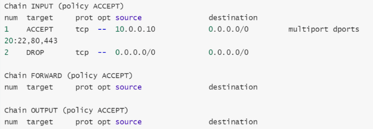

## iprange模块

iprange模块可以指定"一段连续的IP地址范围";

用于匹配报文的源地址或者目标地址，iprange扩展模块中有两个扩展匹配条件可以使用。

\[!] --src-range from\[-to]:原地址范围。

\[!] --dst-range from\[-to]:目标地址范围

```bash
10.0.0.5-10.0.0.10地址段ping本机，
[root@route ~]# iptables -t filter -F
[root@route ~]# iptables -t filter -I INPUT -p icmp -m iprange --src-range "10.0.0.5-10.0.0.10"" -jDROP
[root@route ~]# iptables -t filter -L -n --line-numbers

```

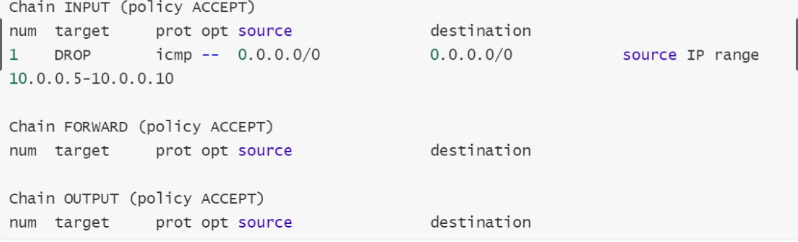

## string模块

string 模块，可以指定要匹配的字符串，如果报文中包含对应的字符串，则符合匹配条件。

\--algo {bm/kmp}:字符匹配的查询算法;

\[!] --string pattern:字符匹配的字符串;

```bash
#应用返回的报文中包含字符hello，我们就丢弃，其余正常通过
#安装httpd准备两个文件
[root@Route ~]# yum insta11 httpd -y
[root@Route ~]# echo "he11o" > /var/www / htm1/test.htm1
[root@Route ~]# echo "index-oldxu" > /var/www/htm1/index.htm1[root@Route ~]# systemct1 start httpd
#配置规则
[root@route ~]# iptables -F
[root@route ~]# iptables -t filter -I OUTPUT -p tcp -m string --string "hello" --algo kmp -j DROP
[root@route ~]# iptables -t filter -L -n
```

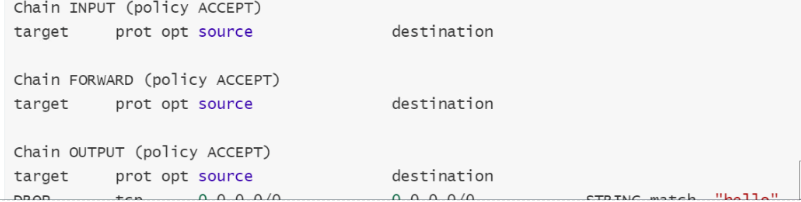

## time模块

time模块，可以根据时间段区匹配报文，如果报文到达的时间在指定的时间范围内，则符合匹配条件。

\--timestart hh:mm\[:ss]:开始时间

\--timestop hh:mm\[:ss]:结束时间

\[!] --monthdays day\[,day...]:指定一个月的某一天

\[!] --weekdays day\[,day...]:指定周一到周天

\--kerneltz:使用内核时区而不是UTc时间

```bash
#示例:拒绝每天8:30~12:30(00:30~04:30)、13:30~18:30(05:30~10:30)，任何主机发送icmp协议;
      # utc时间，与本地快8小时，所以需要-8小时
      [root@Route ~]# iptables -t filter -I INPUT -p icmp -m time --timestart 00:30 --timestop 04: 30 -j DROP
      [root@Route ~]# iptables -t filter -I INPUT -p icmp -m time --timestart 05:30 --timestop 10:30 -j DROP
      #限制用户在上班时间段访问优酷、爱奇艺等资源，其他时间可以正常放行;
      #主机策略（在input和output链进行操作）
      [root@route ~]# iptables -t filter -I OUTPUT -p tcp -m string --string "taobao.com（要禁止的字符段）" --algo kmp -m time --timestart 01:00 --timestop 04:00-j DROP
      [root@route ~]# iptables -t filter -I OUTPUT -p tcp -m string --string "taobao.com（要禁止的字符段）"--algo kmp -m time --timestart 06:00 --timestop 10:30 -j DROP
      [root@route ~]# iptables -t filter -I OUTPUT -p tcp -m string --string "aqiyi.com（要禁止的字符段）"--a1go kmp -m time --timestart 01:00 --timestop 04:00 -j DROP
      [root@route ~]# iptables -t filter -I OUTPUT -p tcp -m string --string "aqiyi.com（要禁止的字符段）"--algo kmp -m time --timestart 06:00 --timestop 10:30 -j DROP
      #网络策略（在forward链进行操作）
      上午：
      iptables -t filter -I  FORWARD -p tcp -m string --string "qq" --algo kmp -m time --timestart 00:00 --timestop 04:00 -j DROP
      iptables -t filter -I  FORWARD -p tcp -m string --string "tb" --algo kmp -m time --timestart 00:00 --timestop 04:00 -j DROP
      iptables -t filter -I  FORWARD -p tcp -m string --string "jd" --algo kmp -m time --timestart 00:00 --timestop 04:00 -j DROP
      iptables -t filter -I  FORWARD -p tcp -m string --string "aqy" --algo kmp -m time --timestart 00:00 --timestop 04:00 -j DROP
      iptables -t filter -I  FORWARD -p tcp -m string --string "wx" --algo kmp -m time --timestart 00:00 --timestop 04:00 -j DROP
      下午：
      iptables -t filter -I  FORWARD -p tcp -m string --string "qq" --algo kmp -m time --timestart 06:00 --timestop 10:00 -j DROP
      iptables -t filter -I  FORWARD -p tcp -m string --string "tb" --algo kmp -m time --timestart 06:00 --timestop 06:22 -j DROP
      iptables -t filter -I  FORWARD -p tcp -m string --string "jd" --algo kmp -m time --timestart 06:00 --timestop 10:00 -j DROP
      iptables -t filter -I  FORWARD -p tcp -m string --string "aqy" --algo kmp -m time --timestart 06:00 --timestop 10:00 -j DROP
      iptables -t filter -I  FORWARD -p tcp -m string --string "wx" --algo kmp -m time --timestart 06:00 --timestop 10:00 -j DROP

```

## icmp模块

icmp模块:可以控制其他主机无法ping通本机，但本机可以ping通其他主机;

默认情况当禁止ping后，其他主机无法ping通本主机，本主机也无法ping通其他主机，现需要本主机可以ping通其他主机，而其他主机依然无法ping同本主机。

\[!] --icmp-type itype\[/code]/typename}

指定TCMP类型，echo-request(8请求)、echo-reply (0回应)

```bash
#常规做法不满足需求
[root@route ~]# iptables -t filter -I INPUT -p icmp -j DROP
#通过扩展icmp
[root@route ~]# iptables -t filter -F INPUT
[root@route ~]# iptables -t filter -I INPUT -p icmp --icmp-type "echo-request" -jREECT
[root@route ~]# iptables -L -n

iptables -t filter -I INPUT -p tcp --dport 80 -m connlimit --connlimit-above 10 -j DROP   #限制同一IP地址的并发连接数

```

## connlimit模块

connlimit扩展模块，限制每个客户端iP地址到服务器的并行连接数。

\--connlimit-upto n:如果现有连接数小于或等于n，则匹配。

&#x20;\--connlimit-above n:如果现有连接数大于n，则匹配。

DDOS攻击脚本程序，模拟大量的并发数连接;

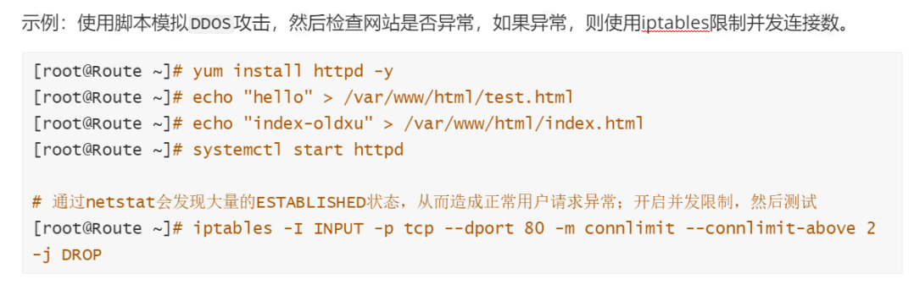

## limit模块

limit模块，限制单位时间内流入包的数量;
可以以秒为单位进行限制，也可以以分钟、小时、天作为单位进行限制。

\--limit rate\[second | minute|hour|day]:平均匹配的速率

\--limit-burst number:超过限制速率的包，允许超过burst所设定值，默认可超出5个

```bash
#1.限制主机每分钟接收10个icmp数据包，差不多6s会接收客户端一个数据包。
    [root@Route ~]# iptables -t filter -F
    [root@Route ~]# iptables -t filter -I INPUT -p icmp -m limit --limit 10/minute -jACCEPT
    [root@Route ~]# iptables -t filter -A INPUT -p icmp -j REJECT
#2.允许icmp瞬间通过10个数据包通过，超过的数据包每分钟仅能通过一个。
    [root@Route ~]# iptables -t filter -A INPUT -p icmp -m limit --limit 1/m --limit-burst 10 -j ACCEEPT
    [root@Route ~]# iptables -t filter -A INPUT -p icmp -j REECT #如果超过10的我们给其drop掉
#3.限制主机传输时的带宽每秒不超过500k ;(500k * 1000=500000字节/1500=333个包)
    [root@Route ~]# iptables -t filter -I OUTPUT -p tcp -m limit --limit 300/second -jACCEPT
    [root@Route ~]# iptables -t filter -A OUTPUT -p tcp -j DROP

```

## tcp-flags模块

使用tcp模块的--tcp-flags可以对TCP的标志位进行匹配，匹配指定标志位的值是否为"1"

在tcp协议建立连接的过程中，需要先进行三次握手，而三次握手就要依靠tcp头中的标志位进行。

第一次:客户端向服务端发起TcP连接，在TCP的flag标志位中，SYN,RST,ACK,FIN等仅SYN为1，其他标志位为0。

第二次:服务端向客户端返回ACK，在TcP的flag标志位中，SYN,RST,ACK ,FIN等标志位仅SYN、ACK为1，其他标志位为0。

第三次:客户端向服务端返回ACK，在TcP的flag标志位中，SYN,RST,ACK,FIN等标志位仅ACK为1.其他标志位为0

我们可以通过--tcp-flag指明需要匹配哪些标志位，然后再指明这些标志位中，哪些必须为1，剩余的都必须为0。所以当服务器接收新请求时，SYN标志位必须1，其他的标志位为0，

而服务端响应这个连接时，SYN、ACK标志位必须为1，其他的标志位为0。(这样可以避免木马程序通过端口主动向外发送新连接)

```bash
#示例:客户端连接服务端22端口第一次握手必须是客户端发起的，所以SYN必须为1，剩下全部为0。然后服务端可以通过22端口返回对应的报文。
#使用"--syn"选项相当于使用"--tcp-flags sYN,RST,ACK,FIN SYN"
[root@Route ~]# iptables -t filter -I INPUT -p tcp -m tcp --dport 22 --tcp-flagsSYN,ACK,FIN,RST SYN -j ACCEPT
[root@Route ~]# iptables -t filter -A INPUT -p tcp -m tcp --dport 22 --tcp-flagsSYN,ACK,FIN,RST ACK -j ACCEPT
[root@Route ~]# iptab1es -t filter -A INPUT -j DROP
#output
[root@Route ~]# iptables -t filter -I OUTPUT -p tcp --sport 22 -m tcp --tcp-flagsSYN,ACK,FIN,RST SYN,ACK -j ACCEPT
[root@Route ~]# iptables -t filter -A OUTPUT -p tcp --sport 22 -m tcp --tcp-flagsSYN,ACK,FIN,RST ACK -j ACCEPT
[root@Route ~]# iptables -t filter -A OUTPUT -i DROP

```

# iptables链接追踪state

## 什么是链接追踪

state (conntrack）连接跟踪，顾名思义，就是跟踪（并记录）连接的状态。
如下图:是一台P地址为10.1.1.2的Linux机器，我们能看到这台机器上有三条连接:

机器访问外部HTTP服务的连接（目的端口80)

外部访问机器内FTP服务的连接（目的端口21)

机器访问外部 DNS服务的连接（(目的端口53)

连接跟踪所做的事情就是发现并跟踪这些连接的状态;但这个追踪状态与TCP协议没有关系。

它是由内核nefilter在IP层实现，可IP层是无连接、无追踪的，那是如何知道这个IP是否存在;
当用户发送请求时，会将用户的请求信息存储在内存开辟的空间中，对在/proc/net/nf\_conntrack。

文件会记录源IP、目标IP、协议、时间、状态、等信息;

当用户再次发起请求，就可以通过文件获取该用户是否来过，以此来实现连接追踪机制;

注意:该文件能存储的条目是受/proc/sys/net/nf\_conntrack\_max设定大小所限;

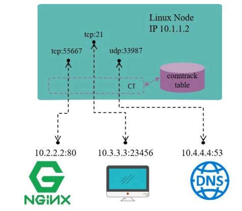

## 有哪些状态

\[ New ]:新请求，内存中不存在此连接的相关条目，因此识别为第一次请求，状态为NEW;

\[ ESTABLISHED ]: NEW状态之后，再次建立连接，由于此前的连接还没有失效，所以追踪后被视为已连接通讯状态，状态为ESTABLISHED ;

\[ RELATED ]:相关的连接。比如ftp程序有两个连接，命令连接和数据连接;命令连接有来有往是一个独立的循环，数据连接有来有往又是另外一个独立的循环，但是两者之间有关系，如果没有命令连接就不可能有数据连接，所以我们将这种称为"相关联的连接";

\[ INVALID ]:无效的连接。

## 应用场景

正常情况下服务器的80端口不会主动连接其他服务器，如果出现了80端口连接其他服务器，那么说明出现了异常行为，或者可以理解为中了木马程序病毒。反弹端口型木马

如果关闭80端口的响应报文，就会造成请求进来无法响应;如果开放80端口则又会出现异常行为。
所以我们需要对80端口做连接追踪限制，凡事从80端口出去的就必须是对某个请求的响应，也就是说通过80端口出去的状态必须是ESTABLISHED，不能是NEW

## 配置场景

1、允许接收远程主机像本机发送的SSH与HTTP请求（NEW、ESTABLISHED)

2、同时也仅允许本机像其他主机回应SSH以及HTTP响应（ESTABLISHED)

3、但不允许本机通过22、80端口主动向外发起连接。

```bash
# input
[root@route ~]# iptables -t filter -I INPUT -p tcp -m multiport --dport 80,22 -mstate --state NEw,ESTABLISHED -j ACCEPT
[root@route ~]# iptables -t filter -A INPUT -j DROP
#output
[root@route ~]# iptables -t filter -I OUTPUT -p tcp -m multiport --sport 80,22 -mstate --state ESTABLISHED -j ACCEPT
[root@route ~]# iptables -t filter -A OUTPUT -j DROP
```

额外补充:如果服务器需要使用SSH连接其他远程主机，需要增加以下配置(但不建议)

```bash
#1.送出的数据包目的端口为22
[root@route ~]# iptables -I OUTPUT 2 -p tcp --dport 22 -m state --stateNEw,ESTABLISHED -j ACCEPT
#2.接收的数据包源端口为22
[root@route ~]# iptables -I INPUT 2 -p tcp --sport 22 -m state --state ESTABLISHED -jACCEPT
```

### conntrack

```bash
/proc/net/nf_conntrack  #查看链接追踪详情
echo "100000" > /proc/sys/net/nf_conntrack_max  #调整链接追踪大小
#INPUT
[root@route ~]# iptables -t filter -I INPUT -p tcp -m multiport --dport 80,22 -m state --state NEW,ESTABLISHED -j ACCEPT
[root@route ~]# iptables -t filter -A INPUT -p tcp -m multiport --dport 80,22 -j DROP
#OUTPUT
[root@route ~]# iptables -t filter -I OUTPUT -p tcp -m multiport --sport 22,80 -m state --state ESTABLISHED -j ACCEPT
[root@route ~]# iptables -t filter -A OUTPUT -p tcp -m multiport --sport 22,80 -j DROP


```

# iptables地址转换

## 什么是NAT

网络地址转换(NAT），意思也比较清楚:对（数据包的)网络地址(IP + Port）进行转换。

例如，机器自己的210.1.1.2是能与外部正常通信的，但192.168网段是私有段，无法与外界通信，因此当源地址为192.168网段的包要出去时，机器会先将源P换成机器自己的10.1.1.2再发送出去;收到应答包时，再进行相反的转换。这就是NAT的基本过程。

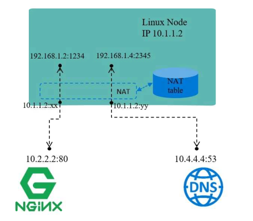

## NAT的几种模式

SNAT:源地址转换

DNAT:目标地址转换

PNAT:端口转换

## NAT环境搭建

```bash
#准备iptables节点:eth0:10.0.0.200 eth1:172.16.1.200  开启forward
    [root@route ~]# cat /etc/sysconfig/network-scripts/ifcfg-eth0 
    TYPE=Ethernet
    BOOTPROTO=none
    DEFROUTE=yes
    NAME=eth0
    DEVICE=eth0
    ONBOOT=yes
    IPADDR=10.0.0.200
    PREFIX=24
    GATEWAY=10.0.0.2
    DNS1=223.5.5.5
    [root@route ~]# cat /etc/sysconfig/network-scripts/ifcfg-eth1
    TYPE=Ethernet
    BOOTPROTO=none
    DEFROUTE=yes
    NAME=eth1
    DEVICE=eth1
    ONBOOT=yes
    IPADDR=172.16.1.200
    PREFIX=24 
    [root@route ~]# echo "net.ipv4.ip_forward = 1" >> /etc/sysctl.conf 
    [root@route ~]# sysctl -p
    net.ipv4.ip_forward = 1
#集群的后端节点(两个或多个，IP地址不同，其他操作一样): eth1: 172.16.1.7 Gateway: 172.16.1.200 | eth1: 172.16.1.8   Gateway: 172.16.1.200
    [root@web01 ~]# cat   /etc/sysconfig/network-scripts/ifcfg-eth1 
    TYPE=Ethernet
    BOOTPROTO=none
    DEFROUTE=yes
    NAME=eth1
    DEVICE=eth1
    ONBOOT=yes
    IPADDR=172.16.1.7
    PREFIX=24
    GATEWAY=172.16.1.200
    DNS1=223.5.5.5
    [root@web01 ~]# ifdown eth1 && ifup eth1
    [root@web02 ~]# ifdown eth0

```

## SNAT场景配置

```bash
#必须使用nat表
    [root@route ~]# iptables -t nat -I POSTROUTING -s 172.16.1.0/24 -j SNAT --to 10.0.0.200
    [root@route ~]# iptables -t nat -L

```

## DNAT场景配置（必须先实现SNAT才能实现DNAT）

```bash
#实现外网主机通过防火墙访问内部主机80端口，需要通过DNAT(目标地址转换PREROUTING)
1.端口映射，将公网IP+Port映射到私网的IP+Port ;
[root@route ~]# iptables -t nat -I PREROUTING -d 10.0.0.200 -p tcp --dport 80 -j DNAT --to 172.16.1.7:80
2.地址映射，将公网地址映射到私网地址;
[root@route ~]# iptables -t nat -I PREROUTING -d 10.0.0.200 -p tcp --dport 2222 -j DNAT --to 172.16.1.8:22

```

# iptables自定义链

## 为什么要自定义

iptables的默认链就已经能够满足我们了，为什么还需要自定义链呢?当默认链中的规则非常多时，不便于管理。

假设INPUT链中存放了100条规则，这100条规则有针对80端口的，有针对22端口的;

如果想修改22端口的规则，则需要将所有规则都看一遍，然后找出匹配的规则，这显然不合理;

所以，我们需要使用自定义链，通过自定义链即可解决上述问题。

首先创建一个自定义链，链名叫IN\_SSHD ;

然后将所有针对22端口入站规则都写入到这条自定义链中;

后期想要修改针对22端口入站规则时，就直接修改IN\_SSHD链中的规则就可以了;

这样即使有再多的规则也没有关系，因为我们可以通过自定义链，快速定位到想修改的规则;

## 基本应用

```bash
#创建一个自定义链
      [root@route ~]# iptables -t filter -N IN_SSHD
#编辑链中的规则:禁止'10.0.0.10'访问10.0.0.200的22端口。
      [root@route ~]# iptables -t filter -I IN_SSHD -s 10.0.0.10 -d 10.0.0.200 -p tcp --dport 22 -j DROP
#使用默认的链调用自定义
      [root@route ~]# iptables -t filter -I INPUT -p tcp --dport 22 -j IN_SSHD

```

> 📌自定义的链表不能直接使用会有系统的链进行转接到自定义的链表

## 测试结果

使用10.0.0.10地址的主机走tcp协议进行访问10.0.0.200主机，查看反馈结果，可以使用ssh远程链接主机进行测试

## 执行顺序

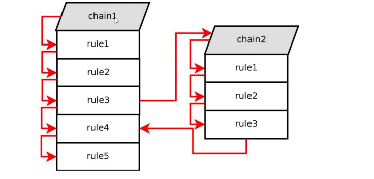

## 删除自定义链

删除自定义链需要满足两个条件:

1.自定义链没有被引用

2.自定义链中没有任何规则

```bash
[root@route ~]# iptables -t filter -D IN_SSHD 1 #删除自定义规则
[root@route ~]# iptables -t filter -D IN_SSHD 1 #删除INPUT引用
[root@route ~]# iptables -E IN__SSHD SSHD       #自定义链重命令
[root@route ~]# iptables -X HTTP                #删除自定义链

```

# 场景示例

## 场景1

场景描述

1.对所有的地址开放本机的tcp (80、22、8080-9090)端口的访问o

2.允许对所有的地址开放本机的基于ICMP协议的数据包访问

3.其他未被允许的端口禁止访问

实现思路:

1.先允许端口、协议。

2.配置拒绝规则

```bash
#先配置允许，再配置拒绝
INPUT
iptables -t filter -I INPUT -p tcp -m multiport --dport 22,80,8080:9090 -m state --state "NEW,ESTABLISHED,RELATED" -j ACCEPT
iptables -t filter -A INPUT -p icmp -j ACCEPT
iptables -t filter -A INPUT -j DROP
OUTPUT
iptables -t filter -I OUTPUT -p tcp -m multiport --sport 22,80,8080:9090 -m state --state "NEW,ESTABLISHED,RELATED" -j ACCEPT
iptables -t filter -A OUTPUT -p icmp -j ACCEPT
iptables -t filter -A OUTPUT -j DROP

```

## 场景2

场景描述

1.员工在公司内部（10.0.0.0/24、10.8.0.0/24）能访问服务器上任何服务

2.当员工出差外地，通过vpn连接到公司，也可以访问内部上的任何服务

3.公司有门户网站需要允许公网用户访问http 80/tcp、https 443/tcp

```bash
[root@route ~]# iptables -F
[root@route ~]# iptables -t filter -I INPUT -s 10.0.0.0/24 -j ACCEPT
[root@route ~]# iptables -t filter -I INPUT -s 10.8.0.0/24 -j ACCEPT
[root@route ~]# iptables -t filter -A INPUT -p tcp -m multiport --dport 80,443 -j ACCEPT
[root@route ~]# iptables -t filter -A INPUT -p tcp -j DROP
```

## 场景3

ftp服务器有两种模式：主动模式和被动模式，规则配置针对两个模式有不同配置

### ftp服务器的主动模式规则配置

对外提供21、20两个端口  21作为链接端口  20作为数据串传输端口

```bash
#vsftpd服务端
yum install vsftpd -y #安装ftp服务端
vim /etc/vsftpd/vsftpd.conf
port_enable=YES
connect_from_port_20=YES
systemctl restart vsftpd

#ftp客户端
yum install ftp -y
ftp server_addressftp> passive
Passive mode off.#提示被动模式关闭
ftp> get bigdata
ftp> get bigdata


netstat -an \ grep -i estab  #用服务端查看客户端和服务端的链接状态
#配置规则
  INPUT
    [root@route ~]# iptables -F
    [root@route ~]# iptables -I INPUT -p tcp --dport 22 -j ACCEPT
    [root@route ~]# iptables -A INPUT -p tcp -m state --state "NEW,ESTABLISHED,RELATED" -j ACCEPT
    [root@route ~]# iptables -A INPUT -p tcp -m multiport --dports 20,21 -j ACCEPT
    [root@route ~]# iptables -A INPUT -j DROP
  OUTPUT(OUTPUT放行从20、21端口出去新建的连接，以及已建立的连接。至于ssh响应建立的连接即可)
    [root@route ~]# iptables -t filter -I OUTPUT -p tcp -m multiport --sport 22 -m state --state "ESTABLISHED" -j ACCEPT
    [root@route ~]# iptables -t filter -I OUTPUT -p tcp -m multiport --sport 20,21 -m state --state "NEW,ESTABLISHED,RELATED" -j ACCEPT
    [root@route ~]# iptables -t filter -A OUTPUT -j DROP


```

### FTP被动模式规则配置

```bash
#修改配置文件，指定随机端口
    [root@route ~]# vim /etc/vsftpd/vsftpd.conf
    pasv_min_port=50000
    pasv_max_port=60000
    [root@route ~]# systemctl restart vsftpd
#配置iptables规则
  INPUT
    [root@route ~]# iptables -I INPUT -p tcp --dport 22 -j ACCEPT
    [root@route ~]# iptables -A INPUT -p tcp -m multiport --dports 21,50000:60000 -m state --state "NEW,ESTABLISHED,RELATED" -j ACCEPT
    [root@route ~]# iptables -A INPUT -j DROP
  OUTPUT
    [root@route ~]# iptables -I OUTPUT -p tcp --sport 22 -m state --state "ESTABLISHED" -j ACCEPT
    [root@route ~]# iptables -A OUTPUT -p tcp -m multiport --sports 21,50000:60000 -m state --state "ESTABLISHED" -j ACCEPT
    [root@route ~]# iptables -A OUTPUT -j DROP

```

# 总结

基本匹配：-s, 源地址  -d, 目标地址   -p, 协议    --sport,  源端口    （OUTPUT）--dport,  目标端口  （INPUT）

使用iptables充当路由器：

SNAT：  内部所有的主机都可以通过路由器上网

DNAT：  让外部的用户可以请求到内部服务器提供的端口；
