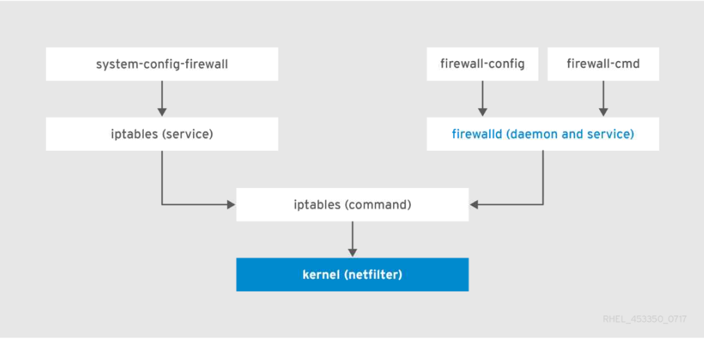
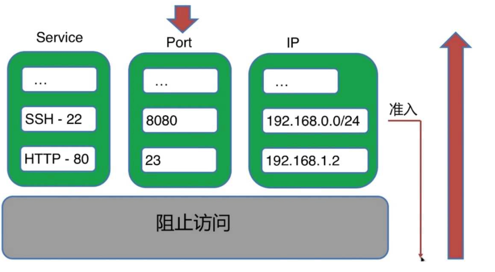
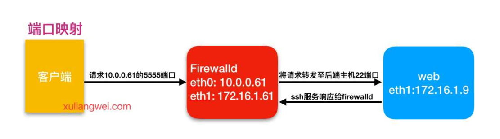
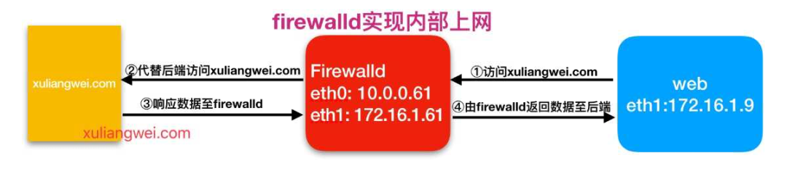

# 防火墙firewalld实践

## 目录

-   [基本介绍](#基本介绍)
    -   [firewalld默认策略](#firewalld默认策略)
    -   [区域概念](#区域概念)
    -   [什么是区域](#什么是区域)
    -   [区域与接口](#区域与接口)
        -   [默认区域规则00000](#默认区域规则00000)
-   [firewalld命令语法](#firewalld命令语法)
-   [firewalld区域设置](#firewalld区域设置)
    -   [查询区域及规则](#查询区域及规则)
    -   [多区域组合应用](#多区域组合应用)
-   [规则配置](#规则配置)
    -   [端口规则配置](#端口规则配置)
-   [firewalld实现NAT](#firewalld实现NAT)
    -   [DNAT应用场景](#DNAT应用场景)
    -   [SNA应用场景](#SNA应用场景)
-   [防火墙规则策略](#防火墙规则策略)
    -   [rule基本介绍](#rule基本介绍)
    -   [命令语法](#命令语法)
    -   [执行顺序](#执行顺序)
    -   [场景示例](#场景示例)

# 基本介绍

在centos7系统中集成了多款防火墙管理工具，默认启用的是firewal1d(动态防火墙管理器)，Firewa11d支持cL工及GuI的两种管理方式。
对于接触Linux较早的人员对Iptables比较的熟悉

由于Iptables的规则比较的麻烦，并网络有一定要求，所以学习成本较高。

但Firewal7d的学习对网络并没有那么高的要求，相对Iptables来说要简单不少。



## firewalld默认策略

如果开启Firewa11d防火墙，默认情况会阻止流量流入，但允许流量流出。



## 区域概念

相较于传统的Iptables防火墙，firewa1ld支持动态更新，并加入了区域zone的概念。

## 什么是区域

简单来说，区域就是firewa11d预先准备了几套防火墙策略集合(策略模板)，用户可以根据不同的场景而选择不同的策略模板，从而实现防火墙策略之间的快速切换。

## 区域与接口

### 默认区域规则00000

| 区域       | 默认规则策略                                                                           |
| -------- | -------------------------------------------------------------------------------- |
| trusted  | 允许所有的数据包流入与流出                                                                    |
| home     | 拒绝流入的流量，除非与流出的流量相关;而如果流量与ssh、mdns.ipp-client、amba-client与dhcpv6-client服务相关，则允许流量 |
| internal | 等同于home区域                                                                        |
| work     | 拒绝流入 的流量，除非与流出的流量数相关;而如果流量与ssh、ipp-client与dhcpv6-client服务相关，则允许流量                |
| public   | 拒绝流入的流量，除非与流出的流量相关;而如果流量与ssh、dhcpv6-client服务相关，则允许流量                             |
| external | 拒绝流入的流量，除非与流出的流量相关;而如果流量与ssh服务相关，则允许流量                                           |
| dmz      | 拒绝流入的流量，除非与流出的流量相关;而如果流量与ssh服务相关，则允许流量                                           |
| block    | 拒绝流入的流量，除非与流出的流量相关                                                               |
| drop     | 拒绝流入的流量，除非与流出的流量相关                                                               |

# firewalld命令语法

区域命令语法

```bash
--get-default-zone:查询默认的区域名称
--set-default-zone=<区域名称>:设置默认的区域，使其永久生效
--get-active-zones:显示当前正在使用的区域与网卡名称
--get-zones:显示总共可用的区域
--new-zone=<zone>:新增区域
```

接口命令语法

```bash
--add-interface=<网卡名称> ∶将源自该网卡的所有流量都导向某个指定区域
 --change-interface=<网卡名称> :将网卡关联至对应的区域
```

服务命令语法

```bash
--get-services :列出所有支持的服务名称
 --add-service=<服务名> :允许服务放行
 --remove-service=<服务名> :拒绝服务放行
 --query-service=<服务名> :查看服务是否放行
```

端口命令语法

```bash
--add-port=<端口号/协议> :允许端口放行
 --remove-port=<端口号/协议> :拒绝端口放行
```

管理命令语法

```bash
--list-all :显示当前区域的网卡配置参数、资源、端口以及服务等信息
 --reload :让"永久生效""的配置规则立即生效，并覆盖当前的配置规则
```

# firewalld区域设置

基本概念

## 查询区域及规则

firewalld启动后，我们需要知道使用的是什么区域，规则明细又有那些

```bash
#1.通过--get-default-zone获取当前默认使用的区域
[root@Firewalld ~]# firewall-cmd --get-default-zonepub1ic
#2.通过--list-all查看当前默认区域配置了哪些规则
[root@Firewalld ~]# firewall-cmd --list-allpublic (active)
      target: default
      icmp-b1ock-inversion: 
      nointerfaces: eth0 eth1
      sources :
      services: ssh dhcpv6-clientports:
      protocols:
      masquerade: 
      noforward-ports:
      source-ports:
      icmp-blocks :
```

## 多区域组合应用

使用firewalld各个区域规则结合配置
调整默认public区域拒绝所有流量，但如果来源P是10.0.0.0/24网段则允许。

1.将默认的public区域中的服务全部删除;

2将来源地址来自于10.0.0.0/24统统都走白名单;

```bash
#1.临时移除默认区域的规则策略
[root@Firewalld ~]# firewall-cmd --remove-service=ssh --remove-service=dhcpv6-clientsuccess
#2.添加来源是10.0.0.0/24网段，将其加入白名单(更精细化控制使用富规则)
[root@Firewalld ~]# firewall-cmd --add-source=10.0.0.0/24 --zone=trustedsuccess
#3.检查当前活动的区域
[root@Firewalld ~]# firewall-cmd --get-active-zone
  public
    interfaces: eth0 eth1 #任何来源网段都走pub1ic默认区域规则(除了10网段)
  trusted
    sources: 10.0.0.0/24  #来源是10网段则走trusted区域规则
```

# 规则配置

## 端口规则配置

放行80/tcp端口流量

```bash
#单个端口（临时>
[root@Firewalld ~]# firewall-cmd --add-port=80/tcp
#多个端口（临时)
[root@Firewalld ~]# firewall-cmd --add-port={80/tcp,8080/tcp}
#多个端口(永久)
[root@Firewalld ~]# firewall-cmd --add-port={80/tcp,8080/tcp] --permanet
[root@Firewalld ~]# firewall-cmd --reload
#查看放行端口
[root@Firewalld ~]# firewall-cmd --list-ports
  80/tcp 8080/tcp
#移除端口规则临时)
[root@Firewalld ~]# firewall-cmd --remove-port={80/tcp,8080/tcp}
```

配置服务规则

# firewalld实现NAT

## DNAT应用场景

基本概念:端口转发是指传统的目标地址映射，实现外网访问内网资源;

实现原理:Firewa17d使用的是代理方式来实现地址地址映射，会占用随机端口;

实现语法: firewa1l-cmd --permanent --zone=<区域> --add-forward-port=port=<源端口号> : proto=<协议>:toport=<目标端口号> :toaddr=<目标IP地址>

配置场景:将请求的10.0.0.200:5555端口转发至后端172.16.1.9:22端口实现地址转换，类似于代理模式而非地址转换



## SNA应用场景

在指定的带有公网IP的服务器上启动Firewa11d实现内部集群共享上网;



```bash
#1.firewalld开启masquerade
[root@Firewalld ~]# firewall-cmd --add-masquerade --permanent
[root@Firewalld ~]# firewall-cmd --reload
#2.客户端将网关指向firewalld服务器，并配置好DNS
[root@web03 ~]# cat /etc/sysconfig/network-scripts/ifcfg-eth1
  GATEWAY=172.16.1.61
  DNS1=223.5.5.5
#3.重启网络
[root@web03 ~]# nmcli connection reload
[root@web03 ~]# nmcli connection down eth1 && nmc1i connection up eth1
#4.测试能否正常上网
  ping baidu.com
```

# 防火墙规则策略

## rule基本介绍

firewa11d中的富规则表示更细致、更详细的防火墙策略配置，它可以针对系统服务、端口号、源地址和目标地址等诸多信息进行更有针对性的策略配置,优先级在所有的防火墙策略中也是最高的。

## 命令语法

```bash
[root@Firewalld ~]# man firewall-cmd   #帮助手册
[root@Firewalld ~]# man firewalld.richlanguage#获取富规则手册
    rule
        [source]
        [destination]
        service|port|protocol|icmp-block|masquerade|forward-port
        [log]
        [audit]
        [accept|reject|drop]
rule [family="ipv4|ipv6"]
source address="address[/mask]"[invert="True"]
service name="service name"
port port="port value" protocol="tcp|udp"
forward-port port="port value" protoco1="tcpludp" to-port="port value" to-addr="address"
accept | reject [type="reject type"] | drop

#富规则相关命令
--add-rich-rule='<RULE>' #在指定的区添加一条富规则
--remove-rich-rule='<RULE>' #在指定的区删除一条富规则
--query-rich-ru1e='<RULE>' #找到规则返回0 ，找不到返回1
--list-rich-rules  #列出指定区里的所有富规则

```

## 执行顺序

查看设定的规则，如果没有添加-permanent参数则重郈jirewalld会失效。富规则按先后顺序匹配，按先匹配到的规则生效

```bash
[root@Firewalld ~]# firewall-cmd --list-rich-rules
rule family="ipv4" source address="10.0.0.1/32" service name="http" accept
rule family="ipv4" source address="172.16.1.0/24" port port="1005o" protocol="tcp"accept
rule family="ipv4" source address="172.16.1.0/24" service name="ssh" drop
rule family="ipv4" source address="10.0.0.1/32" service name="ssh" accept
rule family="ipv4" source address="10.0.0.1/32" forward-port port="5555"protoco1="tcp" to-port="22" to-addr="172.16.1.6"
```

## 场景示例

```bash
#比如允许10.0.0.1主机能够访问http服务，允许172.16.1.0/24能访问10050端口
[root@Firewalld ~]# firewa11-cmd --add-rich-rule='rule fami1y=ipv4 sourceaddress=10.0.0.1/32 service name=http accept'
[root@Firewalld ~]# firewa11-cmd --add-rich-rule='rule family=ipv4 sourceaddress=172.16.1.0/24 port port="10050" protocol="tcp" accept'
#默认public区域对外开放所有人能通过ssh服务连接，但拒绝172.16.1.0/24网段通过ssh连接服务器
[root@Firewa1ld ~]# firewa17-cmd --add-rich-rule='rule family=ipv4 source address=172.16.1.0/24 service name="ssh" drop'
#使用firewalld，允许所有人能访问http,https服务，但只有10.0.0.1主机可以访问ssh服务
[root@Firewalld ~]# firewall-cmd --add-service={http, https}
success
[root@Firewalld ~]# firewall-cmd --add-rich-rule='rule family=ipv4 sourceaddress=10.0.0.1/32 service name=ssh accept'
success
#当用户来源卫地址是10.0.0.1主机，则将用户请求的5555端口转发至后端172.16.1.9的22端口
[root@Firewalld ~]# firewall-cmd --add-masquerade
[root@Firewalld ~]# firewall-cmd --add-rich-rule='rule family=ipv4 sourceaddress=10.0.0.1/32 forward-port port="5555" protocol="tcp" to-port="22" to-addr="172.16.1.6""
success

```
