# DNS

## 目录

-   [DNS基本概述](#DNS基本概述)
    -   [为什么需要域名](#为什么需要域名)
    -   [什么是DNS](#什么是DNS)
    -   [域名结构](#域名结构)
    -   [查询原理](#查询原理)
        -   [递归查询](#递归查询)
        -   [迭代查询](#迭代查询)
    -   [记录类型](#记录类型)
        -   [A](#A)
        -   [PTR](#PTR)
        -   [CNAME](#CNAME)
        -   [NS](#NS)
    -   [企业自建DNS](#企业自建DNS)
-   [BIND基础应用](#BIND基础应用)
    -   [什么是bind](#什么是bind)
    -   [bind的组成](#bind的组成)
    -   [bind服务实践](#bind服务实践)
        -   [环境准备](#环境准备)
        -   [服务安装](#服务安装)
        -   [配置文件](#配置文件)
        -   [客户端验证解析](#客户端验证解析)
    -   [自定义区域（域名）](#自定义区域域名)
        -   [自定义区域配置文件](#自定义区域配置文件)
        -   [自定义区域数据库文件](#自定义区域数据库文件)
    -   [BIND实战场景](#BIND实战场景)
    -   [新建区域配置文件](#新建区域配置文件)
    -   [新增区域数据库文件](#新增区域数据库文件)
    -   [客户端测试解析文件](#客户端测试解析文件)
    -   [场景2](#场景2)
    -   [场景3](#场景3)
    -   [DNS客户端工具](#DNS客户端工具)
        -   [host](#host)
        -   [nslookup](#nslookup)
        -   [dig](#dig)
    -   [递归查询](#递归查询)
        -   [什么是递归查询](#什么是递归查询)
        -   [递归查询配置参数](#递归查询配置参数)
        -   [递归查询场景实践](#递归查询场景实践)
            -   [开启递归查询](#开启递归查询)
            -   [关闭递归查询](#关闭递归查询)
    -   [DNS主辅同步](#DNS主辅同步)
        -   [概念](#概念)
        -   [原理](#原理)
        -   [场景](#场景)
        -   [环境准备](#环境准备)
        -   [同步配置要点](#同步配置要点)
        -   [master服务器配置](#master服务器配置)
        -   [slave服务器配置](#slave服务器配置)
        -   [测试主辅解析](#测试主辅解析)
        -   [配置DNS高可用](#配置DNS高可用)
    -   [DNS子域授权](#DNS子域授权)
        -   [什么是子域授权](#什么是子域授权)
        -   [授权环境](#授权环境)
        -   [授权场景](#授权场景)
            -   [父域配置（master）](#父域配置master)
            -   [子域配置（other）](#子域配置other)
            -   [结果验证](#结果验证)
    -   [DNS转发模式](#DNS转发模式)
        -   [什么是转发模式](#什么是转发模式)
        -   [转发示例](#转发示例)
        -   [DNS区域转发实践](#DNS区域转发实践)
            -   [子域配置转发](#子域配置转发)
            -   [测试转发结果](#测试转发结果)
    -   [智能DNS概述](#智能DNS概述)
        -   [什么是智能DNS](#什么是智能DNS)
        -   [如何实现](#如何实现)
            -   [ACL访问控制](#ACL访问控制)
            -   [VEW视图功能](#VEW视图功能)
        -   [场景实践](#场景实践)
            -   [定义ACL规则](#定义ACL规则)
            -   [定义VEW视图](#定义VEW视图)
            -   [测试环境zong（电信）](#测试环境zong电信)
            -   [生产环境zone（联通）](#生产环境zone联通)
            -   [客户端测试](#客户端测试)

# DNS基本概述

## 为什么需要域名

在互联网中，使用IP地址与服务器进行通信根本行不通，原因如下:o

1.不好记忆，如:学校官网的Ip地址是"39.104.16.126"，难以记忆;

2.IP地址会经常发生变更，所以通过IP地址去访问某台机器就容易出现无法访问的情况;

此时DNS就应运而生了;那DNs解决了什么问题:

DNS主要用来维护域名与IP地址的对应关系;

将(好记忆的字符串)与(不好记忆的P地址)进行关联;

[jd.com](http://jd.com "jd.com") --> 1.1.1.1
[tb.com](http://tb.com "tb.com") --> 2.2.2.2

## 什么是DNS

域名系统DNS(Domain Name system)主要功能是将用户请求的域名转换为TP地址;DNS就像一位"翻译官”，它的基本工作原理可以用下图来表示;

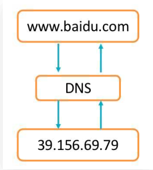

## 域名结构

由于因特网的用户数量较多，所以因特网在命名时采用的是层次树状结构的命名方法。

1.互联网中的域名是有结构有规划的;

2.由于域名进行了分级，在进行域名和IE地址解析时能更容易找到;

3.其次域名具备全球唯一性;

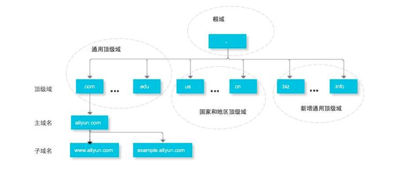

根域:知道所有顶级域名服务器的域名和地址

全世界只有13组根服务器，其中10台设置在美国，另外的三台设置与英国，瑞典，日本;

顶级域:知道所有顶级域名服务器下注册的所有二级域名的IP地址

顶级域有两种:通用域（com、cn）域和国家域(hk、ip);

顶级域名由ICANN(互联网名称与数字地址分配机构）委任的注册机构负责运行;

二级域:负责一个区的域名服务器([oldxu.com](http://oldxu.com "oldxu.com"))

无需到ICANN进行申请，只需要到运行顶级域的注册机构(阿里、腾讯)去申请即可

如果申请的域名没有被注册，也没有被注册为商标，仅需要缴纳一笔年费即可获取

三级域或主机名:

根据服务器所提供的业务功能，选择配置对应的主机名称解析记录，比如(www、ops)

## 查询原理

下面的示例则概述了本地解析器没有域名对应的缓存，DNS查询所需的步骤:

1用户在浏览器中输入example.com，则由本地域名服务器开始进行递归查询。·

2本地域名服务器采用迭代查询的方法，向根域名服务器进行查询。

3根域名服务器告诉本地域名服务器，下一步应该查询的顶级域名服务器．TLD的P地址。

4、本地域名服务器向顶级域名服务器.com TLD进行查询。

5、.com TLD服务器告诉本地域名服务器，下一步查询example.com权威域名服务器的IP地址。

6、本地域名服务器向example.com权威域名服务器发送查询。

7、example.com权威域名服务器告诉本地域名服务器所查询的主机IP地址。8、本地域名服务器最后把查询的I地址响应给浏览器。

[aa0989e8b7604faef3d796a9ecd242d6.png (1402×958) (51cto.com)](https://s4.51cto.com/images/blog/202005/06/aa0989e8b7604faef3d796a9ecd242d6.png "aa0989e8b7604faef3d796a9ecd242d6.png (1402×958) (51cto.com)")

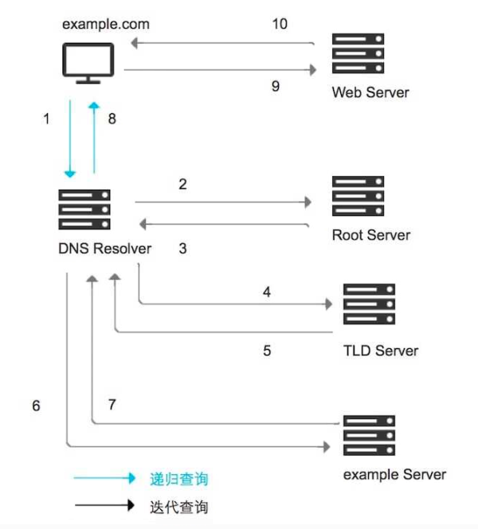

### 递归查询

是指DNS服务器在收到用户发起的请求时，必须向用户返回一个准确的查询结果。

如果DNS服务器本地没有存储与之对应的信息，则该服务器需要询问其他服务器，并将返回的查询结构提交给用户。

### 迭代查询

是指Dws服务器在收到用户发起的请求时，并不直接回复查询结果，而是告诉另一台DNS服务器的地址，用户再向这台DNS服务器提交请求，这样依次反复，直到返回查询结果。

## 记录类型

### A

A记录可实现将域名指向IP地址，也称为正向解析;

正向解析:域名-->DNS服务返回IP


### PTR

PTR记录可以实现上查找域名，也称为反向解析;

反向解析:IP-->DNS服务返回域名;


### CNAME

当需要将域名指向另一个域名，再由另一个域名提供IP地址，就需要添加CNAME记录;

最常用CNAME的场景有WAF、CDN


[http://cdn.xuliangwei.com/16185582535851.ipg](http://cdn.xuliangwei.com/16185582535851.ipg "http://cdn.xuliangwei.com/16185582535851.ipg")（cj）

### NS

1.客户端查询DNs服务，如当前DNs无法提供权威解析，则返回一条Ns记录;

2.客户端在通过Ns记录中提供的DNS权威服务器进行解析;

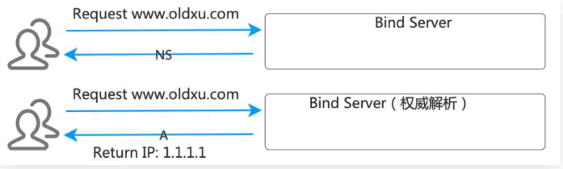

## 企业自建DNS

企业常规做法:购买域名、完成ICP备案，并使用公网DNs服务(万网..)进行免费(付费）解析

既然企业可以通过公网来完成域名解析，为何还要自建DNS呢;

1.内网web服务，例如: `jenkins、jumpserver、elk`等，不适合解析至公网

2.内网中间件服务db、mq等，会经常迁移或扩缩容，应该使用域名对外提供，便于维护;

3.服务器都有hostname，hostname应该设置为FQDN，如何维护主机名和主机的内网IP的关系;

综上:我们需要构建至少—套企业内部的DNS服务;

# BIND基础应用

## 什么是bind

BIND(由美国加州大学开发并且维护的)、

BIND是一个开源、稳定、且应用广泛的DNS服务。

开源:指BIND服务源代码是开放的

稳定:指BIND服务运行非常稳定

广泛:政府企业、单位机构、学校等

## bind的组成

BIND提供（域名解析服务、权威域名服务、DNS调试工具)

域名解析服务:将域名解析为IP地址;

权威域名服务:能从该服务器杳询到宗整域名对应的TP地址，则这台服务器就算权威解析;

DNS调试工具:主要提供DNs客户端调试工具，供客户端使用;

## bind服务实践

### 环境准备

| 系统版本    | 外网地址           | 内网地址             | 功能及作用      |
| ------- | -------------- | ---------------- | ---------- |
| centos7 | eth0：10.0.0.91 | eth1：172.16.1.91 | DNS-Master |
| centos7 | eth0：10.0.0.92 | eth1：172.16.1.92 | DNS-Slave  |
| centos7 | eth0：10.0.0.93 | eth1：172.16.1.93 | DNS-Son    |

### 服务安装

```bash
yum install bind bind-utils -y #bind提供主程序包  utils提供工具包
systemcrl start named
systemctl enable named

```

### 配置文件

1.主配置文件格式

options {}:全局选项（监听端口、数据文件存储位置、缓存位置、权限等)

logging {}:服务日志选项

zone  {}:自定义区域配置o inc1ude:包含别的文件

2.主配置文件注意事项。

语法非常严格;

文件权限属主root，属组named，文件权限640

```bash
[root@dns-master ~]# cat /etc/named.conf
options {
    #监听地址及端口
    listen-on port 53 { localhost;Server_IP;
};
    #区域配置存储目录
    directory "/var/named";
    
    #dns解析过内容的缓存文件
    dump-file
    "/var/named/data/cache_dump.db";
    
    #静态解析文件（几乎不用）
    statistics-file
    "/var/named/data/named_stats.txt";
    
    #内存的统计信息
    memstatistics-file
    "/var/named/data/named_mem_stats.txt";
    recursing-file
    "/var/named/data/named.recursing";
    secroots-file
    "/var/named/data/named.secroots";
    
    #允许谁本台DNS发起查询请求（localhost|ip|any）
    allow-query   { localhost; };
    #递归查询
    recursion yes;
    dnssec-enable yes;
    dnssec-validation yes;
  
  
   # /* Path to ISC DLV key */
    bindkeys-file "/etc/named.root.key";
    managed-keys-directory
    "/var/named/dynamic";
    pid-file "/run/named/named.pid";
    session-keyfile "/run/named/session.key";
    };
    
   #控制日志输出的级别以及输出的位置
  logging {
    channel default_debug {
    file "data/named.run";
    severity dynamic;
    };

    };
   #默认可以对任何域名提供解析服务；因为named.ca中存储的是全球根域服务器;
    zone "." IN {
    type hint;
    file "named.ca"; //区域配置文件名称
    };
    
    
    #包含的其他文件
    include "/etc/named.rfc1912.zones";
    include "/etc/named.root.key";

```

### 客户端验证解析

```bash
#配置DNS服务器指向:在/etc/resolv.conf里配置DNs的ip地址
[root@dns-master ~]# cat /etc /resolv.conf
    # Generated by NetworkManager
    nameserver 172.16.1.91
#使用ping命令验证解析
[root@dns-master ~]# ping baidu.com
[root@dns-son ~]# ping baidu.com

```

## 自定义区域（域名）

自定义域分为如下两类:。主机域(内网)︰

1.主机域其实是一个假的域名;

2.主机域是不能解析到互联网上;.

3.主机域它只对局域网提供服务;。

业务域（公网):

1.业务域一般都是真实可用的;

2.业务域是需要对外网用户提供服务的域名;

### 自定义区域配置文件

区域 zone文件定义在/etc/named.conf 配置;
也可以配置在自定义的其他文件里，并在named.conf里include

注意文件的权限，属主root属组named文件权限640

```bash
zone "oldxu.com" IN {
type masterls1ave;    //自定义区域类型
file /path/to/zonefile;   //绝对路径和相对路径
allow-update {ip|none};  //允许哪个ip可以使用nsupdate动态更新区域文件
```

### 自定义区域数据库文件

范例以及编写注意事项:

1.严格注意语法书写，其格式非常严格;

2.记录不准许折行书写;

3.单行记录开头不准许空格或tab开头;

```bash
[root@dns-master ~]# cat /var/ named/oldxu.com.zone
$TTL600    ; DNS失效时间，单位秒;
;区域名称IN  SOA dns.oldxu.com.管理员邮箱
;区域名称可以使用过@表示，@表示当前域
oldxu.com. IN SOA ns.oldxu.com. qq.oldxu.com. (
  2021041514 ;序列号(serial number)十进制，不能超过10位，通常使用日期时间戳，例如2018121601
  10800 ; 刷新时间(refresh time)即每隔多久到主服务器检查一次
  900   ; 重试时间(retry time）即刷新不成功多久后重试，应该小于refresh time
  604800; 过期时间(expire time)当辅助DNS无法联系主DNS时，辅助DNS在多长时间内认为其缓存是有效的。
  86400 ; 权威应答的tt1(netgative answer ttl) ;缓存DNS服务器可以缓存记录多长时间
 ）
;给客户端返回NS记录，oldxu.com.域名由哪几台权威服务器提供解析
  oldxu.com.  IN  NS  ns1.o1dxu.com.
  o1dxu.com.  IN  NS  ns2.oldxu.com.
;A记录，配置权威域名的真实IP地址;
  ns1.oldxu.com.  IN  A  172.16.1.91
  ns2.oldxu.com.  IN  A  172.16.1.92 
;真正的域名解析
  www.oldxu.com.  IN  A  1.1.1.1
  web.oldxu.com.  IN  A  2.2.2.2

```

## BIND实战场景

用户通过DNS服务器172.16.1.91解析\`[www.o1dxu](http://www.o1dxu). neto

1.添加o1dxu.com区域配置文件

2.添加区域数据库文件，配置Ns记录，返回DNS权威服务器地址。

3.该域的 DNS权威服务器为172.16.1.91

4.添加该域的A记录解析

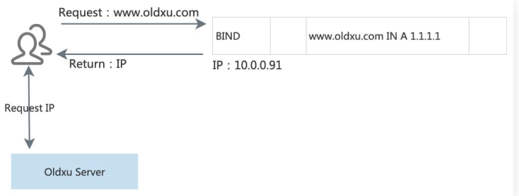

## 新建区域配置文件

```bash
vim /etc/named.conf
  ...
  #自行配置权威域名解析oldxu.com
  zone "oldxu.com" IN {
      type master;
      file "oldxu.com.zone"; #具体解析记录配置存储至那个文件
  }
  ...
  named-checkconf  #检查配置文件语法

```

## 新增区域数据库文件

```bash
vim /var/named/oldxu.com.zone
$TTL 600
oldxu.com.  IN SOA ns.oldxu.com.  qq.olxu.com.  (
    2021041514
    10800
    900
    604800
    86400
)
;给客户端返回NS记录，该域名由哪台权威服务器提供解析
oldxu.com.     IN  NS  ns1.oldxu.com.
ns1.oldxu.com. IN  A   172.16.1.91
;域名解析记录
www.oldxu.com.  IN  A  1.1.1.1
test.oldxu.com. IN  A  2.2.2.2
named-checkconfzone oldxu.com /var/named/oldxu.com.zone #加擦汗区域数据库文件配置
rndc reload  #重载DNS服务器
```

## 客户端测试解析文件

```bash
dig www.oldxu.com @172.16.1.91
```

## 场景2

用户通过DNS 服务器172.16.1.91解析www\.job. com

1.添加job.com区域配置文件

.添加区域数据库文件，配置NS记录，返回DNS权威服务器地址

3.该域的DNS权威服务器为172.16.1.91

4.添加该域的CNAME解析记录，解析至www\.o1dxu.com域名上

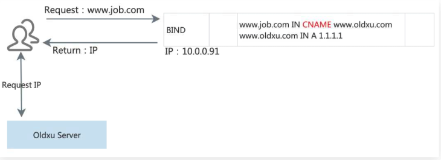

```bash
#在主配置文件/etc/named.conf,新增一个job.com区域配置
    [root@dns-master ~]# vim /etc/named.conf
        #添加job.com权威的域名解析
        zone "job.com" IN {
        type master;
        file "job.com.zone";
        };
    named-checkconf  #检查配置文件语法
#新增区域数据库文件
  vim /var/named/oldxu.com.zone
  $TTL 600
  job.com.  IN SOA ns1.oldxu.com.   qq.olxu.com.  (
      2021041514
      10800
      900
      604800
      86400
  )
  ;给客户端返回NS记录，该域名由哪台权威服务器提供解析
  job.com.       IN  NS  ns1.oldxu.com.
  dns1.oldxu.com. IN  A   172.16.1.91
  ;域名解析记录
  www.job.com.  IN  A  www.oldxu.com
检查区域数据库文件配置并且重载DNS服务器
客户端测试解析域名  dig www.job.com
```

## 场景3

配置反向解析\`PTR:IP-->FQDN
1.反向区域文件名称为逆向网络地址加.in-addr.arpa.后缀组成
2.反向区域数据库文件，例如172.16.1.200的name为200，完全格式为1.16.172.in-addr.arpa.

```bash
#在主配置文件/etc/named.conf，新增一个反向区域配置
[root@dns-master ~]# vim /etc/named.conf   //配置反向解析
zone "1.16.172.in-addr.arpa"IN {
    type master;
    file "1.16.172.zone" ;
};
#检查配置文件语法
named-checkconf

[root@dns-master ~]# cat /var/named/1.16.172.zoneSTTL 7200
IN SOA 1.16.172.in-addr.arpa. qq.o1dxu.com. (
      2021041515
      10800
      900
      604800
      86400
;给客户端返回NS记录，该域名由哪台权威服务器提供解析
@    IN    NS     ns1.oldxu.com.
;权威DNS的反向解析
91   IN    PTR    ns1.o7dxu.com.
; www反向解析
200  IN    PTR    www.o1dxu.com.

```

## DNS客户端工具

|          | 通用性        | 使用难易度   |
| -------- | ---------- | ------- |
| host     | 较多         | 简单、明了   |
| dig      | 常用语linux系统 | 比较专业    |
| nslookup | 支持多平台、应用广泛 | 使用简单、易懂 |

### host

```bash
host -t SOA baidu.com  #查询SOA记录
host -t NS baidu.com #查询NS记录
host -t -A baidu.com  #查询A记录
```

### nslookup

```bash
nslookup www.baidu.com  #解析域名对应的IP
nslookup
> set q =soa  #设定q=soa
> baidu.com 
```

### dig

```bash
dig @223.5.5.5 
    www.baidu.com  #通过dns解析域名，正向解析
dig -x 39.104.16.126 （IP地址）
    @223.5.5.5
dig -t a baidu.com  #通过dig仅查询a记录
dig -t AXFR oldxu.com  #通过dig查看区域传送配置
    

```

## 递归查询

### 什么是递归查询

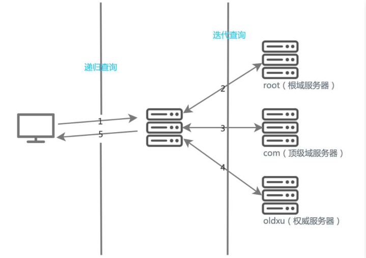

如果你要建立一个授权域名服务器，仅提供本地已存在域名解析;那么将recursion参数设置no;

如果你要建立一个递归DNS服务器，那么需要将recursion参数设置yes ;

如果递归DNS 服务器有公网TP地址，则需要开启访问控制功能，只有合法的用户才可以发起查询。

### 递归查询配置参数

| 参数              | 选项                                 | 作用           |
| --------------- | ---------------------------------- | ------------ |
| recurison       | yes/no                             | 是否开启递归查询请求   |
| allow-recurison | {adress\_match\_list \| any\|none} | 限制客户端递归请求的范围 |

### 递归查询场景实践

#### 开启递归查询

BIND默认配置中的recurison参数是启用的;

1.配置仅允许172.16.1.0网段用户可以查询(可选);&#x20;

⒉.使用客户端查询系统中存在的域名;

3.使用客户端查询系统中不存在的域名（让BIND进行递归查询);

```bash
#修改/etc/ named.conf 配置文件
  [root@dns-master ~]# vim /etc/named.confrecursion yes;
#a1low-recursion {10.0.0.0/24;172.16.1.0/24];
  [root@dns-master ~]# rndc reload
#查询存在BIND 服务中的域名;
  [root@client ~]# dig www.o1dxu.com @172.16.1.91 +short1.1.1.1
#查询不存在BIND 服务中的域名;能获得正确返回，原因是BIND进行了递归查询;
  [root@c1ient ~]# dig www.qq.com @172.16.1.91 +short
  61.241.54.232
  61.241.54.211
```

#### 关闭递归查询

```bash
#修改/etc/named.conf配置文件，关闭递归查询
 vim /etc/named.cof
   recursion no;
  rndc reload #检查配置语法是否错误
#查询本地存在域名会成功返回；因为无需进行递归查询，即可返回权威查询
dig www.oldxu.com  @172.16.1.91 +short
```

## DNS主辅同步

### 概念

辅助DNS是DNS容灾备份服务︰在主DNS和辅DNS之间建立区域数据传输机制，当主DNS遇到故障或者服务中断时，辅DNS仍可以继续提供解析服务，因此保障业务稳定运行。
辅助DNS的优势:

容灾备份，降低业务中断风险:主 DNS系统故障，辅助DNs可继续提供域名解析服务，保障业务可用性。

负责均衡，流量均摊降低负载:当辅助Dws与主DNs同时对外提供解析服务时，可以达到流量负载均衡的效果。

### 原理

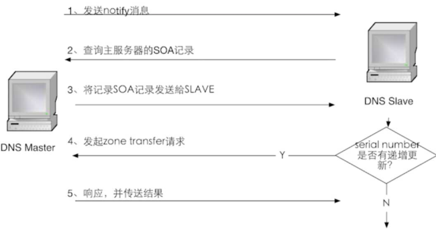

### 场景

### 环境准备

1.确保防火墙规则开放（(建议关闭);

2.保持主从服务器时钟一致;

3.搭建完主从后，若修改主服务器域配置，serail Number必须递增，否则不同步;

### 同步配置要点

1.主DNs修改named.conf配置文件，在option段添加如下内容:

添加allow-transfer:允许哪些IP地址能同步Master配置信息;

添加also-notify : Master主动通知slave域名变发生了变更;

2.辅DNs修改named.conf配置文件:

添加masterfile-format text:同步的文件类型修改为text否则文件类型为data ;

辅助DNs添加对应的区域配置文件，类型为slave，同时masters参数指向主DNs地址;

辅助DNS不可主动修改DNS数据库文件;

### master服务器配置

```bash
[root@dns-master ~]# vim /etc /named.conf
options {
      allow-transfer {172.16.1.92;};//允许哪些`IP`地址能同步Master配置信息;
      also-notify {172.16.1.92;}; //Master主动通知slave域名变发生了变更
     } 
//自行配置权威域名解析
zone "oldxu.com" IN {
      type master;
      file "oldxu.com.zone " ;
};
#添加区域数据文件
  [root@dns-master ~]# cat   /var/named/oldxu.com.zone
    $TTL 600 ; DNS失效时间，单位秒；
      oldxu.com. IN SOA ns.oldxu.com.  qq.oldxu.com. (
          2021041515
          10800
          900
          604800
          86400
)
        ;给客户端返回NS记录，由于是主辅模式，所以需要两台解
        析
        oldxu.com. IN NS ns1.oldxu.com.
        oldxu.com. IN NS ns2.oldxu.com.
        ;将两条NS记录指向两台权威的DNS地址
        ns1.oldxu.com. IN A 172.16.1.91
        ns2.oldxu.com. IN A 172.16.1.92
        ;域名解析
        www.oldxu.com. IN A 1.1.1.1
 #检查语法，重启服务
   named-checkconf
   rndc reload
     
```

### slave服务器配置

```bash
yum install bind-utils -y  #安装bind服务
vim  /etc/named.conf  #修改配置文件
options {
。。。。
    listen-on port 53 { any; };
    allow-query { any; };
    masterfile-format text;
    ...
}
#添加区域配置文件，类型为salve，然后指向master地址；
  [root@dns-slave ~]# vim /etc/named.conf
      zone "oldxu.com" IN {
      type slave;
      file "slaves/oldxu.com.zone";
      masters {172.16.1.91;};
  };
  检查语法。重启服务

```

### 测试主辅解析

```bash
dig  www.oldxu.com @172.16.1.91  #通过master解析
dig  www.oldxu.com @172.16.1.92  #通过salve测试解析
```

### 配置DNS高可用

```bash
#linxu操作
[root@client]# cat /etc/resolv.conf
# Generated by NetworkManager
nameserver 172.16.1.91
nameserver 172.16.1.92

```

## DNS子域授权

### 什么是子域授权

A服务负责（oldx6u.com）域名解析，授权B服务器管理（ops.oldxu.com）的域名解析;。

父域:oldxu.com

子域: ops.oldxu. com

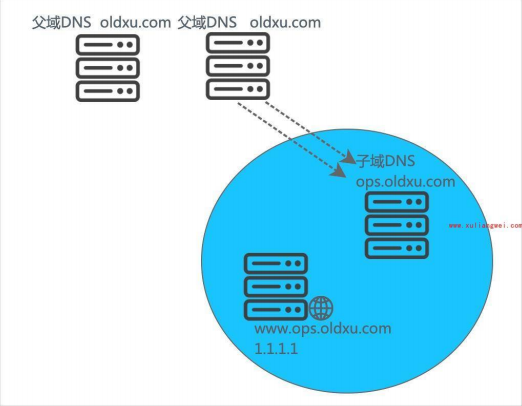

### 授权环境

| 环境         | 域名            | 节点外网地址    | 节点私网地址      |
| ---------- | ------------- | --------- | ----------- |
| 父域（master） | oldxu.com     | 10.0.0.91 | 172.16.1.91 |
| 父域（slave）  | oldxu.com     | 10.0.0.92 | 172.16.1.92 |
| 子域         | ops.oldxu.com | 10.0.0.93 | 172.16.1.93 |

### 授权场景

#### 父域配置（master）

```bash
#区域配置文件此前可以复用之前主辅配置，所以无需修改;
[root@dns-master ~]# cat /etc/named.conf
options {
    allow-transfer {172.16.1.92;3;
    a1so-notify {172.16.1.92;};
zone "o1dxu.com"” IN {
    type master;
    file "o1dxu.com.zone"";
    };
#区域文件数据库文件，将ops三级子域授权给子域服务器;
[root@dns-master ~]# vim /var / named/o1dxu.com.zone$TTL 7200; DNS失效时间,单位秒;
oldxu.com.  IN  SOA   ns.oldxu.com.   qq.o1dxu.com. (
      2021041516
      10800
      900
      604800
      86400
)
;给客户端返回NS记录，该域名由哪台权威服务器提供解析
oldxu.com.  IN  NS    ns1.o1dxu.com.
oldxu.com.  IN  Ns    ns2.oldxu.com.
;权威DNS的地址,由于权威服务器在本机，所以填写本机IP
ns1.oldxu.com.  IN   A   172.16.1.91
ns2.o1dxu.com.  IN   A   172.16.1.92
;真正的域名解析
www.oldxu.com.  IN   A   1.1.1.1 
dev.o7dxu.com.  IN   A   2.2.2.2
ttt.o1dxu.com.  IN   A   3.3.3.3
;子域配置（通常子域也应该是主从模式，如果为主从，则应该授权两台NS记录)
ops.oldxu.com.  IN   NS  ns1.ops.oldxu.com.
ns1.ops.oldxu.com.  IN   A    172.16.1.93 
#检查配置文件，区域文件，重载服务;
[root@dns-master ~]# named-checkconf
[root@dns-master ~]# rndc reload  
```

#### 子域配置（other）

```bash
#安装bind 服务
    [root@dns-slave ~]# yum install bind-utiLs -y
#修改配置文件，然后增加子域的Zone配置文件
    [root@dns-son ~]# vim /etc/named.conf
    options {
    ...
    listen-on port 53 { 127.0.0.1 ; any;};
    allow-query    { localhost; any;};
    ...
    }   
     //增加如下配置
    zone "ops.oldxu.com" IN {
        type master;
        file "ops.oldxu.com.zone";
    };
   
#添加区域数据数据库文件
    [root@dns-son ~]# cat /var/named/ops.oldxu.com.zone
    $TTL  7200
    ops.oldxu.com. IN SOA ns.ops.oldxu.com. qq.o1dxu.com.(
      2021041516
    //增加如下配置
    zone "ops.o1dxu.com"IN {
        type master;
        file "ops. o1dxu.com.zone";
    };
#添加区域数据数据库文件
    [root@dns-son ~]# cat /var / named/ops.oldxu.com.zone
      $TTL 7200
    ops.o1dxu.com. IN SOA ns.ops.o1dxu.com. qq.o1dxu.com. (
      2021041516
      10800
      900
      604800
      86400
    ops.oldxu.com.  IN   Ns   ns1.ops.oldxu.com.
    ns1.ops.oldxu.com.  IN   A   172.16.1.93
    ;配置子域解析记录
    www.ops.o1dxu.com.   IN   A   4.4.4.4
    bbs.ops.o1dxu.com.   IN   A   5.5.5.5
#检查语法并加入开机自启动
    [root@dns-son ~]# named-checkconf
    [root@dns-son ~]# systemctl start named
    [root@dns-son ~]# systemctl enab1e named

```

#### 结果验证

```bash
#客户端获取子域对应的解析（使用子域的IP）
[root@client ~]# dig www.ops.oldxu.com @172.16.1.93 +short
4.4.4.4
#客户端获取子域对应的解析（使用父域的IP）
  [root@client ~]# dig www.ops.oldxu.com@172.16.1.91 +short
  [root@client ~]# dig www.ops.oldxu.com@172.16.1.92 +short
    4.4.4.4
#客户端获取父域的解析（使用子域的IP）
    # 无法正常解析；
      [root@client ~]# dig www.oldxu.com@172.16.1.93

```

问题:由于父域与子域互相维护不同的区域配置，它们之间并不存在任何的联系，所以子域在解析父域:域名时，它并不会直接通过父域来获取权威的解析记录，那它会怎么做呢?

第一步:它会先找顶点根域;

第二步:寻找找com域对应的DNS服务器;

第三步:寻找 oldxu域对应的 DNs服务器，而后获取www对应的解析记录;。

这种查找模式是由DNS的机制所决定的;

解决的方法:明确告诉子域，让其能找到父域进项查询解析，而无需查找根域;(需要配置DNS的转发)

## DNS转发模式

### 什么是转发模式

转发指的是将域名查询请求，转至某一台服务器解析r (被转发的服务器必须允许为当前服务器做递归)转发分为两类;

区域转发:仅转发对某特定区域的解析请求;

全局转发:针对本地没有通过zone定义的区域查询请求，统统转发;

转发参数:

forwarders:转发给哪台服务器;可以多台;

forwarder only :仅转发;

forwarder first:优先转发给对应的服务器查询，如转发器未响应，则自行迭代查询;

### 转发示例

全局转发示例配置（所有本地不存在的域名都进行转发）

```bash
options {
    ...
    forward { first | only };
    forwarders { SERVER_IP; };
    ...
}

```

区域转发配置（符合该区域则进行条件转发）

```bash
zone "ZONE_NAME" IN {
    type forward;
    forward { first | only };
    forwarders { SERVER_IP; };
};

```

### DNS区域转发实践

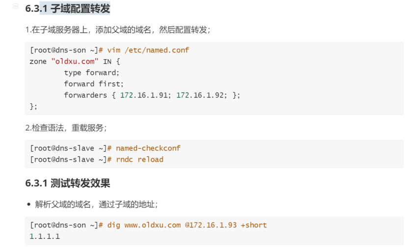

#### 子域配置转发

```bash
vim /etc/named.conf
  zone "oldxu.com" IN {
      type forward;
      forward first;
      forwarders { 172.16.1.91;
      172.16.1.92; };
};
检查语法并重载服务
```

#### 测试转发结果

```bash
dig www.oldxu.com @172.16.1.93 +short  #通过子域地址解析父域域名
```

## 智能DNS概述

智能DNS就是根据用户的来源地域，自动智能化判断来路IP返回给用户，而不需要用户进行选择;

### 什么是智能DNS

传统DNS解析，不判断访问者来源，会随机选择其中一个IP地址返回给访问者

智能DNS解析，会判断访问者的来源，为不同的访问者智能返回不同的IP地址，可使访问者在访问网站时可获取用户指定的IP地址，能够减少解析时延，并提升网站访问速度的功效。

比如一个企业的站点三个运营商的带宽都有:电信、联通、移动;同样来自三个不同运营商网络的访问用户，假设电信用户访问企业网站的时候，智能DNS会自动根据IP判断，返回电信服务器节点IP给电信用户，其他运行商也同理;

电信用户:访问www\.oldxu.com返回1.1.1.1

联通用户:访问www\.oldxu.com返回2.2.2.2

移动用户:访问www\.oldxu.com返回3.3.3.3

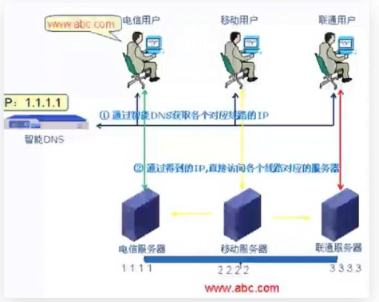

### 如何实现

实现智能DNS需要VIEW视图以及ACL访问控制列表协同完成;

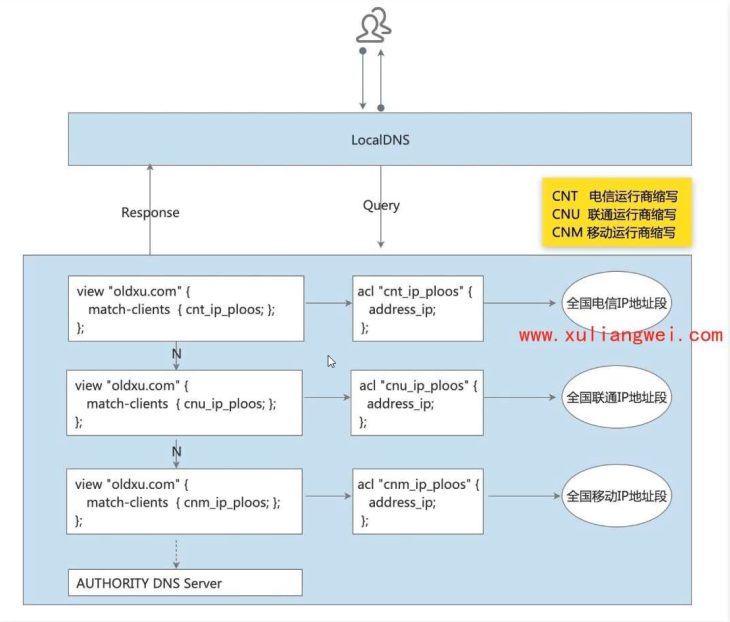

#### ACL访问控制

ACL访问控制列表，是用来限制哪些主机可以通过DNS查询，哪些不可以;系统默认内置了四种ACL

any :允许所有主机节点查询;

none:拒绝所有主机节点查询;

localhost:仅允许本地接口网络主机查询;

localnet:本地子网所有IP;

当然内置的可能无法满足企业需求，所以我们也可以自定义ACL规则;

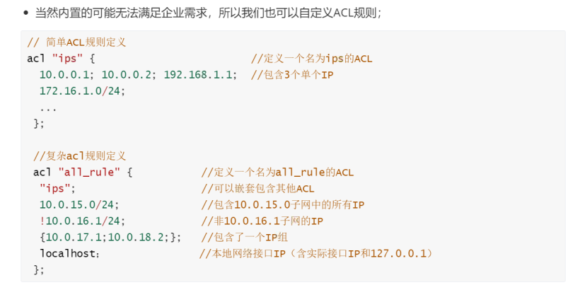

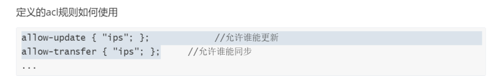

#### VEW视图功能

view语句定义了视图功能，视图是BIND9提供的强大功能，允许DNS服务器根据不同的客户端，请求相同的域名，但返回不同的解析结果;

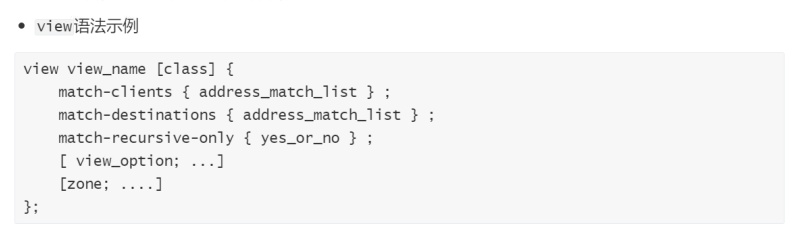

### 场景实践

维护一个主机域;根据不同环境的IP地址，查询相同域名，返回不同的结果;(企业常用)

维护一个业务域，根据不同的运行商IP地址，解析到不同的地址;(需要大量IP地址库)

#### 定义ACL规则

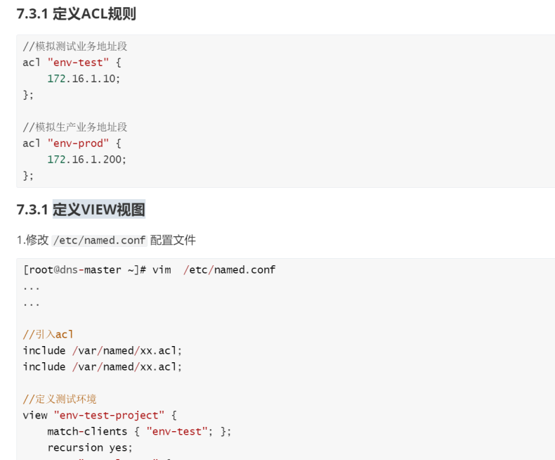

#### 定义VEW视图

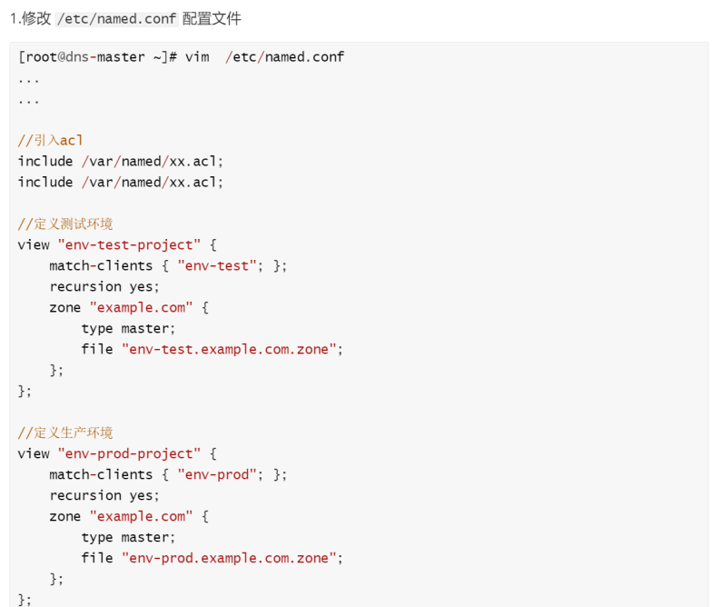

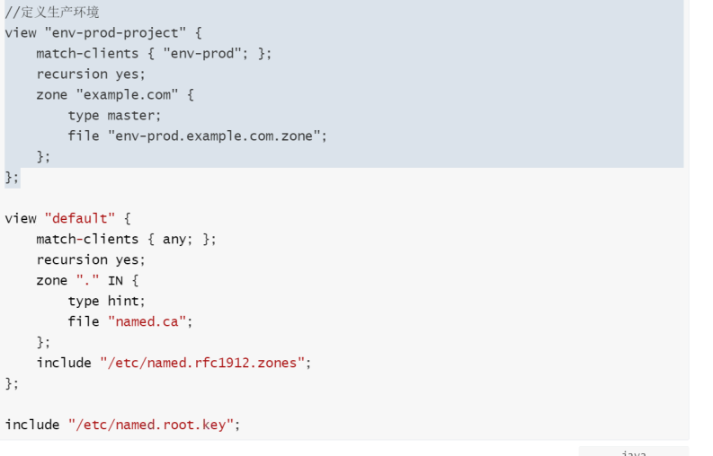

#### 测试环境zong（电信）

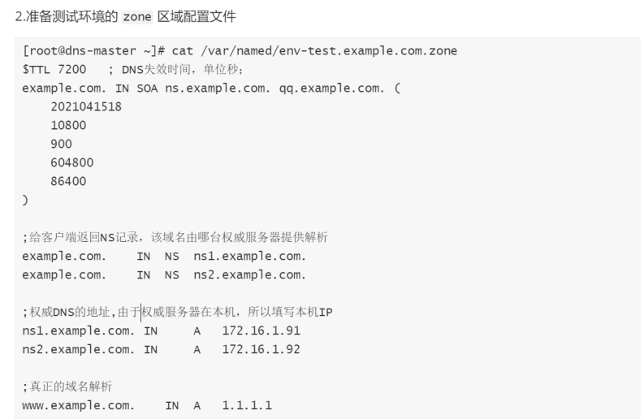

#### 生产环境zone（联通）

#### 客户端测试
