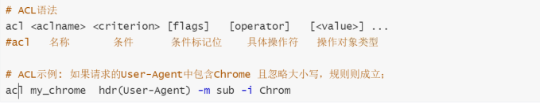
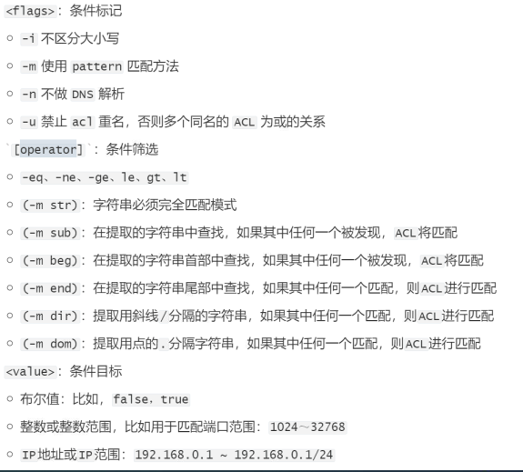
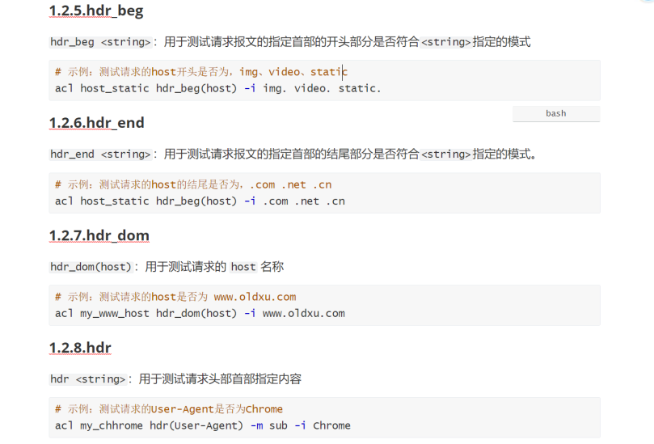
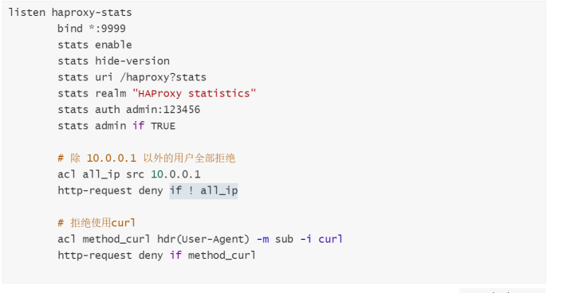
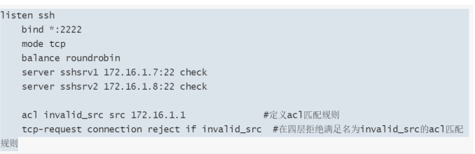

# acl实践

## 目录

-   [ACL实践](#ACL实践)
    -   [基本概述](#基本概述)
        -   [什么是ACL](#什么是ACL)
        -   [定义方式](#定义方式)
    -   [匹配示例](#匹配示例)
    -   [ACL逻辑关系](#ACL逻辑关系)
        -   [ACL访问控制](#ACL访问控制)
            -   [基于http访问控制](#基于http访问控制)
            -   [基于tcp访问控制](#基于tcp访问控制)
    -   [ACL场景实践](#ACL场景实践)
        -   [基于域名调度](#基于域名调度)
            -   [配置后端节点](#配置后端节点)
        -   [基于设备的调度](#基于设备的调度)
            -   [配置节点](#配置节点)
        -   [基于路径调度](#基于路径调度)
    -   [基于后缀调度](#基于后缀调度)
    -   [实现动静分离](#实现动静分离)

# ACL实践

## 基本概述

### 什么是ACL

ACL主要对请求报文和响应报文进行匹配和过滤。其配置法则通常分为两步:

首先定义ACL规则，即定义一个测试条件，条件可以是请求报文中的源地址、源端口、目标地址、目标端口、请求方法、URL、文件后缀等;

然后在条件得到满足时执行相应的动作;比如阻止请求、又或着转发请求至某特定的后端。

### 定义方式



\<aclname> : ACL名称，可使用字母数字: .  - \_ 区分字符大小写\<criterion> :比较的标准和条件

基于源地址、源端口、目标地址、目标端口: src. src\_port.dst.dst\_port。基于Header信息比对: hdr、 hdr\_beg、hdr\_end、hdr\_dom

基于路径或后缀比对:path\_beg. path\_end

基于请求的方法比对: method




## 匹配示例



## ACL逻辑关系

多个acl作为条件时的逻辑关系:

与:默认，如if ac11 ac12表示满足第一个ac1的同时要满足第二acl此条件才为真

或:使用or或表示，如if ac11 ll ac12表示满足ac11或ac12中的任意一个此条件就为真

非:使用!表示，如if ! acll表示对该ACL取相反的操作，意思就是非该ACL此条件为真

### ACL访问控制

#### 基于http访问控制

配置七层的请求访问控制;只能用在mode http中;

http-request { allow / deny } \[ { if | unless } \<condition> ]

示例:仅允许10.0.0.1访问haproxy的stat

```bash
  listen haproxy-stats
          bind * : 9999stats enable
          stats hide-version
          stats uri/haproxy?stats
          stats realm "HAProxy statistics"stats auth admin: 123456
          stats admin if TRUE
          #除10.0.0.1以外的用户全部拒绝ac1 a1l_ip src 10.0.0.1
          http-request deny if ! all_ip
          #拒绝使用cur1
          acl method_curl hdr(user-Agent) -m sub -i curlhttp-request deny if method_cur1

```



#### 基于tcp访问控制

配置四层的请求访问控制;只能用在mode tcp中;

tcp-request connection {accept/reject] \[{if | unless} \<condition>]示例:拒绝来源tcp应用，比如SSH

```bash
listen ssh=
    bind *:2222
    mode tcp
    balance roundrobin
    server sshsrv1 172.16.1.7:22 check
    server sshsrv2 172.16.1.8:22 check

    acl invalid_src src 172.16.1.9
    tcp-request connection reject if invalid_src

```



## ACL场景实践

### 基于域名调度

根据用户请求不同的域名，调度到不同的后端集群。

用户请求www\.oldxu.com调度到172.16.1.7:80,172.16.1.8:80

用户请求m.oldxu.com调度到172.16.1.7:8080,172.16.1.8:8080

#### 配置后端节点

```bash
frontend web
  bind *:80
  mode http

  # acl规则
  acl www_site hdr(host) -i www.oldxu.net
  acl m_site hdr(host) -i m.oldxu.net

  # 调用
  use_backend www_cluster if www_site
  use_backend m_cluster if m_site 
  default_backend www_cluster

backend www_cluster
  balance roundrobin
  option httpchk HEAD / HTTP/1.1\r\nHost:\ m.oldxu.net
  server 172.16.1.7 172.16.1.7:80 check port 8080 inter 3s rise 2 fall 3
  server 172.16.1.8 172.16.1.8:80 check port 8080 inter 3s rise 2 fall 3

backend m_cluster
  balance roundrobin
  option httpchk HEAD / HTTP/1.1\r\nHost:\ m.oldxu.net
  server 172.16.1.7 172.16.1.7:8080 check port 8080 inter 3s rise 2 fall 3
  server 172.16.1.8 172.16.1.8:8080 check port 8080 inter 3s rise 2 fall 3

```

### 基于设备的调度

根据用户请求的user-Agent，调度到不同的后端集群

用户通过chrome调度到172.16.1.7:80

用户请求Firefox调度到172.16.1.8:80

#### 配置节点

```bash
frontend web
  bind *:80
  mode http

  # acl规则-基于设备调度   chrome --www    firefox -- m
  acl chrome_agent hdr(User-Agent) -m sub -i chrome
  acl firefox_agent hdr(User-Agent) -m sub -i firefox

  # 调用
  use_backend www_cluster if chrome_agent
  use_backend m_cluster if firefox_agent
  default_backend www_cluster

backend www_cluster
  balance roundrobin
  option httpchk HEAD / HTTP/1.1\r\nHost:\ m.oldxu.net
  server 172.16.1.7 172.16.1.7:80 check port 8080 inter 3s rise 2 fall 3
  server 172.16.1.8 172.16.1.8:80 check port 8080 inter 3s rise 2 fall 3

backend m_cluster
  balance roundrobin
  option httpchk HEAD / HTTP/1.1\r\nHost:\ m.oldxu.net
  server 172.16.1.7 172.16.1.7:8080 check port 8080 inter 3s rise 2 fall 3
  server 172.16.1.8 172.16.1.8:8080 check port 8080 inter 3s rise 2 fall 3
```

### 基于路径调度

根据用户请求的URL，调度到不同的后端集群

用户通过/static调度到172.16.1.7:80

用户请求/user调度到172.16.1.8:80

```bash
frontend web
  bind *:80
  mode http

  # acl规则
  acl www_site hdr(host) -i www.oldxu.net

  # acl规则-请求/static www_cluster  /user --- m_cluster
  acl req_static path_beg -i /static
  acl req_user path_beg -i /user

  # 调用
  use_backend www_cluster if www_site req_static
  use_backend m_cluster if  www_site req_user
  default_backend www_cluster

backend www_cluster
  balance roundrobin
  option httpchk HEAD / HTTP/1.1\r\nHost:\ m.oldxu.net
  server 172.16.1.7 172.16.1.7:80 check port 80 inter 3s rise 2 fall 3
  server 172.16.1.8 172.16.1.8:80 check port 80 inter 3s rise 2 fall 3

backend m_cluster
  balance roundrobin
  option httpchk HEAD / HTTP/1.1\r\nHost:\ m.oldxu.net
  server 172.16.1.7 172.16.1.7:8080 check port 8080 inter 3s rise 2 fall 3
  server 172.16.1.8 172.16.1.8:8080 check port 8080 inter 3s rise 2 fall 3

```

## 基于后缀调度

```bash
#---------------------------------------------------------------------
# main frontend which proxys to the backends
#---------------------------------------------------------------------
frontend web
  bind *:80
  mode http

  # acl规则
  acl www_site hdr(host) -i www.oldxu.net

  # acl规则-请求txt --》 www   请求 pdf --m
  acl req_txt path_end -i .txt
  acl req_pdf path_end -i .pdf

  # 调用
  use_backend www_cluster if www_site req_txt
  use_backend m_cluster if  www_site req_pdf
  default_backend www_cluster

backend www_cluster
  balance roundrobin
  option httpchk HEAD / HTTP/1.1\r\nHost:\ m.oldxu.net
  server 172.16.1.7 172.16.1.7:80 check port 80 inter 3s rise 2 fall 3
  server 172.16.1.8 172.16.1.8:80 check port 80 inter 3s rise 2 fall 3

backend m_cluster
  balance roundrobin
  option httpchk HEAD / HTTP/1.1\r\nHost:\ m.oldxu.net
  server 172.16.1.7 172.16.1.7:8080 check port 8080 inter 3s rise 2 fall 3
  server 172.16.1.8 172.16.1.8:8080 check port 8080 inter 3s rise 2 fall 3
```

## 实现动静分离

```bash
global
    log         127.0.0.1 local2

    chroot      /var/lib/haproxy
    pidfile     /var/run/haproxy.pid
    maxconn     4000
    user        haproxy
    group       haproxy
    daemon

    # turn on stats unix socket
    stats socket /var/lib/haproxy/stats

defaults
    mode                    http
    log                     global
    option                  httplog
    option                  dontlognull
    option http-server-close
    option forwardfor       except 127.0.0.0/8
    option                  redispatch
    retries                 3
    timeout http-request    10s
    timeout queue           1m
    timeout connect         10s
    timeout client          1m
    timeout server          1m
    timeout http-keep-alive 10s
    timeout check           10s
    maxconn                 30000

listen stats
    mode http
    bind 0.0.0.0:1080
    stats enable
    stats hide-version
    stats uri     /haproxyadmin?stats
    stats realm   Haproxy\ Statistics
    stats auth    admin:admin
    stats admin if TRUE


frontend http-in
    bind *:80
    mode http
    log global
    capture request  header Host len 20
    capture request  header Referer len 60
    
    # acl规则 
    acl domain_site hdr(host) -i www.oldxu.net
    acl url_static path_beg -i /static /images /javascript /stylesheets
    acl url_static path_end  -i .jpg .jpeg .gif .png .css .js
    use_backend static_servers if domain_site url_static 
    use_backend dynamic_servers if domain_site  
    
backend static_servers
    balance roundrobin
    server imgsrv1 172.16.200.7:80 check maxconn 6000
    server imgsrv2 172.16.200.8:80 check maxconn 6000

backend dynamic_servers
  cookie srv insert nocache
    balance roundrobin
    server websrv1 172.16.200.7:80 check maxconn 1000 cookie websrv1
    server websrv2 172.16.200.8:80 check maxconn 1000 cookie websrv2
    server websrv3 172.16.200.9:80 check maxconn 1000 cookie websrv3

```
