# Haproxy

## 目录

-   [Haproxy入门实践](#Haproxy入门实践)
    -   [基础概念](#基础概念)
        -   [什么是haproxy](#什么是haproxy)
        -   [应用场景](#应用场景)
        -   [性能指标](#性能指标)
    -   [Haproxy安装配置](#Haproxy安装配置)
        -   [使用系统rpm安装](#使用系统rpm安装)
        -   [使用三方rpm安装](#使用三方rpm安装)
        -   [源码安装](#源码安装)
            -   [安装依赖环境](#安装依赖环境)
            -   [安装lua脚本](#安装lua脚本)
            -   [编译haproxy](#编译haproxy)
            -   [创建启动文件](#创建启动文件)
            -   [创建配置文件](#创建配置文件)
            -   [启动](#启动)
            -   [配置](#配置)
        -   [haproxy配置示例](#haproxy配置示例)
            -   [场景示例1](#场景示例1)
            -   [场景2](#场景2)
            -   [场景3](#场景3)
    -   [haproxy Global配置](#haproxy-Global配置)
        -   [global配置参数](#global配置参数)
        -   [配置多进程运行](#配置多进程运行)
        -   [配置多线程运行](#配置多线程运行)
        -   [配置访问日志](#配置访问日志)
    -   [Haproxy default配置](#Haproxy-default配置)
        -   [option参数](#option参数)
        -   [timeout参数](#timeout参数)
    -   [Haproxy Proxies配置](#Haproxy-Proxies配置)
        -   [mode参数](#mode参数)
        -   [bind参数](#bind参数)
        -   [maxconn参数](#maxconn参数)
        -   [server参数](#server参数)
            -   [backup](#backup)
            -   [check](#check)
            -   [inter](#inter)
            -   [rise](#rise)
            -   [fall](#fall)
            -   [maxconn](#maxconn)
            -   [maxqueue](#maxqueue)
            -   [weight](#weight)
    -   [使用子配置管理](#使用子配置管理)
        -   [创建子配置文件](#创建子配置文件)
        -   [修改unit配置](#修改unit配置)
        -   [重载服务](#重载服务)
    -   [Haproxy高级功能](#Haproxy高级功能)
        -   [基于cookie会话保持](#基于cookie会话保持)
        -   [配置示例](#配置示例)
        -   [验证session](#验证session)
        -   [redispatch参数](#redispatch参数)
        -   [基于web管理haproxy ](#基于web管理haproxy-)
            -   [状态页配置](#状态页配置)
            -   [状态页登录](#状态页登录)
        -   [基于socat管理haproxy](#基于socat管理haproxy)
        -   [安装socat](#安装socat)
        -   [修改配置文件](#修改配置文件)
        -   [实现主机动态上下线](#实现主机动态上下线)
        -   [实现滚动发布](#实现滚动发布)
    -   [服务器状态监测](#服务器状态监测)
        -   [httpchk参数](#httpchk参数)
        -   [基于端口监测](#基于端口监测)
        -   [基于url检测](#基于url检测)
        -   [基于url头检测](#基于url头检测)
    -   [IP地址透传](#IP地址透传)
        -   [七层负载地址透传](#七层负载地址透传)
        -   [四层负载地址透传](#四层负载地址透传)
    -   [自定义日志capture](#自定义日志capture)
        -   [配置实例](#配置实例)
        -   [验证日期](#验证日期)
    -   [自定义错误页面](#自定义错误页面)
        -   [errorfile](#errorfile)
        -   [errorloc](#errorloc)
    -   [自定义HTTP报文](#自定义HTTP报文)
        -   [reqadd](#reqadd)
        -   [rspadd](#rspadd)
        -   [rspdel](#rspdel)
    -   [调度算法](#调度算法)
        -   [roundrobin](#roundrobin)
            -   [配置示例](#配置示例)
            -   [调度测试](#调度测试)
            -   [动态调整](#动态调整)
        -   [static-rr](#static-rr)
            -   [配置示例](#配置示例)
            -   [调度示例](#调度示例)
        -   [leastconn](#leastconn)
            -   [配置示例](#配置示例)
            -   [调度示例](#调度示例)
        -   [source](#source)
            -   [配置示例](#配置示例)
            -   [调度示例](#调度示例)
        -   [uri](#uri)
            -   [配置示例](#配置示例)
            -   [调度示例](#调度示例)
        -   [url](#url)
            -   [配置示例](#配置示例)
            -   [调度示例](#调度示例)
        -   [hdc](#hdc)
            -   [配置示例](#配置示例)
            -   [调度示例](#调度示例)
        -   [hash\_type](#hash_type)

# Haproxy入门实践

## 基础概念

### 什么是haproxy

haproxy虽然名称中包含HA，但它不提供任何HA 高可用

的功能，它仅提供proxy 代理的功能;

但haproxy提供对后端节点进行状态检测，一但后端节点出现故障,haproxy则会将请求重新分发，这也是它将自己称为haproxy的原因。

user—>proxy—>appserver

### 应用场景

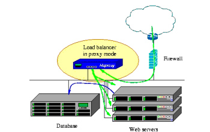

Haproxy支持http反向代理

Haproxy支持动态程序的反向代理

Haproxy支持基于tcp数据库的反向代理

### 性能指标

衡量负载均衡性能，可以从三个因素来评估负载均衡器的性能:

会话率:会话建立的速率，新的请求来了在1s能建立多少连接

会话并发能力:整体服务器的会话并发能力，能支撑多少个。

数据率:在所有会话基础上，数据传输速率或数据传输效率

经过官方测试统计，haproxy单位时间处理的最大请求数为20000个，可以同时维护40000-50000个并发连接，最大数据处理与数据交换能力为10cbps (那么10Gbps实际速率= 10/8=1.25GBps，下载速率每秒1.25GB）。综合上述， haproxy是性能优越的负载均衡、反向代理服务器。

## Haproxy安装配置

### 使用系统rpm安装

centos 7默认的base 仓库中包含haproxy的安装包文件，但是版本是1.5.18，比较旧;

距离当前版本已经有较长时间没有更新，由于版本比较旧所以有很多功能不支持;

如果对功能和性能没有要求可以使用此版本，否则推荐使用新版本。

```bash
yum install haproxy  #安装
haproxy -v  #验证版本

```

### 使用三方rpm安装

```bash
[root@proxy ~]# wget http://cdn.xuliangwei.com/haproxy22.rpm.tar.gz
[root@proxy ~]# tar xf haproxy22.rpm.tar.gz
[root@proxy ~]# yum localinstall haproxy/*.rpm -y
#验证haproxy版本
[root@proxy ~]# haproxy -v
HA-Proxy version 2.2.9-a947cc2 2021/02/06

```

### 源码安装

#### 安装依赖环境

```bash
[root@proxy ~]# yum install gcc readline-devel openssl-devel systemd-devel -y
```

#### 安装lua脚本

```bash
[root@proxy ~]# wget http: / /www.lua.org/ftp/lua-5.4.3.tar. gz
[root@proxy ~]# tar xf lua-5.4.3.tar.gz -c /usr/local/
[root@proxy ~]# cd /usr/ local/lua-5.4.3/
[root@haproxy lua-5.4.3]# make linux
[root@haproxy lua-5.4.3]# make linux test
[root@haproxy lua-5.4.3]# ln -s /usr/local/lua-5.4.3//usr/local/lua
```

#### 编译haproxy

```bash
[root@proxy ~]# wget http://cdn.xuliangwei.com/haproxy-2.4.0.tar. gz
[root@proxy ~]# tar xf haproxy-2.4.0.tar. gz
[root@proxy ~]# cd haproxy-2.4.0/
[root@haproxy haproxy-2.4.0]# make ARCH=x86_64 TARGET=linux-glibc USE_PCRE=1 USE_OPENSSL=1 \
USE_ZLIB=1 USE_SYSTEMD=1 USE_LUA=1 \
LUA_INC=/usr/ local/lua/src LUA_LIB=/usr/local/lua/src
[root@haproxy haproxy-2.4.0]# make install PREFIX=/usr/local/ haproxy-2.4.0
[root@haproxy haproxy-2.4.0]# ln -s /usr/loca1/haproxy-2.4.0//usr/1ocal/haproxy
#验证版本
[root@proxy ~]# /usr/local/haproxy /sbin/haproxy -v
HAProxy version 2.4.0-6cbbecf 2021/05/14 - https://haproxy.org/
```

#### 创建启动文件

```bash
[root@proxy ~]# vim /usr/lib/systemd/system/haproxy24.service
[unit]
Description=HAProxy Load 
BalancerAfter=syslog.target network.target
[service]
ExecstartPre=/usr/local/haproxy/sbin/haproxy -f /usr/local/haproxy/ haproxy.cfg -c -q
Execstart=/usr/loca1/haproxy/sbin/haproxy -ws -f /usr/local/haproxy /haproxy.cfg -p /var/1ib/haproxy24/haproxy. pid
ExecReload=/bin/kill -USR2 SMAINPID
[Insta11]
wantedBy=multi-user.target
```

#### 创建配置文件

```bash
[root@proxy01 ~]# cat /etc/haproxy/haproxy.cfg
global
  maxconn 100000
  # uid 99
  # gid 99
  user haproxy
  group haproxy
  daemon
  log 127.0.0.1 local2 info
  pidfile /var/lib/haproxy24/haproxy.pid
  stats socket /var/lib/haproxy24/haproxy.sock mode 600 level admin

defaults
  option http-keep-alive
  option forwardfor
  maxconn 100000
  mode http
  timeout connect 300000ms
  timeout client 300000ms
  timeout server 300000ms

listen stats
  mode http
  bind 0.0.0.0:9999
  stats enable
  log global
  stats uri  /haproxy-status
  stats auth  admin:123456

listen web_port
  bind *:80
  mode http
  server web1 127.0.0.1:8080 check inter 3000 fall 2 rise 5
```

#### 启动

```bash
[root@proxy01 ~]# systemctl cat haproxy24
# /usr/lib/systemd/system/haproxy24.service
[Unit]
Description=HAProxy Load Balancer
After=syslog.target network.target

[Service]
ExecStartPre=/usr/local/haproxy/sbin/haproxy -f /etc/haproxy/haproxy.cfg -c -q
ExecStart=/usr/local/haproxy/sbin/haproxy -Ws -f /etc/haproxy/haproxy.cfg -p /var/lib/haproxy24/haproxy.pid
ExecReload=/bin/kill -USR2 $MAINPID

[Install]
WantedBy=multi-user.target


```

#### 配置

```bash
useradd -r haproxy
mkdir /var/lib/haproxy24
浏览器访问：http://10.0.0.5:9999/haproxy-status
```

### haproxy配置示例

```bash
#nginx:
    前端：
      server {
        listen 80;
        server_name proxy.oldxu.net;
        
        location / {
          proxy_pass http://webservers;
        }
      }
    
    后端：
    upstream webservers {
      server 172.16.1.7;
      server 172.16.1.8;
    }
    关联前端和后端
      proxy_pass:

#haproxy
   frontend:
   bind         #定义前端   对外提供什么端口；
   backend:         #定义后端   集群资源池中具体有多少节点；
   use_backend:     #关联前端和后端的  类似于nginx中的proxy_pass 基于条件的方式来进行调度
   default_backend: #关联前端和后端的，默认所有的请求都调度
   listen:          #frontend和backend的组合体（直接将前后端建立起来）
   default          #提供统一的默认参数，如果定义了则使用自己的，没有定义则使用default的

```

#### 场景示例1

1、监听在所有接口的80端口上HTTP proxy服务:

1.1、将请求本机80端口的服务，都转发至webservers后端集群组。

1.2、后端webservers资源池定义了172.16.1.7:80、172.16.1.8:80两台节点。

1.3、调度方式采用轮询调度。

```bash
#nginx写法
  upstream webservers i
      server 172.16.1.7:80;
      server 172.16.1.8 :80;
      }
    server {
      listen 80;
      server_name proxy.oldxu.com;
      location / {
      proxy_pass http://webservers;
}
}

#haproxy
[root@proxy ~]# vim /etc/haproxy/haproxy.cfg
frontend web1
bind *:80
default_backend webservers
backend webservers
    balance roundrobin
    server web01 172.16.1.7:8888
    server web02 172.16.1.8:8888
#后端节点配置
[root@web conf.d]# cat oldxu.net.conf 
server {
  listen 8888;
  server_name oldxu.net;

  location / {
  root /proxy;
  index index.html;
  }

}

[root@web02 conf.d]# cat oldxu.net.conf 
server {
  listen 8888;
  server_name oldxu.net;

  location / {
  root /proxy;
  index index.html;
  }

}
#由于80端口已被其他应用占用用8888端口实验


```

#### 场景2

监听在所有接口的80端口上HTTP proxy服务:

1.1、将请求本机80端口的服务，url为/的默认转发至webservers后端集群组。

1.2、将请求本机80端口的服务，url为/1.png|/2.gif的转发至static后端集群组。

1.3、后端webservers资源池定义了172.16.1.7∶80、172.16.1.8:80两台节点。

1.4、后端static资源池定义了172.16.1.9:80、172.16.1.10:80两台节点。

1.5、调度方式采用轮询调度。

```bash
#nginx实现
  upstream webservers {
    server 172.16.1.7:80;
    server 172.16.1.8:80;
}
upstream static {
    server 172.16.1.9:80;
    server 172.16.1.10:80;
}
server {
    listen 80;
    server_name proxy.oldxu.com;
    location / {
      proxy_pass http://webservers;
}
   location ~ \.(png|gif)$  {
      proxy_pass http://static;
}
}
#haproxy实现
    # ---------------------------------------
    #haproxy(frontend、default_backend、use_backend、acl）
    #-------------------------------------------
   frontend proxy.oldxu.com *:80
      default_backend webservers   # url非png|gif结尾的，默认调度webservers集群
      acl url_static path_end -i .gif .png   #定义url的acl规则
      use_backend static if url_static   #调用static集群，url必须为.png|.gif结尾的
  
   backend webservers
      balance    roundrobin
      server web1 172.16.1.7:80 check
      server web2 172.16.1.8:80 check
  
   backend staticl
      balance    roundrobin
      server     staticl 172.16.1.9:80 check
      server     staticl 172.16.1.10:80 check

```

#### 场景3

1、监听在所有接口的80端口上HTTP proxy服务:

1.1、将请求本机80端口的服务，直接代理至后端的172.16.1.11:80 节点。

1.2、无需采用负载均衡模式，与nginx代理配置大同小异。

```bash
#不加负载均衡
  #nginx
   server {
    listen 80;
    server_name proxy.oldxu.com;
    location / {
    proxy_pass http://172.16.1.11:80;
    }
    } 
  #haproxy
    listen proxy.oldxu.com *:80
    server web1 172.16.1.11:80;
#haproxy实现负载均衡
  frontend web
    bind *:80
    default_backend webservers
  backend webservers
        balance roundrobin
        server web01 172.16.1.7:8888 check
        server web02 172.16.1.8:8888 check

```

## haproxy Global配置

### global配置参数

Global settings全局配置，用于设定全局配置参数;

daemon:以守护进程模式运行;

chroot /var/lib/haproxy:锁定运行目录;

user haproxy:运行haproxy进程用户身份;

group haproxy:运行haproxy进程用户组身份;

maxconn 4000:设定每个haproxy进程所接受的最大并发连接数;

cpu-map 1 0: cpu亲和，第一个参数是进程编序号，第二个参数是cpu序号;

nbproc \<number>:指定启动haproxy进程数量，默认启动一个进程

nbthread \<number>:指定启动haproxy线程数量，默认启动一个线程，不允许和nbproc同时使用log 127.0.0.1 loca12:日志记录通过本地rsyslog的local2设备写入

stats socket /var/lib/haproxy/stats:基于socket通信，可实现动态变更配置

spread-checks <0..50，in percent>:在haproxy后端有着众多的服务器节点，如果同时进行健康检查，则会对haproxy造成较大的性能影响;此选项用于将其检查的时间间隔长度上增加或减少一定随机时长;官方建议2-5(20%-50%)之间;如果后端主机较多的情况下(比如1000台甚至更多）能够避免同时并发对后端主机check时，减少对haproxy的性能影响;

### 配置多进程运行

### 配置多线程运行

### 配置访问日志

```bash
[root@proxy01 haproxy]# vim /etc/rsyslog.conf
    # Provides UDP syslog reception
    $ModLoad imudp
    $UDPServerRun 514
    local2.*                                                /var/log/haproxy.log
[root@proxy01 haproxy]# systemctl restart rsyslog
[root@proxy01 haproxy]# systemctl restart haproxy
```

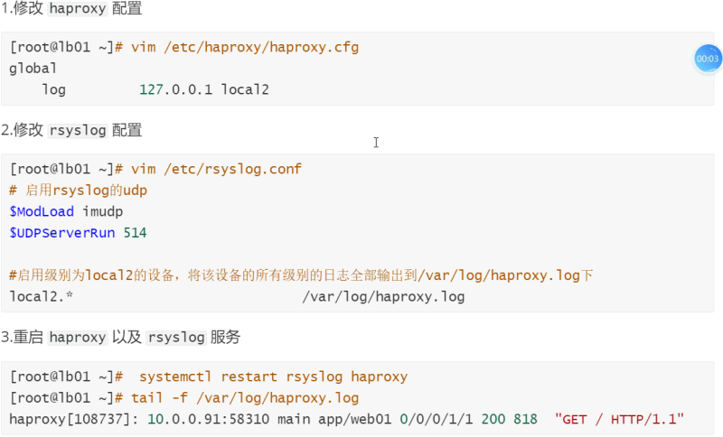

## Haproxy default配置

defaults段用于为所有其它配置段提供默认参数。

httplog

option httplog:用来记录日志，其通常包括但不限于HTTP请求、连接计时器、会话状态、连接数、捕获的首部及cookie、“frontend”、“backend”等信息。

### option参数

dontlognull

option dontlognu17 :不记录健康检查的日志信息;

redispatch

option redispatch:当找不到cookie对应的服务器时，重新分配新的节点给客户端（后续讲解)

forwardfor

option forwardfor:传递客户端真实lE(后续讲解)

### timeout参数

queue

timeout queue 1m:当请求超过最大并发连接数，多余请求会进入队列，那该请求在等待多长时间则超时;

connect

timeout connect 10s : haproxy与后端服务器连接超时时间;

client

timeout client 1m:定义客户端与haproxy连接后，数据传输完毕，不再有数据传输，即非活动连接的超时时间;

server

timeout server 1m:定义haproxy与后端应用服务器的非活动连接超时时间

check

timeout check 10s:健康检测的时间的最大超时时间

http-request

timeout http-request 10s:客户端发送http请求的超时时间

http-keep-alive

timeout http-keep-alive 10s : http请求连接建立的最大超时时间

maxconn

maxconn 3000:最大并发连接数（不可以超过global)主要针对后端服务器的并发连接数

## Haproxy Proxies配置

代理相关配置:

frontend \<name>:用于定义一系列监听的端口，这些端口可接受客户端请求并与之建立连接;

backend \<name>:用于定义一系列后端服务器，代理将会将对应客户端的请求转发至这些服务器

listen \<name>:通过关联“前端"和"后端"定义了一个完整的代理;

### mode参数

mode概念:设置Haproxy 实例运行的协议。mode语法: mode { tcp/ http }

tcp:实例运行于TCP模式，不对7层报文做任何检查;通常用于SSL、SSH、MysQL等应用

http:实例运行于HTTP模式，客户端请求服务端，服务端重新封装请求报文，请求后端真实节点

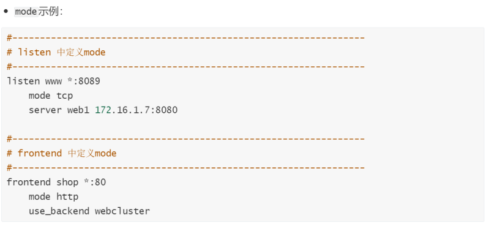

### bind参数

bind概念:设置Haproxy实例运行的端口

bind语法: bind \[\<address>]:\<port\_range> \[，...] interface \<interface>


\<port\_range>:可以是一个特定的TCCP端口，也可是一个端口范围，如8080-9090 ;

\<interface>:指定物理接口名称，仅能在Linux系统上使用;其不能使用接口别名，只有管理有权限指定绑定的物理接口;

```bash
bind示例:
#—--------------------
#listen中定义 bind
#-------------------------
listen proxy.oldxu.com
    bind *:80#单个端口
    mode tcp
    server web1 172.16.1.7:8080


# frontend中定义 bind
#---------------------
frontend proxy.oldxu.com
    bind *:8899-9090#连续端口mode http
    use_backend webcluster
```

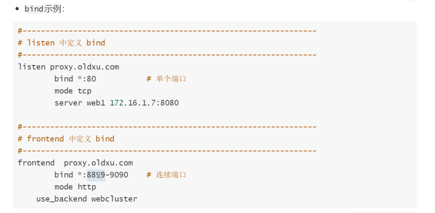

### maxconn参数

maxconn概念:设定一个前端的最大并发连接数，对于大型站点来说，应该尽可能提高此值，从而避免haproxy无法应答用户请求。当然，此值最大值不能超出global段中的定义。

maxconn注意: haproxy会为每个连接维持两个缓冲，每个缓冲的大小为8KB，再加上其它的数据，每个连接将大约占用17KB的RAM空间。这意味着经过适当优化后，1GB的可用RAM空间将能维护40000-50000并发连接。

maxconn语法: maxconn \<conns>

\<conns>:如果为\<conns>指定了一个过大值，极端场景下，其最终占据的空间可能会超出当前主机的可用内存，这可能会带来意想不到的结果;因此，将其设定了一个系统可接受值。

```bash
[root@1b01 ~]# cat /etc/haproxy/haproxy.cfg
#--------------------------
# Global settings(定义全局，最大不能超过4000并发连接数）
#----------------------------
global
maxconn      4000
#-—-------------------------
# defaults settings(当frontend没定义则使用默认，最大不能超过3000并发连接数)
#----------------------------
defaults
maxconn   3000
#--------------------------
# frontend settings(定义每个站点的最大连接数，所有站点并发值加起来不能超过G1oba1中的设定)
#—-------------------------
frontendproxy.oldxu.com *:80
    mode http
    maxconn 2000
frontend ha.oldxu.com *:80
      mode http
      maxconn 2000
```

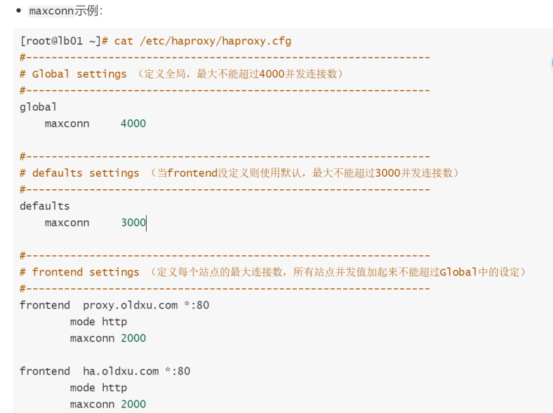

### server参数

为后端声明一个server节点信息。因此，不能用于defaults和frontend区段。

server语法:server <name> <address>\[ : port] \[param \*]

\<name>:为此服务器指定标识名称，会出现在日志文件中;

\<address>:填写节点的IPv4地址，也支持使用可解析的主机名称;

\[:port]:指定将连接所发往节点的目标端口，如未设定，则使用客户端请求的端口;

#### backup

backup设定为备用服务器
在负载均衡场景中，所有的正常server均不可用时，此backup节点则会顶替提供服务;

```bash
backend webcluster
server web1 172.16.1.7:80 backup# 当8与9都节点异常，则启用7节点
server web2 172.16.1.8:80
server web3 172.16.1.9:80
```

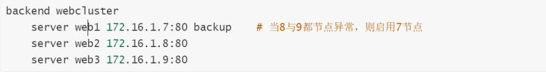

#### check

check : 对此server进行TCP的健康状态检查;

```bash
backend webcluster
    server web1 172.16.1.7:80 backup   #当8与9都节点异常，则启用7节点
    server web2 172.16.1.8:80 check port 80  #检测tcp的80端口
    server web3 172.16.1.9:80 check port 80
```

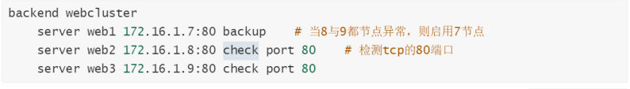

#### inter

inter \<delay>:设定健康状态检查的时间间隔，单位为毫秒，默认为2000毫秒;

```bash
backend webcluster
    server web1 172.16.1.7:80 backup
    server web2 172.16.1.8:80 check inter 3000
    server web3 172.16.1.9:80 check inter 3000
```

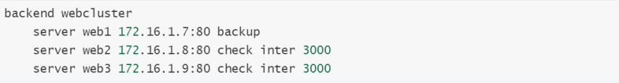

#### rise

rise \<count>:设置离线状态转换至正常状态需要成功检查的次数;

```bash
backend webcluster
    server web1 172.16.1.7:80 backup
    server web2 172.16.1.8:80 check inter 3000 rise 2
    server web3 172.16.1.9:80 check inter 3000 rise 2
```

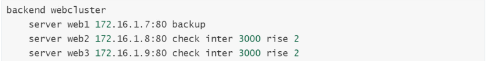

#### fall

fall \<count>:设置正常状态节点转换为不可用状态，需要检查的次数;

```bash
backend webcluster
    server web1 172.16.1.7:80 backup
    server web2 172.16.1.8:80 check inter 3000 rise 2 fa1l 3
    server web3 172.16.1.9:80 check inter 3000 rise 2 fa1l 3
```

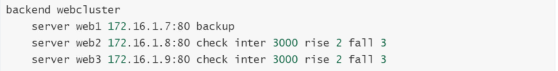

#### maxconn

maxconn \<maxconn> :指定此服务器接受的最大并发连接数;

如果发往此服务器的连接数目高于此处指定的值，其将被放置于请求队列，以等待其它连接被释放;

```bash
backend webcluster
    server web1 172.16.1.7:80 backup
    server web2 172.16.1.8:80 check inter 3000 rise 2 fall 3 maxconn 2000
    server web3 172.16.1.9:80 check inter 3000 rise 2 fall 3 maxconn 3000
```

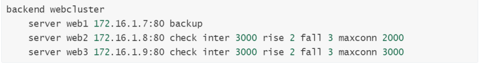

#### maxqueue

maxqueue \<maxqueue>:设定请求队列的最大长度;

当请求超过 maxconn设定的数值，剩余请求进入排队状态，排队的最大长度由maxqueue决定。

```bash
#节点总共能处理的并发连接之和不能超过global设定的maxconnbackend webcluster
balanceroundrobin
    server web1 172.16.1.7:80 check maxconn 2000 maxqueue 200
    server web2 172.16.1.8:80 check maxconn 2000 maxqueue 200
```


#### weight

weight \<weight>:服务器节点权重，默认为1，最大值为256,

表示不参与负载均衡，等同于将该节点进行下线处理（可以通过脚本实现滚动上线与下线);

```bash
backend webcluster
server web1 172.16.1.7:80 backup
server web2 172.16.1.8:80 check inter 3000 rise 2 fall 3
server web3 172.16.1.9:80 check inter 3000 rise 2 fall 3
```

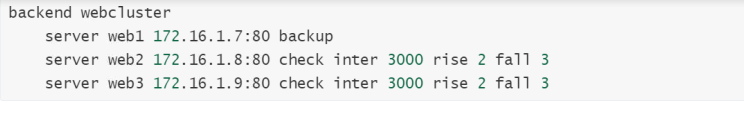

## 使用子配置管理

当业务众多时，将所有配置都放在一个配置文件中，会造成维护困难。

可以考虑按业务分类，将配置信息拆分，放在不同的子配置文件中，从而达到方便维护的目的。

### 创建子配置文件

```bash
[root@proxy01 haproxy]#  cat /etc/haproxy/conf.d/app.oldxu.net.cfg 
frontend app_web
    bind *:8899
    mode http
    use_backend app_servers
    
backend app_servers
    balance roundrobin
    server web1 172.16.1.7:8888 check inter 3000 fall 2 rise 5
    server web2 172.16.1.8:8888 check inter 3000 fall 2 rise 5
```

### 修改unit配置

```bash
[root@proxy01 haproxy]# cat  /usr/lib/systemd/system/haproxy.service
[Unit]
Description=HAProxy Load Balancer
After=network-online.target
Wants=network-online.target

[Service]
EnvironmentFile=-/etc/sysconfig/haproxy
Environment="CONFIG=/etc/haproxy/haproxy.cfg" "PIDFILE=/run/haproxy.pid"
Environment="CONFIG_D=/etc/haproxy/conf.d/"   #定义配置文件路径变量

#启动或停止使用-f调用CONFIG_D变量
ExecStartPre=/usr/sbin/haproxy -f $CONFIG -f $CONFIG_D -c -q $OPTIONS
ExecStart=/usr/sbin/haproxy -Ws -f $CONFIG -f $CONFIG_D -p $PIDFILE $OPTIONS
ExecReload=/usr/sbin/haproxy -f $CONFIG -f $CONFIG_D -c -q $OPTIONS
###
ExecReload=/bin/kill -USR2 $MAINPID
KillMode=mixed
SuccessExitStatus=143
Type=notify

[Install]
WantedBy=multi-user.target
#主要作用是添加子配置目录到unit文件中，使其能加载子目录配置
```

### 重载服务

```bash
[root@proxy01 haproxy]# systemctl daemon-reload
[root@proxy01 haproxy]# systemctl restart haproxy
[root@proxy01 haproxy]# netstat -lntp
Active Internet connections (only servers)
Proto Recv-Q Send-Q Local Address           Foreign Address         State       PID/Program name    
tcp        0      0 0.0.0.0:8899            0.0.0.0:*               LISTEN      112435/haproxy 
```

## Haproxy高级功能

### 基于cookie会话保持

在backend服务器组启用cookie植入功能,

haproxy会将后端服务器定义的serverID植入到客户端的cookie中，以保证会话的持久性;

需要设置backend中的cookie以及server指令的cookie选项。

1.定义key：  SERVERID

2.定义value：为server段中的每个节点起一个名称；  cookie name

3.当用户请求时，haproxy会下发一个httpheader信息，  Set-Cookies: SERVERID:web01

4.当浏览器在次请求haproxy会在request中增加一个header： cookie: SERVERID:web1

5.已便实现会话保持的方案：

ip\_hash： 基于来源ip进行hash取模，已便实现会话保持；

cookie植入：haproxy很容易实现，Nginx也可以实现，需要三方模块（自行完成一下）

session共享：基于Redis实现;

### 配置示例

```bash
frontend web
        bind *:80-88
        mode http
        default_backend webservers
backend webservers
        balance roundrobin

        cookie SERVERID insert nocache
        server web01 172.16.1.7:8888 check port 8888 inter 3s rise 2 fall 3 maxconn 2000 maxqueue 1000 weight 1 cookie web1
        server web02 172.16.1.8:8888 check port 8888 inter 3s rise 2 fall 3 maxconn 2000 maxqueue 1000 weight 1 cookie web2

```

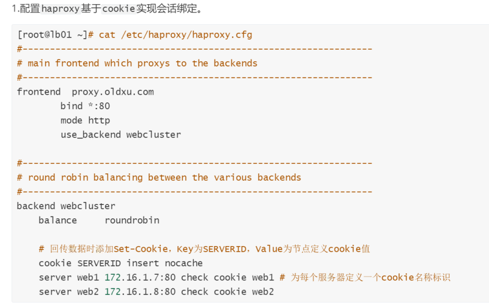

### 验证session

客户端第一次请求。haproxy 会挑选一个节点响应，并会通过set-cookies返回该响应的是哪台后端节点

### redispatch参数

### 基于web管理haproxy&#x20;

```bash
[root@lb01 ~]# cat /etc/haproxy/haproxy.cfg
listen haproxy-stats
mode http
bind * :7777
stats enable#启用stats功能
stats refresh 10s#设定自动刷新时间间隔
stats hide-version#隐藏haproxy版本
stats uri /haproxy?stats# stats页面的访问路径
stats realm "HAProxy stats"#认证提示信息
stats auth oldxu :123456#认证的账号和密码
stats admin if TRUE#启用管理功能

```

#### 状态页配置

#### 状态页登录

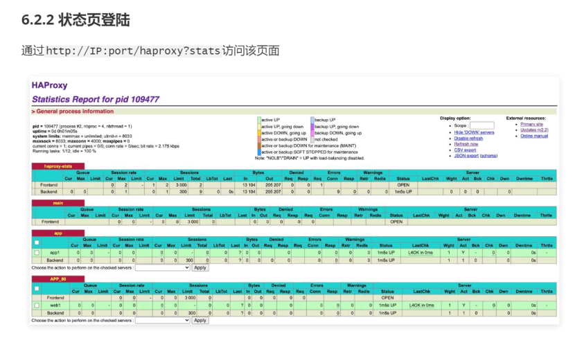

### 基于socat管理haproxy

### 安装socat

```bash
yum install socat
```

### 修改配置文件

```bash
vim /etc/haproxy/haproxy.cfg
global
     #turn on unix socat
     stats socket /var/lib/haproxy/stats level admin
systemctl restart haproxy
```

### 实现主机动态上下线

```bash
echo "show info" | socat stdio /var/lib/haproxy/stats  #获取详情
echo "disable server webservers/web01" | socat stdio /var/lib/haproxy/stats   #实现下线
echo "enable server webservers/web01" | socat stdio /var/lib/haproxy/stats    #实现上线

```

### 实现滚动发布

```bash
#免密，将10.0.0.9主机与所有的节点进行免密登录；
  ssh-copy-id -i ~/.ssh/id_rsa.pub root@172.16.1.5
  ssh-copy-id -i ~/.ssh/id_rsa.pub root@172.16.1.6
  ssh-copy-id -i ~/.ssh/id_rsa.pub root@172.16.1.7
  ssh-copy-id -i ~/.ssh/id_rsa.pub root@172.16.1.8
# 详情见下面脚本
```

[client\_check.sh](file/client_check_NtdoPOILln.sh " client_check.sh")

[deploy.sh](file/deploy_bh4JZz76Di.sh " deploy.sh")

## 服务器状态监测

基于端口做状态监测，此为默认方式基于指定URI做状态监测

基于指定URI的request请求头部内容做状态监测;

### httpchk参数

option httpchk指令基于http协议来做健康检查，只有返回状态码为2xx或3xx的才认为是健康，其余所有状态码都认为不健康。

如果不设置该选项时，默认采用tcp做健康检查，只要能建立tcp就表示健康。

option httpchk语法:

option httpchk

option httpchk \<uri>:检查的uri路径，默认为/。接受带有查询参数的urio&#x20;

option httpchk \<method> \<uri> : http检查使用的方法。建议采用HEAD方法。

option httpchk \<method> \<uri> \<version>:检查的HTTP协议版本，默认为HTTP/1.0，如果修改为HTTP/1.1，还强制要求指定Host，中间使用\r\n隔离。

### 基于端口监测

通过监听端口进行健康检测。

这种检测方式，haproxy只会去检查后端server的端口，并不能保证服务的真正可用。

```bash
[root@1b01 ~]# vim /etc/haproxy/ haproxy.cfg
    listen http_proxy 0.0.0.0:80
        mode http
        balance roundrobin
        server web1 172.16.1.7:80 check   #基于tcp检测端口
        server web2 172.16.1.8:80 check
```

### 基于url检测

通过URI获取进行健康检测。通过GET后端服务的web页面，基本上可以代表后端服务的可用性。

```bash
[root@lb01 ~]# vim /etc/haproxy / haproxy.cfg
 listen http_proxy 0.0.0.0:80
      mode http
      balance roundrobin
      
      option httpchk GET /index.html#基于URI，会消耗网络带宽
      server web1 172.16.1.7:80 check port 80
      server web2 172.16.1.7:80 check port 80
```

### 基于url头检测

通过request获取的头部信息进行匹配，然后进行健康检测。

将健康检查的请求发送至后端节点的80端口，然后与Host进行匹配，用来确定该后端节点是否正常。

```bash
[root@1b01 ~]# vim /etc/haproxy/haproxy.cfg
  listen http_proxy 0.0.0.0:80
      mode http
      balance roundrobin
      option httpchk HEAD /HTTP/1.1\r\nHost:\ proxy.o1dxu.com # head减少网络消耗
      
      server web1 172.16.1.7:80 check port 80 
      server web2 172.16.1.8:80 check port 8o
```

## IP地址透传

web服务器中记录客户端的真实IP地址，主要用于访问统计、安全防护、行为分析、区域排行等场景。

### 七层负载地址透传

Haproxy工作于反向代理模式，其发往服务器的请求中的客户端TP均为Haproxy主机的地址而非真正客户端的地址，这会使得服务器端的日志信息记录不了真正的请求来源，X-Forwarded-For首部则可用于解决此问题。

HAProxy可以向每个发往服务器的请求上添加此首部，并以客户端IP为其value。

option forwardfor语法: option forwardfor \[ except \<network> ] \[ header \<name> ]\[ if-none ]

\<network>:可选参数，当指定时，源地址为匹配至此网络中的请求都禁用此功能;

\<name>:可选参数，可自定义一个首部，如x-client来替代x-Forwarded-For ;

&#x20;if-none:仅在此首部不存在时才将其添加至请求报文中;

```bash
#option forward示例
[root@lb01 ~]# cat /etc/haproxy/haproxy.cfg
defaults
    option forwardfor #此为默认值,首部字段默为:X-Forwarded-For
frontend main
    bind *:8023
    mode http
    default_backend app
backend app
    balance roundrobin
    server web 172.16.1.7:80 check
    server web 172.16.1.8:80 check

```

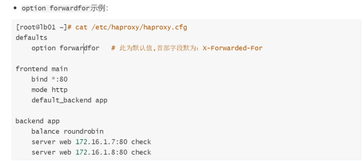

### 四层负载地址透传

```bash
#配置haproxy基于tcp协议访问
[root@haproxy ~]# vim /etc/haproxy/haproxy.cfg
frontend web_tcp
  bind *:88
  mode tcp      # tcp
  default_backend webservers_tcp

backend webservers_tcp
  mode tcp
  balance roundrobin
  server 172.16.1.6 172.16.1.6:8888 check port 8888 inter 3s rise 2 fall 3  send-proxy
  #配置后端web节点
  [root@proxy02 ~]# cat /etc/nginx/conf.d/proxy.oldxu.net.conf
http {
log_format main '$remote_addr - $remote_user [$time_loca1] "$request""Sproxy_protoco1_addr"'
} 
server {
        listen 8888 proxy_protocol;
        server_name proxy.oldxu.net;
        root /proxy;

        location / {
                index index.html;

        }
}

```

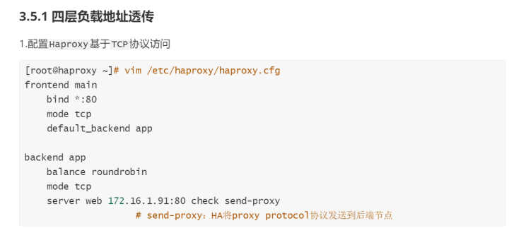

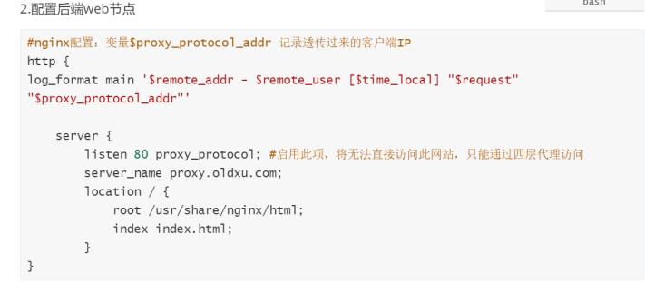

## 自定义日志capture

capture {request|response} header捕获并记录指定请求或响应首部最近一次出现时的第一个值，捕获的首部值使用花括号}括起来后添加进日志中。

如果需要捕获多个首部值，它们将以指定的次序出现在日志文件中，并以竖线"|"作为分隔符。不存在的首部记录为空字符串。最常需要捕获的首部有如下几个:

1.虚拟主机环境中使用的Host字段

2.上传请求首部中的content-length字段

3.快速区别真实用户和网络机器人的user-agent字段

4.代理环境中记录真实请求来源的x-Forward-For字段

capture语法:capture request header \<name> len \<length>

\<name>:要捕获的名称，不区分大小写。注意:记录在日志中是首部对应的值，而非首部名称。

\<length>:指定记录首部值时所记录的精确长度，超出的部分将会被忽略。

### 配置实例

```bash
vim /etc/haproxy/haproxy.cfg
frontend web
        bind *:80
        mode http
        default_backend webservers

        capture request header Cache-Control        len 40   # 捕捉请求的域名
        capture request header Host        len 40   # 捕捉请求的域名
        capture request header User-Agent  len 40   # 捕捉请求的设备
        capture response header Server     len 40   # 捕捉响应的Server是什么

backend webservers
        balance roundrobin
        #cookie HaproxyCookie insert nocache
        option httpchk HEAD / HTTP/1.1\r\nHost:\ proxy.oldxu.com
        server 172.16.1.6 172.16.1.6:8888 check port 8888 inter 3s rise 2 fall 3 maxconn 2000 maxqueue 1000
        server 172.16.1.7 172.16.1.7:8888 check port 8888 inter 3s rise 2 fall 3 maxconn 2000 maxqueue 1000
        server 172.16.1.8 172.16.1.8:8888 check port 8888 inter 3s rise 2 fall 3 maxconn 2000 maxqueue 1000
    
    tail -f /var/log/haproxy.log
Sep  3 09:55:31 localhost haproxy[117457]: 10.0.0.1:64058 [03/Sep/2021:09:55:31.936] web webservers/172.16.1.6 0/0/0/1/1 404 690 - - ---- 2/2/0/0/0 0/0 {no-cache|10.0.0.5|Mozilla/5.0 (Windows NT 10.0; Win64; x64} {nginx/1.20.1} "GET /adasdas HTTP/1.1"
```

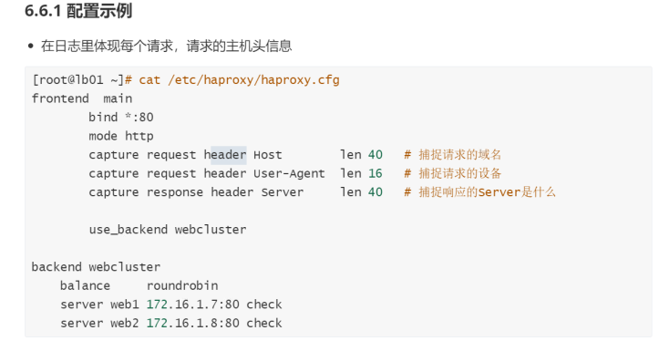

### 验证日期


## 自定义错误页面

Haprony自定义错误页面有两种方式

一种是由haproxy本机提供错误页面，通过errorfile参数来设定。

第二种是将错误转到一个指定的ur1地址，通过errorcode参数来设定。

### errorfile

&#x20;5oo /opt/500.http#捕捉错误码为500将其重定向，由本机来提供错误页面
&#x20;   errorfile 502 /opt/502.http
&#x20;   errorfile

```bash
[root@haproxy ~]# cat /etc/haproxy/haproxy.cfgdefaults
    errorfile 500 /opt/500.http  #捕捉错误码为500将其重定向，由本机来提供错误页面
    errorfile 502 /opt/502.http
    errorfile 503 /opt/503.http
#准备503对应的错误页面，需要添加头部信息
[root@proxy01 ~]# cat /opt/503.http 
  HTTP/1.1 503 
  Content-Type:text/html;charset=utf-8

  <!DOCTYPE html>
  <html lang="en">
    <head>
      <meta charset="UTF-8">
      <title>报错页面</title>
    </head>

    <body>
      <center><h1>网站维护中..请稍候再试</h1></center>
      <center><h2>请联系网站管理人员</h2></center>
      <center><h3>503 Service Unavailable</h3></center>
    </body>
  </html>
```

### errorloc

```bash
#使用errorloc选项来捕捉错误状态码，然后将其重定向到其他url，修改haproxy配置
[root@haproxy ~]# cat /etc/haproxy/haproxy.cfgdefaults
errorloc 503 https://www.xuliangwei.com/error/

```

## 自定义HTTP报文

### reqadd

reqadd \<string> \[{if | unless} \<cond>]在请求报文中添加指定首部

实现原理:client-->haproxy--reqadd（添加Header) -->web

```bash
#在frontend中使用reqadd，将发往后端集群的请求中添加一个Header
[root@1b01 ~]# cat /etc/haproxy / haproxy.cfgfrontend main
      bind *:88mode http
      reqadd x-via:\Haproxy-Node1
      use_backend webcluster
[root@1b01 ~]# systemctl reload haproxy
#.修改后端nginx.conf中logformat添加""$http_x_via""
[root@veb ~]# vim /etc/nginx/nginx.conf
http {
log_format main '$remote_addr - $remote_user [stime_loca1] "Srequest" "
                '$status Sbody_bytes_sent "shttp_referer" "
                '"Shttp_user_agent" "Shttp_x_forwarded_for" "Shttp_x_via" ';

```

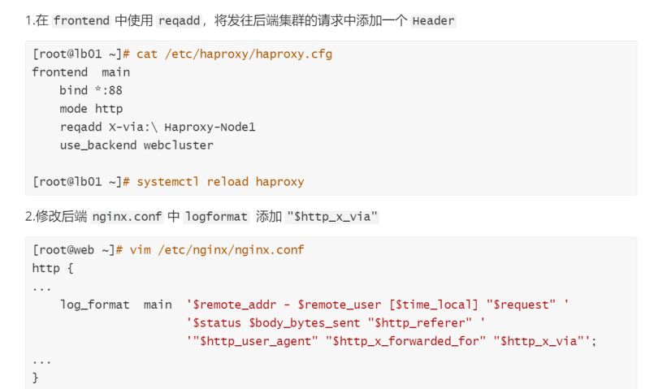

### rspadd

rspadd在响应报文中添加指定首部

实现原理: web-->haproxy--rspadd（添加Header) -->client

```bash
frontend web
      bind *:80
      mode http
      default_backend webservers

      # 自定义添加Header给后端的Nginx节点
      http-request add-header X-via 
```

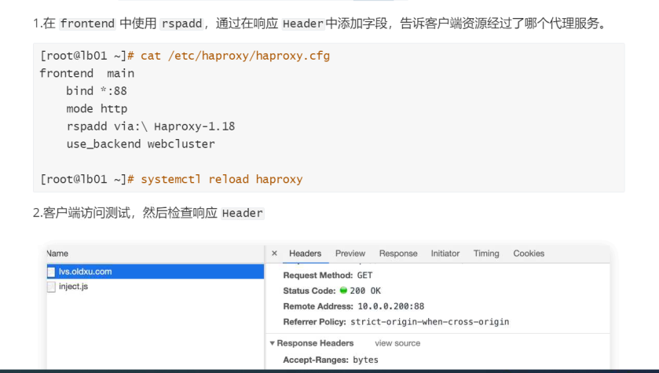

### rspdel

## 调度算法

| roundrobin | 动态轮询                                                                      |
| ---------- | ------------------------------------------------------------------------- |
| static-rr  | 静态轮询                                                                      |
| leastconn  | 最少连接数调度算法                                                                 |
| source     | 基于ip\_hash取模实现也可修改为consistent一致性hahs调度                                    |
| uri        | 根据请求的目标uri做调度，&#xA;相同的uri、不同的客户端始终调往同一服务器节点&#xA;相同的客户端、不同的url，可能会调度到不同的节点 |
| url\_param | 基于用户请求的关键字做调度                                                             |
| hdr        | 基于用户请求的header进行调度  可以是User-Agent，也可以是其他的Header字段；                         |

Haproxy 根据后端服务器的负载，或其他的计算的标准，判断挑选哪台Rs来进行请求处理。

Haproxy调度算法语法，可用于defaults、listen、backend ;

### roundrobin

roundrobin:基于权重进行轮询，保持均匀分布，这是最平衡、最公平的算法。

此算法是动态的，这表示其权重可以在运行时进行调整，不过，在设计上，每个后端服务器仅能最多接受4128个连接;

#### 配置示例

#### 调度测试

#### 动态调整

### static-rr

#### 配置示例

#### 调度示例

### leastconn

leastconn:新的连接请求被派发至具有最少连接数目的后端服务器;此算法是动态的，可以在运行时调整其权重;

#### 配置示例

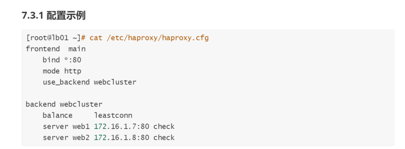

#### 调度示例

### source

source:源地址hash调度算法，将请求的源地址进行 hash运算，得到一个具体的数值，同时对后端服务器进行编号，按照运算结果将请求分发到对应编号的服务器上。

这可对不同源IP的访问进行负载分发，对同一个客户端P的请求始终被派发至某特定的服务器。

注意:如某服务器宕机或新添加了服务器，许多客户端的请求可能会被派发至与此前请求不同的服务器;不过也可以使用hash-type修改此特性;

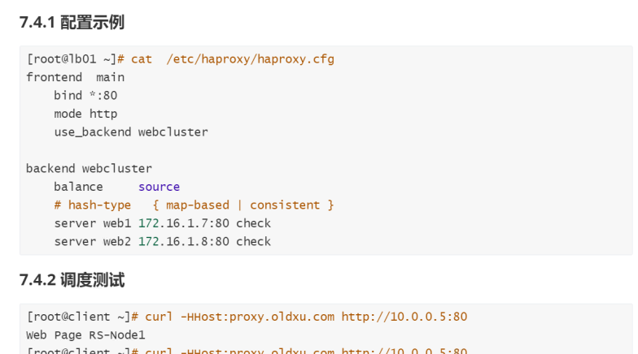

#### 配置示例

#### 调度示例

### uri

uri:基于对用户请求的uri做hash并将请求转发到后端指定服务器。

理解:同一个节点访问不同的uri可能会被调度到不同的后端服务器处理，但是不同的节点访问相同的uri则会被调度到同一台服务器处理，因为基于uri调度是在服务端完成的而非客户端。这种调度算法多用在缓存场景，能有效提高命中率。

注意，此算法仅应用于HTTP后端服务器场景;其默认为静态算法，不过也可以使用hash-type修改此特性;

#### 配置示例

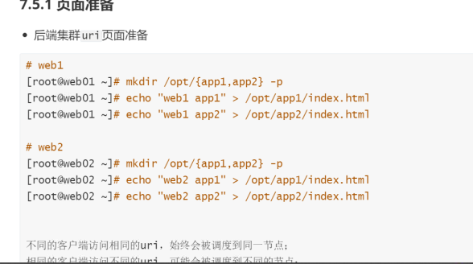

#### 调度示例

### url

url\_param \`:对用户请求url中的\<params>参数中的 name 作 hash 计算;

通常用于追踪用户，以确保来自同一个用户的请求始终发往同一个Backend server(使用较少)

#### 配置示例

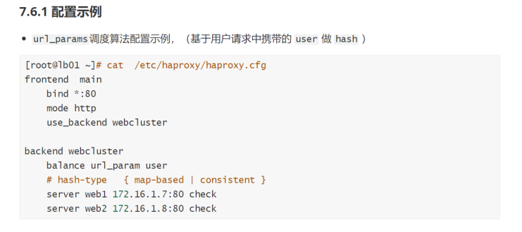

#### 调度示例

### hdc

hdr(\<name>):针对用户发起HTTP请求中Header 中的\<name>关键字进行 hash计算，假如无有效的值，则会被轮询调度;

此算法默认为静态的，不过其也可以使用hash-type修改此特性;(使用较少)

#### 配置示例

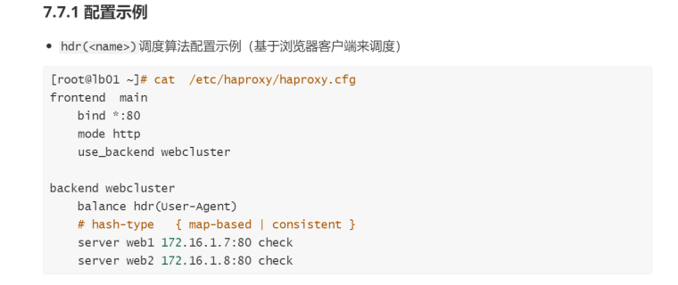

#### 调度示例

### hash\_type

hash-type \<method>用于将hash映射至后端服务器的方法;。可用方法有map-based|consistent ;

大多数场景下使用默认map-based方法;
