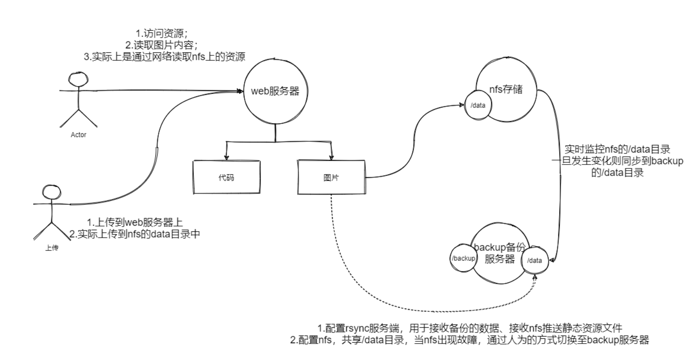
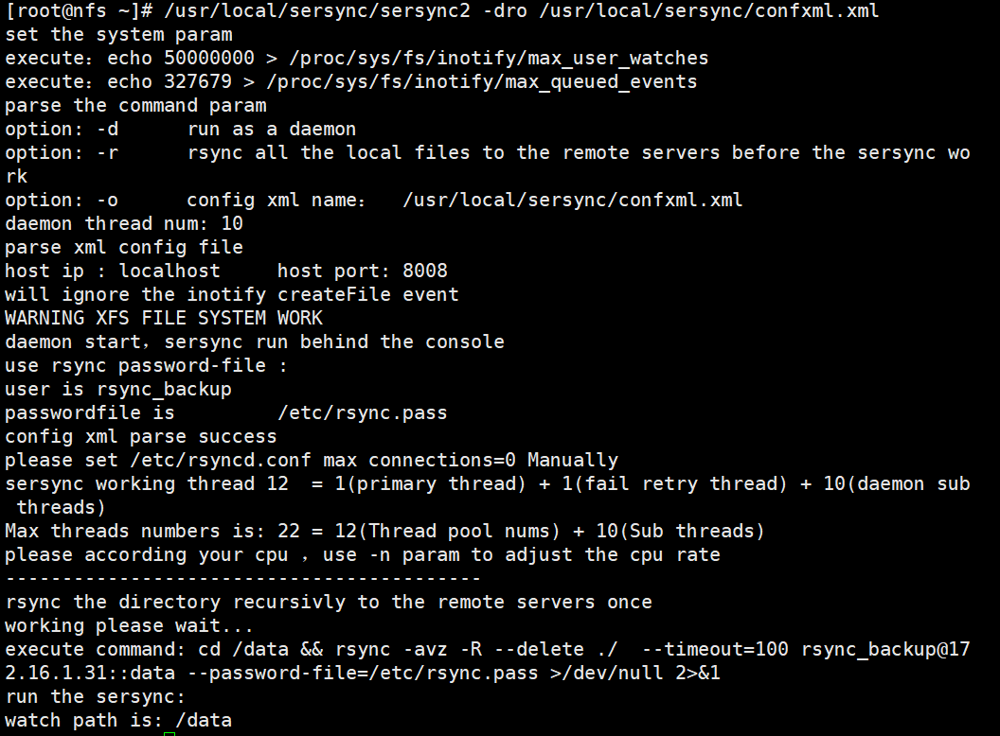

# 实时同步

## 目录

-   [概念及原理](#概念及原理)
-   [实时同步的案例](#实时同步的案例)
    -   [服务器配置](#服务器配置)
    -   [思路](#思路)
    -   [nfs（172.16.1.32）配置](#nfs17216132配置)
    -   [web（172.16.1.7）服务器配置](#web1721617服务器配置)
    -   [backup（172.16.1.31）服务器配置](#backup17216131服务器配置)
-   [平滑迁移场景](#平滑迁移场景)

# 概念及原理

只要当前目录发生变化则会触发一个事件，事件触发后将变化的目录同步至远程服务器

原理：借助inotify通知接口，用来监控本地目录的变化，如果监控本地的目录发生变更，则触发动作，此动作可以是进行同步操作或者其他操作

# 实时同步的案例

实现上传视屏文件，实则是写入NFS至存储，当NFS存在新的数据则会实时的同步到备份服务器



## 服务器配置

| 角色         | 外网        | 内网          | 安装工具           |
| ---------- | --------- | ----------- | -------------- |
| web        | 10.0.0.7  | 172.16.1.7  | httpd、php      |
| nfs-server | 10.0.0.32 | 172.16.1.32 | nfs、sersync    |
| backup     | 10.0.0.31 | 172.16.1.31 | sersync-servre |

## 思路

1.模拟用户通过程序上传视频至web，实际是写入至nfs服务器

2.在备份服务器上新增data模块，便于nfs的数据实时同步至备份服务器的data模块

3.配置sersync实时同步，将nfs的数据实时的同步到备份服务器/data目录

## nfs（172.16.1.32）配置

``````bash
yum install nfs-utils  #安装nfs工具
cat  /etc/exports  #nfs的配置文件
配置为:/data  172.16.1.0/24(rw,all_squash,anonuid=666,anongid=666)#内网访问
#初始化操作
greoupadd -g 666 luo
useradd -u 666 -g 666 luo
mkdir /data  #创建共享目录
systemctl restart nfs  #重启nfs服务
######
yum install rsync inotify-tool -y  
wget https://raw.githubusercontent.com/wsgzao/sersync/master/sersync2.5.4_64bit_binary_stable_final.tar.gz#装sersync服务
tar -xf  sersync2.5.4_64bit_binary_stable_final.tar.gz  #解压rsync压缩文件
mv GNU-Linux-x86/ /usr/local/sersync  #移动文件到/usr/local下并改名为sersync

vim /usr/local/sersync/confxml.xml
  <?xml version="1.0" encoding="ISO-8859-1"?>
   <head version="2.5">
    <host hostip="localhost" port="8008"></host>
    <debug start="false"/>
    <fileSystem xfs="true"/> <!--文件系统-->
    <filter start="false">   <!--排除不想同步的文件-->
  <exclude expression="(.*)\.svn"></exclude>
  <exclude expression="(.*)\.gz"></exclude>
  <exclude expression="^info/*"></exclude>
  <exclude expression="^static/*"></exclude>
    </filter>
    <inotify><!--监控的事件类型-->
  <delete start="true"/>
  <createFolder start="true"/>
  <createFile start="true"/>
  <closeWrite start="true"/>
  <moveFrom start="true"/>
  <moveTo start="true"/>
  <attrib start="true"/>
  <modify start="true"/>
    </inotify>

    <sersync>
  <localpath watch="/data"> <!--监控的目录-->
      <remote ip="172.16.1.31" name="data"/>
     <!-- <remote ip="192.168.8.39" name="tongbu"/>-->
      <!--<remote ip="192.168.8.40" name="tongbu"/>-->
  </localpath>
  <rsync>
      <commonParams params="-avz"/>
      <auth start="true" users="rsync_backup" passwordfile="/etc/rsync.pass"/>
      <userDefinedPort start="false" port="874"/><!-- port=874 -->
      <timeout start="true" time="100"/><!-- timeout=100 -->
      <ssh start="false"/>
  </rsync>
  <failLog path="/tmp/rsync_fail_log.sh" timeToExecute="60"/><!--default every 60mins execute once-->
  <crontab start="false" schedule="600"><!--600mins-->
      <crontabfilter start="false">
    <exclude expression="*.php"></exclude>
    <exclude expression="info/*"></exclude>
      </crontabfilter>
  </crontab>
  <plugin start="false" name="command"/>
    </sersync>

    <plugin name="command">
  <param prefix="/bin/sh" suffix="" ignoreError="true"/>  <!--prefix /opt/tongbu/mmm.sh suffix-->
  <filter start="false">
      <include expression="(.*)\.php"/>
      <include expression="(.*)\.sh"/>
  </filter>
    </plugin>

    <plugin name="socket">
  <localpath watch="/opt/tongbu">
      <deshost ip="192.168.138.20" port="8009"/>
  </localpath>
    </plugin>
    <plugin name="refreshCDN">
  <localpath watch="/data0/htdocs/cms.xoyo.com/site/">
      <cdninfo domainname="ccms.chinacache.com" port="80" username="xxxx" passwd="xxxx"/>
      <sendurl base="http://pic.xoyo.com/cms"/>
      <regexurl regex="false" match="cms.xoyo.com/site([/a-zA-Z0-9]*).xoyo.com/images"/>
  </localpath>
    </plugin>
</head>

/usr/local/sersync/sersync2 -dro /usr/local/sersync/confxml.xml  #启动sersync服务
关于中间几个参数
参数-d:启用守护进程模式
参数-r:在监控前，将监控目录与远程主机用rsync命令推送一遍
c参数-n: 指定开启守护线程的数量，默认为10个
参数-o:指定配置文件，默认使用confxml.xml文件
参数-m:单独启用其他模块，使用 -m refreshCDN 开启刷新CDN模块
参数-m:单独启用其他模块，使用 -m socket 开启socket模块
参数-m:单独启用其他模块，使用 -m http 开启http模块
不加-m参数，则默认执行同步程序

kill $(ps aux|grep sersync | grep -v grep | awk '{print $2}')
  /usr/local/sersync/sersync2 -dro /usr/local/sersync/confxml.xml  #关闭服务
  
使用lsyncd工具进行实时同步
yum install rsync inotify-tools lsyncd 
cat  /etc/lsyncd.conf   #配置文件，监控本地目录，触发立即同步
  settings {
 logfile = "/var/log/lsyncd/lsyncd.log",
 statusFile = "/var/log/lsyncd/lsyncd.status",
 inotifyMode = "CloseWrite",
 maxProcesses = 8,
}i8
sync {
 default.rsync,
 source = "/data",
 target = "rsync_backup@172.16.1.31::data",
 delete= true,
 delay = 1,     --同步事件时间1s
    rsync = {
        binary = "/usr/bin/rsync",
        archive = true,
        compress = true,
        verbose = true,
        password_file = "/etc/rsync.pass",
        _extra = {"--bwlimit=200"}
    }
}

echo "密码"  > /etc/rsync.pass # 创建，密码文件
chmod 600  /etc/rsync.pass   #授权
systemctl start lsyncd.service  #启动服务·`````·················3
``````

"/data",
&#x20;target = "rsync\_backup\@172.16.1.31::data",

成功执行



## web（172.16.1.7）服务器配置

```bash
yum install httpd php -y  #安装http和php插件
#初始化操作
groupadd -g 666 luo
useradd -g 666 -u 666 luo  #创建和nfs服务端用户uid和gid一样的用户
sed -i '/^User/c User www' /etc/httpd/conf/httpd.conf 
sed -i '/^Group/c Group www' /etc/httpd/conf/httpd.conf  #修改进程的运行身份（文件里存放的是关于http服务的配置参数）
wget http://cdn.xuliangwei.com/kaoshi.zip  #从网上下载所需代码，也可自己书写代码
unzip kaoshi.zip -d /var/www/html/  #解压到目标目录内
chown -R luo.luo /var/www/html #修改所属组和主 同时查看文件夹权限，权限不够可能导致文件写入失败
systemctl restart httpd  #重启httpd服务
测试上传服务
mount -t nfs 172.16.1.32:/data /var/www/html/2021-08-04/ #将html生成文件的目录挂载到32的/data目录，作为入口，当上传文件到该目录时将会被上传到/data目录中

```

## backup（172.16.1.31）服务器配置

基本构思：增加一个data模块配置nfs将本地/data目录共享出来（与nfs服务端保持完全一致）

```bash
yum install nfs-utils　rsync #安装nfs和rsync插件
cat /etc/rsyncd.conf  #配置rsync服务的文件
    uid = www
    gid = www
    port = 873
    fake super = yes
    use chroot = no
    max connections = 200
    timeout = 600
    #ignore errors  #忽略错误
    read only = false
    list = false
    auth users = rsync_backup
    secrets file = /etc/rsync.passwd
    log file = /var/log/rsyncd.log
    #####################################
    [backup]
    path = /backup
    [data]
    path = /data  #添加共享同步文件夹data
groupadd -g 666 luo
useradd -u 666 -g 666 luo #创建用户和组，和服务端保持一致
mkdir /data /backup -p  #创建共享目录
chown -R luo.luo /data/ /backup/ # 改变data和backup的属组和属主
#测试数据能否推送到backup模块
rsync -avz root@172.16.1.32:/etc/exports /etc/export  #将服务端的nfs配置文件拉取过来
重启nfs服务
```

监控nfs的/data目录，一旦发生变化会同步到backup服务器的data模块上

# 平滑迁移场景

上述操作已完成平滑迁移
