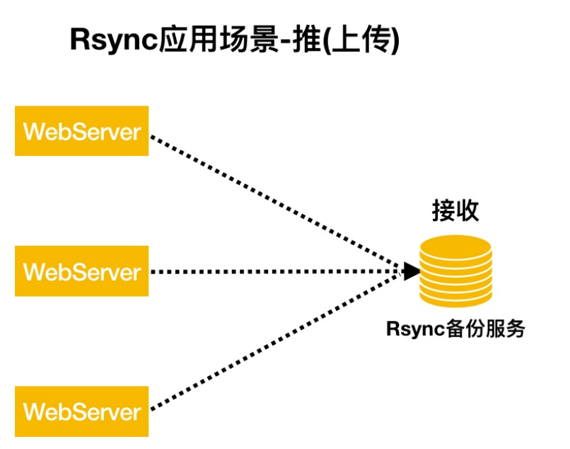
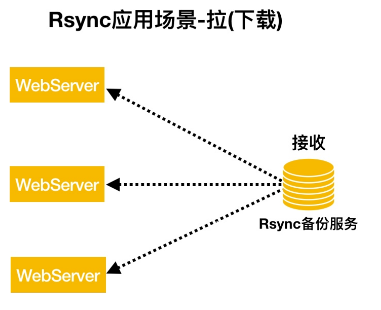
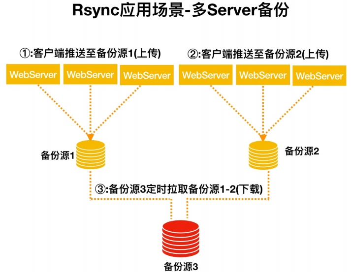
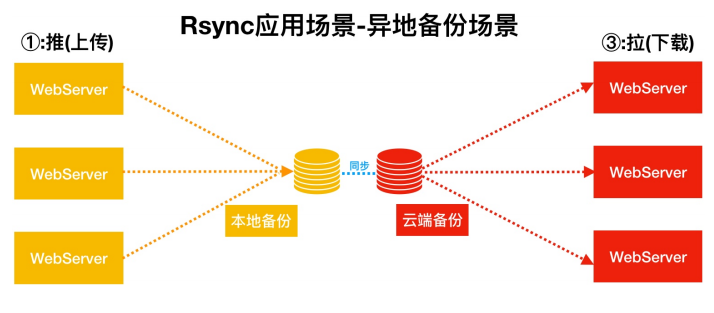

# Rsync传输

## 目录

-   [备份基本概述](#备份基本概述)
    -   [为什么要备份](#为什么要备份)
-   [Rsync基本概述](#Rsync基本概述)
    -   [同步模式](#同步模式)
    -   [应用场景](#应用场景)
    -   [传输模式](#传输模式)
        -   [本地传输](#本地传输)
        -   [远程传输](#远程传输)
        -   [守护进程](#守护进程)
        -   [常用选项](#常用选项)
    -   [远程传输场景](#远程传输场景)
        -   [服务端配置](#服务端配置)
        -   [客户端](#客户端)
            -   [数据推送和拉取](#数据推送和拉取)
        -   [数据无差异同步](#数据无差异同步)
        -   [推送数据限速场景](#推送数据限速场景)
    -   [Rsync备份案列](#Rsync备份案列)

# 备份基本概述

备份就是把文件再复制一份存放起来

## 为什么要备份

1.数据非常重要

2.减少数据丢失的几率

3.便于快速恢复

# Rsync基本概述

简称远程同步，可以实现不同主机之间的同步，同时支持增量和全量的同步，备份。

官方地址：[rsync (samba.org)](https://rsync.samba.org/ "rsync (samba.org)")

监听端口：873

运行模式：c/s

## 同步模式

推端：所有主机推送本地数据至Rsync备份服务器，会导致数据同步缓慢



拉：rsyns备份服务器拉取所有主机上的数据，会导致备份服务器开销大



## 应用场景

大量服务器备份



异地备份



## 传输模式

### 本地传输

方式：单个主机本地之间的数据传输（类似于cp命令）

语法：rsync \[opiton..] SRC..  \[dest]

rdync : 备份命令

\[option] :选项

src..：本地源文件

\[DEST] ：本地目标文件

eg  ：  rsync -avz /etc/passwd  /tmp/

### 远程传输

通过ssh通道传输数据，类似于scp命令

语法： PULL：rsync \[option..] \[user@]host:SRC..  \[DEST]

pull:拉取，下载

rsync ： 备份命令

\[user@] :目标主机的系统用户

host：目标主机IP地址或域名

src.. ：目标主机源文件

\[DEST]:下载至本地那个位置

eg：rsync -avz  root@地址:/目录  /backup/

PUSH: rsync \[option..]  src.. \[user@]host:DEST

push:推送上传

src ： 本地源文件

\[user@] : 目标主机的系统用户

host：目标主机的IP地址或域名

\[dest] ：目标对应位置

eg：rsync -avz /backup/2018-10-01 root\@172.16.1.31:/tmp/

rsync借助ssh协议同步数据存在缺陷

1.使用系统用户（不安全）

2.使用普通用户（权限不足）

### 守护进程

rsync自身非常重要的功能（不使用系统用户，更安全）

语法：

Pull : rsync \[OPTION. . .]\[USER@]HOST : :SRC.. \[DEST]

\[user@] 远程主机用户

host.. ： 远程主机地址

src..：远程主机模块（不是目录）

\[DEST] 将远程主机数据备份至本地什么位置

eg：rsync -avz rsync\_backup\@172.16.1.31::backup/ /mnt/  - -password-file=/etc/rsync.password

Push: rsync \[oPTION.. .] SRC. . .\[USER@]HOST: :DEST

SRC. . .#远程主机模块(不是目录)
\[USER@]#远程主机用户(虚拟用户)
HOST : :#远程主机地址
\[DEST]#将远程主机模块备份至本地什么位置

eg:rsync -avz /mnt/ rsync\_backup\@172.16.1.31::backup/  - -password-file=/etc/rsync.password

### 常用选项

| 选项                   | 含义                      |
| -------------------- | ----------------------- |
| a                    | 归档模式传输，等于-tropgD1       |
| v                    | 详细模式输出，打印速率，文件数量等       |
| z                    | 传输时进行压缩以提高速率            |
| r                    | 递归传输目录及子目录，即目录下的所有目录都传输 |
| t                    | 保持文件时间信息                |
| o                    | 保持稳健属主信息                |
| p                    | 保持文件权限                  |
| g                    | 保持文件属组信息                |
| l                    | 保留软连接                   |
| P                    | 显示同步的过程及传输时的进度等信息       |
| D                    | 保留设备文件信息                |
| L                    | 保留软连接指向的目标文件            |
| e                    | 使用的信道协议，指定替代rsh的shell程序 |
| - -exclude=PATTERN   | 指定排除不需要传输的文件模式          |
| - -exclude-from=file | 文件名所在的目录文件              |
| - -bwlimit=100       | 限速传输                    |
| - -partial           | 断点续传                    |
| - -delete            | 让目标目录和源目录数据保持一致         |

## 远程传输场景

准备两台机器

| 主机名      | 外网        | 内网          | 主机名    |
| -------- | --------- | ----------- | ------ |
| rsync服务端 | 10.0.0.31 | 172.16.1.31 | backup |
| rsync客户端 | 10.0.0.32 | 172.16.1.32 | nfs    |

### 服务端配置

安装rsync

yum install rsync -y

配置

配置文件

```bash
uid = rsync  #运行进程的用户
gid = rsync  #运行进程的用户组
port = 873   #监听端口
fake super = yes #不需要rsync以root身份运行就可以存储文件的完成属性
use chroot = no  #禁锢推送的数据至某个目录，不允许跳出该目录
max connections = 200  #最大连接数
timeout = 600   #超时时间
ignore errors   #忽略错误信息
read only = false  #对备份数据可读写
list = false    #不允许查看模块信息
auth users = rsync_backup  #定义虚拟用户，作为链接认证用户
secrets file = /etc/rsync.passwd   #定义rsync服务用户链接认证密码文件路径
log file = /var/log/rsyncd .1og  #日志文件
###############################
[backup]  #定义模块信息
path = /backup  #定义接收备份数据目录
comment= commit  #模块注释信息
```

服务端：根据配置文件，初始化操作

```bash
useradd -r rsync  #创建rsync用户
echo "rsync_backup:密码" > /etc/rsync.passwd  #创建虚拟用户并添加密码
cat /etc/rsync.passwd  #查看文件信息
chmod 770 /etc/passwd  #给于文件最高权限。切记不可给其他人权限
mkdir /backup  #创建模块对应的目录/backup
chown -R rsync.rsync /backup/  #修改backup文件夹的所属组和主为rsync
systemctl enable rsyncd #将rsync服务加入开机自启动
systemctl start rsyncd  #启动服务
netstat -lntp  #查看服务是否启动
```

### 客户端

客户端实现数据推送与拉取免密操作两种方式

1.声明RSYNC\_PASSWORD

2.写入文件：- - password-file

\#写脚本声明

export RSYNC\_PASSWORD=密码（和服务端一样）

rsync -avzP 要同步的文件 [rsync\_backup@172.16.1.31](mailto:rsync_backup@172.16.1.31 "rsync_backup@172.16.1.31")::backup

\#实时同步写入文件

echo "密码（和服务端一致）"  > /etc/rsync.pass

chmod 770 /etc/rsync.pass  ##给于文件最高权限。切记不可给其他人权限

rsync -avzP 要同步的文件 [rsync\_backup@172.16.1.31](mailto:rsync_backup@172.16.1.31 "rsync_backup@172.16.1.31")::backup - -password-file=/etc/rsync.pass

#### 数据推送和拉取

客户端推送backup目录下所有内容至rsync服务端

```bash
export RSYNC_PASSWORD=密码
rsync -avz /backup/rsync_backup@172.16.1.31::backup/
```

客户端拉取rsync服务端backup模块数据至本地客户端/backup目录

```bash
export RSYNC_PASSWORD=密码
rsync -avzrsync_backup@172.16.1.31::backup /backup/
```

### 数据无差异同步

实现本地数据与远程数据无差异同步

拉取远端数据：远端与本地数据保持一致，若远端没有而本地有则本地数据则会被删除，造成客户端数据丢失

```bash
export RSYNC_PASSWORD=密码
rsync -avz --delete rsync_backup@172.16.1.31::backup/ /data/

```

推送数据至远端：本地与远端保持一致，本地没有远端数据则会被删除，造成服务端数据丢失

```bash
export RSYNC_PASSWORD=密码
rsync -avz --delete /data/ rsync_backup@172.16.1.31::backup/
```

### 推送数据限速场景

故障案例:某DBA使用rsync拉取备份数据时，由于文件过大导致内部交换机带宽被沾满，导致用户的请求无法响应;

```bash
export RSYNC_PASSWORD=密码
rsync -avz --bwlimit=1 rsync_backup@172.16.1.31::backup/ /data/ 
```

> 📌rsync用户和rsync\_backup用户的关系和区别：没关系

> 📌rsync：负责写入数据的用户身份；

> 📌rsync\_backup：用于链接rsync服务端的一个用户身份而已；

## Rsync备份案列

准备三台机器

| 角色    | 外网ip（nat） | 内网ip（lan）   | 主机名    |
| ----- | --------- | ----------- | ------ |
| WEB   | 10.0.0.7  | 172.16.1.7  | web    |
| NFS   | 10.0.0.32 | 172.16.1.32 | nfs    |
| Rsync | 10.0.0.31 | 172.16.1.31 | backup |
