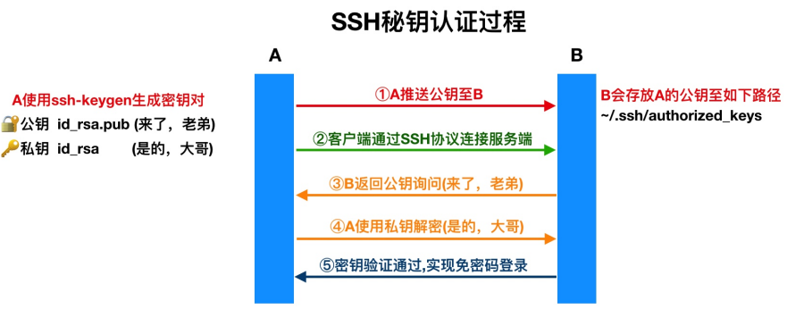

# SSH-跳板机

## 目录

-   [SSH基础概述](#SSH基础概述)
    -   [什么是ssh](#什么是ssh)
    -   [主要功能](#主要功能)
    -   [区别](#区别)
    -   [ssh远程登录](#ssh远程登录)
    -   [远程拷贝](#远程拷贝)
-   [ssh远程验证方式](#ssh远程验证方式)
    -   [基于密钥验证](#基于密钥验证)
        -   [创建密钥](#创建密钥)

# SSH基础概述

## 什么是ssh

是一个安全协议，在数据传输时，会对数据包进行加密处理，加密后在进行数据传输。去报数据传输安全。

## 主要功能

1.提供远程链接服务器（ssh。telnet）

2.提供远程传输数据加密

## 区别

| 服务链接方式 | 数据传输 | 监听端口 | 登录用户    |
| ------ | ---- | ---- | ------- |
| ssh    | 加密   | 22   | 支持root  |
| telnet | 明文   | 23   | 不支持riit |

## ssh远程登录

-p 指定链接的远程主机端口，默认22端口

@前面为链接的用户名后面为链接的服务器

## 远程拷贝

scp复制数据至远程主机（全量）

-P指定端口，默认22端口可不写

-r 表示递归拷贝目录

-p 表示在拷贝文件前后

-l 限制传输使用的带宽（默认kb/8=mb）

```bash
scp -P22 -rp /tmp/  root@10.0.0.61:/tmp  #送当前用户的tmp数据至10.0.0.61
scp -rp -l 8096 /opt/1.txt root@172.16.1.31:/tmp  #限速为1mb


```

注意

1.scp通过ssh协议加密方式进行文件或目录拷贝

2.scp连接时的用户作为拷贝文件或目录的权限

3。scp支持数据推送和拉取，每次都是全量拷贝，效率较低

# ssh远程验证方式

## 基于密钥验证

为降低密码泄露的几率和提高登陆的方便性，建议使用密钥验证方式



### 创建密钥

生成非对称密钥，使用-t指定密钥类型，使用-C指定用户邮箱

```bash
ssh ssh-keygen -t rsa -C 1815638861@qq.com  #一路回车
ssh-keygen -t rsa -C 1815638861@qq.com -f ~/.ssh/id_rsa -P ""  #无需回车，自动应答方式生成密钥


```
