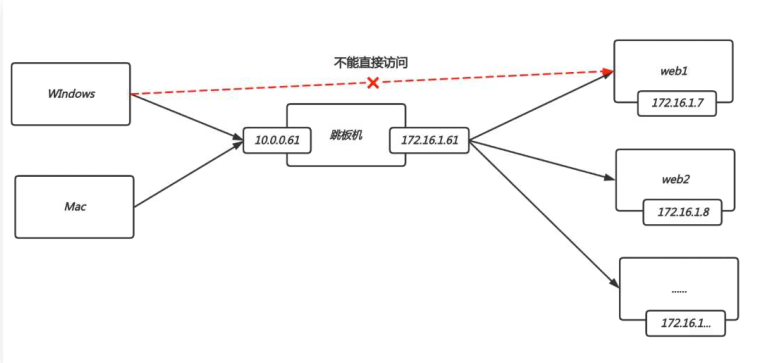
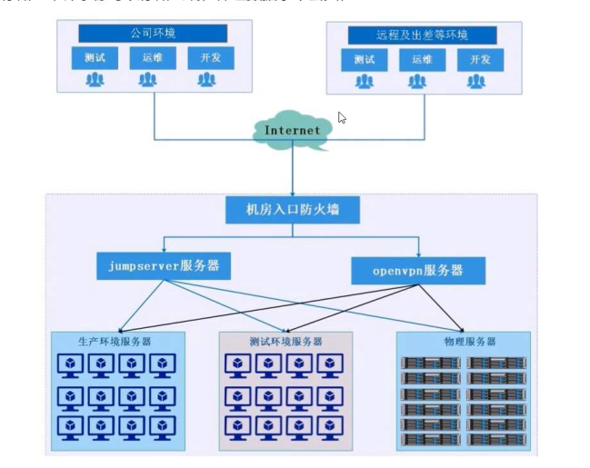
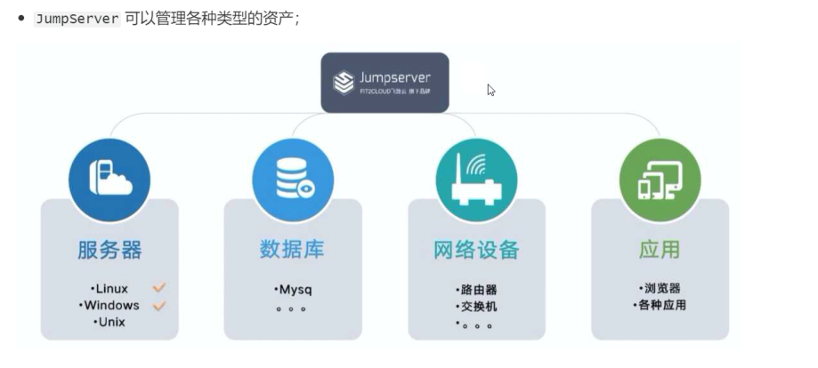

# jumpserver概述

## 目录

-   [jumserver介绍](#jumserver介绍)
    -   [什么是跳板机](#什么是跳板机)
    -   [缺陷](#缺陷)
    -   [什么是堡垒机](#什么是堡垒机)
    -   [为什么需要堡垒机](#为什么需要堡垒机)
    -   [什么是jumpserver](#什么是jumpserver)
    -   [主要组件](#主要组件)
    -   [基础架构图](#基础架构图)
    -   [jumpserver优势](#jumpserver优势)
    -   [jumpserver安装配置](#jumpserver安装配置)
        -   [基础环境准备](#基础环境准备)
    -   [jumpserer基础配置](#jumpserer基础配置)
        -   [修改超级管理员权限](#修改超级管理员权限)
        -   [设定访问域名](#设定访问域名)
        -   [设定文件邮箱](#设定文件邮箱)
    -   [用户管理](#用户管理)
        -   [用户整体流程](#用户整体流程)
    -   [资产管理](#资产管理)
        -   [创建linux资产](#创建linux资产)
        -   [创建windows资产](#创建windows资产)
        -   [为用户分配服务器资产](#为用户分配服务器资产)
        -   [为用户分配数据库资产](#为用户分配数据库资产)
    -   [jumpserver网域管理](#jumpserver网域管理)
        -   [网域实践](#网域实践)

# jumserver介绍

## 什么是跳板机

跳板机就是一台服务器，具备公网和内网，我们的开发人员或运维人员，要想维护内部集群服务时，需要先统一登录到跳板机这台服务器，然后在通过跳板机的内网登录目标集群服务器。

## 缺陷

首先没有实现对运维人员操作进行行为控制和审计;

其次使用跳板机的过程中还是会出现误操作，导致故障，一旦出现事故很难快速定位到原因和责任人;

此时堡垒机就应运而生了;

## 什么是堡垒机

堡垒机是基于跳板机基础之上，实现“运维更加安全的操作目标集群服务器";那提供什么安全保证:

1.资产集中管理（统一管理)

2.审计、记录、视频回放操作记录;

3.限制如rm、dd等危险命令执行;

4.限制登陆目标服务器的身份权限;

5.主机的划分;权限划分;

## 为什么需要堡垒机

首先，堡垒机提供了运维安全审计的4A规范:

Authentication:身份鉴别，防止身份冒用和复用

Authorization:授权控制，防止内部误操作和权限滥用

Accounting :账号管理，人员和资产的管理

Auditing:安全审计，追溯和分析事故的依据

其次，堡垒机的建设目标可以概括为5W，主要是为了降低运维风险

审计:你做了什么?(what)

授权:你能做哪些?(which)

账号:你要去哪?(where)

认证:你是谁?（who）

来源:访问时间?(when)

总结:

堡垒机能让运维更安全、更加便捷的登陆目标资产服务;

堡垒机能快速构建"身份鉴别、访问控制、安全审计”等企业必备功能;

所有企业都需要堡垒机，因为堡垒机是企业进行"资产管理、运维安全审计"的重要组件。

## 什么是jumpserver

JumpServer是全球首款开源的堡垒机，使用GNU GPL v2.0开源协议，是符合4A规范的运维安全审计系统。

JumpServer使用Python / Django为主进行开发，遵循Web 2.0规范，配备了业界领先的Web Terminal方案,交互界面美观、用户体验好。

JumpServer采纳分布式架构，支持多机房跨区域部署，支持横向扩展，无资产数量及并发限制。改变世界，从一点点开始。

## 主要组件

Jumpserver:提供管理后台，管理员可以通过Web页面进行资产管理、用户管理、资产授权等操作;

KoKo:提供SSH server和 web Terminal server方式登陆资产;

Lina、Luna(web terminal页面;视频回放等):提供web前端页面，后续会将整合到lina中;

Lion:提供 RDP 功能，用户可通过该方式登陆 windows资产。(通过web Terminal来访问)

## 基础架构图

## jumpserver优势

1、开源:零门槛，操作简单，能快速进行企业落地;

2、无插件:仅需浏览器，即可通过Web Terminal 连接目标节点;

3、分布式:产品解耦程度高，便于后期分布式部署与横向扩展，轻松支持大规模并发访问;

4、多租户:一套系统，多个子公司和部门同时使用;

5、多云支持:一套系统，同时管理不同云上面的资产;

6、云端存储:审计录像可以存储云端，保证数据永不丢失;

## jumpserver安装配置

### 基础环境准备

## jumpserer基础配置

### 修改超级管理员权限

点击右上角-->个人信息-->登陆密码设置。（修改超级管理员权限)

### 设定访问域名

点击系统设置-->基本设置-->当前站点URL，修改为域名方式访问。

### 设定文件邮箱

点击系统设置-->邮件设置-->填写发件人相关信息，注意SSL、TLS只能选择一个

## 用户管理

### 用户整体流程

ssh：linux  RDP：windows  vnc：windows  telnet：网络设备

用户整体流程介绍:

1.首先使用普通用户登陆jumpserver;

⒉.登陆后使用jumpserver连接内网目标资产;

3.连接内网资产需要使用系统用户;

4.系统用户是由jumpserver的特权用户创建的;

## 资产管理

### 创建linux资产

### 创建windows资产

### 为用户分配服务器资产

### 为用户分配数据库资产

## jumpserver网域管理

Jumpserver网域功能是为了解决部分环境(如:混合云）无法直接连接而新增的功能;

原理是通过网关服务器进行跳转登录，JMS-->网关服务器-->目标资产

### 网域实践

基于阿里云混合云实践思路

1.添加网域、然后添加网关服务器;

2.使用jumpserver的私钥登陆网关服务器（需要将jumpserver公钥推送给网关服务器);。&#x20;

3.网关服务器要与其内部主机免密，需要推送网关服务器公钥至内部服务器;

4.下载网关服务器的私钥证书文件至本地;

5.新增一个管理用户root，使用网关服务器的私钥证书文件;

6.添加阿里云内网资产服务器，分配管理用户、系统用户、以及资产分配给哪个普通用户;
