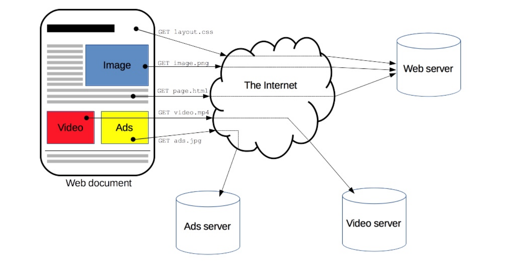
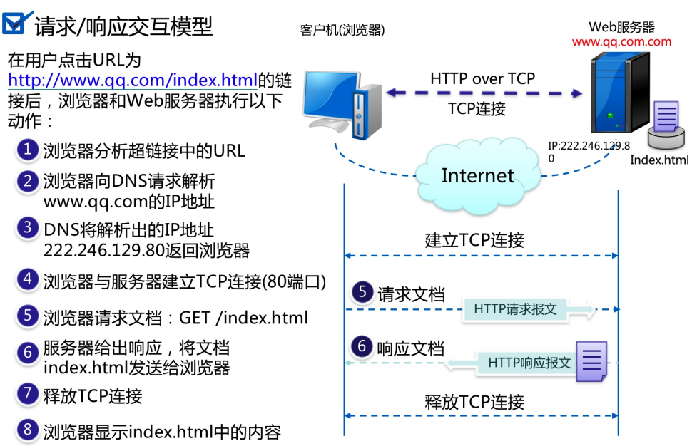
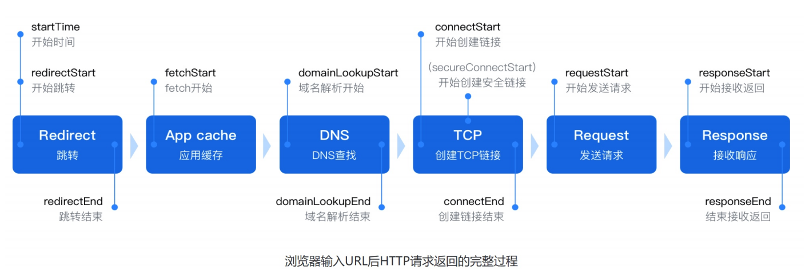
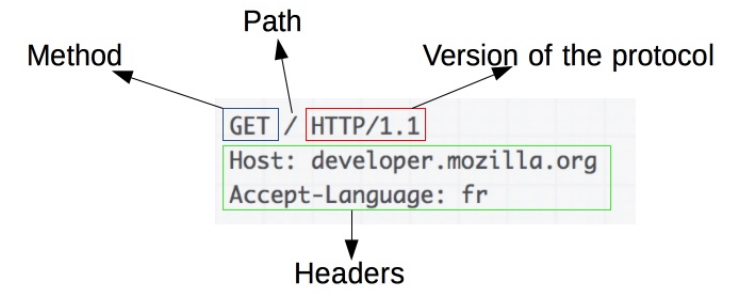

# http协议基础

## 目录

-   [什么是URL、HTML、HTTP](#什么是URLHTMLHTTP)
-   [工作原理](#工作原理)
-   [HTTP工作原理总结](#HTTP工作原理总结)
-   [HTTP请求Request](#HTTP请求Request)
    -   [请求Method](#请求Method)
    -   [Header的请求](#Header的请求)
    -   [请求connection](#请求connection)
-   [http响应response](#http响应response)
    -   [响应头部](#响应头部)
    -   [响应status](#响应status)
    -   [响应code](#响应code)
-   [相关术语](#相关术语)

# 什么是URL、HTML、HTTP

url就是我们在访问一个网站页面时的一个内容，也就是网站资源

html简称web page，一个完整的html界面包含多个url资源

http中文名为超文本传输协议，是一种能够获取如html这样网络资源的通讯协议，是web进行数据交换的基础

简单来说就是协议将用户请求的html页面从一台web服务器传输到客户端浏览器的一种协议



三者之间的关系：完整的html页面是由分个不同的url资源组成的，而http西医主要用来传输这种html页面

# 工作原理



第一步：浏览器分析超链接中的URL

第二步：DNS请求，pc端向DNS服务器发出dns请求，请求网站的记录

第三步：dns服务器回复dns reponse解析出的域名对应的记录

第四步：建立TCP链接，pc向dns解析地址发起tcp三次握手

第五步：http请求，pc端向地址服务器发出GET请求，请求访问主页

第六步：http响应,地址服务器回应http/1.1 200 ok，返回主页数据包

第七步：链接断开，完成数据交互过程，四次挥手断开链接

# HTTP工作原理总结

整个用户访问网站过程就是DNS-TCP-HTTP



# HTTP请求Request

例子



## 请求Method

客户向服务端发送请求时，会根据不同的资源发送不同的请求方法Method

| GET    | 用于获取URI对应的资源            |
| ------ | ----------------------- |
| POST   | 用于提交请求，可以更新或者创建资源，是非幂等的 |
| PUT    | 用于向指定URI传送更新资源，是幂等的     |
| DELETE | 用于向指定的URI删除资源           |
| Head   | 用于检查（仅获取Header部分的内容）    |

一般创建对象时用post，更新对象时用put：put是幂等的，post是非幂等

幂等和非幂等：

幂等: 对于同一种行为，如果执行不论多少次，最终的结果都是一致相同的，就称这种行为是幂等的。

(个人理解：不管是一次,还是多次操作，我们返回同样的结果,且不修改状态信息,接口可重复调用)

非幂等:  对于同一种行为，如果最终的结果与执行的次数有关，每次执行后结果都不相同，就称这种行为为非幂等。譬如：累加

在数学上的概念:这是个高等代数中的概念。简而言之就是x^Y=x    x可能是任何元素，包括（数、矩阵等）

## Header的请求

```bash
:authority : www.xuliangwei. com:method: GET
:path:/
:scheme: https
Accept: text/htm1   #请求的类型
Accept-Encoding: gzip，deflate   #是否进行压缩
Accept-Language: zh-CN ,zh;q=o.9  #请求的语言
cache-control : max-age=0   #缓存
Connection: keep-alive   #TCP长连接
Host: www.oldboyedu.com  #请求的域名
if-Modified-since: Fri，04 May 201808:13:44 GMT #修改的时间
user-Agent: Mozi71a/5.0  #请求浏览器的工具
"===请求一个空行==="
"===请求内容主体==="
```

## 请求connection

http协议中的长连接和短链接是什么

http1.0使用的是短链接，建立一次tcp的链接，发起一次http的请求，结束，tcp断开

http1.1协议使用的是长连接，建立一此tcp的链接发起多次http的请求，结束，断开[https://http2.akamai.com/demo/http2-lab.html](https://http2.akamai.com/demo/http2-lab.html "https://http2.akamai.com/demo/http2-lab.html")

# http响应response

## 响应头部

```bash
#3.服务端响应的头部信息
HTTP/1.1 200 oK
#返回服务器的http协议，状态码
Date: Fri, 14 sep 2018 09:14:28 GMT
#返回服务器的时间
server: Apache/ 2.4.6
#返回服务器使用的软件Apacheconnection : Keep-A7ive
#TCP长连接
Keep-A7ive: timeout=5,max=100
#长连接的超时时间
"===返回一个空行==="
"===返回内容主休==="
```

## 响应status

http的status-code以三位数字组成，用来标识请求是否成功，主要分为以下五大类

| 状态码 | 说明                       |
| --- | ------------------------ |
| 1xx | 信息，服务器收到请求，需要请求者继续执行操作   |
| 2xx | 成功，操作被成功接收并处理            |
| 3xx | 重定向，需要进一步的操作以完成请求        |
| 4xx | 客户端错误，请求包含语法错误或无法完成请求404 |
| 5xx | 服务器错误，服务器在处理请求的过程中发生了错误  |

## 响应code

常见的状态码

| 状态码 | 说明                                                           |
| --- | ------------------------------------------------------------ |
| 200 | 表示客户端成功接收到了服务端返回的数据，最常见的状态码                                  |
| 206 | 客户端发完请求后，服务端只是返回了部分数据，就会出现该状态码，例如下载一个很大的文件，在没有下载完成之前就会出现该状态码 |
| 301 | 永久重定向（redirect）http—>https                                   |
| 302 | 临时重定向（resirect）                                              |
| 400 | 客户端请求语法错误，服务端无法理解                                            |
| 401 | 服务端开启了用户认证，而客户端没有提供正确的验证信息                                   |
| 403 | 服务端不允许客户端访问，或者没有找到默认返回页面                                     |
| 404 | 客户端请求的资源不存在                                                  |
| 405 | 防火墙阻止访问                                                      |
| 413 | 客户端向服务端上传一个比较大的文件，并且文件大小超过了服务端的限制；                           |
| 500 | 服务端出现了内部错误，需要进行人为排查故障（连接数据库类服务异常，会出现500错误）                   |
| 502 | 服务器充当代理角色时，后端被代理的服务器不可用或者没有正常回应                              |
| 503 | 服务当前不可用，由于超载或者系统维护，服务器暂时无法处理客户端请求                            |
| 504 | 服务器充当代理角色时，后端的服务器没有按时返回数据，超时了                                |

# 相关术语

pv：即页面浏览量，用户访问一个网站算一个pv。刷新一次页面累计pv+1。若多次打开或刷新同一个页面，浏览量累计

uv：独立访客，访问网站的一台电脑客户端为一个访客，即访问网站的用户端数量

IP：即独立公网IP数

并发：指同时，即一段时间内网站支持同时访问的人数，假设10s并发值为500时，一天能达到多少pv？500✖6✖40✖24=4320000
