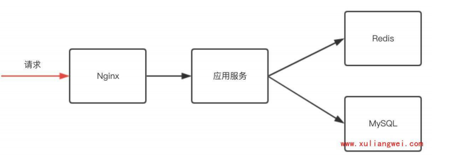
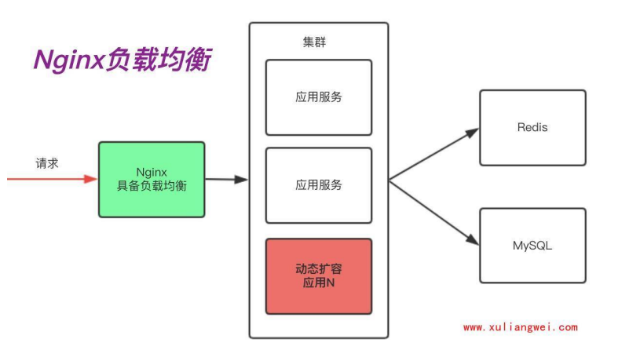
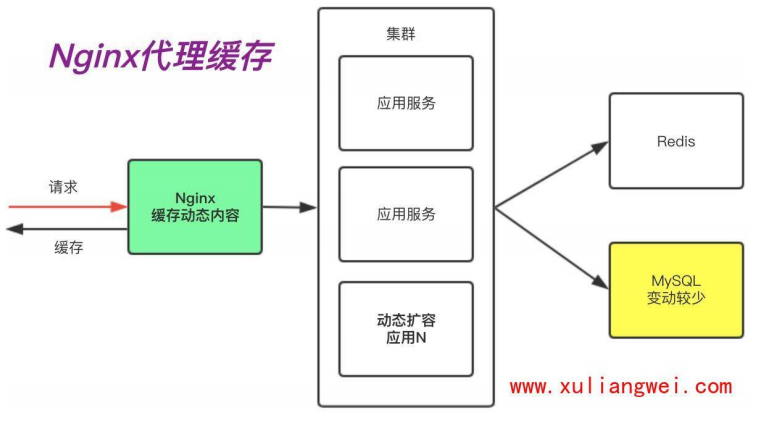
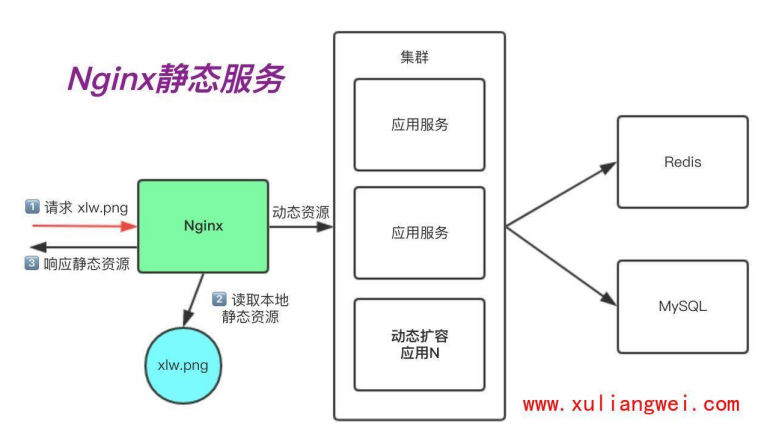
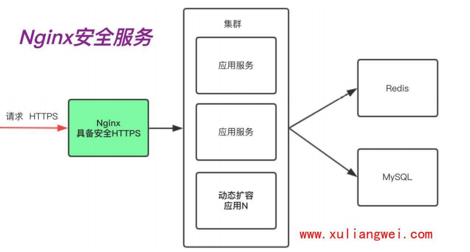

# nginx入门

## 目录

-   [nginx简述](#nginx简述)
-   [选择nginx的原因](#选择nginx的原因)
    -   [高性能、高并发](#高性能高并发)
    -   [高扩展性](#高扩展性)
    -   [高可靠性](#高可靠性)
    -   [热部署](#热部署)
    -   [应用广泛](#应用广泛)
    -   [网络模型](#网络模型)
-   [应用场景](#应用场景)
    -   [nginx组成](#nginx组成)
-   [nginx安装部署](#nginx安装部署)
-   [Nginx目录结构](#Nginx目录结构)
-   [Nginx基本配置](#Nginx基本配置)
-   [Nginx构建网站](#Nginx构建网站)
    -   [增加nginx配置](#增加nginx配置)

# nginx简述

是一种开源且高性能、可靠的http web服务器、代理服务

开源：体现在直接获取nginx的源代码

高性能：体现在支持海量的并发

高可靠：体现在服务稳定

# 选择nginx的原因

1.高性能，高并发

2.高扩展性

3.高可靠性

5.热部署

6.应用广泛

7.网络模型

## 高性能、高并发

通常情况下，单次请求会得到更快的响应。另一方面在高峰期（数以万计的并发请求），nginx可以比其他web服务器更快懂得响应请求

select：O（n）

epoll：O（1）

## 高扩展性

nginx官方、第三方提供了非常多的优秀模块提供使用，这些模块可以实现快速增加和减少

## 高可靠性

指nginx可以在服务器上持续不间断的运行，而很多web服务器往往运行几周或几个月就需要继续宁一次重启。nginx持续运行能宕机的时间只能以秒计算，所以nginx的高可靠性为我们提供了很好的保证

## 热部署

指在不停服务的情况下升级nginx，对于普通的服务，只需要kill掉进程在启动，但对于Nginx而言，如果Nginx有很多的客户端连接，那么kill掉Nginx。Nginx会像客户端发送tcp reset复位包，但很多客户端无法很好的理解reset包，就会造成异常。
由于Nginx的master管理进程与worker工作进程的分离设计，使得Nginx能够在7×24小时不间断服务的前提下，升级Nginx的可执行文件。当然，也支持不停止服务更新配置、更换日志文件等功能。

## 应用广泛

首先Nginx技术成熟，具备企业最常使用的功能，如代理、代理缓存、负载均衡、静态资源、动静分离、Https、Inmp、Inmt等等
其次使用Nginx统一技术栈，降低维护成本，同时降低技术更新成本。

tenginelOpenResty都是基于Nginx进行的二次开发;

## 网络模型

Nginx使用Epool网络模型，而常听到Apache采用的是Select网络模型

select:当用户发起一次请求,select模型就会进行一次遍历扫描，从而导致性能低下。

Epoll:当用户发起请求，epoll模型会直接进行处理，效率高效。

# 应用场景

主要分为三个：静态资源服务，代理资源服务。安全服务。

网站基本架构



负载均衡场景

主要有两个需求：1.应用服务需要动态扩展（手动或者自动）2.有些服务出问题需要做容灾。



代理缓存场景

随着我们网络链路的增长，用户体验到的时延则会增加。如果我们能把一段时间内不会发生变化的"动态"内容，缓存在Nginx，由Nginx直接向用户提供访问，那么这样用户请求的时延就会减少很多，所以在这里反向代理会演生出另外一个功能"缓存"，因为它能加速我们的访问。



静态资源场景

在很多时候我们访问docs、pdf、mp4、 png等这样的静态资源时，是没有必要将这些请求通过Nginx交给后端的应用服务，我们只需要通过Nginx直接处理“静态资源”即可。这是Nginx的静态资源功能。



安全应用场景

当我们使用http网站时，可能会遭遇到篡改，如果使用https安全通讯协议，那么数据在传输过程中是加密的，从而能有效的避免黑客窃取或者篡改数据信息，同时也能避免网站在传输过程中的信息泄露。大大的提升我们网站安全。



## nginx组成


1.第一个组成部分Nginx二进制可执行文件:它是Nginx本身框架以及相关模块等构建的一个二进制文件，这个文件就相当于汽车本身，所有的功能都由它提供。

2.第二个组成部分Nginx.conf文件:它相当于驾驶人员，虽然二进制可执行文件已经提供了许多的功能，但是这些功能究竟有没有开启，或者开启后定义怎样的行为去处理请求，都是由nginx.conf这个文件决定的，所以他就相当于这个汽车的驾驶员，控制这个汽车的行为。
3.第三个组成部分access.log:它相当于这辆汽车经过所有地方形成的GPS轨迹，access.log会记录Nginx处理过的每一条HTTP的请求信息、响应信息。
4.第四个组成部分error.log:它相当于黑匣子，当出现了一些不可预期的问题时，可以通过error.log将问题定位出来。

# nginx安装部署

安装方式有多种

1.编码安装（版本随意，安装复杂，升级繁琐）

2.epel仓库（版本较低，安装简单，配置不易读）

3.官方仓库（版本较新，安装简单，配置易读）

```bash
yun install -y gcc gcc-c++ autoconf pcre pcre-devel make sutomake httpd-tools  #安装nginx依赖
vim /etc/yum.repos.d/nginx.repo
[nginx-stable]
name=nginx stable repo
baseurl=http://nginx.org/packages/centos/$releasever/$basearch/
gpgcheck=1
enabled=1
gpgkey=https://nginx.org/keys/nginx_signing.key
module_hotfixes=true

[nginx-mainline]
name=nginx mainline repo
baseurl=http://nginx.org/packages/mainline/centos/$releasever/$basearch/
gpgcheck=1
enabled=0
gpgkey=https://nginx.org/keys/nginx_signing.key
module_hotfixes=true  #配置nginx源
yum install nginx -y #安装nginx服务
systemctl enable nginx  #加入开机自启动
systemctl start nginx  #启动服务
安装yum优先级插件
yum install yum-priorities
##配置安装源优先级
在repo文件中加入
priority=1 
#数字越小，优先级越高
确定这个配置文件里的 enabled = 1
[root@web01 ~]# vim /etc/yumuginconf.d/priorities.conf 
#然后清理一下yum缓存，重新建立一下yum缓存就可以以我们指定的源安装了

nginx -v  #检查nginx版本
nginx -t  #检查编译语法有无问题
```

# Nginx目录结构

可以使用rpm  -ql  nginx查询nginx的整体目录结构

```bash
/etc/logrotate.d/nginx
/etc/nginx                   #nbginx安装位置
/etc/nginx/nginx.conf        #nginx主配置文件
/etc/nginx/conf.d
/etc/nginx/conf.d/default.conf   #nginx提供的默认站点
/etc/nginx/fastcgi_params      #nginx在通过模块链接php程序时需要传递的一些变量
/etc/nginx/mime.types        #nginx支持的类型；
/etc/nginx/modules          #nginx的模块；
/etc/nginx/uwsgi_params     #nginx在通过模块链接python程序时需要传递的一些变量

/usr/lib/systemd/system/nginx.service  #nginx服务的启动与停止文件

/usr/sbin/nginx            #nginx二进制文件  
/usr/sbin/nginx-debug
/var/cache/nginx          #nginx缓存目录
/var/log/nginx            #nginx日志目录
```

# Nginx基本配置

Nignx主配置文件是/etc/nginx/nginx.conf是一个纯文本类型的文件，配置文件时以区块的形式组织的，一般每个区块以一对大括号{}来表示结束

```bash
#全局配置
user  nginx;  #nginx的运行身份为nginx用户
worker_processes  auto;  #启动进程数量，默认为自动设置

error_log  /var/log/nginx/error.log notice;  #错误日志的路径，从warning开始记录
pid        /var/run/nginx.pid;   #存储进程的pid number

events {
    worker_connections  1024;  #一个worker的最大连接数
}
use epool  #默认采用epool网络模型
#主要负责接受与响应HTTP请求
http {
    include       /etc/nginx/mime.types; #支持的类型
    default_type  application/octet-stream; #默认的类型（默认下载方式）
    #原因 1.提供的是下载压缩包。2.后端没有将代码解析完成，所以就直接成了下载
#定义日志格式
    log_format  main  '$remote_addr - $remote_user [$time_local] "$request" '
                      '$status $body_bytes_sent "$http_referer" '
                      '"$http_user_agent" "$http_x_forwarded_for"';

    access_log  /var/log/nginx/access.log  main;

    sendfile        on;
    #tcp_nopush     on;

    keepalive_timeout  65;

    #gzip  on;

    include /etc/nginx/conf.d/*.conf;   #包含的子文件
}

######
#一个server就是一个站点
server{
    listen  80;  #监听端口
    server_name  www.oldxu.net   #站点的域名
    location  / {    #uri路径匹配
            root   /usr/share/nginx/html  #root:定义网站的路径
            index  index.html  #定义默认返回的页面
            #root+index = /usr/share/nginx/html/index.html
                  
    }

}
```

# Nginx构建网站

## 增加nginx配置

```bash
cat /etc/nginx/conf.d/域名.conf
server {
      listen  80;
       server_name 访问的域名名称;
       location / {
       root 文件夹位置;
       index indes.html; #要访问的文件名
       
       }
}
在Windows授权虚拟域名进行访问C:\Windows\System32\drivers\etc\hosts文件添加域名转换
mkdir 要访问的文件夹
下载代码
nginx -t  #检查代码是否有问题
systemctl reload nginx  #重新挂载
```

Nginx中的http、 server、location之间的关系http标签主要用来解决用户的请求与响应;

server标签主要用来响应具体的某一个网站;

location标签主要用于匹配网站具体url工路径;

http{}下允许有多个server{}，一个server{}下又允许有多个location{}
