# nginx反向代理

## 目录

-   [nginx代理概述](#nginx代理概述)
    -   [无代理场景](#无代理场景)
    -   [有代理场景](#有代理场景)
-   [Nginx正向代理](#Nginx正向代理)
    -   [科学上网](#科学上网)
    -   [客户端缓存](#客户端缓存)
    -   [客户端授权](#客户端授权)
-   [Nginx反向代理（企业）](#Nginx反向代理企业)
    -   [路由功能](#路由功能)
    -   [负载均衡](#负载均衡)
    -   [动静分离](#动静分离)
    -   [动静分离](#动静分离)
    -   [数据缓存](#数据缓存)
-   [正向与反向代理区别](#正向与反向代理区别)
    -   [nginx支持的代理协议](#nginx支持的代理协议)
    -   [nginx常用的代理协议](#nginx常用的代理协议)
-   [Nginx反向代理实践](#Nginx反向代理实践)
    -   [配置语法](#配置语法)
    -   [环境准备](#环境准备)
    -   [web节点配置](#web节点配置)
    -   [proxy节点配置](#proxy节点配置)
    -   [代理相关配置参数](#代理相关配置参数)
        -   [proxy\_set\_header](#proxy_set_header)
        -   [proxy\_http\_version](#proxy_http_version)
        -   [proxy\_connect\_timeout](#proxy_connect_timeout)
        -   [proxy\_read\_timeout](#proxy_read_timeout)
        -   [proxy\_send\_timeout](#proxy_send_timeout)
        -   [proxy\_buffer(缓冲区)](#proxy_buffer缓冲区)
    -   [代理参数总结](#代理参数总结)

# nginx代理概述

代理就如同生活中的中介

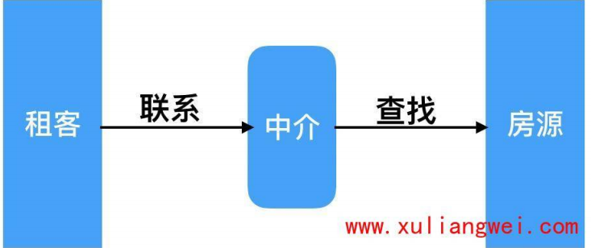

## 无代理场景

在没有使用代理的场景下，客户端都是直接请求服务端，服务端直接响应客户端。

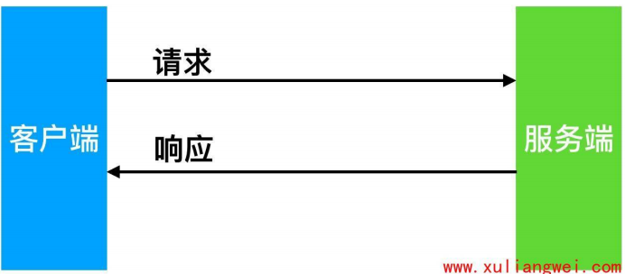

## 有代理场景

在使用代理的场景下，客户端无法直接向服务端发起请求，需要先请求代理服务，由代理服务代为请求后端节点，以实现客户端与后端通信;
使用代理会增加网络延迟，但能提高系统整体的响应，以此承担海量的并发请求;


# Nginx正向代理

即为内部上网：客户端←→代理←→服务端

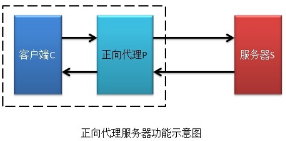

## 科学上网

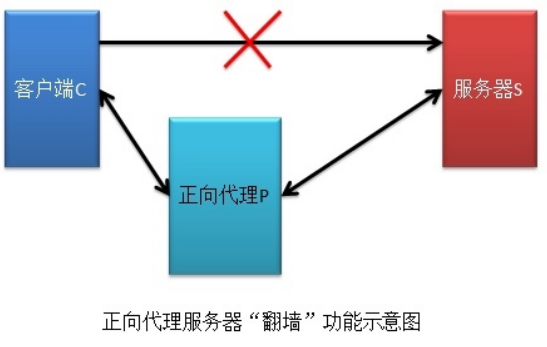

## 客户端缓存

比如下资源，可以查看代理服务是否有，如果有直接通过代理获取


## 客户端授权

很多公司为了安全，链接外网需要通过防火墙，防火墙可以配置规则，允许谁可以上外网，谁不可以上外网

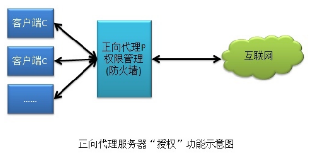

# Nginx反向代理（企业）

反向代理，用于公司集群架构中，客户端→代理←→服务端

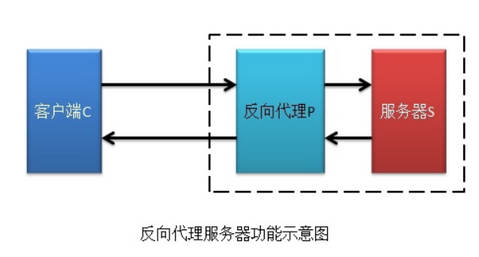

## 路由功能

根据用户请求的uri调度到不同功能的集群服务器进行处理

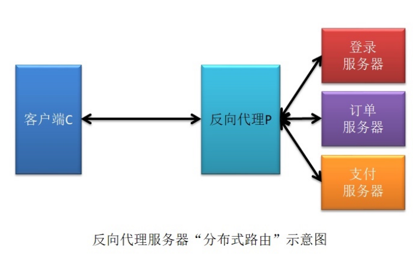

## 负载均衡

将用户发送的请求通过负载均衡调度算法挑选一台合适的节点进行请求处理

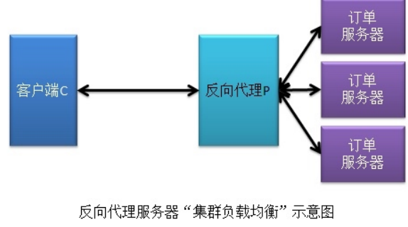

## 动静分离

根据用户请求的uri进行区分，将动态资源调度至应用服务器处理，将静态资源调度至静态资源服务器处理

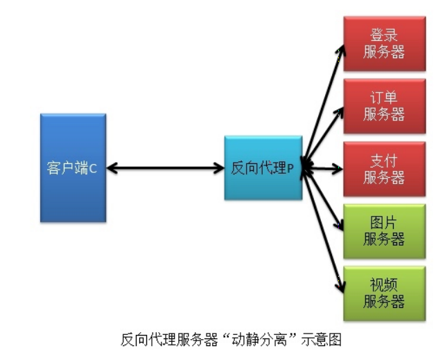

## 动静分离

根据用户请求的uri进行分区，将动态资源调度至应用服务器处理，将静态资源调度至静态资源服务器处理

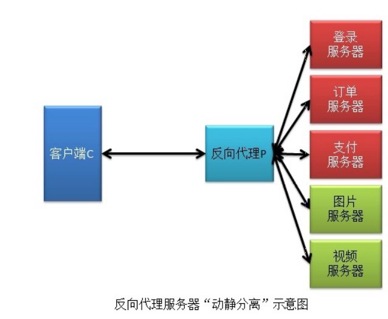

## 数据缓存

将后端查询的数据存储至反向代理的缓存上，可以加速用户获取资源

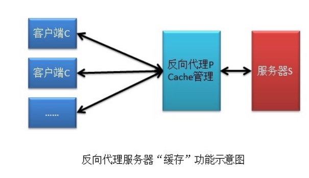

# 正向与反向代理区别

&#x20;区别在于形式上服务的的对象不一样。其次架设的位置点不一样

正向代理的对象是客户端，为客户 端服务pass

反向代理的对象是服务端，为服务端服务

user—>正向代理（路由器）—>反向代理（缓存）—>服务器

## nginx支持的代理协议

nginx作为代理服务，支持的代理协议非常多，


## nginx常用的代理协议

通常情况下，我们将nginx作为反向代理，常常会用到如下几种代理协议

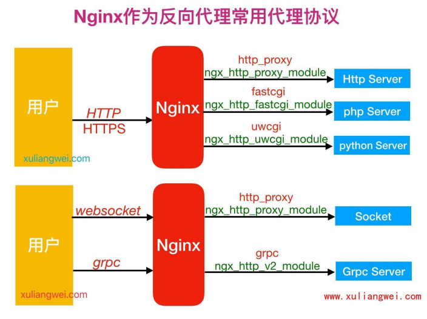

# Nginx反向代理实践

## 配置语法

```bash
systax:proxy_pass URL;
default:-
context: location,if in localtion, limit_except

```

## 环境准备

| 角色    | 外网       | 内网         | 主机名   |
| ----- | -------- | ---------- | ----- |
| Peoxy | 10.0.0.5 | 172.16.1.5 | lb01  |
| web01 |          | 172.16.1.7 | web01 |

## web节点配置

```bash
#web服务配置一个网站，监听8080，此时网站仅172网段用户可以访问
vim /etc/nginx/conf.d/创建nginx文件
server {
  listen 8080;
  server_name 域名;
  location / {
    root /code;
    index index.html; 
  }
}
mkdir /code  #创建要链接的目录
#在code目录下创建一个index.html的文件，让域名可以访问文件
重启nginx
```

## proxy节点配置

```bash
#proxy代理服务器，能让外网用户通过代理服务访问到后端的172.16.1.7的8080端口站点内容
vim /etc/nginx/conf.d/proxy_客户端创建的文件名称（保持一致，好修改）
server {
  listen 8080;
  server_name 域名;
  location / {
proxy_pass http://172.16.1.7:8080;
}
}
重启nginx
```

## 代理相关配置参数

### proxy\_set\_header

```bash
#添加发往后端服务器的请求头信息,
syntax: proxy_set_header field value;
Default:proxy_set_header Host$proxy_host;
proxy_set_header connection close;
context:http,server,location
#客户端请求Host的值是www. o1dxu.net，那么代理服务会像后端请求时携带Host变量为www. oldxu .net
proxy_set_header Host $http_host;
#将$remote_addr的值放进变量x-Rea7-IP中，$remote_addr的值为客户端的ip
proxy_set_header X-Real-IP $remote_addr;#客户端通过代理服务访问后端服务，后端服务会通过该变量会记录真实客户端地址
proxy_set_header X-Forwarded-For$proxy_add_x_forwarded_for;
```

### proxy\_http\_version

```bash
#代理后端请求使用的http协议版本，默认1.0
syntax：proxy_http_version 1.0|1.1
default:proxy_http_version 1.1;
context:http,server.location


```

### proxy\_connect\_timeout

```bash
#nginx代理与后端服务器“链接超时”时间（代理连接超时）
sysntax:proxy_connect_timeout time;
default:proxy_connect_timeout 60s;
context:http.server,localtion;

```

### proxy\_read\_timeout

```bash
#nginx代理等待后端服务器“响应（header）超时”时间
proxy_read_time time;
proxy_read_time 60s;
```

### proxy\_send\_timeout

```bash
#后端服务器“数据回传给nginx代理超时”时间
proxy_send_timeout time;
proxy_send_timeout 60s;


```

### proxy\_buffer(缓冲区)

1启用缓冲时，nginx代理服务器将尽快的接收响应Header以及响应报文，并将其保存到proxy\_buffer\_size(Headers）和proxy\_buffers(data)设置的缓冲区中。

```bash
#代理缓冲区
proxy_buffering on||off;
proxy_buffering on;
#控制代理服务器读取第一部分响应header缓冲区大小
proxy_buffer_size size;
```

## 代理参数总结

```bash
#代理网站常用优化配置时，将配置写入一个新文件，调用时使用include即可
vim /etc/nginx/proxy_params
proxy_http_version 1.1;
proxy_set_header Host $http_host;
proxy_set_header X-Real-IP $remote_addr ;proxy_set_header X-Forwarded-For$proxy_add_x_forwarded_for;
proxy_connect_timeout 30;
proxy_send_timeout 60;proxy_read_timeout 60;
proxy_buffering on ;
proxy_buffer_size 64k;proxy_buffers 4 64k;
#后期需要使用时直接include引用，便于localtion重复使用
```
