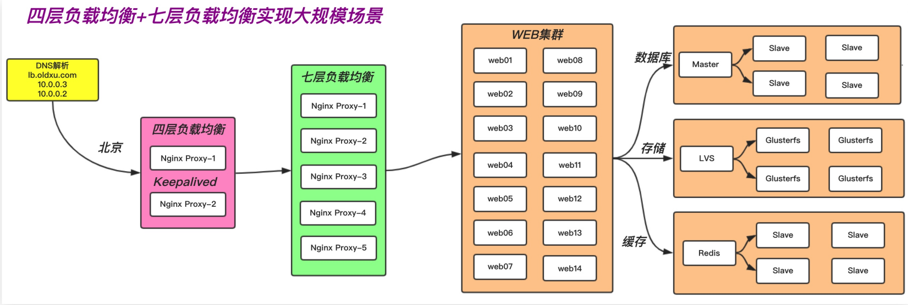

# 四层负载均衡

## 目录

-   [四层均衡负载基本概述](#四层均衡负载基本概述)
-   [应用场景](#应用场景)
-   [优缺点](#优缺点)
-   [实践](#实践)
    -   [实现http协议的均衡负载](#实现http协议的均衡负载)
    -   [实现mysql负载均衡](#实现mysql负载均衡)

# 四层均衡负载基本概述

所谓四层就是基于IP+端口的负载均衡，它通过用户请求
的端口来决定将请求转发至哪台后端服务器。

# 应用场景

1.场景一、端口代理
首先http当然是最常用的一种协议，但是还是有很多非http的应用（mysql、redis、ssh），只能用四层代理

2.场景二、四层负载均衡+七层负载均衡，实现大规模集群架构。其次七层代理需要CPU运算，所以单台机器很难做到很高的处理能力，因此需要在七层负载均衡前面再加四层负载均衡。（提高网站的访问效率，并保证了七层负载均衡的高可用性。）



# 优缺点

1.四层负载均衡通常用来转发非http应用：如 tcp/80tcp/443 tcp/3306 tcp/22 udp/53

2.四层负载均衡可以解决七层负载均衡高可用性的问题。( 多个七层负载均衡同时提供服务 )

3.四层负载均衡可以解决七层负载均衡端口数限制问题。（七层负载均衡最多能使用的端口是5w）

4.四层转发效率远比七层代理的效率高的多，但是他只能支持tcp/ip协议，所以他的功能较弱，虽然七层效率不高，但他支持http/https这样的应用层协议。

# 实践

语法配置示例

```bash
stream {
      upstream backend {
      hash $remote_addr consistent;
      server backend1.example.com:12345 weight=5;
      server 127.0.0.1:12345 max_fails=3
        fail_timeout=30s;
        server unix:/tmp/backend3;
}
  server {
      listen 12345;
      proxy_connect_timeout 1s;
      proxy_timeout 3s;
      proxy_pass backend;
}
}

```

## 实现http协议的均衡负载

```bash
[root@lb02 ~]# vim /etc/nginx/nginx.conf
events {
....
}
include /etc/nginx/conf.c/*.conf;
http {
.....
}
#创建存放四层负载均衡配置的目录
[root@lb4-01 conf.c]# rm -f
/etc/nginx/conf.d/default.conf #删除http的
80端口
[root@lb4-01 ~]# mkdir /etc/nginx/conf.c
[root@lb4-01 ~]# cd /etc/nginx/conf.c
[root@lb4-01 conf.c]# cat lb_domain.conf
stream {
upstream lb {
server 172.16.1.5:80 weight=5 max_fails=3 fail_timeout=30s;
server 172.16.1.6:80 weight=5 max_fails=3 fail_timeout=30s;
}
server {
  listen 80;
  proxy_connect_timeout 3s;
  proxy_timeout 3s;
  proxy_pass lb;
}
}
```

## 实现mysql负载均衡

```bash
#请求负载均衡 5555 ---> 172.16.1.7:22
#请求负载均衡 6666 ---> 172.16.1.51:3306
[root@lb01 ~]# mkdir -p /etc/nginx/conf.c
[root@lb01 ~]# vim /etc/nginx/nginx.conf   # 在events层下面，http层上面配置include
include /etc/nginx/conf.c/*.conf;  
# 配置Nginx四层转发
[root@lb01 ~]# cd /etc/nginx/conf.c/
[root@lb01 conf.c]# cat stream.conf
stream {
#1.定义转发tcp/22端口的虚拟资源池
upstream ssh {
server 172.16.1.7:22;
}
#2.定义转发tcp/3306端口的虚拟资源池
upstream mysql {
server 172.16.1.51:3306;
}
#调用虚拟资源池
server {
listen 5555;
proxy_connect_timeout 1s;
proxy_timeout 300s;
proxy_pass ssh;
}
server {
listen 6666;
proxy_connect_timeout 1s;
proxy_timeout 300s;
proxy_pass mysql;
}
}
```
