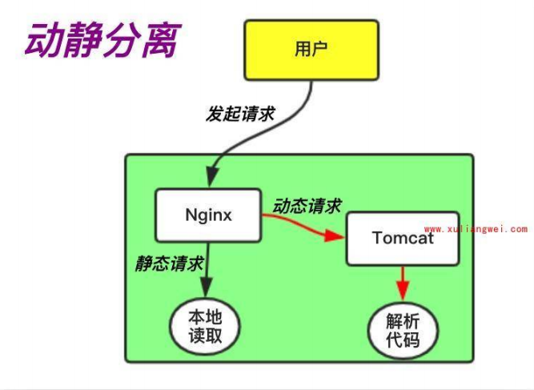
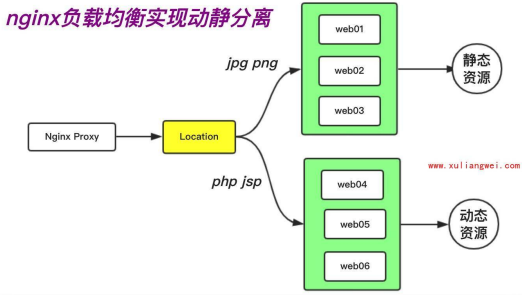
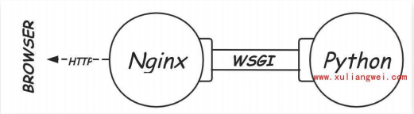
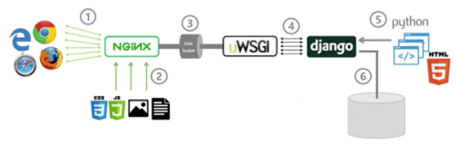

# 动静分离

## 目录

-   [动静分离基本介绍](#动静分离基本介绍)
    -   [如何实现动静分离](#如何实现动静分离)
-   [单机动静分离实践](#单机动静分离实践)
-   [集群动静分离实践](#集群动静分离实践)
    -   [环境准备](#环境准备)
    -   [配置实践](#配置实践)
-   [Uwsgi代理基本概述](#Uwsgi代理基本概述)
    -   [uwsgi结合nginx](#uwsgi结合nginx)
    -   [uwsgi代理配置场景](#uwsgi代理配置场景)
    -   [uwsgi代理项目实践](#uwsgi代理项目实践)

# 动静分离基本介绍

其实就是将动态请求和静态请求分开处理

## 如何实现动静分离

nginx通过用户请求的uri来区分请求的类型。并转发给不同的服务端

如果请求的uri包含png，jpg等资源则有nginx处理，如果请求的uri包含php，jsp等资源则代理至tomcat处理



# 单机动静分离实践

环境配置：nginx+tomcat

```bash
#tomcat的配置
yum install java   #安装Java插件
wget https://mirrors.tuna.tsinghua.edu.cn/apache/tomcat/tomcat-9/v9.0.52/bin/apache-tomcat-9.0.52.tar.gz  #安装tomcat包
mkdir  /要安装软件的文件夹  #创建安装文件的文件夹
tar xf apache-tomcat-9.0.52.tar.gz -C /创建的文件夹 
ln -s /安装的软件位置  /要创建软连接的名字  #安装的名字较长，为其创建一个软链接
软件文件夹下的/bin/startup.sh   #运行软件
####nginx的配置######
vim /etc/nginx/conf.d/ds.oldxu.net.conf  #创建nginx文件
server  {
    listen 80;
    server_name java.oldxu.net;
    #处理动态请求
    location / {
    proxy_pass http://10.0.0.7:8080;
    include proxy_params;
    } 
    #如果匹配到.png .jpg这样的后缀，则让其通过nginx读取到本地/code/images下的资源文件
    location ~* \.(png|jpg)$ {  #忽略大小写匹配png和jpg结尾的文件
    root /code/images;
    expires 30d;   #将资源缓存三十天
    }

}


```

# 集群动静分离实践

通过nginx负载均衡将动态请求和静态请求进行分离，基于用户请求uri实现路由功能。



## 环境准备

| 系统     | 服务   | 安装服务         | 地址 |
| ------ | ---- | ------------ | -- |
| centos | 负载均衡 | nginx+proxy  |    |
| centos | 动态资源 | nginx+static |    |
| centos | 静态资源 | tomcatserver |    |

## 配置实践

```bash
#10.0.0.7动态节点的配置
/tomcat的安装包下的/bin/shutdown.sh  #安装tomcat
rm -rf /soft/tomcat/webapps/root/*  
#编写java配置
vim /soft/tomcat/webapps/ROOT/index.jsp
<% page language="java"
  import="java.uti7.*" pageEncoding="utf-8"%>
  <html>
<head>
<title>Nginx+Tomcat动静分离</title></head>
<body>
<%
    Random rand = new Random(;
    out.println("<h2>动态资源</h2>");
    out.println(rand.nextInt(99)+100) ;
%>
<h2>静态图片</h2>
      
</body>
</html>

####配置10.0.0.8静态资源节点####
vim /etc/nginx/conf.d/ds.oldxu.net.conf
server {
    listen 80;
    server_name ds.oldxu.net;
    root /code/images;
    localtion / {
    index index.html;
    }

}
#准备目录以及静态图片
mkdir /code/images
wget -O /code.images/nginx.png http://nginx.org/nginx.png
systemctl reload nginx
####配置10.0.0.5的负载均衡配置调度，根据不同uri调度到不同服务器###
vim  /etc/nginx/conf.d/proxy_ds.oldxu.net.conf
  upstream java {
    server 172.16.1.7 :8080;
}
  upstream static {
    server 172.16.1.8:80;
}
server {
    1isten 80;
      server_name ds.oldxu.net;
    location / {
      proxy_pass http://java;
      include proxy_params;
}
    location ~* .*\.(png|gif)$ {
      proxy_pass http://static;
  }
}
  systemctl reload nginx

 进行测试 
```

# Uwsgi代理基本概述

wsgi全称是web server gateway interface是为python语言定义的web服务器和web应用程序之间的一种简单通用的接口，它既是一个网关，用于协议之间的的转换，也就是说他是一个桥，一边是web服务器，一边是web应用程序



而uwsgi实现了wsgi、http等数据交换协仪。也就是我们将项目通过uwsgi方式运行，可以直接对外服务吗，无需依托nginx


## uwsgi结合nginx

通常情况下Python中的Django框架或F1ask框架可以通过uwsgi方式对外提供服务。为什么还需要Nginx

1.安全:后端服务直接以http对外提供访问，往往会暴露后端的真实服务，如果使用nginx可以隐藏后端的服务，并且nginx能够实现安全限制、Rewrite、HTTPs等功能(这些都是uwsgi无法实现的)

2.效率: nginx可以直接处理静态资源，然后将动态内容通过uwsGI协议转发给后端Django，实现动静分离，提供更好的请求与响应。



## uwsgi代理配置场景

步骤一：安装python3的环境

步骤二：安装django框架及uwsgi

步骤三：配置django工程

步骤四：配置uwsgi、配置nginx

```bash
yum install openss1-devel bzip2-devel expat-devel gdbm-devel readline-devel  #安装python3

pip3 install -i https://mirrors.aliyun.com/pypi/simple/ --upgrade pip
pip3 install -i https://mirrors.aliyun.com/pypi/simp1e/django==2.1.8
pip3 install -i https://mirrors.aliyun.com/pypi/simple/uwsgi   #安装diango
##创建django项目
cd /opt
django-admin.pystartproject demosite
cd demosite
python3 manage.pyrunserver 0.0.0.0:8002
访问http://8002正常会提示the install worked successfully
若出现ALLOWED_HOSTS，修改以下配置
vim demosite/settings.py
ALLOWED_HOSTS = ['*']
##配置Uwsgi运行项目##
#配置Django工程以由uwsgi方式运行
[root@web01 ~]# vim/opt/demosite/uwsgi.ini
[uwsgi]
#uwsgi监听的端口
socket = 127.0.0.1:9999
#uwsgi启动进程数
workers = 2
#最大接收的请求数
max-requests = 1000
#buffer缓冲区大小
buffer-size = 30000
#进程pid存放路径
pidfile = /run/uwsgi.pid
#uwsgi日志存储路径
daemonize = /var/1og/uwsgi.log
##配置nginx代理uwsgi
#通过uwsgi方式启动django项目，默认监听127.0.0.1
[root@web01 ~]# uwsgi --ini/opt/demosite/uwsgi.ini
[root@web01 ~]# netstat -1ntp
#配置Nginx，使用Nginx代理uwsgi应用
[root@web01 ~]# cat /etc/nginx/conf.d/py.conf
server {
listen 80;
        server_name py.o1dxu.net;
        client_max_body_size 10OM;
        location / {
        index index.htm1 ;   #默认返回页面
            uwsgi_pass 127.0.0.1:9999;
            uwsgi_param uwSGI_CHDIR
            /opt/demosite;#工程所在的路径
            uwsgi_param uwsGI_SCRIPT
         demosite.wsgi ; #demosite/wsgi接口文件
          include uwsgi_params ;
          }
   }
   浏览器测试

```

## uwsgi代理项目实践

分为以下步骤

1.安装python3环境

⒉.安装Django环境
3.下载博客系统、安装博客系统所需要的模块

4.配置博客链接的数据库、在数据上创建对应的库名

5.导入博客的数据内容

6.收集所有的静态资源文件到统一的一个目录中

7.配置uwsgi运行

8.配置Nginx反向代理uwsgi

```bash
##下载博客系统
wget http://cdn.xuliangwei.com/pythonav.zip
unzip pythonav.zip -d /code
pip3 install -i https://pypi.doubanio.com/simple/ -r /code/pythonav/requireements.txt  #下载该项目所需的依赖包
yum install mariadb mariadb-server  #安装数据库并添加pythonav基础表
vim /code/BBS/BBS/settings.py
  'default' : {
    'ENGINE':
'django.db.backends.mysql',
      'NAME': 'pythonav ',
      'HOST' : "127.0.0.1",
     'USER ' : 'root',
   'PASSWORD': '',
       'PORT': 3306,
}
}
python manage.py makemigratins
python manage.py migrat  #初始化数据库

#创建超级管理员用户
python3 manage.py createsuperuser
username (leave blank to use 'root '): oldxu
Email address : 552408925@qq.com
Password:#输入密码
Password (again) :#确认密码
superuser created successfully.
#手机静态资源至指定位置存储
python manage.py collectstatic
###配置uwsgi运行项目###
[root@web01 pythonav]# cat pythonav_uwsgi.ini
[uwsgi]
#uwsgi监听的端口
socket = 127.0.0.1:8811
#指定项目所在路径
chdir = /code/pythonav/
#指定项目入口文件
wsgi-file = pythonav/wsgi.py
#uwsgi启动的进程数量与线程数量processes = 4
threads = 10
#最大接收的请求数
max-requests = 1000
#buffer缓冲区大小
buffer-size = 30000
#进程pid存放路径
pidfile = /run/uwsgi-pythonav.pid
#uwsgi日志存储路径
daemonize = /var/log/uwsgi-pythonav. log
#启动uwsgi
[root@web01 ~]# uwsgi --ini
/code/pythonav/pythonav_uwsgi.ini

###配置nginx代理uwsgi###
[root@web02 pythonav]# cat /etc/nginx/conf.d/pythonav.oldxu.net.confserver i
    listen 80;
      server_name av.oldxu.net;
      client_max_body_size 10OM;
      location /static {
         alias /opt/pythonav/static;
}
        location / {
        uwsgi_pass 127.0.0.1:8811;
        include uwsgi_params ;
}
}
访问测试
```
