# LVS四层负载均衡

## 目录

-   [基本概述](#基本概述)
-   [为什么需要](#为什么需要)
-   [组成部分](#组成部分)
-   [相关名词](#相关名词)
-   [使用场景](#使用场景)
-   [常见模型](#常见模型)
    -   [NAT模型](#NAT模型)
    -   [DR模型](#DR模型)
-   [LVS集群命令介绍](#LVS集群命令介绍)
    -   [集群管理参数](#集群管理参数)
    -   [节点管理参数](#节点管理参数)
-   [LVS NAT模型详解](#LVS-NAT模型详解)
    -   [访问原理](#访问原理)
    -   [特性总结](#特性总结)
    -   [NAT模型场景实现](#NAT模型场景实现)
        -   [NAT架构规划](#NAT架构规划)
    -   [NAT模型实践](#NAT模型实践)
-   [LVS DR模型详解](#LVS-DR模型详解)
    -   [基础图解](#基础图解)
    -   [访问流程](#访问流程)
    -   [特性总结](#特性总结)
    -   [DR ARP参数](#DR-ARP参数)
    -   [场景实践](#场景实践)
-   [shell脚本配置LVS环境](#shell脚本配置LVS环境)
-   [keepalived高可用实践](#keepalived高可用实践)
    -   [为什么需要高可用](#为什么需要高可用)
    -   [高可用实践](#高可用实践)
    -   [LVS实现MySQL负载均衡（LVS+Proxy+nginx+mysql+https）](#LVS实现MySQL负载均衡LVSProxynginxmysqlhttps)
-   [LVS持久链接实践](#LVS持久链接实践)
    -   [什么时持久化链接](#什么时持久化链接)
    -   [持久化链接设置](#持久化链接设置)
    -   [持久化链接测试](#持久化链接测试)
-   [LVS调度算法详解](#LVS调度算法详解)
    -   [静态调度算法](#静态调度算法)
        -   [RR](#RR)
        -   [WRR](#WRR)
        -   [SH](#SH)
        -   [DH](#DH)
    -   [动态调度算法](#动态调度算法)
        -   [LC](#LC)
        -   [WLC](#WLC)
        -   [SED](#SED)
        -   [ND](#ND)
        -   [LBLC](#LBLC)
        -   [LBLCR](#LBLCR)

# 基本概述

LVS的英文全称是Linux virtual server，即Linux虚拟服务器。其实它是一种`cluster`集群技术,主要用于负戟均衡，将用户请求均匀的调度到不同的服务器上执行。
注意:Lvs是基于四层IP:PORT的负载均衡。

# 为什么需要

解决七层负载不够问题，实现百万链接，解决七层负载高可用问题

# 组成部分

ipv4:工作在内核空间，实现集群服务的"调度"，借鉴了iptables的实现方式

ipvsadm:工作在用户空间，负责为ipvs内核框架编写规则。定义谁是集群服务，谁是后端服务器，数据包如何调度，调度到哪个节点。

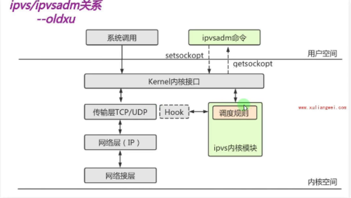

# 相关名词

| 名称  | 详细名称               | 描述              |
| --- | ------------------ | --------------- |
| DS  | Director server    | lvs服务器名称        |
| RS  | Real Server        | lvs后端的应用节点      |
| CIP | client IP          | 客户端IP地址         |
| VIP | VIRtual IP         | 虚拟IP，必须要配置，面向用户 |
| DIP | director server ip | ds服务器真实的IP地址    |
| RIP | real server IP     | rs服务器的真实IP地址    |

# 使用场景

提高应用服务器处理能力

消除单点故障，实现流浪分发

同城容灾

腾讯云：[负载均衡 使用场景 - 产品简介 - 文档中心 - 腾讯云 (tencent.com)](https://cloud.tencent.com/document/product/214/529 "负载均衡 使用场景 - 产品简介 - 文档中心 - 腾讯云 (tencent.com)")

阿里云：[应用场景 (aliyun.com)](https://help.aliyun.com/document_detail/27543.html "应用场景 (aliyun.com)")

青云：[帮助与文档 | 青云QingCloud](https://docs.qingcloud.com/product/network/loadbalancer/#应用场景 "帮助与文档 | 青云QingCloud")

# 常见模型

LVS负载均衡模型有NAT、DR、TUN、FULL-NAT\`，较为常见的模型有NAT、DR，使用最为广泛的模型是DR

## NAT模型

NAT:通过修改请求报文的目标IP地址，然后根据算法挑选出某台Rs进行转发。《请求进入负载均衡器LVS时做 DNAT，后端返回数据报文出负载均衡时做 SNAT

## DR模型

DR:通过修改请求报文的目标MAC地址，然后根据算法挑选出某台RS进行转发。(请求进入负载均衡器LVS 时做MAC地址转换，后端返回数据报文不经过负载均衡，所以无需做转换

# LVS集群命令介绍

ipvsadm用法大概分两类：管理集群服务（定义负载均衡配置）、管理后端RS（定义负载均衡后端节点的增删配置）

## 集群管理参数

```bash
-A, --add-service#添加一个生群服务
-E, --edit-service#修改己添加的集群服务
-D，--delete-service#刮除虚拟服务
-c, --clear#清空集群所有规则
-R, --restore#从文件中恢复集群
-s, --save#将集群信息报文至文件中
-L|-l，--list#列出当前失群信息
-z， --zero#清生集群计数器
-n #数字格式显示ip和port.注意-n只能写在-L之后
```

## 节点管理参数

```bash
-a， --add-server#表示要添加RS节点
-e, --edit-server#长示要修改RS节点
-d,--delete-server#表示要刷除RS节点
-t. service-address#指定操作哪个节点地址与端口，host[: port]. tcp协议
-u. service-address#指定探作哪个节点地址与端口, host[:port]. udp协议
-r. --real-server#指定RS节点地址与端口
-w，--weight#指定RS节点的权重
-m，—-masquerading#指定LVS工作模型( NAT模型）
-g,--gatevaying#指定 LVS工作模型(DR模型)
-i， --ipip#指定LVS工作模型( tun模型)
-s. --scheduler#指定 LvS训度策略，歌认为wlc
-p:--persistent#持久连接超时时间
-f， --fwmark-service#防火墙标记
-c，--connection#显示ipvs连接信息

```

# LVS NAT模型详解

通过修改请求报文的目标ip地址，而后根据调度算法挑选出一台RS节点进行转发（请求进入负载均衡器LVS时做DNAT，后端返回数据退出负载均衡时做RNAT）

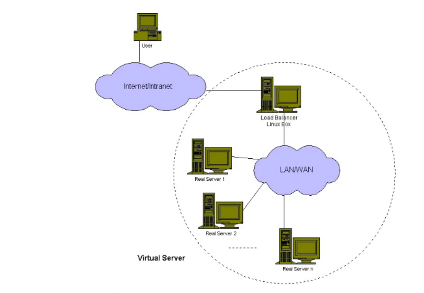

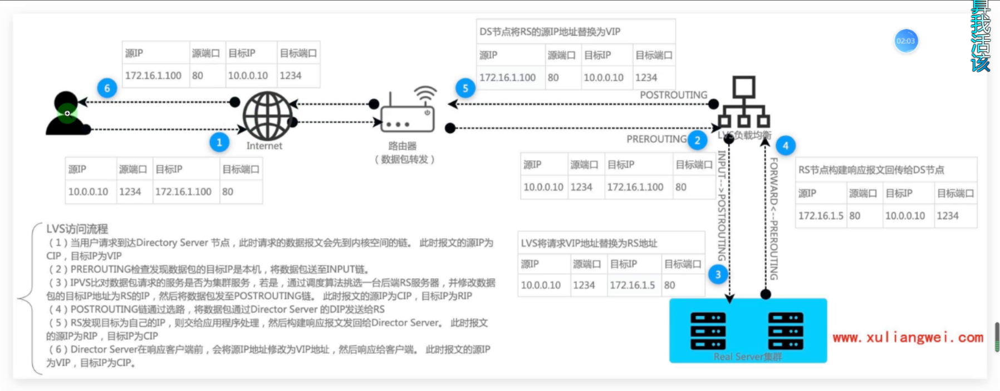

## 访问原理

1、当用户请求到达 Director Server，此时请求的数据报文会先到内核空间的PREROUTING链。此时报文的源IP为CIP，目标IP为VIP

2、PREROUTING检查发现数据包的目标IP是本机，将数据包送至INPUT链。

3、IPVs 比对数据包请求的服穷定白乃来针hTO QlITTNG链。此时报文的源IP为CIP，目标IP为数据包的目标IP为Rs的IP，然后将数据包发至POSTROUTING链。此时报文的源IP为CIP，目标IP为RIP

4、POSTROUTING链通过选路，将数据包通过Director server的 DIP发送给RS

5、Rs发现目标为自己的IP，则交给应用程序处理，然后构建响应报文发回给Director server。
此时报文的源IP为RIP，目标IP为CIP

6、Director server 在响应客户端前，会将源工P地址修改为vIP地址，然后响应给客户端。此时报文的源IP为VIP，目标IP为CIP

## 特性总结

1、RS 必须使用私网地址，并需要将网关指向DS ;

2、RIP和DIP必须为同一网段内;

3、NAT模型支持端口映射;

4、RS 可以使用任意操作系统。例如Linux、 windows等;

5、请求和响应报文都要经过 Ds，高负载场景中，DS易称为瓶颈。

## NAT模型场景实现

### NAT架构规划

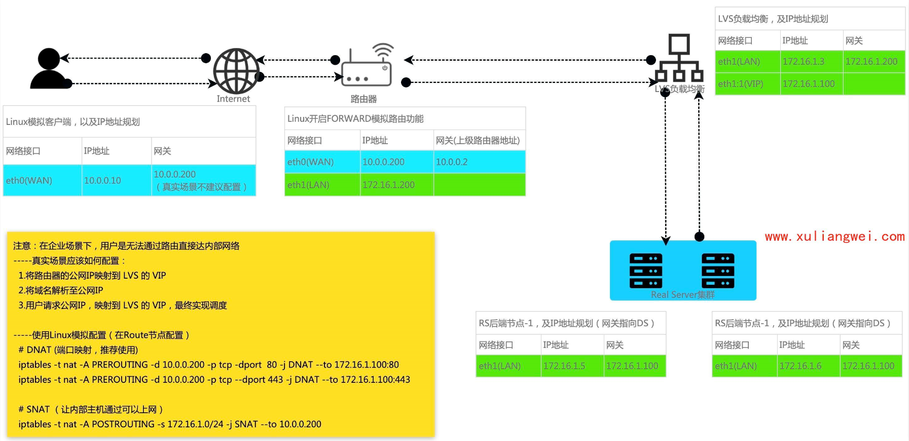

## NAT模型实践

```bash
##客户端:仅需要配置一个公网的地址即可  eth:10.0.0.10,eth1:不需要，关闭 
      [root@client ~]# cat  /etc/sysconfig/network-scripts/ifcfg-eth0 
      TYPE=Ethernet
      BOOTPROTO=none
      DEFROUTE=yes
      NAME=eth0
      DEVICE=eth0
      ONBOOT=yes
      IPADDR=10.0.0.10
      PREFIX=24
      [root@client ~]# ifdown eth0 && ifup eth0
      [root@client ~]# ifdown eth1

 ##路由器：充当真正的路由 配置网卡如下eth0:10.0.0.200 eth1:172.16.1.200 gateway:10.0.0.2,并开启forward转发功能 
      #eth0配置：
      [root@route ~]# cat /etc/sysconfig/network-scripts/ifcfg-eth0
      TYPE=Ethernet
      BOOTPROTO=none
      DEFROUTE=yes
      NAME=eth0
      DEVICE=eth0
      ONBOOT=yes
      IPADDR=10.0.0.200
      PREFIX=24
      GATEWAY=10.0.0.2
      DNS1=223.5.5.5
      
      #eth1配置：
      [root@route ~]# cat /etc/sysconfig/network-scripts/ifcfg-eth1
      TYPE=Ethernet
      BOOTPROTO=none
      DEFROUTE=yes
      NAME=eth1
      DEVICE=eth1
      ONBOOT=yes
      IPADDR=172.16.1.200
      PREFIX=24
      
      #开启forward转发：
      [root@route ~]# echo "net.ipv4.ip_forward = 1" >> /etc/sysctl.conf 
      [root@route ~]# sysctl -p
 #RS节点: eth0:关闭。eth2:172.16.1.5 gateway:172.16.1.100.nginx:提供web站点；修改成proxy模式 。
      eth0配置：
      [root@proxy01 ~]# ifdown eth0
      eth1配置：
      [root@proxy01 ~]# cat  /etc/sysconfig/network-scripts/ifcfg-eth1 
      TYPE=Ethernet
      BOOTPROTO=none
      DEFROUTE=yes
      NAME=eth1
      DEVICE=eth1
      ONBOOT=yes
      IPADDR=172.16.1.5
      PREFIX=24
      GATEWAY=172.16.1.100
      [root@proxy01 ~]# ifdown eth1 && ifup eth1
      
      
      nginx配置：
      [root@proxy01 ~]# cat /etc/nginx/conf.d/lvs.oldxu.net.conf 
      server {
        listen 80;
        server_name lvs.oldxu.net;
        root /opt;
      
        location / {
          index index.html;
        }
      }
      [root@proxy01 ~]# echo "Proxy01 Real Server" > /opt/index.html
      [root@proxy01 ~]# nginx -t
      [root@proxy01 ~]# systemctl reload nginx
 #RS节点:eth0:关闭  eth1:172.16.1.6  gateway:172.16.1.100 . nginx:提供web站点；修改为proxy模式 
      eth0配置：
      [root@proxy02 ~]# ifdown eth0
      
      eth1配置：
      [root@proxy02 ~]# cat /etc/sysconfig/network-scripts/ifcfg-eth1 
      TYPE=Ethernet
      BOOTPROTO=none
      DEFROUTE=yes
      NAME=eth1
      DEVICE=eth1
      ONBOOT=yes
      IPADDR=172.16.1.6
      PREFIX=24
      GATEWAY=172.16.1.100
      [root@proxy02 ~]# ifdown eth1 && ifup eth1
      nginx配置：
      [root@proxy01 ~]# cat /etc/nginx/conf.d/lvs.oldxu.net.conf 
      server {
        listen 80;
        server_name lvs.oldxu.net;
        root /opt;
      
        location / {
          index index.html;
        }
      }
      [root@proxy02 ~]# echo "Proxy01 Real Server" > /opt/index.html
      [root@proxy02 ~]# nginx -t
      [root@proxy02 ~]# systemctl reload nginx

 #配置LVS规则: eth0；关闭 eth1:172.16.1.3  gateway:172.16.1.200  vip:172.16.1.100,开启forware转发功能  
      #eth0配置：
      [root@lvs01 ~]# ifdown eth0
      
      #eth1配置：
      [root@lvs01 ~]# cat  /etc/sysconfig/network-scripts/ifcfg-eth1 
      TYPE=Ethernet
      BOOTPROTO=none
      DEFROUTE=yes
      NAME=eth1
      DEVICE=eth1
      ONBOOT=yes
      IPADDR=172.16.1.3
      PREFIX=24
      GATEWAY=172.16.1.200
      [root@lvs01 ~]# ifdown eth1 && ifup eth1
      
      
      #vip配置：
        [root@lvs01 ~]# cp /etc/sysconfig/network-scripts/ifcfg-eth1 /etc/sysconfig/network-scripts/ifcfg-eth1:1
      [root@lvs01 ~]# cat  /etc/sysconfig/network-scripts/ifcfg-eth1:1
      TYPE=Ethernet
      BOOTPROTO=none
      DEFROUTE=yes
      NAME=eth1:1
      DEVICE=eth1:1
      ONBOOT=yes
      IPADDR=172.16.1.100
      PREFIX=24
      [root@lvs01 ~]# ifdown eth1:1 && ifup eth1:1
      
      
      #开启forward：
      [root@lvs01 ~]# echo "net.ipv4.ip_forward = 1" >> /etc/sysctl.conf 
      [root@lvs01 ~]# sysctl -p
      
      #配置ipvs规则；  将请求的80端口，调度到后端rs节点；
      [root@lvs01 ~]# yum install ipvsadm -y
      [root@lvs01 ~]# ipvsadm -A -t 172.16.1.100:80 -s rr
      [root@lvs01 ~]# ipvsadm -a -t 172.16.1.100:80 -r 172.16.1.5 -m 
      [root@lvs01 ~]# ipvsadm -a -t 172.16.1.100:80 -r 172.16.1.6 -m 
      
      [root@lvs01 ~]# ipvsadm -L -n
      IP Virtual Server version 1.2.1 (size=4096)
      Prot LocalAddress:Port Scheduler Flags
        -> RemoteAddress:Port           Forward Weight ActiveConn InActConn
      TCP  172.16.1.100:80 rr
        -> 172.16.1.5:80                Masq    1      0          0         
        -> 172.16.1.6:80                Masq    1      0          0  
 #在路由器上增加端口映射，模拟实现真实的公网环境 
      [root@route ~]# iptables -t nat -A PREROUTING -d 10.0.0.200 -p tcp --dport 80 -j DNAT --to 172.16.1.100:80
      [root@route ~]# iptables -t nat -L -n
      Chain PREROUTING (policy ACCEPT)
      target     prot opt source               destination         
      DNAT       tcp  --  0.0.0.0/0            10.0.0.200           tcp dpt:80 to:172.16.1.100:80
删除客户端的网关，让客户端请求路由器的公网IP，如果能访问，说明ok了’
```

# LVS DR模型详解

通过修改请求报文的目标MAc地址，然后根据算法挑选出合适的Rs 节点，进行转发。(请求进入DSserver时做 MAC地址替换，后端返回数据报文时无需经过Ds server节点，直接返回给客户端即可。)

## 基础图解

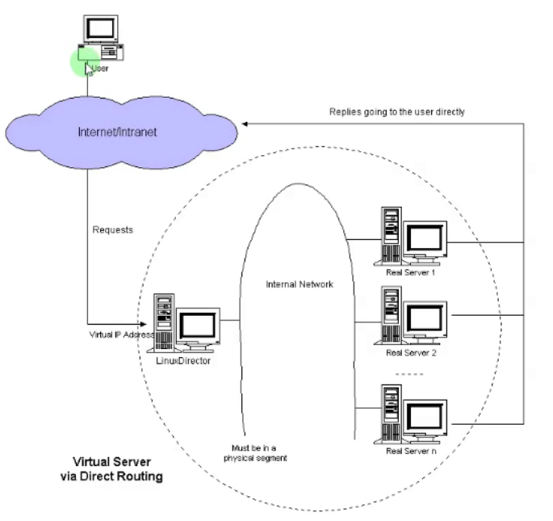

1.路由器如何找到VIP以及MAC地址呢?

路由器通过ARP广播获取vMAC，然后封装cIP、VIP、CMAC、VMAC，通过交换机转发至目标主机

2.RS处理请求直接返回给cIP，不经过Ds，那么Rs如何将数据包回传给CIP

由于cIP请求的是vIP，而响应是通过RIP响应给cIP，所以数据报文一定会被丢弃。那么就需要在所有的Rs的接口上配置vIP的地址。由Rs上的VIP响应给cIP即可。

3.所有Rs节点都配置vP，那么路由器在广播的时候，岂不是所有的vIP都会响应?

方式1:在路由器上静态绑定vIp与VMAc的关系。(但可能没有操作权限)
方式2∶在所有Rs节点上配置ARP抑制，简单来说就是路由器广播获取vwAc时，所有的Rs都不应答，其次所有的Rs都不对外宣布自己的\`VIP

5.VIP、DIP、RIP需要在同一网段中吗?

一般来说DIP和RIP在同一物理网络中，并不一定在同一网段中。

## 访问流程

1、当用户请求到达Ds节点，此时请求的数据报文会先到内核空间的PREROUTING链。此时报文的源IP为CIP，目标IP为VIP。

2、PREROUTING检查发现数据包的日标IP是本机。将数据包送至INPUT链。

3、IPvs比对数据包请求的服务是否为集群服务，是则将请求报文中的源MAc修改为DAAc，将日标MAc修改RMAc，然后将数据包通过PO5TROUTING链发出。此时的源IP和日的IP均未修改，仅将源MAc修改为DMAc，|目标MAC修改为RMAC

4、Rs拆解数据报文发现请求的IP地址是本机，则会接收该数据报文，而后构建响应报文向外发出，此时的源P是VIP，目标P是CIP

5、响应报文最终送达至客户端

## 特性总结

1、请求报文必须由Ds节点转发，但响应报文必须不经过Ds节点

2、RS不能将网关指向Ds节点的DIP

3、Ds和Rs节点必须位于同一物理网络中

4、DR模型不支持地址转换，也不支持端口映射

5、Rs可以是常见的操作系统windows、Linux、Macos

6、Rs在lo接口上配置VIP

## DR ARP参数

arp\_ignore(控制系统在收到外部的arp请求时，是否应答。)。

0默认值，将本机所有接口的所有信息像每个连接的网络进行通告

1只应答本地主机访问网络接口(etho-->1o)，才给予响应

arp\_announce(控制系统是否对外宣布自己的地址。)

0默认值，把本机所有接口的所有信息向每个接口的网络进行通告。

1"尽量避免"将接口信息向非直接连接网络进行通告

2"必须避免"将接口信息向非本网络进行通告

## 场景实践

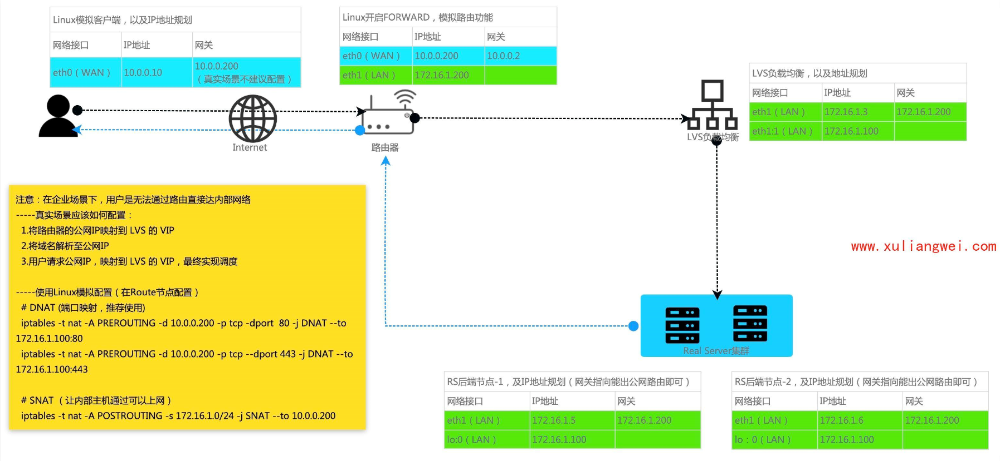

```bash
#客户端: eth0:10.0.0.10,eth1:关闭 
      [root@client ~]# ifdown eth1
      [root@client ~]# cat /et2c/sysconfig/network-scripts/ifcfg-eth0 
      TYPE=Ethernet
      BOOTPROTO=none
      DEFROUTE=yes
      NAME=eth0
      DEVICE=eth0
      ONBOOT=yes
      IPADDR=10.0.0.10
      PREFIX=24

 #路由器 eth0: 10.0.0.200  gateway: 10.0.0.2  eth1: 172.16.1.200   开启forward 
      #eth0:
      [root@route ~]# cat /etc/sysconfig/network-scripts/ifcfg-eth0
      TYPE=Ethernet
      BOOTPROTO=none
      DEFROUTE=yes
      NAME=eth0
      DEVICE=eth0
      ONBOOT=yes
      IPADDR=10.0.0.200
      PREFIX=24
      GATEWAY=10.0.0.2
      DNS1=223.5.5.5
      
      #eth1:
      [root@route ~]# cat /etc/sysconfig/network-scripts/ifcfg-eth1
      TYPE=Ethernet
      BOOTPROTO=none
      DEFROUTE=yes
      NAME=eth1
      DEVICE=eth1
      ONBOOT=yes
      IPADDR=172.16.1.200
      PREFIX=24
      
      #开启forward                                      
      [root@route ~]# sysctl -p
      net.ipv4.ip_forward = 1
      
      #清理IPtables规则
      [root@route ~]# iptables -t nat -F 
      [root@route ~]# iptables -t nat -L -n
 #RS1节点:eth0:关闭 eth1:172.16.1.5  gateway:172.16.1.200  lo:172.16.1.100  #RS2:eth1:172.16.1.6 其他操作和RS1一样 
      #关闭eth0接口；
      [root@proxy01 ~]# ifdown eth0
      
      
      #配置eth1IP地址：
      [root@proxy01 ~]# cat  /etc/sysconfig/network-scripts/ifcfg-eth1 
      TYPE=Ethernet
      BOOTPROTO=none
      DEFROUTE=yes
      NAME=eth1
      DEVICE=eth1
      ONBOOT=yes
      IPADDR=172.16.1.5
      PREFIX=24
      GATEWAY=172.16.1.200
      [root@proxy01 ~]# ifdown eth1 && ifup eth1
      
      
      #配置Nginx
      [root@proxy01 ~]# cat /etc/nginx/conf.d/lvs.oldxu.net.conf 
      server {
        listen 80;
        server_name lvs.oldxu.net;
        root /opt;
      
        location / {
          index index.html;
        }
      }
      
      #配置VIP地址；
      [root@proxy01 ~]# cp /etc/sysconfig/network-scripts/ifcfg-lo /etc/sysconfig/network-scripts/ifcfg-lo:0
      [root@proxy01 ~]# cat /etc/sysconfig/netw0ork-scripts/ifcfg-lo:0
      DEVICE=lo:0
      IPADDR=172.16.1.100
      NETMASK=255.0.0.0
      ONBOOT=yes
      NAME=loopback
      [root@proxy01 ~]# ifdown lo:0 && ifup lo:0
      
      
      #配置arp抑制：
      echo "1" >/proc/sys/net/ipv4/conf/all/arp_ignore
      echo "1" >/proc/sys/net/ipv4/conf/default/arp_ignore
      echo "1" >/proc/sys/net/ipv4/conf/lo/arp_ignore
              
      echo "2" >/proc/sys/net/ipv4/conf/all/arp_announce
      echo "2" >/proc/sys/net/ipv4/conf/default/arp_announce
      echo "2" >/proc/sys/net/ipv4/conf/lo/arp_announce
 #LVS:eth0:关闭  eth1:172.16.1.3 gateway:172.16.1.200 
      #配置LVS规则，配置DR模型：
      [root@lvs01 ~]# ipvsadm -A -t 172.16.1.100:80 -s rr
      [root@lvs01 ~]# ipvsadm -a -t 172.16.1.100:80 -r 172.16.1.5:80 -g
      [root@lvs01 ~]# ipvsadm -a -t 172.16.1.100:80 -r 172.16.1.6:80 -g
      [root@lvs01 ~]# ipvsadm -L -n
      IP Virtual Server version 1.2.1 (size=4096)
      Prot LocalAddress:Port Scheduler Flags
        -> RemoteAddress:Port           Forward Weight ActiveConn InActConn
      TCP  172.16.1.100:80 rr
        -> 172.16.1.5:80                Route   1      0          0         
        -> 172.16.1.6:80                Route   1      0          0  
        
  

 #端口路由器的映射： 
      [root@route ~]# iptables -t nat -A PREROUTING -d 10.0.0.200 -p tcp --dport 80 -j DNAT --to 172.16.1.100:80
      [root@route ~]# iptables -L -n -t nat
      Chain PREROUTING (policy ACCEPT)
      target     prot opt source               destination         
      DNAT       tcp  --  0.0.0.0/0            10.0.0.200           tcp dpt:80 to:172.16.1.100:80
```

# shell脚本配置LVS环境

网络规划没有问题的前提下，可以通过脚本实现lvs dr模型（注意脚本中的IP地址）

```bash
#DS配置脚本 
        cat lvs_dr.sh
        #!/usr/bin/bash
        VIP=172.16.1.100
        RS1=172.16.1.5
        RS2=172.16.1.6
        PORT=80
        SCHEDULER=rr
        DEV=eth1:1
        
        case $1 in
            start)
            # 配置虚拟IP地址  VIP
          cat  >/etc/sysconfig/network-scripts/ifcfg-${DEV} <<-EOF
          TYPE=Ethernet
          BOOTPROTO=none
          DEFROUTE=yes
          NAME=${DEV}
          DEVICE=${DEV}
          ONBOOT=yes
          IPADDR=${VIP}
          PREFIX=24
          EOF
        
          # 启动网卡
          ifup ${DEV}
        
          # 配置LVS规则
          ipvsadm -C
          ipvsadm -A -t ${VIP}:${PORT} -s ${SCHEDULER}
          ipvsadm -a -t ${VIP}:${PORT} -r ${RS1} -g
          ipvsadm -a -t ${VIP}:${PORT} -r ${RS2} -g
          ;;
        
          stop)
              ifdown ${DEV}
              rm -f /etc/sysconfig/network-scripts/ifcfg-${DEV}
              ipvsadm -C
             ;;
          *)
            echo "Usage: sh $0 { start | stop }"
          ;;
          esac
 #RS配置脚本 
          cat lvs_rs.sh
          #!/usr/bin/bash
          
          VIP=172.16.1.100
          DEV=lo:0
          
          case $1 in
              start)
              # ARP抑制
            echo "1" >/proc/sys/net/ipv4/conf/all/arp_ignore
            echo "1" >/proc/sys/net/ipv4/conf/default/arp_ignore
            echo "1" >/proc/sys/net/ipv4/conf/lo/arp_ignore
          
            echo "2" >/proc/sys/net/ipv4/conf/all/arp_announce
            echo "2" >/proc/sys/net/ipv4/conf/default/arp_announce
            echo "2" >/proc/sys/net/ipv4/conf/lo/arp_announce
          
            # VIP
            cat  >/etc/sysconfig/network-scripts/ifcfg-${DEV} <<-EOF
            DEVICE=lo:0
            IPADDR=${VIP}
            NETMASK=255.0.0.0
            ONBOOT=yes
            NAME=loopback
            EOF
            
            ifup ${DEV}  # 启动网卡
            systemctl start nginx
            ;;
            
            
            stop)
            echo "0" >/proc/sys/net/ipv4/conf/all/arp_ignore
            echo "0" >/proc/sys/net/ipv4/conf/default/arp_ignore
            echo "0" >/proc/sys/net/ipv4/conf/lo/arp_ignore
            
            echo "0" >/proc/sys/net/ipv4/conf/all/arp_announce
            echo "0" >/proc/sys/net/ipv4/conf/default/arp_announce
            echo "0" >/proc/sys/net/ipv4/conf/lo/arp_announce
        
                ifdown ${DEV}  # 停止网卡
                rm -f /etc/sysconfig/network-scripts/ifcfg-${DEV}
                systemctl stop nginx
                ;;
            *)
                echo "Usage: sh $0 { start | stop }"
        esac


```

# keepalived高可用实践

## 为什么需要高可用

问题:LvS可以实现负载均衡功能，但是没有健康检查机制、以及冗余机制;

1.如果一台RS 节点故障，LVS 任然会将请求调度至该故障Rs节点服务器;

2.其次Lvs节点出现故障，那么整个集群就无法正常对外提供服务;

解决:可以使用Keepalived软件来解决如上问题:

1.使用Keepalived可以实现Lvs 的健康检查机制，RS节点故障，则自动剔除该故障的Rs节点，如果Rs 节点恢复则自动加入集群。

2.使用Keeplaived可以解决(LvS单点故障，以此实现Lvs的高可用。总结: Keepalived 就是为Lvs而诞生的。

## 高可用实践

```bash
#配置lvs-master的keepalived 
      yum install keepalived ipvsadm  #安装软件并关闭七层负载均衡的keepalived
      #配置lvs-master的keepalived, （记得先删除lvs上的虚拟IP，以及ipvs规则）
      [root@lvs01 ~]# sh lvs_ds.sh stop
      
      
      [root@lvs01 ~]# cat /etc/keepalived/keepalived.conf 
      global_defs {
          router_id lb01
      }
      
      vrrp_instance VI_1 {
          state MASTER
          priority 200
      
          interface eth1
          virtual_router_id 50
          advert_int 1
          authentication {
              auth_type PASS
              auth_pass 1111
       }
          virtual_ipaddress {
              172.16.1.100
          }
      }

      # 配置集群地址访问的IP+Port
      virtual_server 172.16.1.100 80 {
      # 健康检查的时间，单位：秒
      delay_loop 6
      # 配置负载均衡的算法
      lb_algo rr
      # 设置LVS的模式 NAT|TUN|DR
      lb_kind DR
  
      # 设置协议
      protocol TCP
  
      # 负载均衡后端的真实服务节点RS-1
      real_server 172.16.1.5 80 {
      # 权重配比设置为1
      weight 1
      # 设置健康检查
      TCP_CHECK {
      # 检测后端80端口
      connect_port 80
      # 超时时间
      connect_timeout  3
      # 重试次数2次
      nb_get_retry 2
      # 间隔时间3s
      delay_beefore_retry 3
        }
    }
     # 负载均衡后端的真实服务节点RS-2
    real_server 172.16.1.6 80 {
        weight 1
        TCP_CHECK {
            connect_port 80
            connect_timeout  3
            nb_get_retry 2
            delay_beefore_retry 3
        }
    }
}
 #配置lvs—backup 
    [root@lvs02 ~]# cat /etc/keepalived/keepalived.conf 
    global_defs {
        router_id lb02
    }
    
    vrrp_instance VI_1 {
        state BACKUP
        priority 150
    
        interface eth1
        virtual_router_id 50
        advert_int 1
        authentication {
            auth_type PASS
            auth_pass 1111
     }
        virtual_ipaddress {
            172.16.1.100
        }
    }
    
    # 配置集群地址访问的IP+Port
    virtual_server 172.16.1.100 80 {
    # 健康检查的时间，单位：秒
    delay_loop 6
    # 配置负载均衡的算法
    lb_algo wlc
    # 设置LVS的模式 NAT|TUN|DR
    lb_kind DR
    # 设置协议
    protocol TCP

    # 负载均衡后端的真实服务节点RS-1
    real_server 172.16.1.5 80 {
        # 权重配比设置为1
        weight 1
        # 设置健康检查
        TCP_CHECK {
            # 检测后端80端口
            connect_port 80
            # 超时时间
            connect_timeout  3
            # 重试次数2次
            nb_get_retry 2
            # 间隔时间3s
            delay_beefore_retry 3
        }
    }
     # 负载均衡后端的真实服务节点RS-2
    real_server 172.16.1.6 80 {
     # 权重配比设置为1
     weight 1
     # 设置健康检查
     TCP_CHECK {
            # 检测后端80端口
            connect_port 80
            # 超时时间 
            connect_timeout  3
            # 重试次数2次
            nb_get_retry 2
            # 间隔时间3s
            delay_beefore_retry 3
        }
    }
}
#如果realserver节点故障，会自动将其移除；通过查看 systemctl status keepalived -l 会发现有移除的记录，检查ipvsadm -L -n 节点信息
 #测试ds服务器如果故障，能否切换到备用节点 
      [root@lvs01 ~]# systemctl stop keepalived
      [root@lvs01 ~]# ip addr |grep 172.16.1.100
      [root@lvs01 ~]# ipvsadm -L -n
      IP Virtual Server version 1.2.1 (size=4096)
      Prot LocalAddress:Port Scheduler Flags
        -> RemoteAddress:Port           Forward Weight ActiveConn InActConn
      
      查看备节点：
      [root@lvs02 ~]# ip addr |grep 172.16.1.100
          inet 172.16.1.100/32 scope global eth1
      [root@lvs02 ~]# 
      [root@lvs02 ~]# ipvsadm -L -n
      IP Virtual Server version 1.2.1 (size=4096)
      Prot LocalAddress:Port Scheduler Flags
        -> RemoteAddress:Port           Forward Weight ActiveConn InActConn
      TCP  172.16.1.100:80 wlc
        -> 172.16.1.5:80                Route   1      0          0         
        -> 172.16.1.6:80                Route   1      0          0  
        
        
      [root@client ~]# curl -HHost:lvs.oldxu.net http://10.0.0.200
      Proxy01 Real Server
      [root@client ~]# curl -HHost:lvs.oldxu.net http://10.0.0.200
      Proxy02 Real Server
      [root@client ~]# curl -HHost:lvs.oldxu.net http://10.0.0.200
      Proxy01 Real Server
      [root@client ~]# curl -HHost:lvs.oldxu.net http://10.0.0.200

```

## LVS实现MySQL负载均衡（LVS+Proxy+nginx+mysql+https）

```bash
#数据库环境准备（在数据库虚拟机操作）
     yum install mariadb mariadb-server -y
    systemctl start mariadb
    #进入数据库
    grant all privileges on *.* to 'app'@'%' identified by 'oldxu.net123';
    flush privilege
 #在各个lvs机器上运行脚本lvs_rs.sh,创建VIP以及Arp抑制
#配置lvs规则 
    [root@lvs01 ~]# ipvsadm -A -t 172.16.1.100:3306 -s rr
    [root@lvs01 ~]# ipvsadm -a -t 172.16.1.100:3306 -r 172.16.1.32:3306
    [root@lvs01 ~]# ipvsadm -a -t 172.16.1.100:3306 -r 172.16.1.9:3306
 #配置路由器端口映射 
    ptables -t nat -A PREROUTING -d 10.0.0.200 -p tcp --dport 3306 -j DNAT --to 172.16.1.100:3306
配置四层负载均衡+七层负载均衡——web站点
 #配置所有应用服务器 
    [root@web01（所有服务器） ~]# vim /etc/nginx/conf.d/lvs.oldxu.net.conf
    server {
            listen 80;
            server_name lvs.oldxu.net;
            root /opt;
    
            location / {
                    index index.html;
            }
    }
    
    [root@web01 ~]# nginx -t
    [root@web01 ~]# systemctl reload nginx

 #配置所有七层负载均衡 
    [root@proxy02 ~]# vim /etc/nginx/conf.d/proxy_lvs.oldxu.net.conf
    upstream lvs {
            server 172.16.1.7:80;
            server 172.16.1.8:80;
    }
    
    
    server {
            listen 80;
            server_name lvs.oldxu.net;
    
            location / {
                    proxy_pass http://lvs;
                    include proxy_params;
            }
    }（在此加入ssl证书，达到https的转换）
    sh lvs_rs.sh    一定不要忘记配置RS节点的VIP和Arp抑制（切记运行脚本的前提）

 #接入四层负载均衡 【keeplaived中定义是永久，命令行是临时】 
    [root@lvs01 ~]# ipvsadm -A -t 172.16.1.100:80 -s rr
    [root@lvs01 ~]# ipvsadm -a -t 172.16.1.100:80 -r 172.16.1.5:80 -g
    [root@lvs01 ~]# ipvsadm -a -t 172.16.1.100:80 -r 172.16.1.6:80 -g
    
    [root@lvs01 ~]# ipvsadm -L -n 
    IP Virtual Server version 1.2.1 (size=4096)
    Prot LocalAddress:Port Scheduler Flags
      -> RemoteAddress:Port           Forward Weight ActiveConn InActConn
    TCP  172.16.1.100:80 rr
      -> 172.16.1.5:80                Route   1      0          0         
      -> 172.16.1.6:80                Route   1      0          0  

 #路由器做端口映射  
    [root@route ~]# iptables -t nat -A PREROUTING -d 10.0.0.200 -p tcp --dport 80 -j DNAT --to 172.16.1.100:80
域名解析：10.0.0.200 lvs.oldxu.net
 #对接blog和zh业务，需要增加443端口的调度 
    [root@lvs01 ~]# ipvsadm -A -t 172.16.1.100:443 -s rr
    [root@lvs01 ~]# ipvsadm -a -t 172.16.1.100:443 -r 172.16.1.5:443
    [root@lvs01 ~]# ipvsadm -a -t 172.16.1.100:443 -r 172.16.1.6:443
    [root@lvs01 ~]# ipvsadm -L -n 
    IP Virtual Server version 1.2.1 (size=4096)
    Prot LocalAddress:Port Scheduler Flags
      -> RemoteAddress:Port           Forward Weight ActiveConn InActConn
    TCP  172.16.1.100:80 rr
      -> 172.16.1.5:80                Route   1      1          1         
      -> 172.16.1.6:80                Route   1      1          1         
    TCP  172.16.1.100:443 rr
      -> 172.16.1.5:443               Route   1      0          0         
      -> 172.16.1.6:443               Route   1      0          0     
    


 #路由进行443端口映射 
    [root@route ~]# iptables -t nat -A PREROUTING -d 10.0.0.200 -p tcp --dport 443 -j DNAT --to 172.16.1.100:443


```

# LVS持久链接实践

## 什么时持久化链接

lvs persistence持久连接，无论使用任何调度算法，在一段时间内（默认300s )，能够实现将来自同一个地址的请求始终发往同一个RS，常用于SSL、FTP等协议;

## 持久化链接设置

```bash
[ root@1bo1 ~]# ipvsadm -E -t 172.16.1.3:80 -p 30
[ root@1b01 ~]# ipvsadm -L -n
```

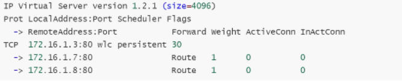

## 持久化链接测试

客户端请求后，可以登陆LVS节点查看，是否有一个连接处于长连接状态。(需要每个请求都TIME-WAIT结束，才会断开长连接)

```bash
ipvsadm -L -n -c  #测试查看
```

# LVS调度算法详解

LVs根据后端服务器的负载，或其他的计算的标准，判断挑选哪台R5来进行请求处理。调度算法主要分为"静态调度算法"、"动态调度算法"。

·静态调度算法:RR.wRR、SH、DH

·动态调度算法:LC. wLc. SED、NQ、LBLC、LBLCR

## 静态调度算法

仅根据算法本身进行调度，不考虑后端实际负载情况（起点公平）

### RR

RR:round robin 轮询调度算法，将每一次用户的请求，轮流分配给Rea1 server节点。

```bash
ipvsadm -E -t 172.16.1.3:80 -s rr
```

### WRR

WRR: weighted round robin加权轮询调度算法，根据服务器的硬件情况、以及处理能力，为每台服务器分配不同的权值，使其能够接受相应权值的请求。

```bash
[root@1b01 ~]# ipvsadm -E -t 172.16.1.3:80 -s wrr
[root@1bo1 ~]# ipvsadm -e -t 172.16.1.3:80 -r 172.16.1.7:80 -g -w 5
[root@1b01 ~]# ipvsadm -e -t 172.16.1.3:80 -r 172.16.1.8:80 -g -w 1
[root@1b01 ~]# ipvsadm -L -n
```

### SH

SH: source Hashing源地址hash调度算法，将请求的源IP地址进行Hash运算，得到一个具体的数值，同时对后端服务器进行编号，按照运算结果将请求分发到对应编号的服务器上。
1.可以实现不同来源P的请求进行负载分发;
2.同时还能实现相同来源IP的请求始终被派发至某一台特定的节点;

```bash
[root@1b01 ~]# ipvsadm -E -t 172.16.1.3:80 -s sh
[root@1b01 ~]# ipvsadm -L -n

```

### DH

DH: destination hash目标地址hash将客户端的请求，始终发往同一个Rs。应用场景:Lvs-cache-源站，始终调度到指定的cache，加速用户体验。

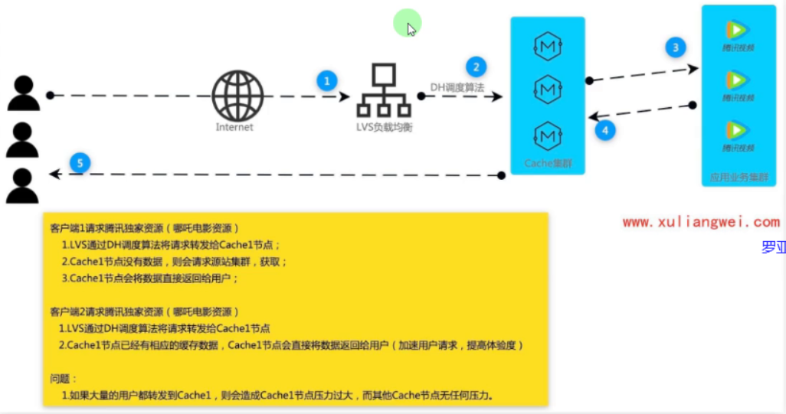

```bash
[root@1b01 ~]# ipvsadm -E -t 172.16.1.3:80 -s dh
[root@1b01 ~]# ipvsadm -L -n

```

## 动态调度算法

动态：根据算法及RS节点负载状态进行调度，较小的RS将会被调度（结果公平）

### LC

LC: Least-connection最少连接数调度算法，哪台Rs连接数少就将请求调度至哪台RS。
算法: overhead = ( Active \* 256 + Inactive仅连接）一个活动连接相当于256个非活动连接

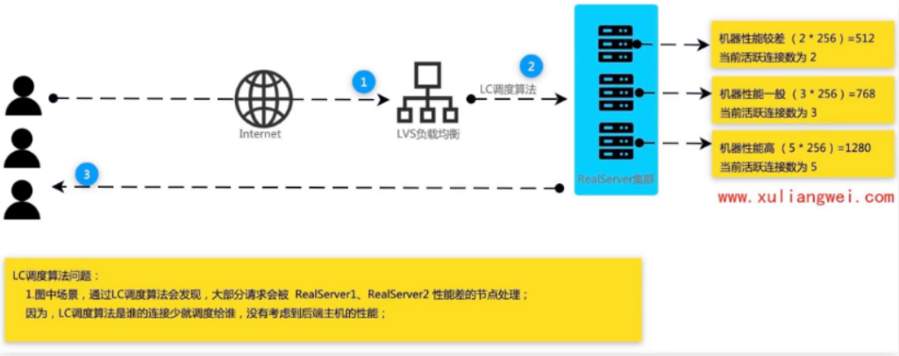

### WLC

wLC: weighted Least-connection加权最小连接数（默认调度算法)，在服务器性能差异较大的情况下，采用"加权最少链接"调度算法优化负载均衡性能，权值较高的Rs节点，将承受更多的连接;负载均衡可以自动问询Rs节点服务器的负载状态，通过算法计算当前连接数最少的节点，而后将新的请求调度至该节点。
算法: overhead = ( Active \* 256 + Inactive ) /weight

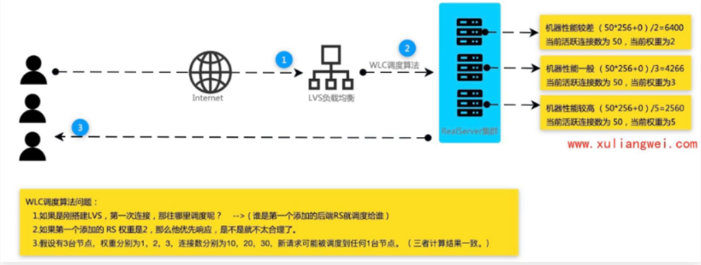

### SED

SED:shortest Expected Delay最短期望延迟，尽可能让权重高的优先接收请求，不再考虑非活动状态，把当前处于活动状态的数目+1，通过算法计算当前连接数最少的节点，而后将新的请求调度至该节点。算法:在WLC基础上改进，overhead = 《ACTIVE+1》\*256/weight

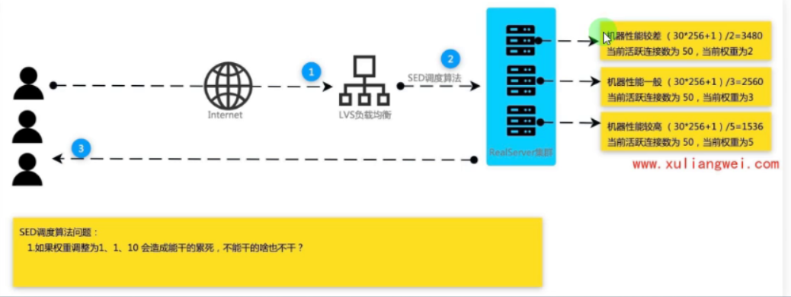

### ND

NQ: Never Queue永不排队/最少队列调度

原理: sED算法由于某台服务器的权重较小，比较空闲，甚至接收不到请求，而权重大的服务器会很忙，而NQ算法是说不管权重多大都会被分配到请求。简单来说，就是无需队列，如果有台Real server的连接数为0会直接分配过去，后续采用SED算法

算法: overhead = (ACTIVE+1) w256/weight

### LBLC

LBLC: Locality-Based Least-Connection动态目标地址hash调度算法，解决DH调度算法负载不均衡。应用场景:LVs-cache-源站，此前DH算法始终调度到后端cache1节点，会造成cache1负载过高，LBLc会根据负载均衡动态调度到后端其他cache节点。

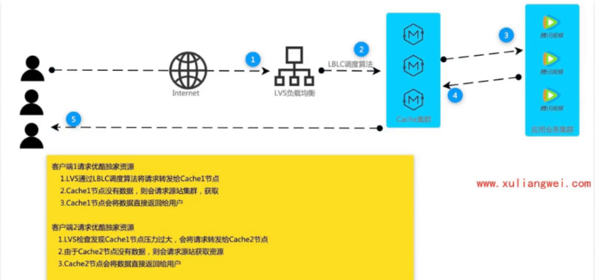

### LBLCR

LBLCRiLocality-Based Least-Connection with Replication带复制功能的LBLC算法，解决LBLC负载不均衡的问题，从负载重的复制到负载轻的RS。

应用场景:LV5-cache-源站，此前LbLc算法始终调度到后端cache1节点，会造成cache1负载过高，会根据负载均衡动态调度到后端其他cache节点，同时也会将缓存数据同步一份至cache1、 cache2节点。

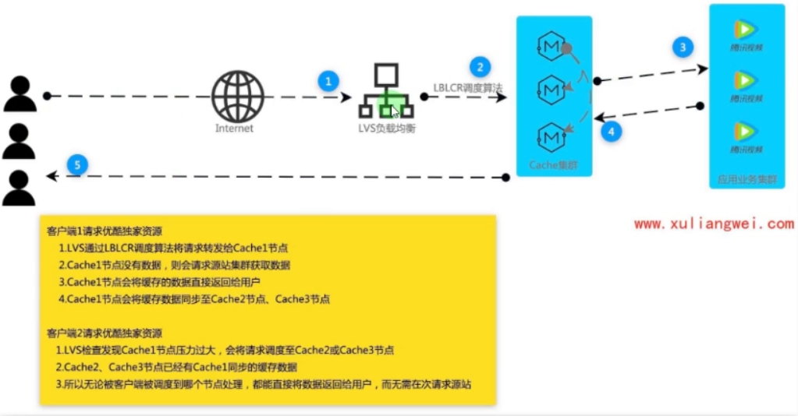
