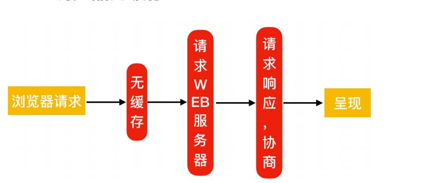
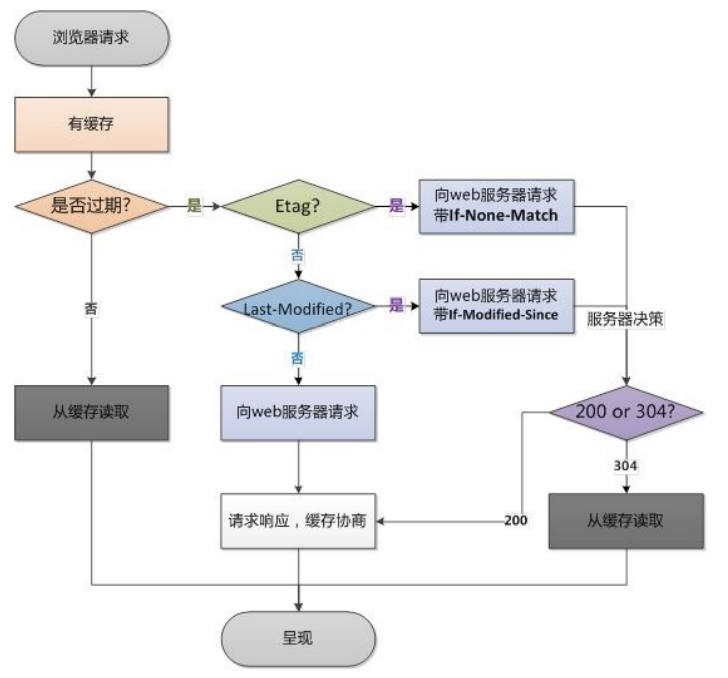

# Nginx常用模块

## 目录

-   [目录索引](#目录索引)
    -   [配置语法](#配置语法)
    -   [配置示例及配置企业内网仓库](#配置示例及配置企业内网仓库)
    -   [访问控制](#访问控制)
    -   [配置语法](#配置语法)
    -   [配置示例](#配置示例)
-   [Nginx基础认证](#Nginx基础认证)
    -   [配置语法](#配置语法)
    -   [配置示例](#配置示例)
-   [Nginx限流限速](#Nginx限流限速)
    -   [为什么要限速](#为什么要限速)
    -   [下载场景](#下载场景)
    -   [限制请求并发数](#限制请求并发数)
    -   [限制并发连接数](#限制并发连接数)
    -   [限制下载速度](#限制下载速度)
    -   [综合场景实践](#综合场景实践)
-   [Nginx状态监控](#Nginx状态监控)
    -   [配置语法](#配置语法)
    -   [配置示例](#配置示例)
    -   [页面状态](#页面状态)
-   [Nginx资源缓存](#Nginx资源缓存)
    -   [浏览器无缓存](#浏览器无缓存)
    -   [浏览器有缓存](#浏览器有缓存)
    -   [缓存过期校验](#缓存过期校验)
    -   [配置语法](#配置语法)
    -   [场景](#场景)
-   [Nginx资源缓存](#Nginx资源缓存)
    -   [配置语法](#配置语法)
    -   [图片压缩案例](#图片压缩案例)
    -   [文件压缩案例](#文件压缩案例)
-   [Nginx location](#Nginx-location)
    -   [语法示例](#语法示例)
    -   [应用场景](#应用场景)
    -   [location @重定向](#location-重定向)
-   [Nginx日志模块](#Nginx日志模块)
    -   [日志格式](#日志格式)
        -   [nginx日志格式中的常用变量](#nginx日志格式中的常用变量)
        -   [nginx日志过滤](#nginx日志过滤)

# 目录索引

当ngx\_http\_index\_module模块找不到索引文件时，常会将请求传递给ngx\_http\_autoindex\_moudle模块

ngx\_http\_autoindex\_moudle模块处理以斜杠字符（/）结尾的请求，并且生成目录列表

## 配置语法

```bash
#启用或禁用目录列表输出，on是开启，off是关闭
syntax（语法）:autoindex on|off
Default（默认情况下）:autoindex off（默认是关闭的）
context（使用场景）:http，server，location
#指定是否应在目录列表中输出确切的文件大小，on显示字节，off显示大概单位
syntax:autoindex_exact_size on|off
default:autoindex_exact_size on;
context: http,server,location
#指定目录列表中的时间是应以本地时区还是UTC输出。on是本地时间，off  UTC时间
Syntax: autoindex_localtime on | off;
Default: autoindex_localtime off;
Context: http, server, location

```

## 配置示例及配置企业内网仓库

```bash
[root@oldxu ~]# cat /etc/nginx/conf.d/mirror.oldxu.net.conf
server {
    listen 80;
server_name mirror.oldxu.net;
    charset utf-8; #设定字符集，防止中文字符乱码显示。
    root /mirror
  location / {
    index index.html
}
    location /repo {  #在/mirroe/repo下创建仓库
      autoindex on;  #开启目录生成列表
      autoindex_exact_size off; #显示文件确切文件大小
      autoindex_locatime on; #显示本地时间
}
rsync -avz rsync://rsync.mirror.ustc.edc.cn/repo/centos/  /mirror/repo/  #使用rsync同步
createrepo  /mirror/repo  #将该目录创建为仓库目录
```

## 访问控制

ngx\_http\_access\_module模块允许限制对某些客户端地址的访问

## 配置语法

```bash
#允许配置语法
Syntax: allow address | CIDR | unix: | all;
Default: —
Context: http, server, location,
limit_except
#拒绝配置语法
Syntax: deny address | CIDR | unix: | all;
Default: —
Context: http, server, location,
limit_except
```

## 配置示例

只允许指定的来源IP能访问/centos，其他网段全部拒绝

```bash
server {
  listen 80;
  server_name mirror.oldxu.net;
    charset utf-8; #设定字符集，防止中文字符乱码显示。
    autoindex on;
    autoindex_exact_size off;
    autoindex_locatime on;
  location / {
    index index.html;
}
    location /centos {
      allow 127.0.0.1;
      allow 10.0.0.1/32; #允许地址或地址段
      deny all; #拒绝所有人
}
}
```

拒绝指定IP访问该网站的/centos，其他IP全部允许访问

```bash
server {
    listen 80;
  server_name mirror.oldxu.net;
    charset utf-8; #设定字符集，防止中文字符乱码显示。
    autoindex on;
    autoindex_exact_size off;
    autoindex_locatime on;
  location / {
    index index.html;
}
  location /centos {
    deny 10.0.0.1/32; #拒绝指定的地址或地址段
    allow all; #允许所有的地址
}
} 
```

> 📌注意：deny和allow的顺序是有影响的

> 📌默认情况下，从第一条规则进行匹配，如果匹配成功，则并继续匹配下面的内容。如果匹配不成功，则继续往下寻找能匹配成功的内容。

# Nginx基础认证

ngx\_http\_auth\_basic\_moudle模块允许HTTP基本身份验证，验证用户名和密码来限制对资源的访问

## 配置语法

```bash
#使用HTTP基本身份验证协议启用用户名和密码验证
syntax:auth_basic string | off;
default: auth_basic off;
context: http,sever,location,
limit_except
#指定保存用户名和密码的文件
syntax: auth_basic_user_file file;
default:_
context:http,server,location,
limit_except 
#指定保存用户名和密码的文件，格式如下
#可以使用htpasswd程序或“openssl passwd”命令生成对应的密码；
name1:passwd1
name2:passwd2
#使用htpasswd创建新的密码文件，-c创建新文件 -b允许命令行输入密码
yum install httpd-tools
htpasswd -b -c  /etc/nginx/auth_conf 用户名  密码

```

## 配置示例

```bash
server {
    listen 80;
  server_name mirror.oldxu.net;
      charset utf-8; #设定字符集，防止中文字符乱码显示。
      autoindex on;
      autoindex_exact_size off;
      autoindex_locatime on;
  location / {
      index index.html;
}
  location /centos {
      auth_basic "Auth access Blog Input your Passwd!";
      auth_basic_user_file   /etc/nginx/auth_conf;
}
}

```

# Nginx限流限速

## 为什么要限速

限制某个用户在一定时间内能够产生的http请求。或者说是限制某个用户的下载速度。

## 下载场景

下载限速：限制用户下载资源的速度；

ngx\_http\_core\_moudle

请求限制：限制用户单位时间内所产生的http请求数；

ngx\_http\_limit\_rep\_moudle

链接限制：限制统一时间的连接数，及并发数限制

ngx\_http\_limit\_conn\_moudle

## 限制请求并发数

指令

```bash
syntax: limit_rep_zone key zone=name:size rate=rate;
Default: -
context: http
syntax:limit_rep zone number
[burst=number] [nobady];
default:-
context: http,server,location
```

2.基于来源IP对下载速率限制，限制每秒处理一次请求，但可以突发超过5个请求放入缓存区

```bash
#http标签段定义请求限制，rate限制速率，限制一秒钟最多一个IP请求
$remote_addr; $binary_remote_addr
http{
   limit_rep_zone $binary_remote_addr 
   zone=rep_one:10m rate=1r/s;
   
}

server {
    listen 80;
    server_name 域名;
    #请求超过1r/s,剩下的将被延迟处理，请求数超过burst定义的数量，则返回503
    limit_rep zone=rep_one burst=3 nobady;
    location / {
        root /code;
        index index.html;
    }
}
limit_rep_zone $binary_remote_addr
zone=rep_one:10m  rate=1r/s;
#第一个参数：$binary_remote_addr表示通过这个标识来做限制，限制同一客户端ip地址。
#第二个参数：zone=req_one:10m表示生成一个大小为10M，名为req_one的内存区域，用来存储访问的频次信息。
#第三个参数：rate=1r/s表示允许相同标识的客户端的访问频次，这里限制的是每秒1次。
limit_rep zone=rep_one burst=3 nodelsy;
#第一个参数：zone=req_one 设置使用哪个配置区域来做限制，与上面limit_req_zone 里的name对应。
#第二个参数：burst=3，设置一个大小为3的缓冲区，当有大量请求过来时，超过了访问频次限制的请求可以先放到这个缓冲区内。
#第三个参数：nodelay，超过访问频次并且缓冲区也满了的时候，则会返回503，如果没有设置，则所有请求会等待排队。

```

## 限制并发连接数

指令

```bash
Syntax: limit_conn_zone key
zone=name:size;
Default: —
Context: http
Syntax: limit_conn zone number;
Default: —
Context: http, server, location
#设置共享内存区域和给定键值的最大允许连接数超过此限制时，服务器返回503错误以回复请求
[root@oldxu ~]# cat
/etc/nginx/conf.d/mirror.oldxu.net.conf
limit_conn_zone $binary_remote_addr
zone=conn_od:10m;
server {
  listen 80;
  server_name mirror.oldxu.net;
    root /code;
    charset utf8;
    autoindex on;
    autoindex_exact_size off;
    autoindex_localtime on;
    limit_conn conn_od 2;
    location / {
    index index.html;
    }
    }


```

## 限制下载速度

```bash
[root@oldxu ~]# cat  /etc/nginx/conf.d/mirror.oldxu.net.conf
    server {
      listen 80;
      server_name mirror.oldxu.net;
        root /code;
        charset utf8;
        autoindex on;
        autoindex_exact_size off;
        autoindex_localtime on;
        limit_rate_after 100m; #达到100m开始限速
        limit_rate 100k;
        location / {
        index index.html;
}
}

```

## 综合场景实践

1、限制web服务器请求数处理为1秒一个，触发值为5、限制用户仅可同时下载一个文件。
2、当下载超过100M则限制下载速度为500k

3、如果同时下载超过2个视频，则返回提示 "请联系
oldxu进行会员充值" 跳转到其他页面；

```bash
[root@oldxu conf.d]# cat
mirror.oldxu.net.conf
limit_req_zone $binary_remote_addr
zone=req_od:10m rate=1r/s;
limit_conn_zone $binary_remote_addr
zone=conn_od:10m;
server {
    listen 80;
    server_name mirror.oldxu.net;
    root /code;
    charset utf8;
    autoindex on;
    autoindex_exact_size off;
    autoindex_localtime on;
    limit_req zone=req_od burst=5 nodelay;
    limit_conn conn_od 1;
    limit_rate_after 100m;
    limit_rate 500k;
    error_page 503 @errpage;
    location @errpage {
    default_type text/html;
    return 200 'Oldxu提示-->请联系QQ:552408925 进行会员充值（提示的内容）';
    }
    location / {
       index index.html;
       }    
    }

```

# Nginx状态监控

ngx\_http\_stub\_status\_module模块提供对基本状态信息的访问。
默认情况下不集成该模块，需要使用 --with-http\_stub\_status\_module集成。

## 配置语法

```bash
Syntax: stub_status;
Default: —
Context: server, location
```

## 配置示例

```bash
cat /etc/nginx/conf.d/module.conf
server {
    listen 80;
    server_name mirror.oldxu.net;
    access_log off;
    location /nginx_status {
    stub_status;
    }
}
```

## 页面状态

此配置创建一个简单的网页，其基本状态数据可能如下所示：

```bash
curl -HHost:mirror.oldxu.net  http://10.0.0.7/nginx_status
Active connections: 291
server accepts handled requests
16630948 16630948 31070465
Reading: 6 Writing: 179 Waiting: 106
# Active connections：当前活跃连接数，包括
Waiting等待连接数。
# accepts:已接收的总TCP连接数量。
# handled:已处理的TCP连接数量。
# requests:当前总http请求数量。
# Reading:当前读取的请求头数量。
# Writing:当前响应的请求头数量。
# Waiting:当前等待请求的空闲客户端连接数。

```

# Nginx资源缓存

浏览器缓存设置用于提高网站性能，尤其是新闻网站，一经发布，改动可能性非常小，，所以西洼港用户访问一次后缓存在用户的浏览器非常长时间。

浏览器是有自己的缓存机制，它是基于HTTP协议缓存机制来实现的，在HTTP协议中有很多头（Headers）信息，那么实现浏览器的缓存就需要依赖特殊的头信息来与服务器进行特殊的验证，如: Expires(http/1.0) ；Cache-control (http/1.1)

### 浏览器无缓存



### 浏览器有缓存


### 缓存过期校验

浏览器缓存过期校验检查机制，

1.浏览器请求服务器会先进行expires、cache-control的检查，检查缓存是否过期，如果没有过期则直接从缓存文件中读取

2.如果缓存过期，首先会检查是否存在etag，如果存在客户端则会向web服务器请求if-none-Match，进行对比，服务器巨册返回200还是304



### 配置语法

```bash
#作用: 添加Cache-Control Expires头
Syntax: expires [modified] time;
expires epoch | max | off;
Default: expires off;
Context: http, server, location, if in
location

```

### 场景

```bash
server {
    listen 80;
    server_name  域名；
    location ~ .*\>(jpg|gif|png)$ {
    expires 7d;
    }
}  #如果代码没有正式上线时，希望静态文件不被缓存
location ~ .*\.(css|js|swf|json|mp4|htm|html)$ {
    add_header Cache-Control no-store;
    add_header Pragma no-cache;
}
}
```

# Nginx资源缓存

nginx在数据发送至客户端之前进行压缩，然后传输，能有效地节约代换，并提高响应速度。

## 配置语法

```bash
# 1、启用或关闭gzip压缩
Syntax: gzip on | off;
Default: gzip off;
Context: http, server, location, if in
location
# 2、gzip支持的压缩类型
Syntax: gzip_types mime-type ...;
Default: gzip_types text/html;
Context: http, server, location
# 3、gzip压缩比率，压缩率越高，CPU消耗越大 9为极限
Syntax: gzip_comp_level level;
Default: gzip_comp_level 1;
Context: http, server, location
# 4、gzip压缩的最小文件，小于设置的值文件将不会被压缩（由"Content-Length"响应头字段确定）
Syntax: gzip_min_length length;
Default: gzip_min_length 20;
Context: http, server, location
# 5、gzip压缩支持的协议版本
Syntax: gzip_http_version 1.0 | 1.1;
Default: gzip_http_version 1.1;
Context: http, server, location
# 6、启用压缩，是否在响应报文首部插入"Vary:
Accept-Encoding"
Syntax: gzip_vary on | off;
Default: gzip_vary off;
Context: http, server, location

```

## 图片压缩案例

```bash
mkdir -p /code/images
vim 要压缩的文件所属文件
server {
    listen 80;
    server_name static.oldxu.net;
    root /code/images;
    location ~* .*\.(jpg|gif|png)$ {
        gzip on;
        gzip_http_version 1.1;
        gzip_comp_level 2;
        gzip_min_length 10k;
        gzip_types image/jpeg image/gif
        image/png;
        gzip_vary on;
}
}
```

## 文件压缩案例

```bash
mkdir -p /code/doc
vim 要压缩的文件所属文件
server {
      listen 80;
      server_name static.oldxu.net;
      root /code/doc;
      location ~ .*\.(txt|pdf)$ {
          gzip on;
          gzip_http_version 1.1;
          gzip_comp_level 2;
          gzip_min_length 1k;
          gzip_types text/plain
          application/pdf;
          gzip_vary on;
}
}

```

# Nginx location

location就是用来访问网站的uri路径

## 语法示例

```bash
location  [= ~ ~* ^~ ]uri {...}
location @name {...}

```

| 匹配符  | 匹配规则            | 优先级 |
| ---- | --------------- | --- |
| =    | 精准匹配            | 1   |
| ^\~  | 以某个字符串开头        | 2   |
| \~   | 区分大小写的正则匹配      | 3   |
| \~\* | 不区分大小写的正则匹配     | 4   |
| /    | 通用匹配，任何请求去都会匹配到 | 5   |

[location uri 添加 / 和不添加 / 的区别? - oldxulinux - 博客园 (cnblogs.com)](https://www.cnblogs.com/oldxu/p/15128917.html "location uri 添加 / 和不添加 / 的区别? - oldxulinux - 博客园 (cnblogs.com)")

## 应用场景

```bash
vim /etc/nginx/conf.d/写的配置文件
server {
listen 80;
server_name location2.oldxu.net;
# 通用匹配，任何请求都会匹配到
location / {
root html;
index index.html;
}
# 精准匹配,必须请求的uri是/nginx_status
location = /nginx_status {
stub_status;
}
# 严格区分大小写，匹配以.php结尾的都走这个
location info.php
location ~ \.php$ {
default_type text/html;
return 200 'php访问成功';
}
# 严格区分大小写，匹配以.jsp结尾的都走这个
location
location ~ \.jsp$ {
default_type text/html;
return 200 'jsp访问成功';
}
# 不区分大小写匹配，只要用户访
问.jpg,gif,png,js,css 都走这条location
location ~* \.(jpg|gif|png|js|css)$ {
# return 403;
expires 3d;
}
# 不区分大小写匹配
location ~* \.
(sql|bak|tgz|tar.gz|.git)$ {
deny all;
}
}

```

## location @重定向

location @name这样的location不用于常规请求处理，而是请求重定

```bash
vim 配置文件的位置及配置文件
server {
    listen 80;
    server_name location3.oldxu.net;
    root /code;
    location / {
    index index.html;
}
#如果出现异常,则重新定向到@error_404这个
location上
  error_page 404 @error_404;
  location @error_404 {
    default_type text/html;
    return 200 '你可能是不小心走丢了。';
}
}

```

# Nginx日志模块

nginx的日志记录非常的灵活，可以通过log\_format来定义格式

## 日志格式

```bash
#配置语法：包括:error.log  access.log
Syntax: log_format name
[escape=default|json] string ...;
Default: log_format combined "...";
Context: http
#默认Nginx定义语法格式如下
log_format main '$remote_addr -$remote_user [$time_local] "$request" '
'$status$body_bytes_sent "$http_referer" '
'"$http_user_agent"
"$http_x_forwarded_for"';
log_format test '$remote_addr -$remote_user [$time_local] "$request" '
'$status';
#access_log/var/log/nginx/access.log main;
access_log/var/log/nginx/access_test.log test;

```

### nginx日志格式中的常用变量

```bash
$remote_addr # 记录客户端IP地址
$remote_user # 记录客户端用户名
$time_local # 记录通用的本地时间
$time_iso8601 # 记录ISO8601标准格式下的本地时间
$request # 记录请求的方法以及请求的http协议
$status # 记录请求状态码(用于定位错误信息)
$body_bytes_sent # 发送给客户端的资源字节数，不包括响应头的大小
$bytes_sent # 发送给客户端的总字节数
$msec # 日志写入时间。单位为秒，精度是毫秒。
$http_referer # 记录从哪个页面链接访问过来的
$http_user_agent # 记录客户端浏览器相关信息
$http_x_forwarded_for #记录客户端IP地址
$request_length # 请求的长度（包括请求行，请求头和请求正文）。
$request_time # 请求花费的时间，单位为秒，精度毫秒
# 注:如果Nginx位于负载均衡器，nginx反向代理之后，web服务器无法直接获取到客 户端真实的IP地址。
# $remote_addr获取的是反向代理的IP地址。 反向代理服务器在转发请求的http头信息中，
# 增加X-Forwarded-For信息，用来记录客户端IP地址和客户端请求的服务器地址。

```

若想关闭错误日志，只需把错误日志放入黑洞中   ：error\_log  /dev/null

### nginx日志过滤

```bash
location /favicon.ico{
    access_log off;
    return 200;
}  #请求favion.ico时，不记录日志
location ~* .*\.(gif|jpg|png|css|js)$
{
    access_log /dev/null
}   #当有人访问gif、png等资源时，将日hi丢入黑洞
```
