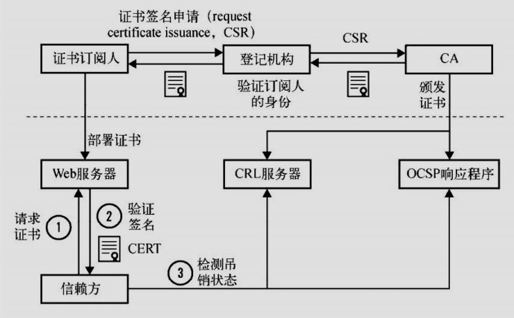
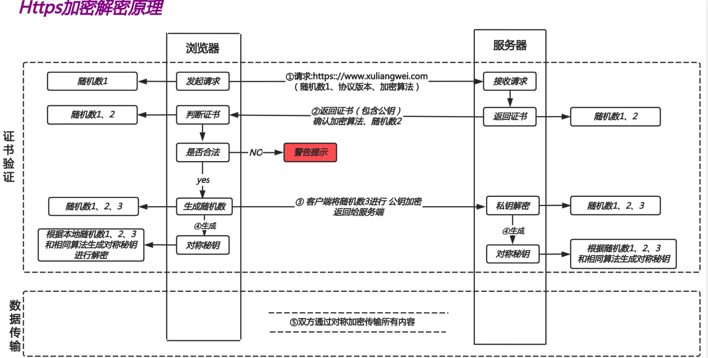

# https实践

## 目录

-   [https基本概述](#https基本概述)
    -   [TLS如何实现加密](#TLS如何实现加密)
-   [身份验证机构-CA](#身份验证机构-CA)
-   [HTTPS通讯原理](#HTTPS通讯原理)
    -   [Https颜色标识](#Https颜色标识)
-   [Https单台配置实践](#Https单台配置实践)
    -   [创建ssl证书](#创建ssl证书)
    -   [配置SSL场景](#配置SSL场景)
-   [强制跳转Htpps](#强制跳转Htpps)
-   [集群配置实践](#集群配置实践)
    -   [环境准备](#环境准备)
    -   [基本配置](#基本配置)
-   [HTTPS场景实践](#HTTPS场景实践)
    -   [场景实践1](#场景实践1)
    -   [场景实践2](#场景实践2)
    -   [场景实践3](#场景实践3)

# https基本概述

为何需要http采用的是明文传输数据，那么在传输（账号密码、交易信息、等敏感数据）时不安全。容易遭到篡改，如果使用https协议，数据在传输过程中是加密的，能够有效避免网站传输时信息泄露。

## TLS如何实现加密

TLS/SSL是如何实现HTTP明文信息被加密的，

TLS/SSL工作是七层模型中的应用层与传输层之间。

1.提供数据安全：保证数据不会被泄露

2.提供数据的完整性：保证数据在传输过程中不会被篡改

# 身份验证机构-CA

CA架构是可信任组织架构，主要颁发证书及验证证书



# HTTPS通讯原理



HTTPs加密过程，HTTPs采用混合加密算法，即对称加密、和非对称加密
通信前准备工作:申请域名对应的证书，并将其部署在Nginx服务器中。

1.第一步客户端向服务端发送client He11o消息，这个消息里包含了一个客户端生成的随机数Random1、客户端支持的加密套件和客户端支持TLS协议版本等信息。

2.服务端会向客户端发送server He11o消息。返回自己的公钥证书、挑选一个合适的加密套件、另外还会生成一份随机数Random2推送给客户端。至此客户端和服务端都拥有了两个随机数(Random1+ Random2)

3.客户端收到服务端传来的公钥证书后，先从CA验证
该证书的合法性（CA公钥去解密公钥证书)，验证通过后取出证书中的服务端公钥，再生成一个随机数Random3，再用服务端公钥非对称加密Random3

4.服务端用自己的私钥解出客户端生成的Random3。至此，客户端和服务端都拥有Random1 + Random2+Random3，两边根据同样的算法生成一份秘钥，握手结束后的应用层数据都是使用这个秘钥进行对称加密。

## Https颜色标识

Https不支持续费,证书到期需重新申请新并进行替换。

Https不支持三级域名解析，[如test.m.o1dxu.net](http://xn--test-f96g.m.o1dxu.net "如test.m.o1dxu.net")\*.m.oldxu.net

Https显示绿色，说明整个网站的ur7都是https的，并且都是安全的。

Https显示黄色，说明网站代码中有部分URL地址是http不安全协议的。(https (http url) )

Https显示红色，要么证书是假的，要么证书已经过期。

# Https单台配置实践

## 创建ssl证书

```bash
mkdir -p /etc/nginx/ssl_key  #创建证书存储目录
openssl genrsa -idea -out server.key 2048  #使用openssl命令充当ca机构创建证书
openssl rep -days 36500 -x509 \ -sha256 -nodes -newkwy rsa:2048 -keyout server.key -out server.crt
country Name (2 letter code) [xx]:CN#国家
state or Province Name (fu11 name) []:wH#省
Locality Name (eg，city) [Default city] :wH#城市
organization Name (eg，company) [Defaultcompany Ltd] :edu #公司
organizational unit Name (eg，section)[]:oldxu#单位
common Name (eg，your name or your servershostname) []: s.oldxu.net#服务器主机名称
Email Address []:o1dxu@qq.com
#req-->用于创建新的证书# new -->表示创建的是新证书
#x509 -->表示定义证书的格式为标准格式
#key -->表示调用的私钥文件信息
#out -->表示输出证书文件信息
#days -->表示证书的有效期

```

## 配置SSL场景

```bash
vim /etc/nginx/conf.d/s.oldxu.net.conf
server {
listen 443 ssl;
server_name s.oldxu. net;
ssl on;
ssl_certificatess1_key /server.crt;
ss1_certificate_key ss1_key/server.key;
location / {
root /code;
index index.html;
}
}
mkdir -p /code
echo "https" > /code/index.html
systemctl restart nginx
```

# 强制跳转Htpps

如果用户忘记在浏览器地址栏输入https\://协议那么将不会跳转至https站点；

```bash
vim /etc/nginx/conf.d/ssl.conf
server {
listen 443;
 server_name s.oldxu.net;
 ssl on;
 ssl_certificate  ssl_key/server.crt;
 ssl_certificate_key  ssl_key/server.key;
 location / {
     root /code;
     index index.html;
 }
}
server {
  li sten 80;
  server_name s.oldxu.net;
  return 302  https://$server_name$request_uri;
}
```

```bash
# 云主机配置博客网站https强制转换证书

server {
  listen 443 ssl;
   server_name s.oldxu.net;
   ssl_certificate  ssl/www.lyjjhh.top.pem;
   ssl_certificate_key  ssl/www.lyjjhh.top.key;
  root /code/typecho/build;
        index index.php;
location ~ .*\.php(\/.*)*$ {
        fastcgi_pass   127.0.0.1:9000;
        fastcgi_index  index.php;
        fastcgi_param  SCRIPT_FILENAME $document_root$fastcgi_script_name;
        include fastcgi_params;
    }

 }

server{
  listen 80;
  server_name www.lyjjhh.top;
  return 302  https://$server_name$request_uri;
}


```

# 集群配置实践

## 环境准备

| 主机名   | 外网       | 内网         | 角色          |
| ----- | -------- | ---------- | ----------- |
| lb01  | 10.0.0.5 | 172.16.1.5 | nginx-proxy |
| web01 | 10.0.0.7 | 172.16.1.7 | nginx-proxy |
| web02 | 10.0.0.8 | 172.16.1.8 | nginx       |

## 基本配置

```bash
#配置web01和web02的后端节点，监听80；
server {
  listen 80；
  server_name s.oldxu.net;
  root /code/wordpress;
  location / {
  index index.html;
  }
}
#配置负载均衡lb01
mkdir /etc/nginx/ssl_key  -p  #创建存储ssl证书的文件夹
cd /etc/nginx/ssl_key
openssl genrsa -idea -out server.key 2048
openssl req -days 36500 -x509 -sha256 \
-nodes -newkey rsa:2048 -keyout server.key-out server.crt  #创建ssl证书
vim /etc/nginx/conf.d/proxy.conf
upstream site {
    server 172.16.1.7:80 max_fails=2 fail_timeout=10s;
    server 172.16.1.8:80 max_fails=2 fail_timeout=10s;

}
server {
      listen 443;
      server_name s.oldxu.net;
      ssl on;
      ss1_certificate ss1_key /server.crt;
      ss1_certificate_key ss1_key /server.key;
    location / {
      proxy_pass http://site;include proxy_params;
}
}
#强制跳转https
server ｛
listen 80;
server_names.oldxu.net;
return 302  https://$server_name$request_uri;
}
检查语法，重启

```

# HTTPS场景实践

## 场景实践1

需求：当用户访问网站主站，使用http协议提供访问，当用户单击登录时，使用的时https提供安全访问。

```bash
#1.主页展示http://yh.o1dxu.net（提供网页浏览)
#2.模拟登陆http://yh.oldxu.net/login（相当于点击了登陆按钮)
#3.登陆页面https://star.oldxu.net(提供安全登陆)
首先配置机器上的star转接站点
vim  /etc/nginx/conf.d/star.oldxu.net.conf
  server {
      listen 443 ssl;
      server_name start.o1dxu.net;
      ssl_certificate ss1_key /server.crt;
      ssl_certificate_key ss1_key /server.key;
      root /code/login;
      location / {
      index index.html;
}
}
mkdir /code/login -p  #创建登录界面代码存放的文件夹
创建一个index.html网页
#配置http://yh.oldxu.net界面
vim  /etc/nginx/conf.d/yh.oldxu.net.conf
server {
    listen 80;
    server_name yh.oldxu.net;
    root /code;
    location / {
    index index.html;
}
      location / login {
      return 302 https://start.oldxu.net;
}
}

```

## 场景实践2

```bash
#需求:希望用户访问网站的所有ur1走Https协议，但访问s.oldxu.net/abc时走Http协议
upstream webs {
  server 172.16.1.7:80;
  server 172.16.1.8:80;
}
server {
  listen 443 ssl;
  ssl_certificate ssl_key/server.crt;
  ssl_certificate_key ss1_key /server.key;
  server_name s.o1dxu. =net;
  location / {
    proxy_pass http://webs;
    include proxy_params ;
}
}
server {
    listen 80;
    server_name s.oldxu.net;
    if ($request_uri !~* "/ abc") {
    return 302
    https:// $http_host$request_uri;
    location / {
    proxy_pass http://webs;
    include proxy_params;
}
}

```

## 场景实践3

开启OCSP加速验证证书是否有效

```bash
#准备oCSP证书:
# wget -o root.pem https: / /ss1-tools.net/certificates/dac9024f54d8f6df94935fb1732638ca6ad77c13.pem
# wget -o intermediate.pem https://letsencrypt.org/ certs/lets-encrypt-x3-cross-signed.pem
# cat intermediate.pem >/etc/nginx/ss1_key/ocsp.pem
# cat root.pem >>/etc/nginx/ss1_key/ocsp. pem
#配置Nginxserver {
listen 443 ssl;
      server_name s.oldxu.net;
      ssl_certificate
      ssl/6152750_s.o1dxu.net.pem;
      ssl_certificate_key
      ssl/6152750_s.oldxu.net.key;
#开启OCSp
      ssl_stapling on;
      ssl_stapling_verify on;ss1_trusted_certificate
      ssl/ocsp.pem;
      root /code;location / {
      index index.html;
}
}
 echo QUIT | openss1s_client -connect s.oldxu.net:443 -status2>/dev/null | grep -A 17"OCSP response"  #验证证书

```
