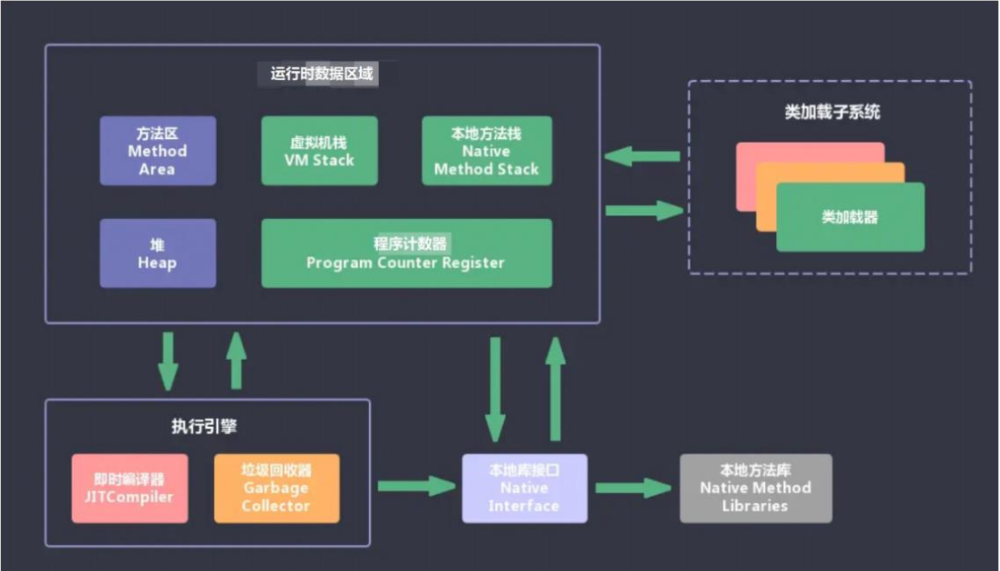
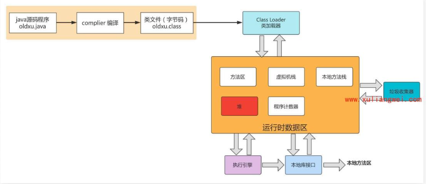
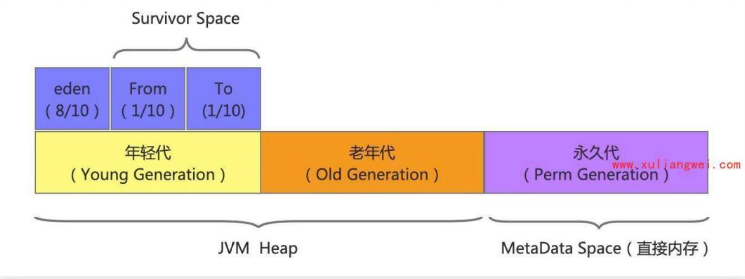
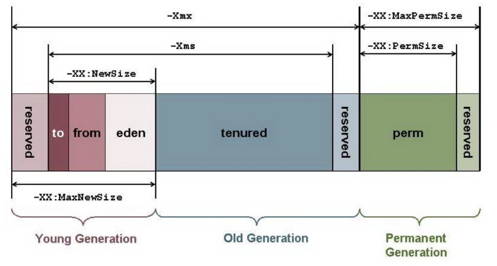
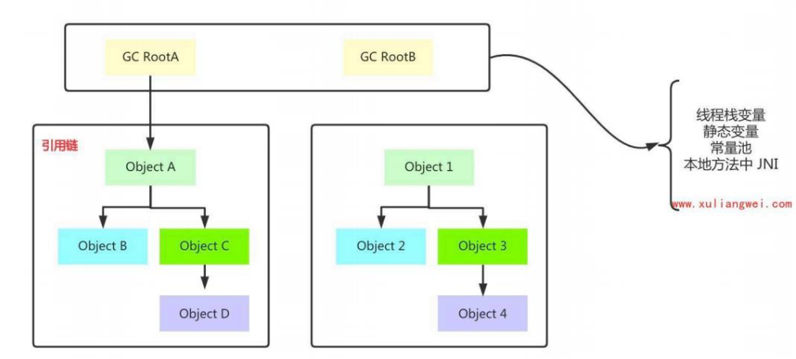
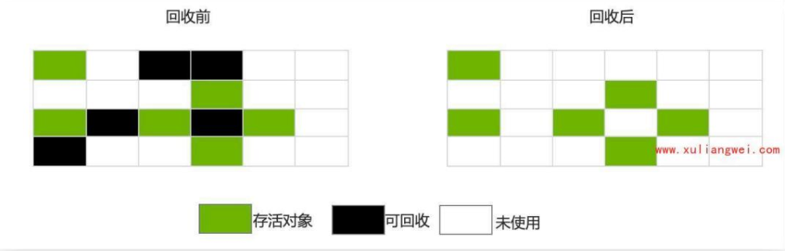

# JVM基本概述

## 目录

-   [JVM组成及作用](#JVM组成及作用)
-   [jvm执行过程](#jvm执行过程)
-   [JVM堆内存模型](#JVM堆内存模型)
-   [JVM堆内存分配参数](#JVM堆内存分配参数)
    -   [设置JAVA项目的堆空间](#设置JAVA项目的堆空间)
    -   [设置tomcat项目堆空间](#设置tomcat项目堆空间)
-   [GC基本概念](#GC基本概念)
    -   [什么是垃圾](#什么是垃圾)
    -   [如何让定位垃圾](#如何让定位垃圾)
    -   [引用计数算法](#引用计数算法)
    -   [可达性分析算法](#可达性分析算法)
-   [GC垃圾回收算法](#GC垃圾回收算法)
    -   [标记-清除算法](#标记-清除算法)
    -   [标记-复制算法](#标记-复制算法)

# JVM组成及作用

jvm包含两个子系统及两个组件

两个子系统：class loader（类挂载）、execution engine（执行引擎）

类挂载：根据给定文件类名挂载到运行区中的方法区

执行引擎：执行classes中的指令

两个组件：running data area（运行事数据区）native interface（本地接口）

运行时数据区域：就是我们常听说的jvm调优区域

本地接口：是与其他编程语言交互的接口



# jvm执行过程

1 •使用java编程语言开发java源代码，然后通过编译器 把Java编译为java类文件也叫字节码；

2.通过类加载器classLoader将字节码加载到内存中，将 其放在运行时数据区中的方法区内；

3.然后调用执行引擎在JVM虚拟机中运行然后讲字节码翻译成底层系统指令，再交由CPU执行

4.同时我们在编写程序时，不可能从头到尾去实现所有代 码功能，可以通过java API调用本地库接口 (Nativeinterface)当中已经有的java代码来实现其他的功能(比如图形库、语言库等)

总结：类的加载指的是将类的-class文件中的二进制数 据读入到内存中，将其放在运行时数据区的方法区内，然 后在堆区创建一个对象，用来封装类在方法区内的数据结构



# JVM堆内存模型

当jvm启动时，jvm会自动从主机操作系统中取到一部分 内存空间；

然后jvm会自动将内存空间按照特定的格式，进行区域划分

划分区段的目的，主要是让垃圾回收算法能够更好的利用 这些区域完成垃圾回收；

&#x20;jvm Heap内存空间由三部分组成：

年轻代、老年代、持久代(1.8移除)

年轻代代又可以划分三个子组成部分：

新生区(Eden):当一个对象刚刚创建时则创建 在eden中；

存活区(Survivor):步入成熟区的初创对象；

suivor to、 suvior from



# JVM堆内存分配参数

分配JVM内存空间，我们应该按照业务运行过程当前当 中，运行模式、或内存使用方式，来指定使用这些内存空 间的大小，指定这些参数，可以通过java -opts传递：

-xms：新生代和老年代初始空间；

-Xmx:新生代和老年代总共可用的空间

-xx：NewSize :新生代初始空间；
-xx：MaxNewSize :新生代的最大空间;



## 设置JAVA项目的堆空间

编写java代码

```bash
[root@web01 JAVA]# cat jvm_heap_params.java import java.util.UUID；
/* **********
java -xms100m -xmx100m -XX:+useconcMarkSweepGC -cp . jvm_heap_params

*****************  */
public class jvm_heap_params 
public static void main(String]] args) { try {
Thread.sieep(integer.MAX_VALUE);
} catch (ItnterruptedException e) {
e.pri ntStackT race();
}
}
}
#编译并执行该代码
[root@web01 JAVA]# javac jvm_heap_params.java 
[root@web01 JAVA]# java -Xms1OOm -Xmx1OOm -cp . jvm_heap_params &
[1] 12853
#通过jinfo -flags查看当前项目的内存分配
[root@web01 java]# jps
36146 Bootstrap
56083 Jps
12853 jvm_heap_params
[root@web01 java]# jinfo -flags 12853


```

## 设置tomcat项目堆空间

```bash
#修改catalina.sh脚本，设定java启动时的堆空间大小，以及垃圾回收站
[root@web01 ~]# vim /soft/tomcat/bin/catalina.sh
#  OS specific support. $var _must_ be set to either true or false.
#添加如下内容
JAVA_OPTS="$3AVA_OPTS -xms200m -Xmx200m - XX: +UsecocMarkSweepGC"
#生产服务器配置参数
JAVA_OPTS="$3AVA_OPTS -Xms2G -Xmx2G -Xss256k - xx:+UseConcMarkSweepGC"
#可选参数
#  -xx:+HeapDumpOnOutOfMemoryError
#  -xx:HeapDumpPath=/tmp/heap_dump
#  -xx：+PrintGCDetai1s
#  -xloggc:/Iogs/heap_trace.txt


```

# GC基本概念

## 什么是垃圾

GC指的就是垃圾，垃圾指的是不在需要使用的java对 象；

程序在运行的过程中是需要申请内存资源的，而在运行过 程中，可能会产生无效的对象资源，如果不及时处理则会 占用内存，最终造成内存溢出；

java有自动垃圾回收机制，也就是GC,使得开发能更专 注业务代码，而无需关心内存释放问题；

那我们需要知道哪些对象是垃圾，

以及这些垃圾对象该如何回收；

## 如何让定位垃圾

如何确定哪些是垃圾，其实就是判断“对象的存活状态蔦 常见的判断分析有两种；

引用计数算法；

可达性分析算法；

## 引用计数算法

原理：给每个java对象添加一个引用计数器；每当有一个地方引用它，计数器+1，引用失败则-1

当计数器不为0时，则判断对象为存活，否则判断为死 亡；
算法优势：

实现简单；
判断高效；
算法缺陷：

每次对象被引用，都需要更新计数器，存在时间开销；
即使内存够用，在运行时进行计数，会浪费CPU资源；
无法解决对象相互循环引用的问题（最重要），比如：
&#x20;[objA.name](http://objA.name "objA.name") = objB；
&#x20;[objB.name](http://objB.name "objB.name") = objA；
&#x20;objA、ObjB他们的计数器至少为1,所以不可能被 回收；

算法小结：

由于算法存在判断逻辑漏洞，所以JVM虚拟机没有采用 该算法判断JAVA对象是否存活；

## 可达性分析算法

java虚拟机采用的算法：可达性分析算法

将一系列gc Roots对象作为起点，从这些起点开始向 下搜索

当一个对象gc Roots没有任何引用链相连时，则判断 对象不可达，可以被GC回收；



# GC垃圾回收算法

GC通过"可达性分析算法"标记了垃圾对象以及存活对象, 那么该如何将标记的垃圾对象回收呢；

标记-清除-算法

标记-压缩-算法

标记-复制-算法

## 标记-清除算法

标记清除算法存在两个阶段：

标记阶段：标记出存活的对象、以及可回收的对象；

清除阶段：回收掉所有被标记的对象；

标记清除算法工作过程图示：



清除算法缺点：

1.效率不高，因为需要遍历所有的对象，然后标记存活 对象、同时还要标记可回收对象；

2.清除对象后位置不连续，难以找到连续的可用空间， 所以容易产生碎片；

## 标记-复制算法

算法基本概念：

1.首先将内存划分为两块相等大小的区域，每次数据存 储仅使用其中一块区域；

2.当这一块区域内存用完后，就将还存活的对象复制到 另一块区域上面；

3.最后将使用过的内存空间进行一次清理；
