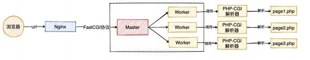
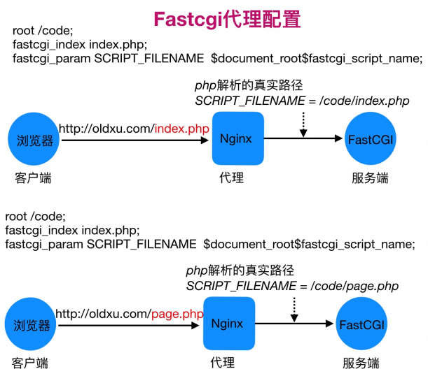
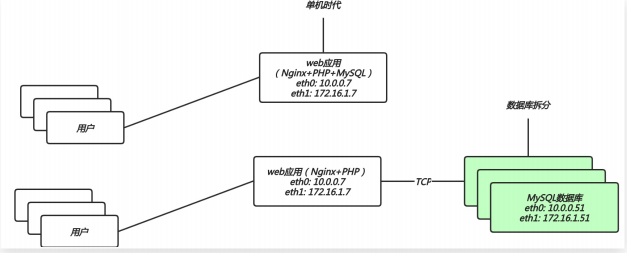
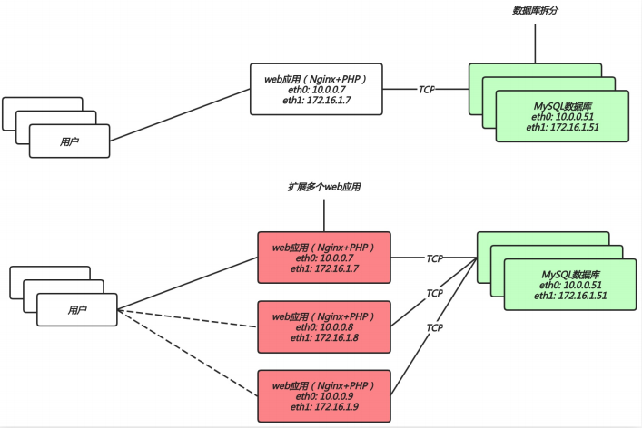
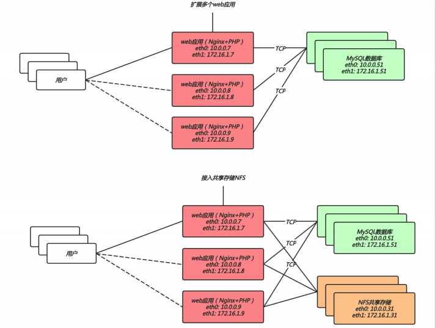

# nginx搭建架构

## 目录

-   [LNMP架构基本概述](#LNMP架构基本概述)
    -   [实现过程](#实现过程)
    -   [实现细节](#实现细节)
-   [LNMP架构环境安装](#LNMP架构环境安装)
    -   [Nginx安装](#Nginx安装)
    -   [PHP安装](#PHP安装)
    -   [mariadb安装](#mariadb安装)
    -   [fastcgi代理语法](#fastcgi代理语法)
    -   [nginx与PHP集成](#nginx与PHP集成)
    -   [PHP与Mysql集成](#PHP与Mysql集成)
-   [部署开源产品](#部署开源产品)
    -   [部署博客wordpress](#部署博客wordpress)
        -   [配置nginx](#配置nginx)
        -   [配置MySQL](#配置MySQL)
        -   [部署产品](#部署产品)
    -   [部署知乎产品](#部署知乎产品)
        -   [配置nginx](#配置nginx)
        -   [配置MySQL](#配置MySQL)
        -   [部署产品](#部署产品)
-   [拆分数据库至独立服务器](#拆分数据库至独立服务器)
    -   [拆分数据库的意义](#拆分数据库的意义)
    -   [数据库拆分架构演变](#数据库拆分架构演变)
    -   [数据库拆分环境准备](#数据库拆分环境准备)
    -   [数据库拆分实现步骤](#数据库拆分实现步骤)
        -   [web服务器上的操作](#web服务器上的操作)
        -   [db节点操作](#db节点操作)
-   [扩展web服务器](#扩展web服务器)
    -   [扩展web节点架构的演变](#扩展web节点架构的演变)
    -   [环境准备](#环境准备)
    -   [LNP(linux、nginx、php)环境安装](#LNPlinuxnginxphp环境安装)
-   [拆分静态资源至独立服务器](#拆分静态资源至独立服务器)
    -   [为何要拆分静态资源](#为何要拆分静态资源)
    -   [拆分静态资源架构演变](#拆分静态资源架构演变)
    -   [环境准备](#环境准备)
    -   [实现步骤](#实现步骤)

# LNMP架构基本概述

lnmp是一套技术的组合，即是linux、nginx、mysql、php的组合

## 实现过程

第一步：用户发起http请求，请求首先被nginx接收，

第二步：nginx通过预设定义好的location规则进行匹配

第三步：nginx将匹配到的动态内容通过fastcgi协议传到后端的php应用服务器处理 &#x20;


## 实现细节

1.用户首先通过http协议发起请求，请求会先抵达Nginx&#x20;

2.Nginx根据用户的请求进行Location规则匹配

3.Location如果匹配到请求是静态，则由Nginx读取本地直接返回

4.Location如果匹配到请求是动态，则由Nginx将请求转发给fastcgi协议

5.fastgi收到后会将请求交给php-fpm管理进程;6.php-fpm管理进程接收到后会调用具体的worker工作进程

6.warrap进程会调用php解析器解析代码，php解析后直接返回

7.如果有查询数据库操作，则由php连接数据库(用户密码IP)发起查询的操作

8.最终数据由mysq1->php->php-fpm->fastcgi->nginx->http->user



# LNMP架构环境安装

部署环境前的初始化操作

```bash
groupadd -g 666 luo（用户名）
useradd -g 666 -u 666 luo(用户名) #linux、nginx、mysql、php的属主和属组要一致
```

## Nginx安装

```bash
vim /etc/yum.repos.d/nginx.repo
[nginx]
name=nginx stable repo
baseurl=http://nginx.org/packages/centos/$releasever/$basearch/
gpgcheck=1
enabled=1
gpgkey=https://nginx.org/keys/nginx_signing.key
module_hotfixes=true
yum install nainx #安装nginx服务，要从官方源进行安装
sed -i '/^user/c user luo;' /etc/nginx/nginx.conf #将nginx的属主和属组变为添加的主和组
```

## PHP安装

```bash
yum remove php-mysql-5.4 php php-fpm php-common -y  #删除原有的低版本的PHP组件
yum install php71w php71w-cli
或者下载php的资源压缩包到本地
unzip php.zip  #进行解压缩
yum localinstall php/*.rpm  #从本地进行安装PHP软件
systemctl enable php-fpm
systemctl start php-fpm
sed -i '/^user/c user = luo' /etc/php-fpm.d/www.conf 
sed -i '/^group/c group = luo' /etc/php-fpm.d/www.conf  #修改php的属主和属组
php-fpm -t  #检查文件是否有问题等同于nginx  -t的用法 
systemctl restart php-fpm  #重启服务

```

## mariadb安装

```bash
yum install mariadb mariadb-server -y #安装mariadb数据库及服务端
systemctl enable mariadb 
systemctl start  mariadb  #加入开机自启动并开启
mysqladmin  password 'xiaoluozi（输入要设置的密码）'
mysql -uroot -pxiaoluozi（u跟用用户名，p跟密码）
如果数据库不能进去，用以下两种方式进行破解
第一种：物理破解
systemctl stop mysqld  #停止数据库
mysqld_safe --skip-grant-tables & mysql -uroot -p  #进入数据库
usesql;
update user set password=PASSWORD("newpass")where user="root";   #更改数据库新密码newpass
flush privileges;  #更新权限
exit  #退出
二、忘记本地密码
1、编辑/etc/my.cnf
在[mysqld] 配置部分添加一行
skip-grant-tables
2、保存后重启mysql
[root@localhost etc]# service mysqld restart
3、登录数据库重新设置root密码
[root@localhost ~]# mysql -uroot -p mysql
       Enter password:
直接回车进入
mysql> show databases;
      执行下列语句
      mysql> update user set password=password("mysql") where user='root';
      mysql> flush privileges;
4、删除/etc/my.cnf文件中添加的“skip-grant-tables”行，重启mysql；
用新设的密码就能正常登录了

```

## fastcgi代理语法

```bash
#设置fastcgi服务器的地址，该地址可以指定为域名或IP地址，以及端口
syntax:fastcgi_pass address;
context:loction,if in location
示例: fast_pass localhost:9000;
#通过fastcgi_param设置变量，并将设置的变量传递到后端的fastcgi服务
systanx:fastcgi_param parameter value [if_not_empty]
#语法示例
fastcgi_index index.php
fastcgi_param SCRIPT_FILENAME
$document_root$fastcgi_script_name;

```

图形化展示fastcgi\_index与fastcgi\_param作用



## nginx与PHP集成

```bash
#编写Nginx配置文件
vim /etc/nginx/conf.d/php.conf
server{
  server_name php.oldxu.net(域名);
  listen 80;
  root /code;(文件在code下)
  index index.html index.php;
  location ~ \.php$ {
  root /code;
  fastcgi_pass  127.0.0.1:9000;
  fastcgi_param SCRIPT_FILENAME $document_root$fastcgi_script_name;
  include   fastcgi_params;
  }
} netstat  -lntp #查看在运行服务的端口
#测试，在/code目录下创建info.php文件
vim /code/info.php
<?php
      phpinfo()

?> 
#nginx和msriadb所属主和组要一致
chown -R luo.luo /code/wordpress  #授权mysql的文件和nginx属组和属主一致
#创建数据库
MariaDB [(none)]>create database wordpress;  #创建基础数据库
MariaDB [(none)]>show databases;  #查看创建的数据库
+--------------------+
| Database           |
+--------------------+
| information_schema |
| mysql              |
| performance_schema |
| test               |
| wordpress          |
+--------------------+
5 rows in set (0.00 sec)

```

## PHP与Mysql集成

```bash
#在/code目录下创建mysqli.php文件，填入对应的数据库IP、用户名、密码
vim /code/mysqli.php
<?php
  $servername = "localhost";
  $username = "root";
  $password = "xiaoluozi(创建数据库时创建的密码)";
  $conn = mysqli_connect($servername,$username,$password);  #创建链接
  if (!$conn) {
    die("Connnection failed: " .mysqli_connect_error());
  } 

    echo "php链接mysql数据库成功"; 
?> 
php /code/mysqli.php  #测试php解析文件，若输出php链接mysql数据库成功则完成
```

# 部署开源产品

## 部署博客wordpress

### 配置nginx

```bash
#配置nginx的虚拟主机站点，域名为blog.oldxu.net
vim /etc/nginx/conf.d/wordpress.conf
server  {
    listen 80;
    server_name blog.oldxu.net;
    root /code/wordpress;
    index index.php index.html;
    location ~ \.php$ {
        fastcgi_pass   127.0.0.1:9000;
        fastcgi_index  index.php;
        fastcgi_param  SCRIPT_FILENAME $document_root$fastcgi_script_name;
        include fastcgi_params;
    }
}
nginx -t #检查语法是否有错
systemctl  restart  nginx  #重载nginx服务
```

### 配置MySQL

```bash
mysql -uroot -pxiaoluozi
mysql> create database wordpress;
mysq1> exit  #由于wordpress产品需要依赖数据库，所以需要手动创建数据库

```

### 部署产品

```bash
mkdir  /code
wget https://cn.wordpress.org/wordpress-4.9.4-zh_CN.tar. gz  #下载wordpress的开源产品代码
tar xf wordpress-4.9.4-zh_CN.tar.gz -C /code  #解压代码到配置文件中写的code目录下
chown -R luo.luo /code/wordpress/  #授权进程运行的身份为创建的一致用户
用配置的虚拟域名进入网站运行个人博客
```

## 部署知乎产品

### 配置nginx

```bash
#配置nginx的虚拟主机站点，域名为zh.oldxu.net
vim /etc/nginx/conf.d/zh.conf
server  {
    listen 80;
    sever_name zh.oldxu.net;
    root /code/zh;
    index index.php index.html;
    location ~ \.php$ {
        root /code/zh;
        fastcgi_pass   127.0.0.1:9000;
        fastcgi_index  index.php;
        fastcgi_param  SCRIPT_FILENAME $document_root$fastcgi_script_name;
        include fastcgi_params;
    }
}
nginx -t 
systemctl restart nginx #检查语法并重启
```

### 配置MySQL

```bash
mysql -uroot -pxiaoluozi
create datacase zh; #创建知乎基础数据库
exit#退出
```

### 部署产品

```bash
下载开源产品并解压
创建文件夹/code/zh
解压进去并进行运行
chown -R luo.luo /code/zh/   #授权文件夹为nginx和数据库以及PHP一致的用户
用域名zh.oldxu.net进入网站进行测试
```

# 拆分数据库至独立服务器

## 拆分数据库的意义

由于单台数据库运行LNMP架构会导致网站访问缓慢，当前系统内存被吃满时，很容易导致系统出现oom，从而kill掉MySQL数据库，所以需要将web和数据库独立部署

拆分数据库能解决什么问题

1.缓解web网站的压力

2.增强数据库读写性能

3.提高用户访问的速度

## 数据库拆分架构演变



## 数据库拆分环境准备

| 主机名称  | 应用环境      | 外网地址     | 内网地址        |
| ----- | --------- | -------- | ----------- |
| web01 | nginx+php | 10.0.0.7 | 172.16.1.7  |
| db01  | mysql     |          | 172.16.1.51 |

## 数据库拆分实现步骤

### web服务器上的操作

```bash
mysqldump -uroot -pxiaoluozi --all-databases > /tmp/db.sql(数据库文件要备份的位置)  #备份数据库文件
du|less -sh /tmp/db.sql  #查看备份的数据库文件大小
rsync /tmp/db.sql root@172.16.1.51:/tmp #推送数据库文件到db服务器上
###操作完db节点继续下面步骤###
vim /code/wordpress/wp-config.php  #修改wordpress产品代码连接数据库的文件
#数据库名称
define( 'DB_NAME'，'wordpress ' );
#数据库用户
define( 'DB_uSER', 'app' );
#数据库密码
define( 'DB_PASSWORD','xiaoluozi' );
#数据库地址
define( 'DB_HOST', '172.16.1.51');
###修改wecenter产品代码链接数据库的配置文件
grep -iR"xiaoluozi" | grep -v cache  #查找带有小罗子的文件位置
system/config/database.php（文件位置）: 'password'=>'xiaoluozi ' ,
vim /code/zh/system/config/database.php  #修改数据库配置文件
'host' => '172.16.1.51',
'username' => 'app',
'password' => 'o1dxu123.com' ,
'dbname' => 'zh ',
#测试搭建的网站数据库是否可用
```

```bash
mysqldump -uroot -pxiaoluozi --all-databases > /tmp/db.sql(数据库文件要备份的位置)  #备份数据库文件
du|less -sh /tmp/db.sql  #查看备份的数据库文件大小
rsync /tmp/db.sql root@172.16.1.51:/tmp #推送数据库文件到db服务器上
###操作完db节点继续下面步骤###
vim /code/wordpress/wp-config.php  #修改wordpress产品代码连接数据库的文件
#数据库名称
define( 'DB_NAME'，'wordpress ' );
#数据库用户
define( 'DB_uSER', 'app' );
#数据库密码
define( 'DB_PASSWORD','xiaoluozi' );
#数据库地址
define( 'DB_HOST', '172.16.1.51');
###修改wecenter产品代码链接数据库的配置文件
grep -iR"xiaoluozi" | grep -v cache  #查找带有小罗子的文件位置
system/config/database.php（文件位置）: 'password'=>'xiaoluozi ' ,
vim /code/zh/system/config/database.php  #修改数据库配置文件
'host' => '172.16.1.51',
'username' => 'app',
'password' => 'o1dxu123.com' ,
'dbname' => 'zh ',
#测试搭建的网站数据库是否可用
```

### db节点操作

```bash
yum install mariadb mariadb-server -y #安装数据库以及数据库服务器
systemctl enable mariadb 
systemctl start mariadb #加入开机自启动以及开启服务
netstat -lntp  #查看数据库是否挂载并查看端口节点
mysql < /tmp/db.sql  #将备份的数据库文件恢复到db上
systemctl restart mariadb  #重启数据库
mysql -uroot -pxiaoluozi  #进入数据库
MariaDB [(none)]show database；  #查看数据库的文件
grant all privileges on *.* to 'app'@'%' identified by 'xiaoluozi(设置密码)' #为db节点创建一个远程用户luo，密码是xiaoluozi，允许所有网段登录，权限是所有权限
flush privileges  
#授权所有权限grant all privileges授权所有库所有表*.
#将授权赋予给哪个用户，这个用户只能通过哪个网段过来，%表示所有;'a17'@ '%'
#授权该用户登录的密码identified by;

```

# 扩展web服务器

单台web服务器能抗住的访问量是有限的，配置多台能提升更高的访问速度

扩展能解决什么问题

1.单台web节点如果故障，会导致业务down机

2.多台web节点能保证业务的持续稳定，扩展性高

3.多台web节点能有效的提升用户范文网站的速度

## 扩展web节点架构的演变



## 环境准备

| 主机名称  | 应用环境      | 外网地址     | 内网地址        |
| ----- | --------- | -------- | ----------- |
| web01 | nginx+php | 10.0.0.7 | 172.16.1.7  |
| web02 | nginx+php | 10.0.0.8 | 172.16.1.8  |
| db01  | mysql     |          | 172.16.1.51 |

通过现有web环境快速扩展一台web02服务器，数据库统一使用db01

## LNP(linux、nginx、php)环境安装

```bash
#在web02创建一个和web01一致的用户
  groupadd -g666 luo
  useradd -u666 -g666 luo
  #安装LNP
  #从已有的web节点上拷贝源
  scp -rp root@172.16.1.7:/etc/yum.repos.d/* /etc/yum.repos.d/  #拷贝原有节点的基础源到本节点上
  scp -rp root@172.16.1.7:/etc/pki/rpm-gpg/* /etc/pki/rpm-gpg/
  #或者使用rsync拉取
  rsync -avz root@172.16.1.7:/etc/nginx/  /etc/nginx/
  #php拉取要修改运行的身份，可以拷贝之前web节点的php.ini配置文件
  rsync -avz root@172.16.1.7:/etc/php.ini /etc/php.ini 
  rsync -avz root@172.16.1.7:/etc/php-fpm.d/www.conf /etc/php-fpm.d/www.conf
  yum install nginx php71w php71w-cli -y
#将web01的代码打包传输到web02服务器上，
#web01操作
  tar czf code.tar.gz /code(网站所配置的文件位置)
  scp code.tar.gz root@172.16.1.8:/tmp
  或rsync -avz root@172.16.1.7:/code /tmp（目标节点的位置） #将原web节点的代码包传输到目标节点
#web02操作
  tar -xf /tmp/code.tar.gz -c /  #将web01传输来的代码压缩包进行解压
  systemctl start nginx php-fpm
  systemctl enable nginx php-fpm  #将服务开启测试并加入开机自启动

```

# 拆分静态资源至独立服务器

## 为何要拆分静态资源

当后端的web节点出现多台时时，会导致用户上传的图片，视频等附件内容仅上传至一台web服务器，那么其他web服务器则无法访问到该图片

增加web服务器能解决什么问题

1.保证了多台web节点静态资源一致

2.有效节省多台web节点的存储空间

3.统一管理静态资源，便于后期推送至cdn进行静态资源加速

## 拆分静态资源架构演变



## 环境准备

| 主机名称  | 应用环境      |   | 外网地址     | 外网地址        |
| ----- | --------- | - | -------- | ----------- |
| web01 | nginx+php |   | 10.0.0.7 | 172.16.1.7  |
| web02 | nginx+php |   | 10.0.0.8 | 172.16.1.8  |
| nfs   | nfs       |   |          | 172.16.1.32 |
| db01  | mysql     |   |          | 172.16.1.52 |

## 实现步骤

```bash
#在nfs主机（172.16.1.32）上进行操作 
  yum install nfs-untils -y  #安装nfs
  vim /etc/exports  #配置nfs链接的配置文件
  /data/blog 172.16.1.0/24(rw,sync,all_squash,anonuid=666,anongid=666)
  /data/zh 172.16.1.0/24(rw,sync,all_squash,anonuid=666,anongid=666)  #允许博客和知乎网站的共享目录进行资源共享
  mkdir /data/{blog,zh} -p   #创建共享目录
  chown -R luo.luo /data/  #修改所属组和主，与其他节点保持一致
  systemctl restart nfs-server
  systemctl enable  nfs-server  #启动nfs存储并加入开机自启动
 #导入静态资源至存储（在要导出的web01:172.16.1.7上进行操作） 
  yum install nfs-untils #安装nfs共享存储
  showmount -e 172.16.1.32  #查看nfs服务器上可挂载的共享存储
  cd /code/wordpress/wp-content/uploads  #复制静态资源
  scp -rp /code/wordpress/wp-content/uploads/2021 root@172.16.1.32:/data/blog/   #将web01的静态资源传输到nfs的共享存储的目标目录中
  mount -t nfs 172.16.1.32:/data/blog /code/wordpress/wp-content/uploads  #将web01客户端上的静态资源目录挂载到nfs存储的目录中
  vim  /etc/fstab
  172.16.1.32:/data/blog /code/wordpress/wp-content/uploads nfs defaults 0 0  #详见2021/07/22磁盘管理的永久挂载
  mount -a  #检查挂载信息
 #节点2接入共享存储（web02:172.16.1.8） 
  mount -t nfs 172.16.1.32:/data/blog /code/wordpress/wp-content/uploads  #由于扩展web服务器已经同步过资源，直接挂载
  vim  /etc/fstab
  172.16.1.32:/data/blog /code/wordpress/wp-content/uploads nfs defaults 0 0  #详见2021/07/22磁盘管理的永久挂载
  mount -a  #查看挂载信息
```
