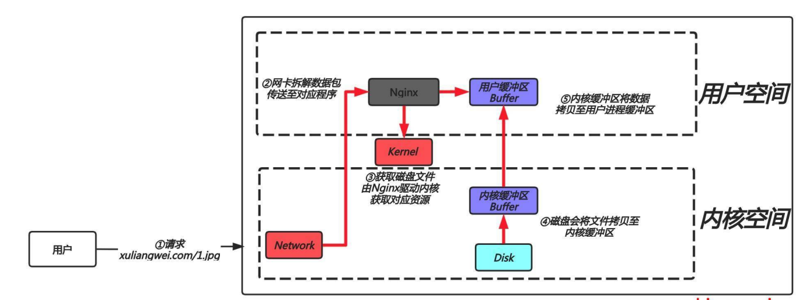
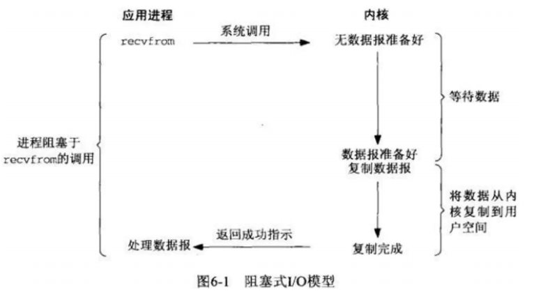
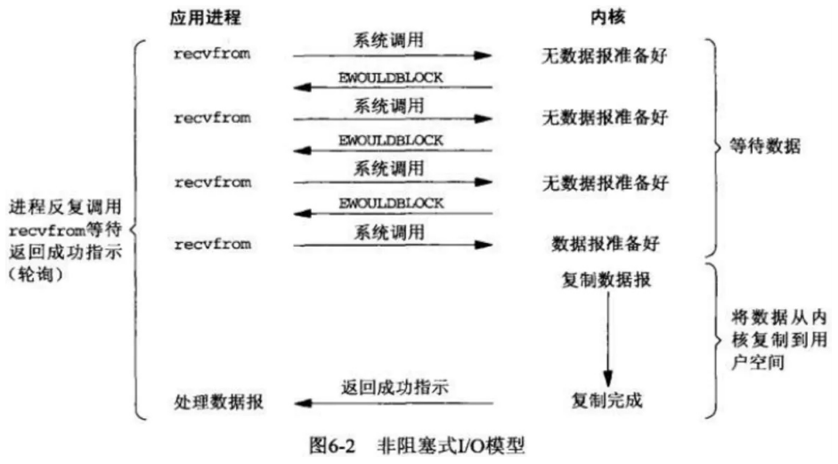
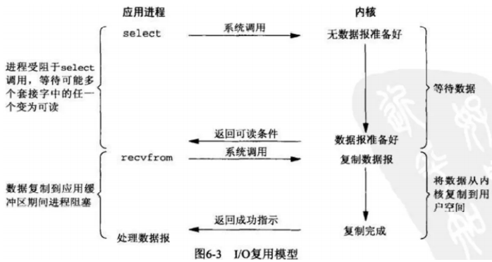
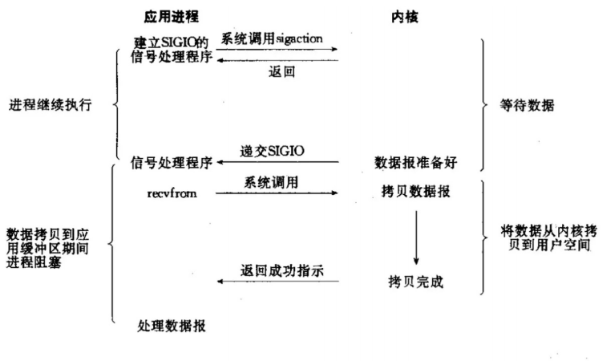
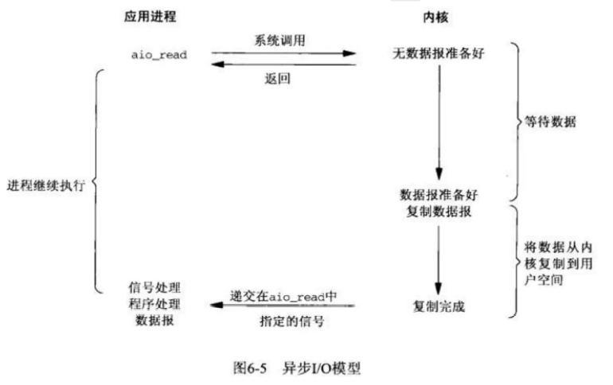
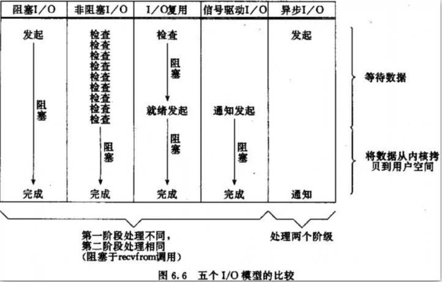

# IO模型

## 目录

-   [基本概述](#基本概述)
-   [网络IO](#网络IO)
-   [IO网络模型](#IO网络模型)
    -   [同步/异步](#同步异步)
    -   [阻塞/非阻塞](#阻塞非阻塞)
    -   [IO组合模型](#IO组合模型)
        -   [同步阻塞IO](#同步阻塞IO)
        -   [同步非阻塞IO](#同步非阻塞IO)
        -   [IO多路复用](#IO多路复用)
        -   [信号驱动IO](#信号驱动IO)
        -   [异步非阻塞](#异步非阻塞)
    -   [IO模型端口对比](#IO模型端口对比)

# 基本概述

就是数据的输入和输出

# 网络IO

用户每一次请求都会发生一次IO操作：而每次IO都要经由两个阶段

第一步：将数据从磁盘加载至内核的内存空间（缓存区），等待数据准备完成，时间较长

第二步：将数据从内核缓冲区复制到用户空间的进程内存，时间较短

第三步：nginx封装数据为响应报文发送

# IO网络模型

同步、异步、阻塞、非阻塞

## 同步/异步

同步：调用者发指令给被调用者，被调用者需要获取资源后再返回给调用者，那么此时调用者需要等待被调用者返回信息，也就意味着调用者啥也干不了

异步：调用者发指令给调用者，被调用者需要获取资源返回给调用者此时被调用者会主动将当前的运行状态返回给调用者。

## 阻塞/非阻塞

阻塞：指IO操作需要彻底完成后才会返回到用户空间，调用结果返回之前，调用者被挂起

非阻塞：指IO操作被调用后立即返回给用户进程一个状态值，无需等待IO操作彻底完成，在最终的调用结果返回之前，嗲用不会被挂起。

## IO组合模型

主要有以下几种组合模型：同步阻塞、同步非阻塞、IO多路复用、信号驱动IO、异步非阻塞

### 同步阻塞IO

特点就是在IO执行的两个阶段都被阻塞，一个进程只能响应一个用户的请求。剩下的请求会被挂起，

### 同步非阻塞IO

当kernel数据准备好了，此时用用户进程再次发起系统调用，那么它马上将数据拷贝到了用户进程内存，所以，非阻塞IO的特点是用户进程需要不断的主动询问kernel数据处理好了没有

好处：用户进程可以处理其他任务，坏处：任务完成得响应延迟增大了，因为每过一段时间才会轮询一次read操作

### IO多路复用

1.当用户进程发起调用请求，不用直接与内核交互，而是找一个代理进程select，当用户进程调用select,那么整个进程会阻塞在select上(因为是由select与内核进行交互，需要等待select返回结果)
2.kerne1会“监视"select负责的数据，当任何一个进程的数据准备好了，select就会返回。
3.当select用户进程返回结果后，用户程序会再次进行系统调用，将kerne1数据拷贝到用户进程。
总结，select代理进程，它这一个进程可以接收多个用户进程的请求。(类似于用户-->飞猪-->办理签证)

### 信号驱动IO

1.当用户进程调用了recvfrom()这个系统调用，希望从磁盘获取数据。
⒉.磁盘文件中的数据如果还没有读取到内核缓冲区时，没关系，进程还可以继续运行并不阻塞。
3.当磁盘数据复制到内核中后，会通知用户进程数据准备就绪。
4.用户进程在发指定将内核中数据复制到用户进程中，此时进程会进入阻塞状态。

### 异步非阻塞

1.当用户进程调用了recvfrom()这个系统调用，希望从磁盘获取数据。
2.kerne1收到后，会立刻返回，所以不会对用户进程产生任何阻塞。
3.kerne1等待数据准备完成，并将内核数据拷贝到用户进程内存，当这一切都完成之后，kerne1会给用户进程发送一个回调函数通知用户进程本次IO完成。

## IO模型端口对比

