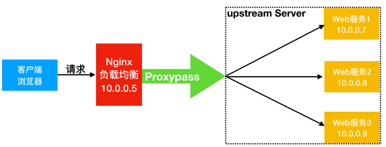

# 七层负载均衡

## 目录

-   [什么是负载均衡](#什么是负载均衡)
    -   [为什么需要](#为什么需要)
    -   [负载均衡和代理的区别](#负载均衡和代理的区别)
-   [nginx负载均衡应用场景](#nginx负载均衡应用场景)
    -   [四层负载均衡](#四层负载均衡)
    -   [七层负载均衡](#七层负载均衡)
    -   [区别](#区别)
-   [nginx均衡负载配置](#nginx均衡负载配置)
    -   [负载均衡场景环境规划](#负载均衡场景环境规划)
-   [nginx负载均衡调度算法](#nginx负载均衡调度算法)
    -   [轮询调度算法](#轮询调度算法)
    -   [加权轮询调度算法](#加权轮询调度算法)
    -   [ip\_hash调度算法](#ip_hash调度算法)
    -   [一致性hash调度算法](#一致性hash调度算法)
    -   [url\_hash调度算法](#url_hash调度算法)
    -   [least\_conn调度算法](#least_conn调度算法)
-   [Nginx负载均衡后端状态](#Nginx负载均衡后端状态)
    -   [max\_conn限制连接数](#max_conn限制连接数)
    -   [down标识关闭状态](#down标识关闭状态)
    -   [backup标识备份状态](#backup标识备份状态)
    -   [max\_fail与fail\_timeout](#max_fail与fail_timeout)
    -   [keepalive提升吞吐量](#keepalive提升吞吐量)
-   [nginx七层负载均衡](#nginx七层负载均衡)
    -   [会话保持](#会话保持)
    -   [如何实现会话保持](#如何实现会话保持)
-   [会话保持演示](#会话保持演示)
    -   [配置php链接redis](#配置php链接redis)
-   [后端节点异常容错机制](#后端节点异常容错机制)
    -   [配置语法](#配置语法)
-   [nginx负载均衡调度场景](#nginx负载均衡调度场景)
    -   [环境准备](#环境准备)
    -   [根据请求设备进行调度](#根据请求设备进行调度)
-   [nginx多级代理获取真实ip](#nginx多级代理获取真实ip)
-   [多级代理获取地址测试](#多级代理获取地址测试)
    -   [通过php脚本测试](#通过php脚本测试)
    -   [通过日志分析](#通过日志分析)
    -   [realip模块获取真实IP](#realip模块获取真实IP)

# 什么是负载均衡

负载均衡Load  balance 。指的是将用户访问请求所产生的流量，进行平衡，分摊到多个应用节点处理，增强了应用的可用性。

## 为什么需要

如果承载大量并发请求，单台服务器难以负荷，使用多台web服务器组成集群，前端使用nginx负载均衡，将请求分散到我们的后端服务器集群中，实现负载的流量并发，从而提升整体性能预计容灾能力。


## 负载均衡和代理的区别

nginx代理仅代理一台服务器基于URI来调度，调度到不同功能的应用节点处理。

nginx负载均衡则是将客户端请求通过proxy\_pass代理至一组uostream资源池

# nginx负载均衡应用场景

## 四层负载均衡

即是osi七层模型中的传输层，仅需要对客户端的请求进行tcp|ip协议的包代理即可实现负载均衡，性能极好，因为只需要底层进行转发处理，不需要进行一些复杂的逻辑

## 七层负载均衡

七层负载均衡工作在应用层，它可以完成很多应用方面的协议请求，比如我们说的http应用负载均衡，它可以实现http 头信息的改写、安全应用规则控制、URI匹配规则控制、及rewrite等功能，所以在应用层里面可以做的内容就更多了。

## 区别

四层：优点：性能高，数据包在底层就进行了转发

缺点：仅支持ip：port转发，无法完成复杂的业务逻辑应用

七层：应用层：优点：贴近业务，支持URI路径匹配、header改写，rewrite等

缺点：性能低，数据包需要拆解到顶层才进行调度，消耗随即端口

# nginx均衡负载配置

upsteam虚拟资源池模块proxy\_upstream\_module

upsteam虚拟资源池模块proxy\_upstream\_module

```bash
#upstream例子
upstream backend(定义资源池) {
    server backend1.example. com weight=5;
    server backend2 .examp7e.com:8080;
    server unix:/tmp/backend3;
    server backup1.example.com:8080 backup;
}
server {
localtion / {
    proxy_pass http://backend;
}
} 
```

## 负载均衡场景环境规划

负载均衡场景架构图规划



地址规划

| 角色    | 外网       | 内网         | 主机名   |
| ----- | -------- | ---------- | ----- |
| LB01  | 10.0.0.5 | 172.16.1.5 | lb01  |
| web01 | 10.0.0.7 | 172.16.1.7 | web01 |
| web02 | 10.0.0.8 | 172.16.1.8 | web02 |

配置nginx负载均衡需要使用的proxy\_params文件

```bash
[root@Nginx ~]# vim /etc/nginx/proxy_params
proxy_set_header Host $http_host;  #加个头文件，域名
proxy_set_header X-Real-IP $remote_addr; #信息尾部加个真实ip
proxy_set_header x-Forwarded-For$proxy_add_x_forwarded_for; #配置反向代理
proxy_connect_timeout 30;#等待链接时间
proxy_send_timeout 60;  #等待发送时间
proxy_read_timeout 60;  #读取等待时间
proxy_buffering on;
proxy_buffer_size 64k;   #缓存区大小
proxy_buffers 4 64k ;
```

```bash
#web01服务器上配置服务节点，
vim /etc/nginx/conf.d/web.oldxu.com.conf
server {
  listen 80;
  server_name web.oldxu . com;root /web;
  location / {
    index index.html;
}
}
mkdir /web
echo "web01.."  > /node/index.html
systemctl restart nginx
#web02服务器配置应用服务节点
vim /etc/nginx/conf.d/web.oldxu.com.conf
server {
listen 80;
server_name web.oldxu.com;
root /web;
location / {
index index.html;
}
}
mkdir /web
echo "web01.."  > /node/index.html
systemctl restart nginx

#前端接入负载均衡，将lb01配置为负载均衡，将请求代理至虚拟资源池
vim /etc/nginx/conf.d/proxy_web.oldxu.com.conf
    upstream web {
      server 172.16.1.7:80;
      server 172.16.1.8:80;
}
server {
    listen 80;
      server_name web.oldxu.com;
      location / {
      proxy_pass http://web;
      include proxy_params;
}
  systemctl restart nginx
```

# nginx负载均衡调度算法

| 调度算法        | 概述                                      |
| ----------- | --------------------------------------- |
| 轮询          | 按时间顺序逐—分配到不同的后端服务器(默认)                  |
| weight      | 加权轮询,weight值越大,分配到的访问几率越高               |
| ip\_hash    | 每个请求按访问IP的hash结果分配,这样来自同一IP的固定访问一个后端服务器 |
| url\_hash   | 根据请求uri进行调度到指定节点                        |
| least\_conn | 将请求传递到活动连接数最少的服务器。                      |

## 轮询调度算法

轮询调度算法的原理是将每一次用户的请求，轮流分配给内部中的服务器。

轮询算法的优点是其简洁性，它无需记录当前所有连接的状态，所以它是一种无状态调度。

```bash
upstream load_pass {
    server 172.16.1.7:80;
    server 172.16.1.8:80;
}
server {
        listen 80;
        server_name web.oldxu.com;
        location/ {
          proxy_pass http://load_pass;
          include proxy_params;
}
```

## 加权轮询调度算法

在轮询调度算法上加上weight权重，

```bash
upstream load_pass {
    server 172.16.1.7:80 weight=5;
    server 172.16.1.8:80 weight=5; #权重数字即是刷新次数轮询
}
server {
        listen 80;
        server_name web.oldxu.com;
        location/ {
          proxy_pass http://load_pass;
          include proxy_params;
}
```

## ip\_hash调度算法

ip\_hash是基于用户请求的IP，对该IP进行hash运算，根据hash运算的值，将请求分配到后端特定的一台节点进行处理。ip\_hash算法实现公式: hash(ip) %node\_counts = index


```bash
upstream load_pass {
ip_hash
    server 172.16.1.7:80;
    server 172.16.1.8:80;
}
server {
        listen 80;
        server_name web.oldxu.com;
        location/ {
          proxy_pass http://load_pass;
          include proxy_params;
}
```

使用ip\_hash时如果有大量来自同一ip的请求会造成某个后端节点浏量过大其他节点无流量，如果临时下线一台节点会出现hash值重新计算，


## 一致性hash调度算法

为了规避上述hash情况，一致性hash算法就诞生，一致性Hash算法也是使用取模的方法，但不是对服务器节点数量进行取模，而是对2的32方取模。即，一致性Hash算法将整个Hash空间组织成一个虚拟的圆环，Hash函数值的空间为0 \~ 232 - 1，整个哈希环如下:

[一致性Hash原理与实现 - 简书 (jianshu.com)](https://www.jianshu.com/p/528ce5cd7e8f "一致性Hash原理与实现 - 简书 (jianshu.com)")

[一致性Hash算法 (xuliangwei.com)](http://cdn.xuliangwei.com/consistent.pdf "一致性Hash算法 (xuliangwei.com)")

## url\_hash调度算法

根据用户请求的URL进行hash 取模，根据hash运算的值，将请求分配到后端特定的一台节点进行处理。URL算法使用场景如下: client-->nginx-->ur1\_hash-->cache1-->app

1.用户请求nginx负载均衡器，通过ur1调度算法，将请求调度至cache1
⒉.由于Cache1节点没有对应的缓存数据，则会请求后端获取，然后返回数据，并将数据缓存起来;

3.当其他用户再次请求此前相同的URL时，此时调度器依然会调度至cache1节点处理;

4.由于cache1节点已存在该URL资源缓存，所以直接将缓存数据进行返回;能大幅提升网站的响应;

```bash
upstream load_pass {
#请求同一个ur1，会始终定向到同一个服务器节点，consistent表示使用一致性hash算法
hash $request_uri consistent;
    server 172.16.1.7:80;
    server 172.16.1.8:80;
}
server {
    listen 80;
    server_name web.oldxu.com;
    location/ {
    proxy_pass http://1oad_pass;
    include proxy_params ;
}
```

## least\_conn调度算法

least\_conn调度算法实现原理，哪台节点连接数少，则将请求调度至哪台节点。

```bash
upstream load_pass {
    least_conn
    server 172.16.1.7:80;
    server 172.16.1.8:80;
}
server {
    listen 80;
    server_name web.oldxu.com;
    location/ {
    proxy_pass http://load_pass;
    include proxy_params ;
}
```

```bash
upstream load_pass {
#请求同一个ur1，会始终定向到同一个服务器节点，consistent表示使用一致性hash算法
hash $request_uri consistent;server 172.16.1.7:80;
server 172.16.1.8:80;
}
server 0.
listen 80;
server_name web.oldxu . com;
location/ {
proxy_pass http://1oad_pass;
include proxy_params ;
}
```

# Nginx负载均衡后端状态

| 状态            | 概述                     |
| ------------- | ---------------------- |
| down          | 当前的server暂时不参与负载均衡     |
| backup        | 预留的备份服务器               |
| max\_fails    | 允许请求失败的次数              |
| fail\_timeout | 经过max\_fails失败后，服务暂时时间 |
| max\_conns    | 限制最大的接受连接数             |

## max\_conn限制连接数

max\_conns用来限制每个后端节点能够接收的最大TCP连接数，如果超过此连接则会抛出错误。

```bash
[root@1b01 ~]# cat proxy_web.o1dxu.com.conf
upstream load_pass {
    server 172.16.1.7:80 max_conns=2;
    server 172.16.1.8:80 max_conns=2;
}
server {
    1isten 80;
    server_name web.oldxu.com;
    location / {
    proxy_pass http://load_pass;
    include proxy_params;
}
```

## down标识关闭状态

down将服务器标记为不可用状态

```bash
[root@lb01 ~]# cat proxy_web.o1dxu.com.conf
upstream load_pass {
    server 172.16.1.7:80 down;#一般用于停机维护
    server 172.16.1.8:80;
}
server {
    listen 80;
    server_name web.oldxu . com;
    location / {
    proxy_pass http://1oad_pass;
    include proxy_params;
}
```

## backup标识备份状态

backup将服务器标记为备份服务器，当主服务器不可用时，将请求传递给备份服务器处理

```bash
[root@7b01 ~]# cat proxy_web.oldxu.com.conf
upstream load_pass {
    server 172.16.1.7:80 backup;
    server 172.16.1.8:80;
    server 172.16.1.9:80;
  }
server {
    listen 80;
    server_name web.o1dxu.com;
    location/ {
    proxy_pass http://1oad_pass;
    include proxy_params;
}
```

## max\_fail与fail\_timeout

max\_fails=2服务器通信失败尝试2次，任然失败，认为服务器不可用;

fail\_timeout=5s服务器通信失败后，每5s探测一次节点是否恢复可用;

在fail\_timeout设定的时间内，与服务器连接失败达到max\_fails则认为服务器不可用;

```bash
[root@7b01 ~]# cat proxy_web.oldxu.com.conf
upstream load_pass {
    server 172.16.1.7:80 max_fails=2 fail_timeout=5s;
    server 172.16.1.8:80 max_fails=2 fail_timeout=5s ;
  }
server {
    listen 80;
    server_name web.o1dxu.com;
    location/ {
    proxy_pass http://1oad_pass;
    include proxy_params;
}
```

## keepalive提升吞吐量

keepalive主要是与后端服务器激活缓存，也就是长连接，主要用来提升网站吞吐量。

默认情况下:没有与后端服务启用长连接功能，当有请求时，需要建立连接、维护连接、关闭连接，所以会存在网络消耗，但如果将所有的连接都缓存了，当连接空闲了又会占用其系统资源，所以可以使用keepalive参数来激活缓存，同时还可以使用keepalive参数来限制最大的空闲连接数;

```bash
[root@7b01 ~]# cat proxy_web.o1dxu.com.conf
upstream web {
      server 172.16.1.7:80;
      server 172.16.1.8:80;
      keepalive 16;  #最大的空闲连接数
      keepalive_timeout 100s;#空闲连接的超时时间
}
server {
        listen 80;
        server_name web.o1dxu.com;
        location / {
        proxy_pass http://web;
        proxy_http_version 1.1;
        proxy_set_header connection "";
}
}
```

# nginx七层负载均衡

## 会话保持

当用户登陆一个网站服务器，网站服务器会将用户的登陆信息存储下来（存储下来的内容叫session)以保证我们能够一直处于”登陆在线“状态。客户端：cookies，服务端：sessionID

## 如何实现会话保持

1.粘性session(演示):指Ngnix每次都将同一用户的所有请求转发至同一台服务器上，及Nginx的lP\_hash。

2.session复制(不用)︰每次session发生变化，就广播给集群中的服务器，使所有的服务器上的session相同。

3.session共享(√)︰缓存session至内存数据库中，使用redis,memcached实现。

4.session持久化:将session存储至数据库中，像操作数据一样操作session。

# 会话保持演示

[https://files.phpmyadmin.net/phpMyAdmin/4.8.4/phpMyAdmin-4.8.4-a77-7anguages.zip](https://files.phpmyadmin.net/phpMyAdmin/4.8.4/phpMyAdmin-4.8.4-a77-7anguages.zip "https://files.phpmyadmin.net/phpMyAdmin/4.8.4/phpMyAdmin-4.8.4-a77-7anguages.zip")

```bash
#安装phpmyadmin
cd /code
wget https://files.phpmyadmin.net/phpMyAdmin/4.8.4/phpMyAdmin-4.8.4-a77-7anguages.zip  #下载压缩包
unzip phpMyAdmin-4.8.4-all-languages.zip
#修改phpmyadmin链接远程的数据库
cd phpMyAdmin-4.8.4-all-languages/
cp config.sample.inc.php   config.inc.php
vim config.inc.php
/* server parameters */ 
$cfg['servers'][$i]['host'] = '172.16.1.51';
#在多台web上准备phpmyadmin的nginx配置文件
cat /etc/nginx/conf.d/php.conf
server {
    listen 80;
    server_name php.oldxu.net;
    root /code/phpMyAdmin-4.8.4-all-languages;
    location / {
        index index.php index.html ;
}
location ~ \.php$ {
      fastcgi_pass 127.0.0.1:9000;
      fastcgi_param SCRIPT_FILENAME $document_root$fastcgi_script_name;
      include fastcgi_params;
}
}
systemctl restart nginx  #重启nginx
####配置负载均衡####
#编写一份proxy负载均衡的配置文件，请求调度到后端web节点
vim /etc/nginx/conf.d/proxy_php.com.conf
  upstream php {
    server 172.16.1.7:80;
    server 172.16.1.8:80;
}
server {
      listen 80;
      server_name php.oldxu.net;
      location / {
      proxy_pass http://php;
      include proxy_params;
}
}
nginx -t  
systemctl restart nginx  #检查语法并重启
####配置Redis服务####
yum install redis -y  #安装redis内存数据库
sed  -i  '/^bind/c bind 127.0.0.1 172.16.1.41' /etc/redis.conf  #配置redis监听在本地的内网网卡上
重启redis并加入开机自启动
```

## 配置php链接redis

```bash
#修改/etc/php.ini文件
 vim /etc/php.inisession.save_handler = redis
 session.save_path ="tcp:/ /172.16.1.41:6379"; 
 session.save_path ="tcp://172.16.1.41:6379?auth=123”#如果redis存在密码，则使用该方式
 #注释php-fpm/www.conf里面的两条内容
vim /etc/php-fpm. d/www.conf; 
php_value[session.save_hand1er] = files; 
php_value[session. save_path] = /var/1ib/php/session
重启php-fpm服务
```

# 后端节点异常容错机制

使用nginx负载均衡时，如何将后端请求超时的服务器流量平滑的切换到另一台上。

如果后台服务连接超时，Nginx是本身是有机制的，如果出现一个节点down掉的时候，Nginx会更据你具体负载均衡的设置，将请求转移到其他的节点上，但是，如果后台服务连接没有down掉，而是返回了错误异常码如:504、502、500，该怎么办

## 配置语法

```bash
#当其中一台返回错误码 404,500等错误时，可以分配到下一台服务器程序继续处理，提高平台访问成功率。
proxy_next_upstream http_500 | http_502 lhttp_503 \ http_504 | http_404;
示例
server {
      listen 80;
      server_name b1og.oldxu. net;
location / {
      proxy_pass http://node;
      proxy_next_upstream error timeout
      http_500 http_502 http_503 http_504;
      proxy_next_upstream_tries 2;
      proxy_next__upstream_timeout 3s;
}
}

```

# nginx负载均衡调度场景


## 环境准备

| 系统     | 角色       | 外网       | 内网         | 端口 |
| ------ | -------- | -------- | ---------- | -- |
| centos | 负载均衡     | 10.0.0.5 | 172.16.1.5 | 80 |
| centos | 提供user集群 |          | 172.16.1.7 | 80 |
| centos | 提供pass集群 |          | 172.16.1.7 | 80 |

配置应用节点

```bash
vim agent.o1dxu.net.conf
server {
listen 80;
server_name agent.oldxu.net;
root / code;
location / {
index index.html;
}
}

##配置负载均衡
  upstream user {
  server 172.16.1.8:80;
}
  upstream pass {
  server 172.16.1.7:80;
}
server {
    listen 80;
    server_name agent.oldxu.net;
    location /user {
    proxy_pass http://user;
    include proxy_params;
}
    location /pass {
    proxy_pass http://pass;
    include proxy_params;
}
}

```

proxy添加/和不添加区别：不添加：请求/user/test/index.html 到达：/user/test/index.html    不添加：请求/user/test/index.html  到达：/test/index.html

1.带/意味着Nginx代理会修改用户请求的URL，将location匹配的URL进行删除。

2.不带/意味着Nginx代理不会修改用户请求的URL，而是直接代理到后端应用服务器。

## 根据请求设备进行调度

| 系统     | 角色        | 外网       | 内网         | 端口 |
| ------ | --------- | -------- | ---------- | -- |
| centos | 负载均衡      | 10.0.0.5 | 172.16.1.5 | 80 |
| centos | 提供pc集群    |          | 172.16.1.7 | 80 |
| centos | 提供phone节点 |          | 172.16.1.8 | 80 |

```bash
##配置两个web节点的nginx设置nginx
vim /etc/nginx/conf.d/文件名.conf
server {
listen 80;
server_name agent.oldxu.net;
root / code;
location / {
index index.html;
}
}

创建html文件进行试验
##配置负载均衡##
 upstream pc {
  server 172.16.1.8:80;
}
  upstream iphone {
  server 172.16.1.8:80;
}
server {
    listen 80;
    server_name agent.oldxu.net;
    location / {
    proxy_pass http://pc;
    include proxy_params;
    default_type text/html; 
    charset utf-8;
}
}

#如果是安卓或iphone,则走phone
    if ( $http_user_agent ~* "android liphone|iPad") {
    proxy_pass http: //phone;
}
#如果是IE浏览器,要么拒绝,要么返回一个好的浏览器下载页面
    if ( $http_user_agent ~* "MSIE”)
    {
    return 200'浏览器真棒!';
}
}
}

```

# nginx多级代理获取真实ip


```bash
#配置一级代理
vim proxy_ip.o1dxu.net.conf
server {
listen 80;
server_name ip.oldxu.net;
location / {
proxy_pass http://10.0.0.7;
proxy_http_version 1.1;
proxy_set_header Host $http_host;
proxy_set_header x-Real-iP$remote_addr;
proxy_set_header X-Forwarded-For$proxy_add_x_forwarded_for;
}
}
#配置二级代理
vim proxy_ip.oldxu.net.conf
server {
listen 80;
server_name ip.oldxu.net;
location / {
proxy_pass http://10.0.0.8;
proxy_http_version 1.1;
proxy_set_header Host $http_host;
proxy_set_header x-Real-IP$remote_addr;
proxy_set_header X-Forwarded-For$proxy_add_x_forwarded_for;
}
}

#配置应用节点
vim ip.oldxu.net.conf
server {
listen 80;
server_name ip.o1dxu.net;
root /code;
location / {
index index.php index.html ;
}
location ~ \.php$ {
fastcgi_pass 127.0.0.1:9000;
fastcgi_param SCRIPT_FILENAME$document_root$fastcgi_script_name;
include fastcgi_params;
}
}

```

# 多级代理获取地址测试

## 通过php脚本测试

```bash
# 通过如下页面获取真实IP，或查看phpinfo()函数中的 HTTP_X_FORWARDED_FOR
 cat /code/index.php
 <?php
phpinfo();
?>
```

## 通过日志分析

```bash
#1.proxy_node1代理的日志
10.0.0.1 - - "GET /index.php HTTP/1.1"200
#2.proxy_node2代理的日志
10.0.0.5 - - "GET /index . php HTTP/1.1"200"10.0.0.1"
#3.真实节点
10.0.0.7 - - "GET /index.php HTTP/1.1"200"10.0.0.1，10.0.0.5"
```

## realip模块获取真实IP

```bash
conf.d里vim ip.oldxu.net.conf
 server {
listen 80;
server_name ip.oldxu.net; 
root /code; 
set_real_ip_from 10.0.0.5;
set_real_ip_from 10.0.0.7; 
real_ip_header  X-Forwarded-For;
real_ip_recursive on; #set_real_ip_from：真实服务器上一级代理的IP地址或者IP段,可以写多行
#real_ip_header：从哪个header头检索出需要的IP地址
#real_ip_recursive：递归排除set_real_ip_from里面出现的IP,其余没有出现的认为是用户真实IP
location / {
index index.php index.html;
}
location ~\.php$ { 
fastcgi_pass 127.0.0.1:9000;
fastcgi_param SCRIPT_FILENAME $document_root$fastcgi_script_name; 
include fastcgi_params;
}
}


```
