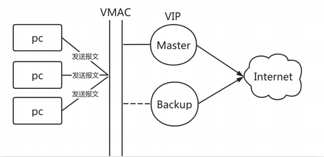
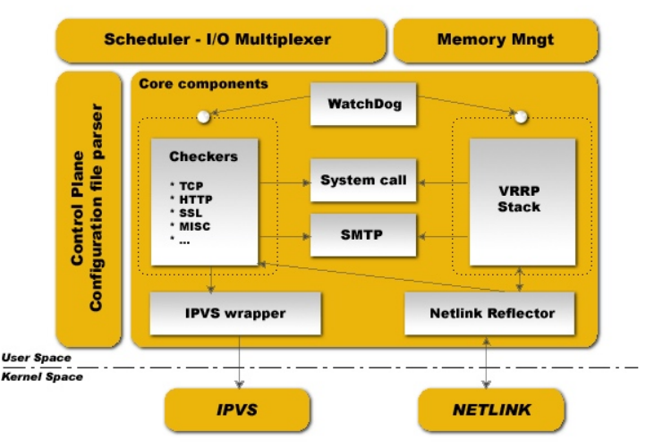
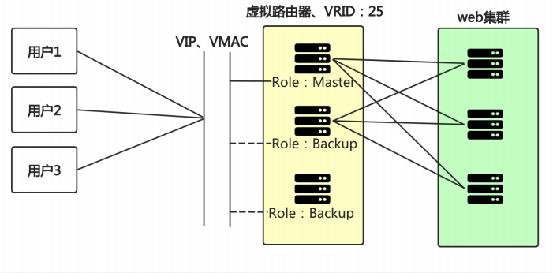
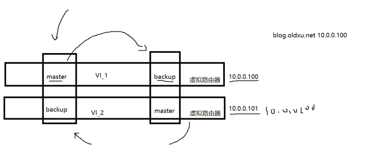

# 高可用keepalived

## 目录

-   [高可用基本概述](#高可用基本概述)
-   [keepalived基本介绍](#keepalived基本介绍)
    -   [核心组件](#核心组件)
    -   [keepalived核心概念](#keepalived核心概念)
-   [应用场景](#应用场景)
    -   [环境配置](#环境配置)
    -   [地址漂移测试](#地址漂移测试)
    -   [抓包分析切换过程](#抓包分析切换过程)
    -   [keepalived延迟抢占](#keepalived延迟抢占)
    -   [非抢占式](#非抢占式)
    -   [邮件通知](#邮件通知)
    -   [keepalived双主模式](#keepalived双主模式)
-   [高可用脑裂](#高可用脑裂)
    -   [产生原因](#产生原因)
    -   [影响范围](#影响范围)

# 高可用基本概述

简单理解：两台机器启动着相同的业务系统,当有一台机器宕机，另外一台服务器能快速的接管，对于访问的用户是无感知的。

专业理解：高可用是分布式系统架构设计中必要的一环，主要目的: 减少系统不能提供服务的时间。假设系统一直能够提供服务，我们说系统的可用性是100%。如果系统每运行100个时间单位，会有1个时间单位无法提供服务，我们说系统的可用性是99%。

通常使用keepalived软件实现高可用，该软件基于vrrp协议进行实现的，主要解决单点故障的问题

vrrp其实就是通过软件或硬件的在master和backup外层增加一个虚拟mac地址简称vmac以及虚拟IP地址简称vip



# keepalived基本介绍

keepalived基于vrrp实现，通过vrrp协议可以完成地址漂移技术

为vip地址所在的节点生成ipvs规则（需要在配置文件中预先定义）

## 核心组件

vrrp stack：用来实现vrrp协议的重要组件之一

netlink接口：设置和删除网络接口上的虚拟IP地址

ipvs wrapper：使用getsock和setxock来建立ipvs规则

checkers：检测rs节点的方式，支持tcp、http、ssl等

system call：支持启动额外系统脚本的功能；

smtp：当发生角色状态转换时，发送时间通知邮件

watchdog：监控进程



## keepalived核心概念

虚拟路由器：由一个Master路由器和多个Backup路由器组成；

Master路由器：虚拟路由器中承担报文转发任务的路由器；

Backup路由器：Master路由器出现故障时，能够代替Master路由器工作的路由器；

VRID：虚拟路由器的标识，由相同 VRID 的一组路由器构成一个虚拟路由器；

组播：组播是有特定的成员，是一种可控的广播，组播成员需要加入“组播组”才能收到该组播的信息。

虚拟IP地址：虚拟路由器的IP地址，一个虚拟路由器可以拥有一个或多个IP地址；

虚拟MAC地址：一个虚拟路由器拥有一个虚拟MAC地址；

优先级：VRRP根据优先级来确定虚拟路由器中每台路由器的地位；

抢占式：如果Master故障，Backup自动接管，当Master恢复了会将VIP地址抢回来；

非抢占式：如果Master故障，Backup自动接管，当Master恢复则自动转为Backup，不会抢占VIP；



# 应用场景

## 环境配置

| 状态    | eth0       | eth1       | 角色     |
| ----- | ---------- | ---------- | ------ |
| 节点1   | 10.0.0.5   | 172.16.1.5 | master |
| 节点2   | 10.0.0.6   | 172.16.1.6 | backup |
| VIP地址 | 10.0.0.100 |            |        |

```bash
#安装keepalived
yum install keepalived(两个节点都要安装)
#配置Master
vim /etc/keepalived/keepalived.conf
global_defs {
router_id lb01 # 当前物理设备的标识名称
#vrrp_mcast_group4 224.0.0.18 # 组播地址，default 224.0.0.18
}
vrrp_instance VI_1 {
state MASTER # 角色状态；
interface eth0 # 绑定当前虚拟路由使用的物理接口；
virtual_router_id 50 # 当前虚拟路由标识，VRID；
priority 200 # 当前物理节点在虚拟路由中的优先级；
advert_int 3 # vrrp通告时间间隔，默认1s；
authentication {
auth_type PASS # 密码类型，简单密码；
auth_pass 1111 # 密码不超过8位字符；
}
virtual_ipaddress {
10.0.0.100 # VIP地址
}
}
加入开机自启动并启动
#配置backup节点2
vim /etc/keepalived/keepalived.conf
global_defs {
    router_id lb02
    vrrp_mcast_group4 224.0.0.18
}
  vrrp_instance VI_1 {
      state BACKUP
      interface eth0
      virtual_router_id 50
      priority 100
      advert_int 1
      authentication {
      auth_type PASS
      auth_pass 1111
}
  virtual_ipaddress {
      10.0.0.100
}
}
加入开机自启动并启动keepalived
```

## 地址漂移测试

检查keepalived的vip地址能否在两个节点之间飘移

```bash
#在Master上进行操作
ip addr | grep 10.0.0.100
停止keepalived服务
#在backup进行操作
ip addr |grep 10.0.0.100
启动 master服务端的keepalived会发现vip被强行抢占

```

## 抓包分析切换过程

```bash
tcpdump -i eth0 -nn host 224.0.0.18

```

## keepalived延迟抢占

延迟抢占指的是，当Master故障后，Backup接管，当Master恢复后不立即抢占VIP地址，延迟一段时间在抢占VIP

配置思路如下：1.两台节点的 state都必须配置为 BACKUP；
2.在节点的 vrrp\_instance 中添加 nopreempt

```bash
# Master
    vrrp_instance VI_1 {
    state BACKUP
    priority 200
    preempt_delay 10s # 延迟10s后抢占VIP
}
# Backup
    vrrp_instance VI_1 {
    state BACKUP
    priority 100
    preempt_delay 10s
}

```

## 非抢占式

配置思路：1、两台节点的 state都必须配置为 BACKUP；
2、两台节点都在 vrrp\_instance 中添加nopreempt 参数；
3、其中一个节点的优先级必须要高于另外一个节点的优先级；

```bash
# Master
  vrrp_instance VI_1 {
  state BACKUP
  priority 200
  nopreempt
}
# Backup
  vrrp_instance VI_1 {
  state BACKUP
  priority 100
  nopreempt
}

```

## 邮件通知

```bash
#邮箱配置
yum install mailx #安装邮箱插件
cat >> /etc/mail.rc <<EOF
set from=572891887@qq.com
set smtp=smtp.qq.com
set smtp-auth-user=572891887@qq.com
set smtp-auth-password=123
set smtp-auth=login
set ssl-verify=ignore
EOF

#通知脚本（所有脚本都需要配置）
[root@dns-slave ~]# cat
/etc/keepalived/notify.sh
#!/usr/bin/bash
# 定义收件人
Email='552408925@qq.com'
# 定义主机名称
Host=$(hostname)
# 定义时间变量
Date=$(date +'%F %T')
#定义发送的消息
Message() {
subject="${Host} 切换为 $1 状态"
submsg="${Date}: ${Host} 成功切换为 $1 状
态"
echo "${submsg}" | mail -s "${subject}" "${Email}"
# echo "时间: ${主机名称} 成功切换为 backup状态" | mail -s "${主机} 切换为 backup 状态""552408925@qq.com"
}
case $1 in
master)
  Message master
    ;;


backup)
Message backup
;;
fault)
Message fault
;;
*)
echo "Usage: $0 { master | backup |
fault }"
exit
esac
#修改master配置
 cat/etc/keepalived/keepalived.conf
! Configuration File for keepalived
    global_defs {
    router_id lb01
    vrrp_mcast_group4 224.0.0.18
  }
  vrrp_instance VI_1 {
  state BACKUP
  interface eth0
  virtual_router_id 50
  priority 200
  advert_int 1
  nopreempt
  authentication {
  auth_type PASS
  auth_pass 1111
}
  virtual_ipaddress {
  10.0.0.100 dev eth0
}
notify_master
"/etc/keepalived/notify.sh master" # 当前节点成为主节点时触发的脚本
notify_backup
"/etc/keepalived/notify.sh backup" # 当前节点转为备节点时触发的脚本
notify_fault
"/etc/keepalived/notify.sh fault" # 当前节点转为“失败”状态时触发的脚本
}
#修改backup配置
vim /etc/keepalived/keepalived.conf
! Configuration File for keepalived
  global_defs {
  router_id lb02
  vrrp_mcast_group4 224.0.0.18
}
    vrrp_instance VI_1 {
    state BACKUP
    interface eth0
    virtual_router_id 50
    priority 100
    advert_int 1
    authentication {
    auth_type PASS
    auth_pass 1111
}
  virtual_ipaddress {
  10.0.0.100 dev eth0
}
notify_master
"/etc/keepalived/notify.sh master" # 当前节点成为主节点时触发的脚本
notify_backup
"/etc/keepalived/notify.sh backup" # 当前节点转为备节点时触发的脚本
notify_fault
"/etc/keepalived/notify.sh fault" # 当前节点转为“失败”状态时触发的脚本
}
停止所有节点启动任意节点进行测试，看是否会发送邮件
```

## keepalived双主模式

两个或以上 VIP 分别运行在不同的 keepalived 服务器；实现服务器并行访问 web 应用，提高服务器资源利用率。



```bash
# proxy01
cat /etc/keepalived/keepalived.conf
    global_defs {
    router_id lb01 # 当前物理设备的标识名称
}
# 主
      vrrp_instance VI_1 {
      state MASTER # 角色状态；
      interface eth0 # 绑定当前虚拟路由使用的物理接口；
      virtual_router_id 50 # 当前虚拟路由标识，VRID；
      priority 200 # 当前物理节点在虚拟路由中的优先级；

     advert_int 3 # vrrp通告时间间隔，默认1s；
#nopreempt
      authentication {
      auth_type PASS # 密码类型，简单密码；
      auth_pass 1111 # 密码不超过8位字符；
}
      virtual_ipaddress {
      10.0.0.100 # VIP地址
}
    notify_master
    "/etc/keepalived/notify.sh master" # 当前节点成为主节点时触发的脚本
    notify_backup
    "/etc/keepalived/notify.sh backup" # 当前节点转为备节点时触发的脚本
    notify_fault
    "/etc/keepalived/notify.sh fault" # 当前节点转为“失败”状态时触发的脚本
} 
# 备
      vrrp_instance VI_2 {
      state BACKUP # 角色状态；
      interface eth0 # 绑定当前虚拟路由使用的物理接口；
      virtual_router_id 55 # 当前虚拟路由标识，VRID；
      priority 100 # 当前物理节点在虚拟路由中的优先级；
      advert_int 3 # vrrp通告时间间隔，默认1s；
#nopreempt
        authentication {
        auth_type PASS # 密码类型，简单密码；
        auth_pass 1111 # 密码不超过8位字符；
}
      virtual_ipaddress {
      10.0.0.101 # VIP地址
}
}
# proxy02
      cat /etc/keepalived/keepalived.conf
      global_defs {
      router_id lb02 # 当前物理设备的标识名称
}
# 备
      vrrp_instance VI_1 {
      state BACKUP # 角色状态；
      interface eth0 # 绑定当前虚拟路由使用的物理接口；
      virtual_router_id 50 # 当前虚拟路由标识，VRID；
      priority 100 # 当前物理节点在虚拟路由中的优先级；
      advert_int 3 # vrrp通告时间间隔，默认1s；
#nopreempt
      authentication {
      auth_type PASS # 密码类型，简单密码；
      auth_pass 1111 # 密码不超过8位字符；
}
      virtual_ipaddress {
      10.0.0.100 # VIP地址
}
      notify_master
      "/etc/keepalived/notify.sh master" # 当前节点成为主节点时触发的脚本
      notify_backup
      "/etc/keepalived/notify.sh backup" # 当前节点转为备节点时触发的脚本
      notify_fault "/etc/keepalived/notify.sh
      fault" # 当前节点转为“失败”状态时触发的脚本
}
# 主
      vrrp_instance VI_2 {
      state MASTER # 角色状态；
      interface eth0 # 绑定当前虚拟路由使用的物理接口；
      virtual_router_id 55 # 当前虚拟路由标识，VRID；
      priority 200 # 当前物理节点在虚拟路由中的优先级；
      advert_int 3 # vrrp通告时间间隔，默认1s；
#nopreempt
      authentication {
      auth_type PASS # 密码类型，简单密码；
      auth_pass 1111 # 密码不超过8位字符；
}
      virtual_ipaddress {
      10.0.0.101 # VIP地址
}
}


```

# 高可用脑裂

由于某些原因，导致两台keepalived高可用服务器在指定时间内，无法检测到对方的心跳消息，当两（多）个节点同时认为自已是唯一处于活动状态的服务节点，从而出现争抢VIP，这种VIP资源的争抢即为“脑裂”。

## 产生原因

1.服务器网线松动等网络故障

2.服务器硬件故障发生损坏现象而崩溃

3.主备都开启firewalld防火墙

## 影响范围

对于无状态服务的HA，比如Nginx、无所谓脑裂不脑裂；

对于有状态服务(比如MySQL)的HA，必须要严格防止脑裂。

对于MySQL来说，可能出现多种情况，比如无法正常访问、或者得不到正确的返回结果，但大部分是无法正常访问，或直接没有响应；

可以使用第三方仲裁 fence 设备来避免脑裂；（fence通过关掉电源来踢掉坏的服务器）
