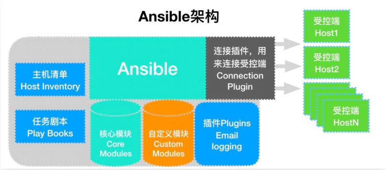
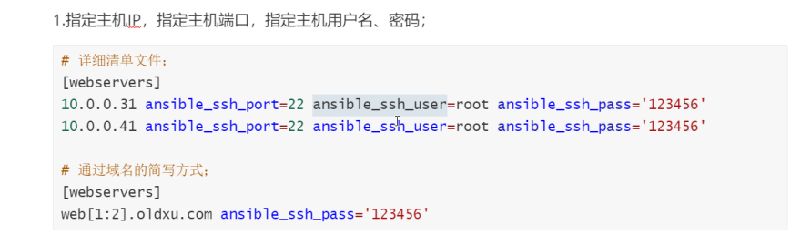
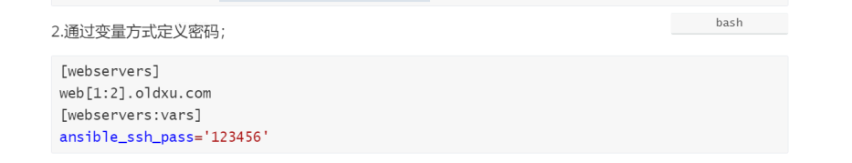
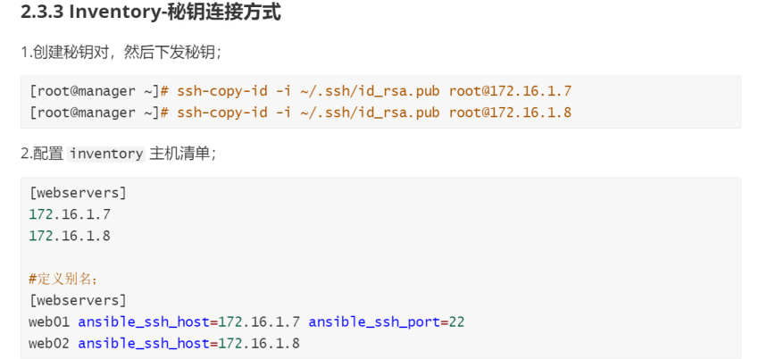
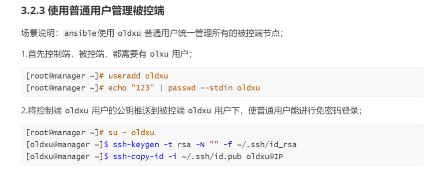
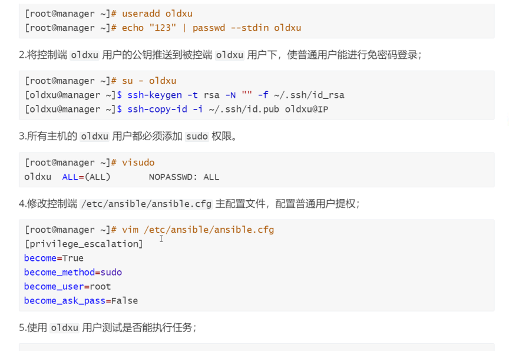
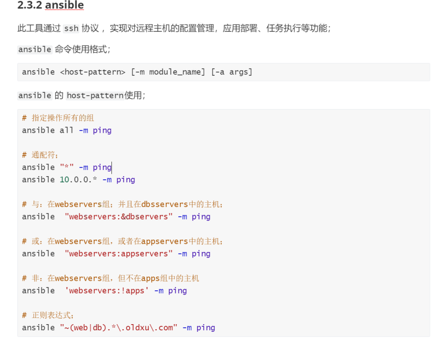
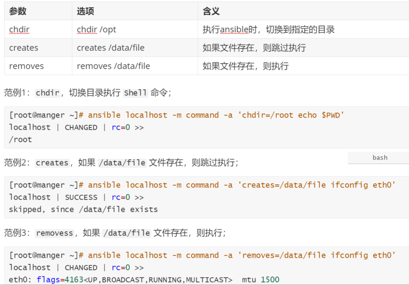

# ansible模块介绍

## 目录

-   [ansible基本介绍](#ansible基本介绍)
    -   [什么是ansible](#什么是ansible)
    -   [ansible主要功能](#ansible主要功能)
    -   [特点](#特点)
    -   [基础架构](#基础架构)
-   [安装和配置](#安装和配置)
    -   [ansible安装方式](#ansible安装方式)
        -   [rpm安装](#rpm安装)
        -   [PIP安装](#PIP安装)
        -   [确认安装](#确认安装)
    -   [相关配置文件](#相关配置文件)
        -   [配置文件](#配置文件)
        -   [主配置文件](#主配置文件)
        -   [配置优先级](#配置优先级)
    -   [ansible inventory](#ansible-inventory)
        -   [inventory是什么](#inventory是什么)
        -   [密码链接方式](#密码链接方式)
        -   [密钥连接方式](#密钥连接方式)
        -   [使用普通用户管理被控端](#使用普通用户管理被控端)
    -   [相关工具](#相关工具)
        -   [ansible](#ansible)
-   [ad-hoc与常用模块](#ad-hoc与常用模块)
    -   [基本介绍](#基本介绍)
        -   [ad-hoc是什么](#ad-hoc是什么)
        -   [命令使用](#命令使用)
        -   [执行过程](#执行过程)
        -   [执行状态](#执行状态)
    -   [ansible常用模块](#ansible常用模块)
        -   [command模块](#command模块)
        -   [shell模块](#shell模块)
        -   [script模块](#script模块)
        -   [yum模块](#yum模块)
        -   [yum\_repository模块建立yum仓库](#yum_repository模块建立yum仓库)
        -   [copy模块](#copy模块)
        -   [file模块](#file模块)
        -   [lineinfile模块](#lineinfile模块)
        -   [get\_until模块](#get_until模块)
        -   [get\_url模块](#get_url模块)
        -   [systel修改内核参数模块](#systel修改内核参数模块)
        -   [systemd模块](#systemd模块)
        -   [group模块](#group模块)
        -   [user模块](#user模块)
        -   [cron模块](#cron模块)
        -   [mount模块](#mount模块)
        -   [hostname模块（）修改主机名称](#hostname模块修改主机名称)
        -   [archive模块](#archive模块)
        -   [unarchive模块](#unarchive模块)
        -   [selinux模块](#selinux模块)
        -   [firewalld模块](#firewalld模块)
        -   [iptables](#iptables)
-   [ansible常用信息](#ansible常用信息)

## ansible基本介绍

ansible的工具集合：

Inventory用来管理设备列表，可以通过分组（不同的业务）实现，对组的调用直接影响组内所有主机；

Moudles是各种执行模块，几乎所有的管理任务都是通过模块来执行的；

plugins提供了各种附加功能

API为编程人员提供了一个调用接口可做Ansible的二次开发

### 什么是ansible

Ansible是一个it自动化的“配置管理工具”，自动化主要体现在Ansible集成了丰富模块，以及强大的功能组件，可以通过一个命令行完成一系列的操作。进而能减少我们重复性的工作，以提高工作的效率。


### ansible主要功能

批量执行远程命令，可以对N多台主机同时进行命令的执行。

批量配置软件服务，可以进行自动化的方式配置和管理服务。

实现软件开发功能，jumpserver底层使用ansible来实现的自动化管理。

编排高级的IT任务，Ansible的 Playbook是一门编程语言，可以用来描绘一套IT 架构。

### 特点

容易学习:无代理，不像salt既要学客户端与服务端，还需要学习客户端与服务端中间通讯协议;

操作灵活: Ansible有较多的模块，提供了丰富的功能、 playbook则提供类似于编程语言的复杂功能;

简单易用:体现在Ansible 一个命令可以完成很多事情;

安全可靠:因为Ansible使用了sSH协议进行通讯，既稳定也安全;

移植性高:可以将写好的 playbook 拷贝至任意机器进行执行;

幂等性:一个任务执行1遍和执行n遍效果一样，不会因为重复执行带来意外情况;

### 基础架构

Ansible架构中的控制节点、被控制节点、inventroy、ad-hoc、playbook、connection Protocol是什么?



## 安装和配置

### ansible安装方式

#### rpm安装

```bash
[root@manager ~]# wget -o /etc/yum.repos.d/epel.repo http://mirrors.aliyun.com/repo/epel-7.repo
[root@manager ~]# yum insta11 ansible -y

```

#### PIP安装

```bash
[root@manager ~]# yum install python3 python3-deve7 python3-pip -y
[root@manager ~]# pip3 install --upgrade pip -i https://pypi.douban.com/simple/
[root@manager ~]# pip3 install ansible -i https://pypi.douban.com/simple/
[root@manager ~]# /usr/local/bin/ansible --version

```

#### 确认安装

### 相关配置文件

#### 配置文件

主要在/etc/ansible/文件夹里面

#### 主配置文件

主配置文件在/etc/ansible/hosts

#### 配置优先级

1\)最先查找SANSIBLE\_CONFIG变量

2\)其次查找当前目录下ansible.cfg

3\)然后查找用户家目录下的.ansible.cfg

4\)最后查找/etc/ansible/ansible.cfg

### ansible inventory

#### inventory是什么

Inventory文件主要用来填写被管理主机以及主机组信息;(逻辑上定义);默认Inventory 文件为/etc/ansible/hosts ;当然也可以自定义一个文件，当执行ansible 命令时使用-i选项指定(工nventory文件位置;

#### 密码链接方式





#### 密钥连接方式



#### 使用普通用户管理被控端





### 相关工具

#### ansible



## ad-hoc与常用模块

### 基本介绍

#### ad-hoc是什么

ad-hoc简而言之就是“临时命令创，执行完即结束，并不会保存;

应用场景1:查看多台节点的进程是否存在;

应用场景2:拷贝指定的文件至本地;

#### 命令使用

命令示例: ansible 'groups' -m command -a 'df -h'，含义如下图所示;


#### 执行过程

1.加载自己的配置文件，默认/etc/ansible/ansible.cfg ;

2.查找对应的主机配置文件，找到要执行的主机或者组;

3.加载自己对应的模块文件，如command ;

4.通过 ansible将模块或命令生成对应的临时 py 文件，并将该文件传输至远程服务器对应执行用户\$HOME/ .ansible/tmp/ansib1e-tmp-number /xXX.PY;

5.执行用户家目录的\`\`文件;

6.给文件+x执行;

7.执行并返回结果;

8.删除临时 py文件，sleep 0退出;

#### 执行状态

使用ad-hoc执行一次远程命令，注意观察返回结果的颜色;

绿色:代表被管理端主机没有被修改

黄色:代表被管理端主机发现变更

红色:代表出现了故障，注意查看提示

### ansible常用模块

ansible有着诸多的模块，虽然模块众多，但最为常用的模块也就20-30个左右;

#### command模块

功能:在远程主机执行shell命令;此为默认模块，可忽略-m选项;注意:不支持管道命令|



#### shell模块

| 命令         | 描述                                    |
| ---------- | ------------------------------------- |
| chdir      | 在哪个目录下执行shell命令，相当于执行shell命令前先cd到对应目录 |
| creates    | 如果存在某文件就不执行shell                      |
| removes    | 如果存在某文件就不执行shell                      |
| executable | 修改并指定shell解释器来执行命令                    |
| free\_form | 指的是具体的shell命令，实际上是一个不存在的选项            |

```yaml
#查看当前目录，在local节点上运行
  #-m shell表示使用shell模块
  #-a 表示传递shell模块的相关参数
  #-i 指定了inventory文件
  #local是inventory文件里面定义好的节点
ansible -i /etc/ansible/hosts local -m shell -a 'pwd'
#设定/root/ccg为当前目录，在local节点上运行
  ansible -i /etc/ansible/hosts local -m shell -a 'pwd chdir=/root/ccg'
  ansible -i /etc/ansible/hosts local -m shell -a 'cd /root/ccg && pwd'
#如果存在~/.ssh/id_rsa则不执行shell命令
  ansible -i /etc/ansible/hosts local -m shell -a 'pwd creates=~/.ssh/id_rsa'
#如果存在~/.ssh/id_rsa则执行该shell命令
  ansible -i /etc/ansible/hosts local -m shell -a 'pwd remove=~/haha'

```

#### script模块

#### yum模块

| 命令                                       | 描述                                  |
| ---------------------------------------- | ----------------------------------- |
| name                                     | 软件包名称                               |
| state                                    | present：安装   absent：删除   latest：最新版 |
| enablerepo                               | 通过那个仓库进行安装                          |
| disablerepo                              | 不使用那个仓库进行安装                         |
| exclude                                  | kernel排除                            |
| validate\_certs( SSL证书校验，只用于name=url的情况) | (Choices: yes, no) \[Default: yes]  |

```bash
#安装vsftpd软件包
  ansible webservers -m yum -a 'name=vsftpd state=present'
#删除vsftpd软件包
  ansible webservers -m yum -a 'name=vsftpd state=absent'
#安装httpd服务，必须从epel源仓库进行安装（所有被控端必须有这个仓库）
  ansible webservers -m yum -a 'name=httpd state=present enablerepo=epel'
#更新所有软件包，维度kernel不更新
  ansible webservers -m yum -a 'name=* state=present exclude="kernel*"'

```

#### yum\_repository模块建立yum仓库

| 命令          | 描述      |
| ----------- | ------- |
| name        | 名称，文件名称 |
| description | 描述（必填）  |
| baseurl     | 仓库地址    |
| gpgcheck    | 验证开启    |
| gpgkey      |         |

```bash
#建立nginx官方仓库源
  ansible webservers -m yum_repository -a 'name=ansible_nginx description=xxx baseurl="http://nginx.org/packages/centos/$releasever/$basearch/" gpgcheck=yes gpgkey="https://nginx.org/keys/nginx_signing.key"'

```

#### copy模块

实现控制端的文件拷贝到被控端，实现替换

| 命令       | 描述        |
| -------- | --------- |
| src      | 控制端的源文件路径 |
| dest     | 被控端的文件路径  |
| owner    | 属主        |
| group    | 属组        |
| mode     | 权限        |
| backup   | 备份        |
| validate | 验证        |
| content  | 写入内容      |

```bash
#更新nfs配置，将控制端的exports.j2文件同步到被控制端的/etc/exports
  ansible webservers -m copy -a 'src=./exports.j2 dest=/etc/exports owner=root group=root mode=0644 backup=yes'
#往文件中写入内容
  ansible webservers -m copy -a 'content="oldxu.net123" dest=/etc/rsync.pass owner=root group=root mode="0600" backup=yes

```

#### file模块

| 命令      | 描述                                         |
| ------- | ------------------------------------------ |
| path    | 被控端创建的路径                                   |
| owner   | 属主                                         |
| group   | 属组                                         |
| mode    | 权限                                         |
| state   | 类型：touch：文件，directory：目录，link：软连接，hard：硬链接 |
| recurse | yes递归授权                                    |

```bash
#初始化操作
  useradd -u 666 -g www
#创建一个/data目录，授权为www身份
  ansible webservers -m file -a 'path=/data owner=luo group=luo mode="0755" state=directory recurse=yes'
#删除目录（默认递归删除）
  ansible webservers -m file -a 'path=/data owner=luo group=luo mode="0755" state=absent'
#在/data目录下创建一个文件
  ansible webservers -m file -a 'path=/data/books owner=www group=www mode="0644" state=touch'
  
```

#### lineinfile模块

| 命令                     | 描述       |
| ---------------------- | -------- |
| path                   | 被控端的路 径  |
| regexp:'Listen'        | 正则匹配语法格式 |
| kline:Listen8080       | 填充的内容    |
| state:absent           | 删除       |
| insertafter:'^#listen' | 在下一行添加   |
| insertbefore           | 在上一行添加   |

```bash
#替换httpd.conf文件中。^Listen   为  Linsten 8080;
  ansible webservers -m lineinfile -a 'path=/etc/httpd/conf/httpd.conf regexp="^Listen" line="Listen 8080"'
#给主机添加一个网关
  ansible webservers -m lineinfile -a 'path=/etc/sysconfig/network-scripts/ifcfg-eth1 line="GATEWAY=172.16.1.200"'
#删除主机网关
  ansible webservers -m lineinfile -a 'path=/etc/sysconfig/network-scripts/ifcfg-eth1 regexp="^GATEWAY" state=absent'
#给主机添加一个网关。但需要增加到ONBOOR下面
  ansible webservers -m lineinfile -a 'path=/etc/sysconfig/network-scripts/ifcfg-eth1 insertafter="ONBOOT=yes" line="GATEWAY=172.16.1.200"'
#给主机添加一个网关，但需要添加到onboot上面
  ansible webservers -m lineinfile -a 'path=/etc/sysconfig/network-scripts/ifcfg-eth1 insertbefore="ONBOOT=yes" line="test=172.16.1.200"' 

```

#### get\_until模块

#### get\_url模块

| 命令       | 描述       |
| -------- | -------- |
| url      | 下载地址     |
| dest     | 下载到本地的路径 |
| mode     | 权限       |
| checksum | 对资源进行校验  |

```bash
#下载一个资源到本地/tmp目录
  ansible webservers -m get_url -a 'url=http://fj.xuliangwei.com/config_vpn_new.zip dest=/tmp mode=0666'
#对下载的资源进行验证
  ansible webservers -m get_url -a 'url=http://fj.xuliangwei.com/config_vpn_new.zip dest=/opt mode=0666 checksum=md5:7107b0e2e01facb067842a6c4c7ffa31'

```

#### systel修改内核参数模块

| 命令    | 描述            |
| ----- | ------------- |
| name  | vm.swappiness |
| value | '5'           |
| state | present       |

```bash
#修改内核转发参数
  ansible webservers -m sysctl -a 'name=net.ipv4.ip_forward value=1 state=present'

```

#### systemd模块

| 命令             | 描述                                            |
| -------------- | --------------------------------------------- |
| name           | 服务名称                                          |
| state          | startd：启动，stopped：停止，restarted：重启，reloaded：重载 |
| enabled        | 开启自启动（yes启动no不启动）                             |
| deamon\_reload | 重载                                            |

```bash
#启动服务并加入开机自启动
  ansible webservers -m systemd -a 'name=nfs state=started enabled=yes'
#停止服务并关闭开机自启动
  ansible webservers -m systemd -a 'name=nfs state=stopped enabled=no'
```

#### group模块

| 命令    | 描述                      |
| ----- | ----------------------- |
| name  | 指定组名称                   |
| gid   | 指定gid                   |
| state | present：创建默认  absent：删除 |

```bash
#创建一个gid为666的www组
  ansible webservers -m group -a 'name=www gid=666 state=present'
#创建名称为mysqldb的系统组
  ansible webservers -m group -a 'name=mysqldb system=yes state=present'

```

#### user模块

| 命令                           | 描述                       |
| ---------------------------- | ------------------------ |
| name                         | 创建的名称                    |
| uid                          | 指定uid                    |
| group                        | 指定基本组                    |
| shell:/bin/bash              | 指定登录脚本                   |
| create\_home                 | 是否创建家目录                  |
| password                     | 给用户添加密码                  |
| system                       | 创建系统用户                   |
| groups:admins,devvelopers    | 指定附加组                    |
| append：yes                   | 添加附加组时使用                 |
| state                        | present：创建用户，absent：删除用户 |
| remove                       | 家目录一起删除                  |
| generate\_ssh\_key: yes      | 是否生成密钥对                  |
| ssh\_key\_bits: 2048         | 秘钥加密的位数                  |
| ssh\_key\_file: .ssh/id\_rsa | 秘钥文件                     |
| expires: 1422403387          | 用户的有效时间                  |

```bash
#创建www用户，指定uid666，基本组www
  ansible webservers -m user -a 'name=www uid=666 group=www shell=/sbin/nologin create_home=no'
#创建db用户基本组是root，附加组，adm，sys
  ansible webservers -m user -a 'name=db group=root groups=adm,sys append=yes shell=/bin/bash create_home=yes'
#创建一个ddd用户，密码为123 需要可以正常登录系统
  ansible webservers -m user -a "name=ddd password=$6$salt$jkHSO0tOjmLW0S1NFlw5veSIDRAVsiQQMTrkOKy4xdCCLPNIsHhZkIRlzfzIvKyXeGdOfCBoW1wJZPLyQ9Qx/1 shell=/bin/bash create_home=yes"
#创建一个dev用户，并为其生成对应的密钥
  ansible webservers -m user -a 'name=dev generate_ssh_key=yes ssh_key_bits=2048 ssh_key_file=~/.ssh/id_rsa'
  

```

#### cron模块

定时任务模拟网站：[https://crontab.guru/](https://crontab.guru/ "https://crontab.guru/")（需要翻墙开代理）

| 命令      | 描述           |
| ------- | ------------ |
| name    | 描述信息，描述脚本的作用 |
| mintue  | 分钟           |
| hour    | 小时           |
| weekday | 周            |
| user    | 该任务是由那个用户去运行 |
| job     | 任务           |

```bash
#每天凌晨三点执行/bin/bash /scripts/client_push_data_server.sh &>/dev/null
  ansible webservers -m cron -a 'name="backups app data scripts" hour=03 minute=00 job="/bin/bash /scripts/client_push_data_server.sh &>/dev/null"'
 查看生成的定时任务列表
   [root@web01 ~]# crontab  -l
    #Ansible: backups app data scripts
    00 03 * * * /bin/bash /scripts/client_push_data_server.sh &>/dev/null
#删除backups app data script执行
  ansible webservers -m cron -a 'name="backups app data scripts" hour=03 minute=00 job="/bin/bash /scripts/client_push_data_server.sh &>/dev/null" state=absent'
#注释backups app data script执行；
  ansible webservers -m cron -a 'name="backups app data scripts" hour=03 minute=00 job="/bin/bash /scripts/client_push_data_server.sh &>/dev/null" disabled=yes'


```

#### mount模块

| 命令    | 描述                                                                 |
| ----- | ------------------------------------------------------------------ |
| src   | 源设备路径或网络地址                                                         |
| path  | 挂载至本地那个路径下                                                         |
| fstyp | 设备类型：nfs                                                           |
| opts  | 挂载的选项                                                              |
| state | present：永久挂载但不会立即生效，absent：卸载，临时或永久均可生效，mounted：临时挂载，unmouted：临时卸载 |

```bash
#将172.16.1.7的/data目录挂载到172.16.1.8的/opt目录下
  ansible 172.16.1.8 -m mount -a 'src=172.16.1.7:/data path=/opt fstype=nfs opts=defaults state=mounted'

```

#### hostname模块（）修改主机名称

| 名称   | 描述       |
| ---- | -------- |
| name | 修改后的主机名称 |

```bash
ansible webservers -m hostname -a 'name=web_cluster'
```

#### archive模块

```bash
#将被控端的/opt打包到/mnt目录下，并命令为opt.tar.gz
  ansible webservers -m archive -a 'path=/opt dest=/mnt/opt.tar.gz format=gz'

```

#### unarchive模块

| 命令              | 描述                    |
| --------------- | --------------------- |
| src             | 控制端的源文件               |
| dest            | 解压到被控端的路径             |
| remote\_src:yes | 源文本是否在被控端，yes则在，no则不在 |

```bash
#将控制端的压缩包，解压到被控端源文本不再被控端
  ansible webservers -m unarchive -a 'src=./test.tar.gz dest=/mnt'
#将被控端的压缩包解压到被控端：remote_src: yes   config_vpn_new.zip
  ansible webservers -m unarchive -a 'src=/tmp/config_vpn_new.zip dest=/mnt remote_src=yes'

```

#### selinux模块

```bash
#关闭内核防火墙
ansible webservers -m selinux -a 'state=disabled'
```

#### firewalld模块

| 命令        | 描述                     |
| --------- | ---------------------- |
| zone      | 要操作的区域 默认public        |
| source    | 来源地址                   |
| service   | 服务名称：http，https，sshd。。 |
| port      | 端口                     |
| permanent | 永久生效但不会立即生效            |
| immediate | 立即生效                   |
| state     | disable：关闭，enable：启动   |

```bash
#让被控端都放行80端口
  ansible webservers -m systemd -a 'name=firewalld state=started'
  ansible webservers -m firewalld -a 'port=80/tcp immediate=yes state=present'
#让被控端都放行https端口
  ansible webservers -m systemd -a 'name=firewalld state=started'
  ansible webservers -m firewalld -a 'service=https immediate=yes state=present'

```

#### iptables

| 命令                | 描述     |
| ----------------- | ------ |
| table             | 表      |
| chain             | 链      |
| source            | 来源IP   |
| destination       | 目标IP   |
| destination\_port | 目标端口   |
| protocol          | 协议     |
| jump：DROP         | 动作     |
| action            | 如何添加规则 |
| insert            | 插入     |
| append            | 追加     |

```bash
#来源IP是 192.168.1.1目标地址是1.1.1.1目标端基80协议是tcp则拒绝，规则写入第一行
  ansible webservers -m iptables -a 'table=filter chain=INPUT source=192.168.1.1/32 destination=1.1.1.1 destination_port=80 protocol=tcp jump=DROP action=insert'
#删除规则：加state=absent
#NAT：SNAT和DNAT:
  #DNAT： 如果请求1.1.1:80端口，则DNAT到2.2.2.2:8800
    ansible webservers -m iptables -a 'table=nat chain=PREROUTING protocol=tcp destination=1.1.1.1 destination_port=80 jump=DNAT to_destination="2.2.2.2:8800"'
  #DNAT： 如果请求1.1.1:81端口，则DNAT到3.3.3.3:8800
    ansible webservers -m iptables -a 'table=nat chain=PREROUTING protocol=tcp destination=1.1.1.1 destination_port=81 jump=DNAT to_destination="3.3.3.3:8800"'
  #SNAT
    #POSTROUTING
    iptables -t nat -I POSTROUTING -s 172.16.1.0/24 -j SNAT --to-source 5.5.5.5
    ansible webservers -m iptables -a 'table=nat chain=POSTROUTING source=172.16.2.0/24 jump=SNAT to_source=6.6.6.6'
    ansible webservers -m iptables -a 'table=nat chain=POSTROUTING source=172.16.3.0/24 jump=SNAT to_source=7.7.7.7 action=insert'

```

## ansible常用信息

```bash
ansible 主机地址 -m setup -a 'filter=下面所需选项'
ansible_all_ipv4_addresses：仅显示ipv4的信息。
ansible_devices：仅显示磁盘设备信息。
ansible_distribution：显示是什么系统，例：centos,suse等。
ansible_distribution_major_version：显示是系统主版本。
ansible_distribution_version：仅显示系统版本。
ansible_machine：显示系统类型，例：32位，还是64位。
ansible_eth0：仅显示eth0的信息。
ansible_hostname：仅显示主机名。
ansible_kernel：仅显示内核版本。
ansible_lvm：显示lvm相关信息。
ansible_memtotal_mb：显示系统总内存。
ansible_memfree_mb：显示可用系统内存。
ansible_memory_mb：详细显示内存情况。
ansible_swaptotal_mb：显示总的swap内存。
ansible_swapfree_mb：显示swap内存的可用内存。
ansible_mounts：显示系统磁盘挂载情况。
ansible_processor：显示cpu个数(具体显示每个cpu的型号)。
ansible_processor_vcpus：显示cpu个数(只显示总的个数)。
```
